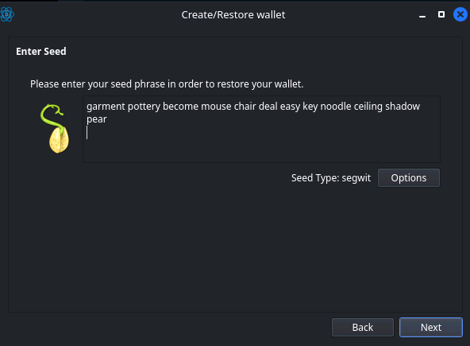
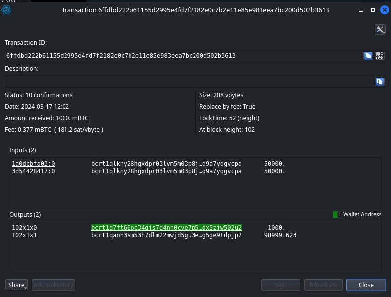
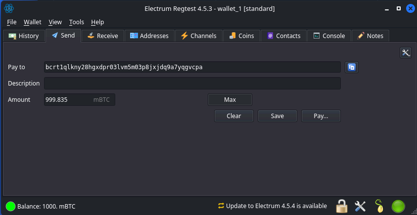
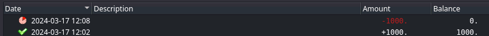
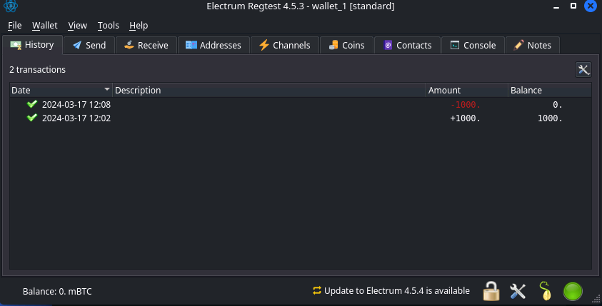

## Recovery - Blockchain Challenge
The "Recovery" challenge tasks participants with recovering stolen Ethereum by accessing an SSH server to retrieve the wallet seed key phrase. With the seed phrase, participants generate a new wallet configuration to interact with the stolen funds. 

### Recovering Stolen Ethereum:
Access the SSH server to obtain the wallet seed key phrase, which is used to generate a new [wallet](https://electrum.org/) configuration. Utilize the seed phrase to access the stolen Ethereum and initiate a transaction to send the funds back to the attacker's address.

```sh
$» ssh 94.237.63.93 -p41111 -l satoshi                                                                                130 ↵
<SNIP>
satoshi@94.237.63.93's password: 
Linux ng-team-112678-blockchainrecoveryca2024-nq7mg-584ff985b8-v4fmz 5.10.0-18-amd64 #1 SMP Debian 5.10.140-1 (2022-09-02) x86_64
<SNIP>
satoshi@ng-team-112678-blockchainrecoveryca2024-nq7mg-584ff985b8-v4fmz ➜  ~ ls
wallet
satoshi@ng-team-112678-blockchainrecoveryca2024-nq7mg-584ff985b8-v4fmz ➜  ~ cat wallet/electrum-wallet-seed.txt 
garment pottery become mouse chair deal easy key noodle ceiling shadow pear
satoshi@ng-team-112678-blockchainrecoveryca2024-nq7mg-584ff985b8-v4fmz ➜  ~ exit
Connection to 94.237.63.93 closed.
$» ./electrum-4.5.3-x86_64.AppImage --oneserver --server 94.237.63.93:58247:t --regtest
zsh: no such file or directory: ./electrum-4.5.3-x86_64.AppImage
$» ~/.local/bin/electrum --oneserver --server 94.237.63.93:58247:t --regtest                                                                                                                        
```

#### Interacting with the Electrum Wallet

Creating a new wallet, using an existing seed phrase:


Viewing transactions and identifying the involved input wallet addresses (the victim) and the output wallet addresses (your current wallet):


Creating a new transaction to send the maximum amount of Ethereum back to the attacker's address:


Wait for the network to settle and validate the transaction, gotta minimize that gas fee!


What it will look like once the transaction's complete. This could take a couple minutes, even on this regtest network:


### Claiming the Flag:
Upon successfully returning the stolen funds, access the NC port for the challenge and request the flag to complete the recovery process.

```sh
                                                                  $» nc 94.237.63.93 31344
Hello fella, help us recover our bitcoins before it's too late.
Return our Bitcoins to the following address: bcrt1qlkny28hgxdpr03lvm5m03p8jxjdq9a7yqgvcpa
CONNECTION INFO: 
  - Network: regtest
  - Electrum server to connect to blockchain: 0.0.0.0:50002:t

NOTE: These options might be useful while connecting to the wallet, e.g --regtest --oneserver -s 0.0.0.0:50002:t
Hacker wallet must have 0 balance to earn your flag. We want back them all.

Options:
1) Get flag
2) Quit
Enter your choice: 1
HTB{n0t_y0ur_k3ys_n0t_y0ur_c01n5}
```

### Conclusion:
The "Recovery" challenge emphasizes the importance of securely managing wallet seed key phrases in blockchain environments. By retrieving and utilizing the seed phrase, participants can recover stolen funds and demonstrate their understanding of blockchain transactions.
