# Side Quest 1

## TL;DR:
Use Wireshark, Aircrack-ng the wifi password, grab the b64 encoded PFX from mimikatz output in the capture, then find the clipboard data.

## TL;StillRead:

Finding this was annoying but not difficult. Simply browsing through all their social media channels, starting with the side quest room in Discord, you can find obvious contents of one corner of a QR code.

However, even as I backtrack to find the references for these codes, I'm reminded of how I struggle with OSINT. Maybe being in the bathroom while doomscrolling X isn't such a time waste.

#1 Pinned in Discord


#2 On a random picture on twitter

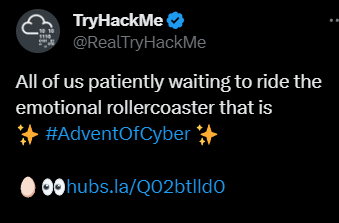

#3 On a Photo Post in LinkedIn

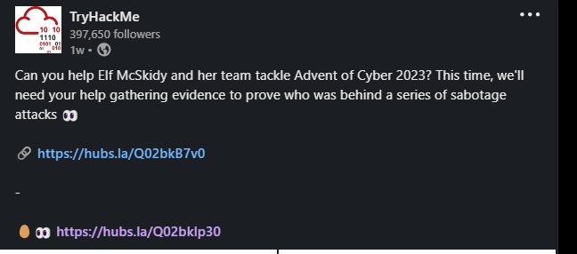

#4 Was released last on the advent itself

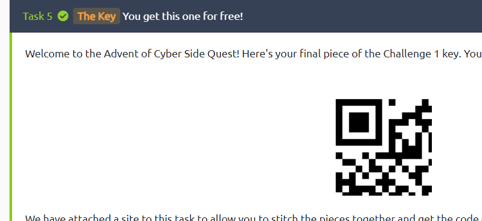

Once you click the "View Site" button, you can even throw in the pngs to have them auto-arranged for you so you can find the first room:


The Actual Challenge
This is a dump of a pcapng file that needs a few steps to complete, but is otherwise a simple tcpdump analysis.

### Requirements:

- Wireshark (Make sure to update so you have the latest and greatest filters)
- Aircrack & a wordlist like rockyou
- Patience

## The Beginning

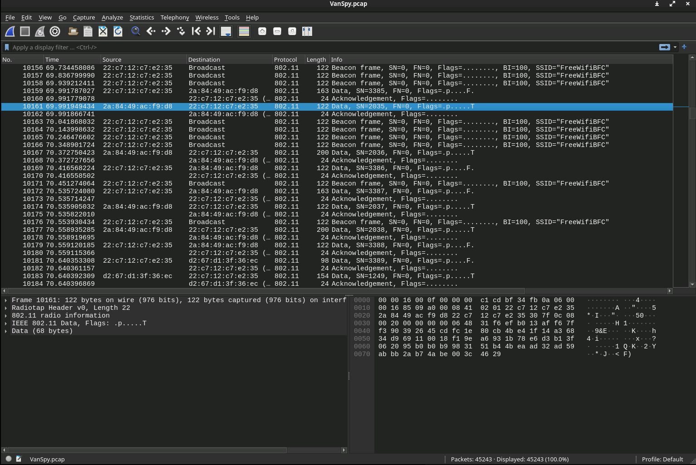

Starting off we have a fully encrypted packet capture and a prompt. Our Yeti buddy was able to log into the Wi-Fi and get some network talk between Van Spy and someone else. Lets see if we can crack this capture open.

This is where our first question's answer lives.
To get the Wi-Fi keys to disassemble this encryption, we'll need to use something like Aircrack to identify the Wi-Fi handshake packets and use that to reverse the password so we can use it for our own means. But rather than join their Wi-Fi, we'll use it to decode what we already have.

Aircrack needs this format to be a normal pcap though, so we'll just save as pcap and go from there. Wireshark: `File > Save As... > pcap`

```
┌──(tokugero㉿kali)-[~/thm/rooms/aoc2023/day1]
└─$ aircrack-ng VanSpytcpdump.pcap -w /usr/share/wordlists/rockyou.txt
Reading packets, please wait...
Opening VanSpytcpdump.pcap
Read 45243 packets.


                               Aircrack-ng 1.7

      [00:00:01] 32754/10303727 keys tested (38895.46 k/s)

      Time left: 4 minutes, 24 seconds                           0.32%

                           KEY FOUND! [ <REDACTED> ]


      Master Key     : A8 3F 1D 1D 1D 1F 2D 06 8E D4 47 CE E9 FD 3A AA
                       B2 86 42 89 FA F8 49 93 D7 C1 A0 29 97 3D 44 9F

      Transient Key  : 00 00 00 00 00 00 00 00 00 00 00 00 00 00 00 00
                       00 00 00 00 00 00 00 00 00 00 00 00 00 00 00 00
                       00 00 00 00 00 00 00 00 00 00 00 00 00 00 00 00
                       00 00 00 00 00 00 00 00 00 00 00 00 00 00 00 00

      EAPOL HMAC     : C1 0A 70 D9 65 94 5B 57 F2 98 8A E0 FC FD 2B 22
```

> This is the answer to the second question.

There we go, now we just have to go back to Wireshark and input our IEEE 802.11 key.

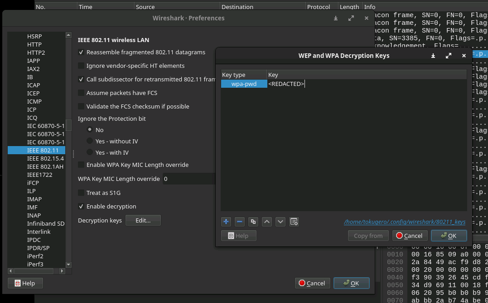


And now we have data that we can actually see. Let's peruse our way down the list and see what we've got, ideally we do a surface glance, then deep dive into the sections we find.

Scrolling through the dump, we see a lot of packets related to the following, in chronological order:

- Wi-Fi broadcasts to establish connections
- Pings, DNS lookups, and RDP
- A whooooole lot more RDP
- What looks like a bunch of failed TCP connections from every port imaginable, like an nmap sweep
- Some data on port 4444 on a TCP stream
- More broadcasts as the traffic looks concluded

Very interesting! If we look at the prompt we see what sounds like the following timeline:

- Old PC gets hooked up by an intern that Van Spy hacks into
- Van Spy hears some chit chat over the wire
- Van Spy thinks someone has caught him
- Van Spy "sends the goods"
  
Can we map this intern's behaviors and the chit chat referenced?

To decode the RDP we need some more information, for now it's encrypted and difficult to understand so we can just write that off for now as something we just can't get into.

This NMAP(?) scan looks like someone's trying to break in to this box, and it looks like at the end there's some success:

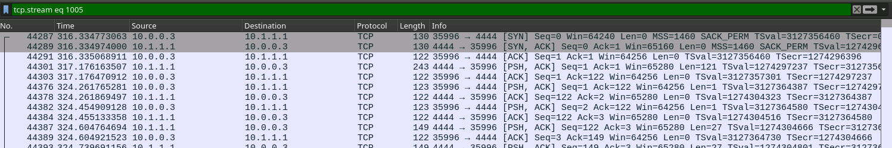

If we follow the TCP Stream we can see all the bytes from each packet lined up in a readable format. It looks like someone popped a shell. Maybe Van Spy?

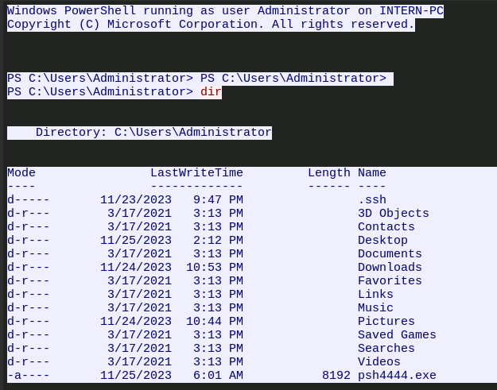

Definitely better at Windows than I am!

> This is also the tool asked about in the 3rd question.
Some of the prompts in the task help us narrow down what we might be looking for. One such thing is an interest in a suspicious program with a "juicy file". Maybe this stream has it.

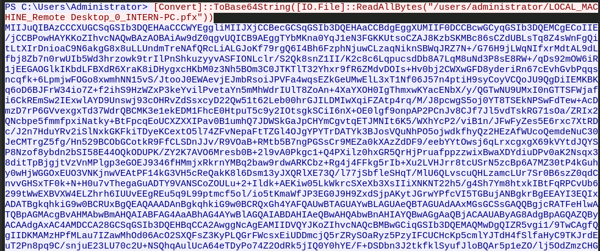

Oh yeah, this must have been what Van Spy exfiltrated. This looks to be a pfx file, `base64` encoded (a go to exfiltration technique that make a file easier to copy around and is easily reversed). A PFX file, after some quick googling and context from the TCP streamed reverse shell, is the password protected keys that we conveniently need to decrypt RDP sessions from this computer!

Next we'll need to `base64 -d` this text into a file and import that file into our Wireshark dump to start investigating the RDP traffic. Since the suspicious tool is known, we can see that PFX files generated with it use the same name as the password to decrypt the file in Wireshark.

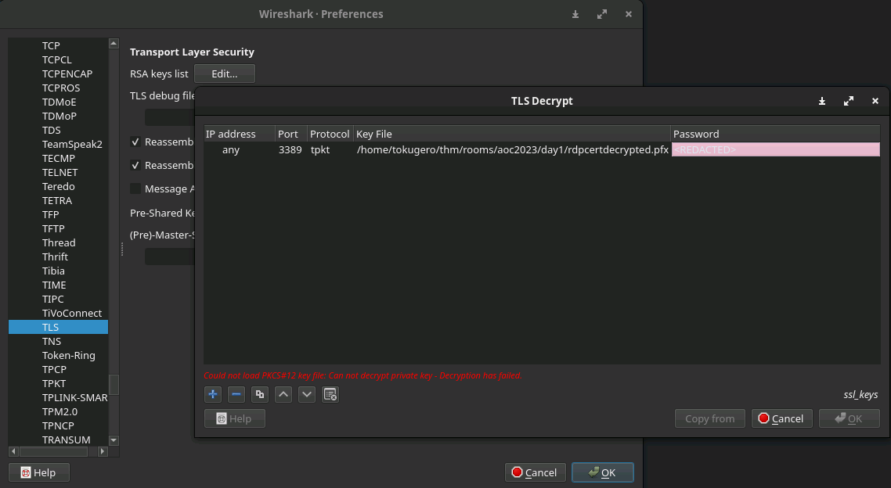

The next part might have been the hardest part because it involves looking through decrypted TLS data. And the thing you're looking for isn't the first thing that gets shown in your purview, you need to filter for RDP, and then search for things that RDP does expose in the packets, like clipboards. Using that you can find the last flags by referencing how the data is called and returned:

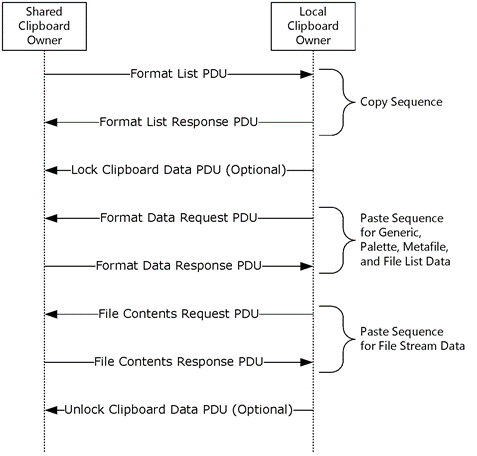

Editors Note: I only came to this conclusion after hours of looking through other packets. Eventually I found something in a clipboard that looked suspiciously human which made me look deeper.

We can see all kinds of these in our Wireshark capture:

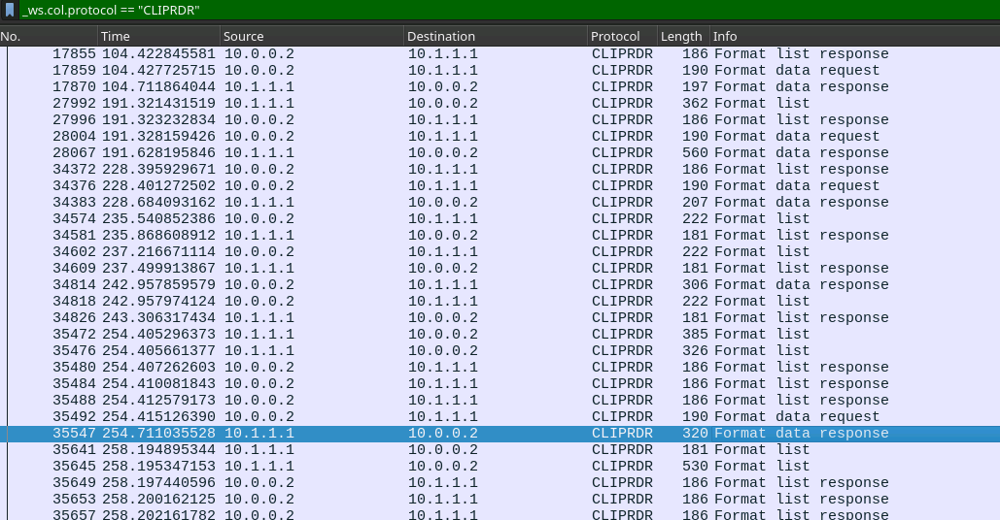

So it's just a matter of finding things that look interesting and finding their corresponding data response to determine what the user thought was valuable enough to be copying around. Note that the data is in the TLS decrypted data portion of the Wireshark output. It may need some massaging to look like the answer formatted in the question fields, but will be obvious once you see them.

> The fourth and fifth answers live here.

Wireshark IS all that's needed to solve this. HOWEVER. If you really want to see something cool, there's one step further you can push this.

The environment built from  lets you take a decoded PDU export pcap file (Which you should have by this point in the post), run it through their pyrdp-converter to load it into their pyrdp-player. Their documentation is pretty comprehensive with many ways to get it to run depending on what works best for your environment - but I believe this is the most complete view of the exercise.

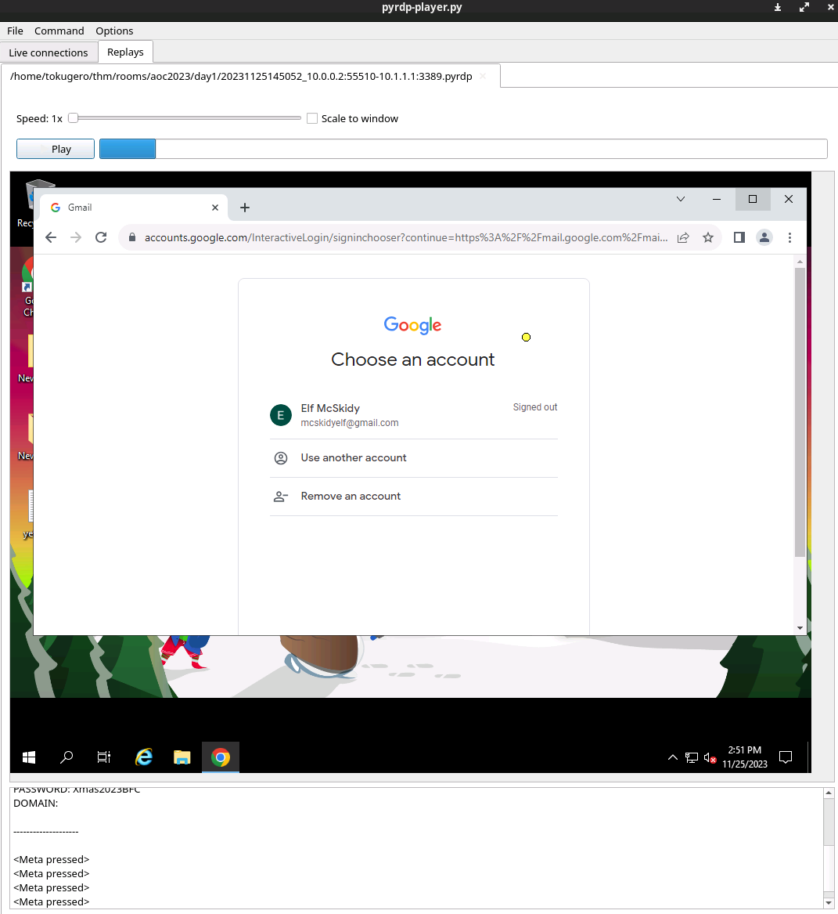

While I think this isn't likely a common scenario, as I sit here RDP'd into my Kali box to do these exercises on my VM, I have to wonder if they're not quite as impractical as I might have at first believed...
